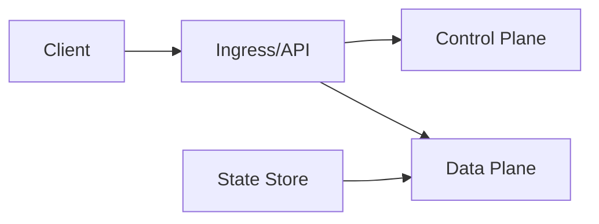

<!-- RESEARCH DOCUMENT TEMPLATE -->
<!-- Replace all [bracketed] placeholders with actual content -->
<!-- See BUILD-SYSTEM.md and TEMPLATES.md for format requirements -->

# 1. Title
- [Insert clear, technical title describing the system or topic]

# 2. Executive Summary
- [5–10 bullet points maximum: what the system is]
- [Why it matters]
- [Key insight or design idea]
- [Additional critical summary points as needed]

# 3. System Overview
- [High-level explanation of the system]
- [Problem solved]
- [Core design philosophy]
- [Key constraints]

# 4. Architecture (CRITICAL SECTION)
- [System components]
- [Component interactions]
- [Data/message flow]
- [Network topology (if applicable)]

## Diagrams (REQUIRED)
Use the **mermaid skill** to generate diagrams. Preferred diagram types:
- Flowchart: System topology, data flows, decision trees
- Sequence Diagram: Component interactions, message ordering
- Architecture Diagram: System layers, component relationships
- State Machine: Protocol states, state transitions
- Class Diagram: System hierarchies and relationships

Mermaid skill usage: Invoke the mermaid skill with your diagram requirements. It will generate publication-ready diagrams.

## Example Diagram


## Component Responsibilities
- [Component A: responsibilities]
- [Component B: responsibilities]
- [Component C: responsibilities]

## Step-by-Step Data Flow
1. [Step 1]
2. [Step 2]
3. [Step 3]
4. [Step 4]

# 5. Core Mechanisms
- [Internal mechanism 1]
- [Internal mechanism 2]
- [Internal mechanism 3]
- [Explain why each mechanism works, not only what it does]

## Pseudocode (for complex mechanisms)
```text
function process(request):
    metadata = validate(request)
    route = select_route(metadata, topology, policy)
    result = execute(route, request.payload)
    return finalize(result)
```

# 6. Design Decisions & Tradeoffs
## Tradeoff 1
- Option A: [description]
- Option B: [description]
- Chosen: [option]
- Why chosen: [justification]
- Sacrifice: [what is lost]
- Scaling risk: [what breaks or degrades]

## Tradeoff 2
- Option A: [description]
- Option B: [description]
- Chosen: [option]
- Why chosen: [justification]
- Sacrifice: [what is lost]
- Scaling risk: [what breaks or degrades]

## Tradeoff 3
- Option A: [description]
- Option B: [description]
- Chosen: [option]
- Why chosen: [justification]
- Sacrifice: [what is lost]
- Scaling risk: [what breaks or degrades]

# 7. Failure Modes & Edge Cases
## Scenario: Network partitions
- What happens: [behavior]
- Why it happens: [root cause]
- Handling/failure mode: [mitigation or failure impact]

## Scenario: Node churn
- What happens: [behavior]
- Why it happens: [root cause]
- Handling/failure mode: [mitigation or failure impact]

## Scenario: Latency spikes
- What happens: [behavior]
- Why it happens: [root cause]
- Handling/failure mode: [mitigation or failure impact]

## Scenario: Security attacks
- What happens: [behavior]
- Why it happens: [root cause]
- Handling/failure mode: [mitigation or failure impact]

## Scenario: Partial system failures
- What happens: [behavior]
- Why it happens: [root cause]
- Handling/failure mode: [mitigation or failure impact]

# 8. Scalability Analysis
## Small scale (10–100 nodes)
- [Expected behavior]
- [Bottlenecks]
- [Resource limits]

## Medium scale (1k–10k nodes)
- [Expected behavior]
- [Bottlenecks]
- [Communication overhead]

## Large scale (100k+ nodes)
- [Expected behavior]
- [Critical bottlenecks]
- [Relay/routing load]
- [Hard constraints]

# 9. Recommended Architecture
- [Final architecture choice]
- [Why optimal]
- [Rejected alternatives]
- [Clear technical justification]

# 10. Implementation Plan
1. [Technologies to use]
2. [Components to build first]
3. [Deployment strategy]
4. [Testing strategy]
5. [Scaling strategy]

# 11. Future Improvements
- [Possible upgrades]
- [Research directions]
- [Optimizations]
- [Long-term scaling ideas]
