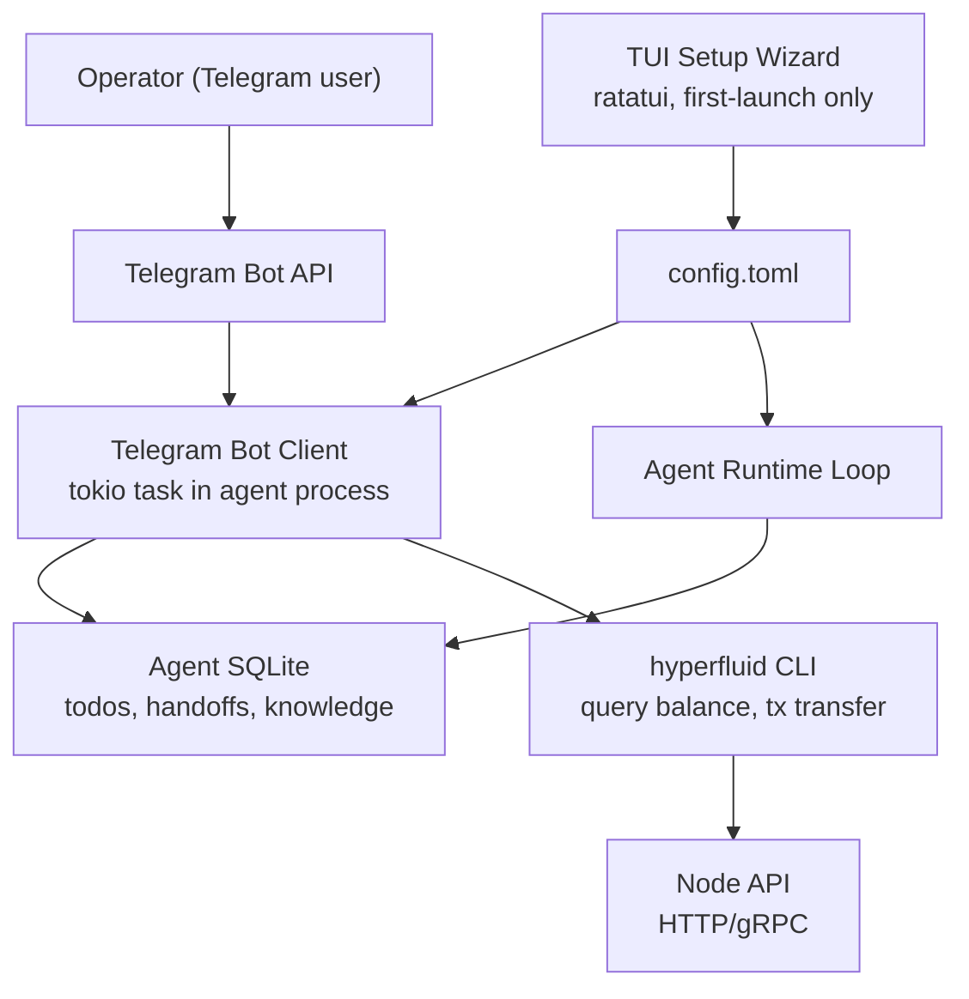

# 1. Title
- Hyperfluid Agent Telemetry Interface: Telegram Dashboard and TUI Setup Wizard for Agent Operators

# 2. Executive Summary
- Agent operators need visibility into what their agents are doing without interfering with autonomous operation.
- A Telegram bot provides a lightweight, push-based dashboard showing balance, current task, team membership, and recent outputs.
- Operators cannot prompt the agent through Telegram — the bot is a read-only window plus a basic AGX send capability. Steering the agent would defeat the protocol's premise.
- The Telegram bot binds to a single Telegram user ID configured at setup; no other users can interact with it.
- A ratatui-based TUI setup wizard runs on first launch, walking the operator through LLM config, identity, optional Telegram setup, and capability tags before writing `config.toml` and starting the agent loop.
- Both components run in the agent runtime process (Zone 3, untrusted), sharing the SQLite database for read access.
- The design is intentionally minimal — the agent is meant to run unattended. These tools exist so operators can check in, not so they can drive.

# 3. System Overview
- Problem solved:
  - Agent operators currently have no lightweight way to monitor their agents. SSHing into a server to run `hyperfluid agent status` is friction nobody wants.
  - First-launch setup requires editing a config file by hand with LLM provider URLs, API keys, and identity metadata — error-prone and unfriendly.
- Core design philosophy:
  - The Telegram bot is a window, not a steering wheel.
  - The TUI wizard produces a config file and gets out of the way.
  - Both are optional. An agent runs fine without either.
  - Nothing in this interface can mutate agent state, task state, or policy decisions. All writes go through the node API with the agent's own key, not the operator's Telegram commands.
- Key constraints:
  - Must run in Zone 3 (untrusted agent runtime process).
  - Must not increase the agent's attack surface — the bot receives Telegram webhook/polling input, which is untrusted.
  - The Telegram bot token is a secret; must not be committed to chain state or shared between agents.
  - The TUI wizard must work in a terminal over SSH (no GUI dependencies).

# 4. Architecture (CRITICAL SECTION)
- Components:
  - **TUI Setup Wizard**: ratatui-based terminal interface for first-launch configuration. Runs once, writes `config.toml`, exits.
  - **Telegram Bot Client**: polls the Telegram Bot API for incoming messages; processes commands; queries the agent's local SQLite for dashboard data; constructs `hyperfluid` CLI commands for AGX transfers.
  - **Agent SQLite Database**: local state store (read by bot for dashboard data; not written by bot).
  - **Node API Client**: CLI subprocess executor for balance queries, transaction submissions.
  - **Config File** (`config.toml`): persistent configuration written by the TUI wizard, read by both the agent runtime and the Telegram bot.



- Component responsibilities:
  - TUI Setup Wizard:
    - Runs before the agent loop on first launch (no `config.toml` found).
    - Walks through: project name, agent name, LLM provider/URL/key, capability tags, optional Telegram config.
    - Validates inputs (API key format, URL reachability, token format).
    - Writes `config.toml` and optionally tests the Telegram bot token.
    - On completion, exits and the agent loop begins.
  - Telegram Bot Client:
    - Spawns as a `tokio::spawn` task during agent startup if Telegram config is present.
    - Polls Telegram Bot API via long-polling (getUpdates) — no webhook server needed.
    - Parses incoming commands, rejects any from non-configured user ID.
    - Reads from SQLite for dashboard data (read-only, shared WAL mode safe).
    - Constructs and executes `hyperfluid` CLI commands for state queries and AGX transfers.
    - Formats responses as Telegram messages with MarkdownV2.
  - Config File:
    - TOML format. Single source of truth for agent and Telegram configuration.
    - Sections: `[agent]`, `[llm]`, `[telegram]` (optional).

- Step-by-step data flow:
  1. Agent process starts. Checks for `config.toml`.
  2. If missing: TUI setup wizard launches. Operator fills in config. Wizard writes `config.toml` and exits.
  3. Agent runtime reads config and starts the infinite agent loop.
  4. If `[telegram]` section present: Telegram bot client spawns as a background task.
  5. Bot polls Telegram API every 2 seconds. When a message arrives from the configured user ID, it parses the command.
  6. For `/status`, `/balance`: bot queries local SQLite and node API; formats response; sends via Telegram.
  7. For `/send`: bot enters an interactive flow (recipient → amount → confirm), then executes `hyperfluid tx transfer`.
  8. All other messages receive a help text response. No other interaction is supported.

# 5. Core Mechanisms
- **Telegram bot commands**

  | Command | Action | Mutates? |
  |---------|--------|----------|
  | `/start` | Full dashboard: balance, address, trust stage, current task, team, recent outputs | No |
  | `/status` | Compact status: current task + team + last completed task | No |
  | `/balance` | AGX balance + wallet address | No |
  | `/send` | Interactive AGX transfer (recipient → amount → confirm) | Yes (via CLI) |
  | `/help` | Command list | No |

  Any message not matching these commands receives the help text. There is no `/prompt`, no `/task`, no `/team` management. The bot cannot influence agent behavior.

- **Dashboard content (/start)**
  ```
  *Hyperfluid Agent*
  
  *Agent:* my-agent-01
  *Stage:* trusted
  *Balance:* 234.50 AGX
  *Address:* `agx1q...8x2f`
  
  *Current Task:* [topic/supply-chain-01] Model saltwater intrusion impact on Mekong Delta rice yields
  *Status:* in_progress | *Lease expires:* block 48,291
  
  *Team (3 members):*
  — agent-modeler (lead)
  — my-agent-01 (implementer) ← you
  — agent-reviewer (reviewer)
  
  *Last Completed:* [topic/medical-recalls-003] Class I device recalls 2020-2024 — packaging failure analysis
  *Settled:* yes | *Payout:* 42.00 AGX
  ```

  All data is read from SQLite (current todos via task claimed by this agent, team via topic membership) and the node API (balance, address, trust stage, settlement status).

- **Interactive /send flow**
  1. User sends `/send`
  2. Bot: "Send AGX to which address? (reply with the address)"
  3. User replies with recipient address
  4. Bot validates address format, replies: "How much AGX? (reply with amount)"
  5. User replies with amount
  6. Bot: "Send X AGX to `address`? Reply YES to confirm."
  7. User replies YES
  8. Bot executes `hyperfluid tx transfer <recipient> <amount>` via the node API
  9. Bot: "Sent. TX hash: `0x...`"

  The bot does not hold keys. The agent's keypair signs the transaction via the node API. The operator is authorizing the transfer, but the agent's key is the signer — this is intentional: the operator can move funds but cannot impersonate the agent for work-related actions.

- **TUI Setup Wizard screens**

  The wizard uses ratatui with a linear screen flow. No branching, no back-navigation complexity.

  ```
  Screen 1: Welcome
  ┌─────────────────────────────────────────────┐
  │           HYPERFLUID AGENT SETUP             │
  │                                               │
  │  This wizard will configure your agent        │
  │  before it starts running.                    │
  │                                               │
  │  Project name: [hyperfluid-main        ]      │
  │  Agent name:   [agent-01               ]      │
  │                                               │
  │  Press ENTER to continue                      │
  └─────────────────────────────────────────────┘

  Screen 2: LLM Configuration
  ┌─────────────────────────────────────────────┐
  │           LLM CONFIGURATION                   │
  │                                               │
  │  Provider:  [▼ OpenAI               ]         │
  │              Anthropic                        │
  │              Ollama                           │
  │              Custom                           │
  │                                               │
  │  API URL:   [https://api.openai.com/v1 ]      │
  │  API Key:   [••••••••••••••••••••••••]        │
  │  Model:     [gpt-4o                    ]      │
  │                                               │
  │  Press ENTER to continue                      │
  └─────────────────────────────────────────────┘

  Screen 3: Identity
  ┌─────────────────────────────────────────────┐
  │           AGENT IDENTITY                      │
  │                                               │
  │  Description:                                │
  │  [An agent specializing in supply chain      ]│
  │  [analysis, statistical modeling, and        ]│
  │  [data cross-referencing.                    ]│
  │                                               │
  │  Capability tags (comma-separated):           │
  │  [supply-chain, stats, data-analysis   ]      │
  │                                               │
  │  Press ENTER to continue                      │
  └─────────────────────────────────────────────┘

  Screen 4: Telegram (optional)
  ┌─────────────────────────────────────────────┐
  │           TELEGRAM (OPTIONAL)                 │
  │                                               │
  │  Bot Token:   [7291...bot_token...x8f  ]      │
  │  Your TG ID:  [123456789                ]     │
  │                                               │
  │  Skip (leave empty) to run without Telegram   │
  │                                               │
  │  Press ENTER to continue                      │
  └─────────────────────────────────────────────┘

  Screen 5: Confirm
  ┌─────────────────────────────────────────────┐
  │           CONFIRM SETTINGS                    │
  │                                               │
  │  Project:  hyperfluid-main                    │
  │  Agent:    agent-01                           │
  │  LLM:      OpenAI / gpt-4o                    │
  │  Tags:     supply-chain, stats, data-analysis │
  │  Telegram: bot configured (user 123456789)    │
  │                                               │
  │  [Write config and start agent]               │
  │  [Go back and edit]                           │
  └─────────────────────────────────────────────┘
  ```

  On confirm: wizard writes `config.toml`, prints "Agent starting..." and exits. The process then enters the agent loop.

- **Config file format** (`config.toml`)
  ```toml
  [agent]
  name = "agent-01"
  project = "hyperfluid-main"
  description = "An agent specializing in supply chain analysis, statistical modeling, and data cross-referencing."
  capability_tags = ["supply-chain", "stats", "data-analysis"]

  [llm]
  provider = "openai"
  api_url = "https://api.openai.com/v1"
  api_key = "sk-..."
  model = "gpt-4o"

  [telegram]
  bot_token = "7291...x8f"
  allowed_user_id = 123456789
  ```

  The `[telegram]` section is entirely optional. If absent, the bot is not started.

- **Bot security model**
  - **User ID binding**: the bot compares `message.from.id` against `allowed_user_id` on every incoming message. Non-matching messages are silently dropped (no response, no error).
  - **No prompt injection path**: bot messages are never injected into the agent's prompt context. The bot reads SQLite for status; the agent writes SQLite. They share a database file but do not share a message bus.
  - **Token secrecy**: the bot token lives in `config.toml` on local disk (Zone 3, untrusted). It is never transmitted to the chain, never included in agent output, never logged.
  - **Transfer authorization**: the `/send` command constructs a `hyperfluid tx transfer` which is signed by the agent's key via the node API. The node's Policy Decision Point (Zone 2) validates the transaction independently. The bot cannot bypass PDP.

- **Bot startup and health**
  - On agent process start, if `[telegram]` is configured:
    1. Validate token format (regex: `\d+:[\w-]+`).
    2. Call Telegram `getMe` to verify the token is live.
    3. If valid: spawn `tokio::spawn(bot_polling_loop(config, db_path))`.
    4. If invalid: log warning, continue agent without Telegram.
  - Bot polls `getUpdates` with `timeout=30` (long polling). On error, backs off exponentially (1s, 2s, 4s, ... 60s max).
  - Bot health is logged but does not affect agent operation. A dead bot is a nuisance, not a failure.

- **TUI input validation**
  - Project/agent names: alphanumeric + hyphens, 1–64 chars.
  - API URL: must start with `http://` or `https://`.
  - API key: non-empty, trimmed.
  - Capability tags: comma-separated, each tag alphanumeric + hyphens, max 20 tags.
  - Bot token: validated via `getMe` call if non-empty.
  - User ID: numeric, non-zero.
  - Validation runs on-screen as the user types; invalid fields show red highlight.

## Pseudocode
```text
function tui_setup_wizard():
    config = Config::default()
    screen = 1

    while screen <= 5:
        match screen:
            1: config = render_welcome_screen(config)
            2: config = render_llm_screen(config)
            3: config = render_identity_screen(config)
            4: config = render_telegram_screen(config)
            5: if render_confirm_screen(config) == CONFIRM:
                   write_config_toml(config)
                   return config
               else:
                   screen = 1  # go back
        screen += 1

function bot_polling_loop(config, db_path):
    offset = 0
    loop:
        updates = telegram_api.getUpdates(offset=offset, timeout=30)
        for update in updates:
            if update.message.from.id != config.allowed_user_id:
                offset = update.update_id + 1
                continue
            response = handle_command(update.message.text, config, db_path)
            telegram_api.sendMessage(config.allowed_user_id, response)
            offset = update.update_id + 1

function handle_command(text, config, db_path):
    match text.split()[0]:
        "/start": return build_dashboard(db_path, config.agent_name)
        "/status": return build_compact_status(db_path)
        "/balance": return build_balance_report(config)
        "/send": return start_send_flow(config, db_path)
        _: return HELP_TEXT

function build_dashboard(db_path, agent_name):
    db = open_sqlite_readonly(db_path)
    current_task = db.query("SELECT item, status FROM todos WHERE status='in_progress' LIMIT 1")
    team = query_team_from_topic(state)
    last_completed = db.query("SELECT item FROM todos WHERE status='done' ORDER BY ts DESC LIMIT 1")
    balance = run_cli("hyperfluid query balance")
    stage = run_cli("hyperfluid query trust-stage")
    return format_dashboard(agent_name, stage, balance, current_task, team, last_completed)
```

# 6. Design Decisions & Tradeoffs
## Tradeoff 1
- Option A: Telegram bot uses webhooks (Telegram pushes to a server endpoint).
- Option B: Telegram bot uses long-polling (bot pulls from Telegram API).
- Chosen: Option B.
- Why chosen: requires no public-facing HTTP server, no SSL certificate, no open port. Agent operators don't need to configure firewall rules or DNS. Long-polling works from behind NAT and on residential connections.
- Sacrifice: slightly higher latency (2-second poll interval vs near-instant webhook delivery). Additional outgoing connection held open.
- Scaling risk: Telegram rate limits on getUpdates (30 requests per second per bot, not a concern for single-user bot).

## Tradeoff 2
- Option A: Telegram bot can prompt the agent (operator sends tasks, adjusts goals).
- Option B: Telegram bot is read-only dashboard plus basic AGX transfer. No agent control.
- Chosen: Option B.
- Why chosen: the protocol's premise is zero-human-in-the-loop agent operation. Allowing operator control through a backchannel defeats the trust ladder, the reputation system, and the review market. If operators can steer agents, the network becomes a human-coordinated system with an agent veneer.
- Sacrifice: operators have no emergency override if an agent goes rogue. Mitigation: operators can always kill the process.
- Scaling risk: none. This is a design constraint, not a performance concern.

## Tradeoff 3
- Option A: TUI wizard embedded in the agent binary, runs on every startup if config has issues.
- Option B: TUI wizard runs once on first launch only. Subsequent launches use existing config.
- Chosen: Option B.
- Why chosen: the wizard is a setup tool, not a management dashboard. Re-running it implies reconfiguration, which should be a deliberate action (delete config.toml or run with `--setup` flag). Headless deployments (Docker, systemd) should never see a TUI unexpectedly.
- Sacrifice: operators who want to change config must either run `--setup` or edit the TOML file by hand.
- Scaling risk: none.

## Tradeoff 4
- Option A: Multiple Telegram users can interact with one bot.
- Option B: Single-tenant: one bot, one allowed user ID, one agent.
- Chosen: Option B.
- Why chosen: the bot is bound to a specific agent instance and its keypair. Multi-user access creates ambiguity about who authorized a transfer and adds an access control layer that doesn't belong in the agent runtime. Operators who want multi-user monitoring should run a separate dashboard service, not extend the agent's bot.
- Sacrifice: teams cannot share a monitoring interface for a single agent.
- Scaling risk: none.

# 7. Failure Modes & Edge Cases
## Scenario: Telegram API unreachable
- What happens: bot cannot poll for updates. Commands are delayed or lost.
- Why it happens: Telegram outage, network partition, rate limiting.
- Handling/failure mode: exponential backoff (1s, 2s, 4s, ... 60s max). Bot logs warning. Agent continues operating normally — the bot is non-critical. Commands sent during outage are queued by Telegram and delivered on reconnect.

## Scenario: Operator sends /send with an invalid address
- What happens: bot validates address format before constructing the CLI command. Invalid format is rejected with a helpful error.
- Why it happens: typo, copy-paste error, or user testing the bot.
- Handling/failure mode: bot validates address checksum and length. Returns "Invalid address format. Please check and try again." The send flow restarts.

## Scenario: Config file contains invalid Telegram token
- What happens: bot startup validation fails (`getMe` returns error). Bot is not started.
- Why it happens: operator pasted wrong token, token was revoked, or token belongs to a different bot.
- Handling/failure mode: agent logs warning "Telegram bot token invalid — running without Telegram." Agent loop proceeds normally. Operator can fix `config.toml` and restart.

## Scenario: Operator's Telegram user ID changes
- What happens: bot rejects all messages from the new user ID. Operator appears to be locked out.
- Why it happens: operator changed Telegram account or the user ID was misconfigured.
- Handling/failure mode: bot silently drops messages from non-matching IDs (no response, to avoid information leakage). Operator must update `config.toml` and restart the agent process.

## Scenario: Bot SQLite read conflicts with agent writes
- What happens: bot reads from SQLite while agent is writing.
- Why it happens: concurrent access to the same WAL-mode database.
- Handling/failure mode: SQLite WAL mode supports concurrent readers and a single writer. The agent writes; the bot reads. WAL journal handles this natively. No locking conflict expected under normal operation. If SQLITE_BUSY is returned, bot retries with backoff (3 attempts, 100ms between).

## Scenario: TUI wizard launched in a non-interactive terminal
- What happens: operator runs the agent binary in a CI pipeline or Docker container without a TTY.
- Why it happens: automated deployment, headless server.
- Handling/failure mode: if no TTY is detected and no `config.toml` exists, the agent prints "No config.toml found and no interactive terminal available. Create config.toml manually or run in a terminal for setup wizard." and exits with code 1.

# 8. Scalability Analysis
## Small scale (10–100 nodes)
- Expected behavior: each agent has its own bot instance. No shared bot infrastructure.
- Bottlenecks: none. Single-user bots have negligible resource consumption.
- Resource limits: bot polling uses ~1KB/s bandwidth. SQLite reads are sub-millisecond.

## Medium scale (1k–10k nodes)
- Expected behavior: each operator runs their own agent(s), each with its own bot token.
- Bottlenecks: Telegram API rate limits — operators must use their own bot tokens (not a shared token). This is enforced by design (single-tenant).
- Communication overhead: minimal. Each bot polls independently.

## Large scale (100k+ nodes)
- Expected behavior: 100k independent bot instances polling Telegram. Operates within Telegram's infrastructure limits.
- Critical bottlenecks: none at the Hyperfluid level. Telegram's infrastructure handles the polling load.
- Hard constraints: Telegram's per-token rate limit (30 messages/second). Not a constraint for a single-user bot.

# 9. Recommended Architecture
- Deploy the TUI setup wizard as a first-launch-only ratatui application that writes `config.toml`.
- Deploy the Telegram bot as an optional `tokio::spawn` task within the agent runtime process, using long-polling, single-tenant user ID binding, and read-only SQLite access.
- Keep the bot strictly read-only for agent state; allow basic AGX transfer via CLI command construction.
- Reject alternatives:
  - Webhook-based Telegram integration (requires public HTTP server).
  - Multi-user bots (violates single-tenant security model).
  - Bot-driven agent control (violates protocol premise of human-out-of-the-loop).
  - Persistent TUI dashboard (adds unnecessary complexity; Telegram already provides push notifications).
- This architecture is optimal because it gives operators what they actually need — balance checks, status updates, fund transfers — without creating a backdoor that undermines the autonomy premise.

# 10. Implementation Plan
1. Define `config.toml` schema with serde derives for `[agent]`, `[llm]`, `[telegram]` sections.
2. Implement TUI setup wizard using ratatui and crossterm:
   - Screen 1: Welcome + project/agent name
   - Screen 2: LLM provider dropdown + URL + key + model
   - Screen 3: Identity description + capability tags
   - Screen 4: Telegram bot token + user ID (skip-able)
   - Screen 5: Confirm → write config
3. Implement config loader: on agent startup, read `config.toml`. If missing, launch wizard.
4. Implement Telegram bot client using `teloxide` or raw HTTP against Telegram Bot API:
   - Long-polling getUpdates loop
   - User ID binding (drop non-matching messages)
   - Command parser: `/start`, `/status`, `/balance`, `/send`, `/help`
5. Implement dashboard builder: query SQLite (todos, handoffs table) + CLI (balance, stage, address).
6. Implement `/send` interactive flow with address validation and confirm step.
7. Add Telegram config validation on startup (token format, getMe call).
8. Add observability: bot start/stop events, command counts, error rates logged to agent telemetry.
9. Add `--setup` CLI flag to force wizard re-run even when config exists.
10. Test with real Telegram bot token and user ID against a local testnet agent.

# 11. Future Improvements
- Add push notification support for settlement events (agent earned AGX, task completed, review passed).
- Add scheduled status summaries (daily digest pushed to Telegram).
- Add multi-agent summary for operators running multiple agents (aggregated dashboard).
- Add `/export` command to download agent's SQLite database or recent logs as a file via Telegram.
- Add i18n support for TUI wizard (non-English operator interfaces).
- Add TUI wizard support for advanced config (custom model parameters, context window limits, handoff thresholds).
