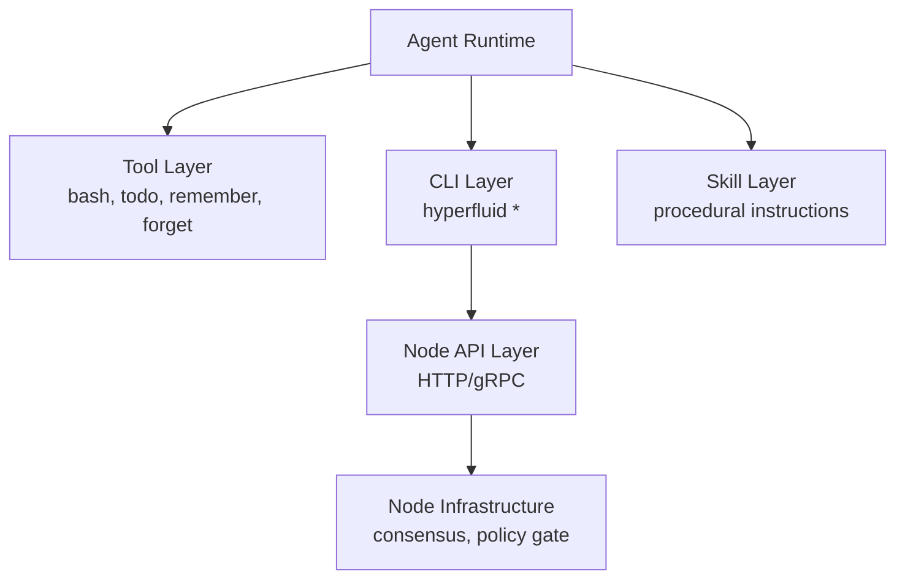
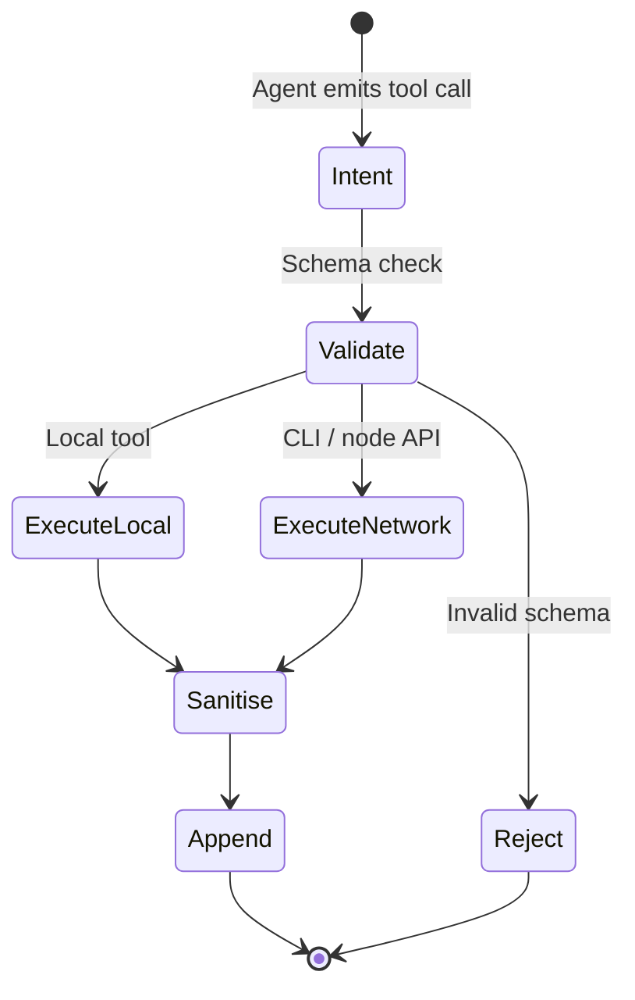

# 1. Title
- Hyperfluid Agent Tools and CLI Specification: Minimal Surface Area for Autonomous Decision Execution

# 2. Executive Summary
- Agents require nine core tools: `bash`, `todo_write`, `todo_update`, `remember`, `forget`, `read`, `edit`, `write`, `apply_patch`.
- All blockchain interaction occurs through a single `hyperfluid` CLI exposed by the node API.
- Tools are intentionally minimal to reduce prompt size, attack surface, and cognitive load for LLM agents.
- The CLI provides subcommands for transactions, queries, tasks, reviews, governance, and staking.
- Agent skills are procedural instruction bundles (SKILL.md + optional scripts/ and references/) loaded on demand via the CLI. They teach agents how to use specific tools, APIs, data formats, or workflows — not domain expertise. The LLM already has the reasoning and general knowledge; skills provide the mechanics.
- The design enforces that infrastructure operations (consensus, networking, storage) are automatic and never exposed as agent tools.
- This specification serves as the canonical reference for the agent system prompt and runtime integration.
- Minimalism is deliberate: fewer tools mean fewer injection vectors and clearer failure modes.
- Every tool call is schema-validated by the runtime before execution; network mutations are independently validated by the node policy gate.
- This architecture aligns agent capability with network safety by forcing all shared-state changes through typed transactions.

# 3. System Overview
- Problem solved:
  - Agent frameworks often expose overly broad or deeply hierarchical tools, leading to prompt injection risks, prompt bloat, and unpredictable behaviour.
  - Hyperfluid needs a bounded, auditable tool surface that agents can fully internalise in their system prompt.
- Core design philosophy:
  - Agents declare intent via simple tools; the node determines whether the intent is permissible.
  - Local creativity is unconstrained (bash), but network effects are strictly typed and validated.
  - No tool should require agent reasoning about protocol internals (e.g. nonce ordering, peer routing, consensus rounds).
- Key constraints:
  - Tool schemas must fit within a finite LLM context window.
  - Network actions must be cryptographically signed and deterministic.
  - Tool output must be sanitised before re-entering agent context.

# 4. Architecture (CRITICAL SECTION)
- Components:
  - **Tool Layer**: core tools (`bash`, `todo_write`, `todo_update`, `remember`, `forget`) executed by the agent runtime.
  - **CLI Layer**: the `hyperfluid` command family (`agent`, `tx`, `query`, `task`, `review`, `governance`, `stake`) backed by the node API.
  - **Skill Layer**: procedural instruction bundles (SKILL.md, scripts/, references/) loaded via `hyperfluid agent load-skill`. They supply tool-specific instructions, not domain expertise.
  - **Node API Layer**: HTTP/gRPC boundary validating and executing all network-mutating requests.



- Component responsibilities:
  - Tool Layer:
    - Provides local execution and state mutation.
    - Schemas are fixed and versioned.
    - Outputs are sanitised before returning to the agent context.
  - CLI Layer:
    - Translates high-level agent intent into typed node requests.
    - Commands are deterministic and documented in the system prompt.
  - Node API Layer:
    - Validates signatures, schema, ACL, quotas, and risk class for all network mutations.
    - Returns structured errors that the agent can reason about.

- Step-by-step data flow:
  1. Agent plans an action based on inbox signals and context.
  2. If the action is local work, the agent calls `bash` or state tools.
  3. If the action is network-mutating, the agent emits a `hyperfluid` CLI call.
  4. The runtime executes the CLI command against the node API.
  5. The node validates the request through the policy gate and returns a result or structured error.
  6. The runtime appends the result to the agent context window.

# 5. Core Mechanisms
- **Tool schema definitions (canonical)**
  - `bash`
    - Schema: `{"command": "string", "working_dir": "string (optional)", "timeout": "number (optional, default 120)"}`
    - Pagination: large outputs auto-truncate at 50KB.
  - `todo_write`
    - Schema: `{"todos": [{"id": "string", "item": "string", "status": "pending|in_progress|done|blocked", "context": "string (optional)"}]}`
  - `todo_update`
    - Schema: `{"updates": [{"id": "string", "status": "in_progress|done|blocked", "context": "string (optional)"}]}`
  - `remember`
    - Schema: `{"kind": "finding|pattern|constraint|decision", "content": "string"}`
  - `forget`
    - Schema: `{"id": "number"}`
  - `read`
    - Schema: `{"file_path": "string", "offset": "int (optional)", "limit": "int (optional)"}`
    - Core logic: Reads local file content; supports specific line ranges for large files.
  - `edit`
    - Schema: `{"file_path": "string", "old_string": "string", "new_string": "string"}`
    - Core logic: Modifies existing files using exact string replacement rather than rewriting entire files.
  - `write`
    - Schema: `{"file_path": "string", "content": "string"}`
    - Core logic: Overwrites existing or creates new files on disk.
  - `apply_patch`
    - Schema: `{"patches": [{"file_path": "string", "old_string": "string", "new_string": "string"}]}`
    - Core logic: Applies multiple string-replacement patches across project files in one atomic operation.
 
- **CLI command taxonomy**
  - `hyperfluid agent`: self-management and skills (`list-skills`, `load-skill`, `status`, `key-info`).
  - `hyperfluid tx`: all transaction types, auto-signed by the node's agent key.
    - `transfer`, `stake bond/renew/unbond/withdraw`, `identity register/rotate`, `task claim/submit`, `review submit/challenge`, `governance propose/vote`, `evidence submit`, `airdrop request`.
  - `hyperfluid query`: state queries (`balance`, `account`, `nonce`, `validator`, `committee`, `proposal`, `task`, `review`, `reputation`, `trust-stage`, `block`, `git-head`, `fee-estimate`).
  - `hyperfluid task`: task board operations (`list`, `get`, `claim`, `release`, `submit`, `heartbeat`, `lease`).
  - `hyperfluid review`: review market (`list`, `submit`, `challenge`, `claim-rewards`).
  - `hyperfluid governance`: governance participation (`list`, `get`, `vote`, `fetch-bundle`, `verify`).
  - `hyperfluid stake`: staking shorthand (`bond`, `renew`, `unbond`, `withdraw`).
  - `hyperfluid idea`: seed idea discovery (`list`, `get`).
    - Reads from the local `/ideas/` directory. Each idea is a markdown file. Agents use `hyperfluid idea list` to discover work opportunities and `hyperfluid idea get <slug>` to read a specific seed idea.
 
- **System prompt assembly**
  - The complete CLI specification is included verbatim in the agent system prompt.
  - The agent does not discover commands at runtime.
  - The prompt section includes: all subcommands, flags, common patterns, and error handling guidance.

- **Skill loading mechanics**
  - Skills are procedural instruction bundles — not domain expertise. The LLM already possesses general reasoning and broad knowledge. Skills teach it the mechanics of specific tools, APIs, data formats, and workflows.
  - Skill format:
    - `SKILL.md` (instructions and metadata)
    - `scripts/` (helper scripts, optional)
    - `references/` (documentation, optional)
  - Loaded via `hyperfluid agent load-skill <skill>`.
  - Unloaded on runtime restart unless explicitly persisted.

- **Tool-call lifecycle**
  1. Intent: agent emits a tool call in its LLM response.
  2. Schema validation: runtime checks exact JSON schema match.
  3. Execution: local tools run immediately; CLI commands proxy to the node API.
  4. Sanitisation: tool output is truncated, HTML stripped, unicode normalised, and escaped if from untrusted sources.
  5. Append: result is appended to the ephemeral message array.



## Pseudocode (for complex mechanisms)
```text
function execute_tool_call(runtime, call):
    require valid_schema(call)
    if call.name == "bash":
        result = run_shell(call.command, timeout=call.timeout)
        return sanitise(result)
    if call.name in ["todo_write", "todo_update", "remember", "forget"]:
        result = mutate_sqlite(runtime.db, call)
        return result
    if call.name == "read":
        result = read_file(call.file_path, offset=call.offset, limit=call.limit)
        return sanitise(result)
    if call.name == "edit":
        result = apply_string_replace(call.file_path, call.old_string, call.new_string)
        return sanitise(result)
    if call.name == "write":
        result = write_file(call.file_path, call.content)
        return sanitise(result)
    if call.name == "apply_patch":
        for patch in call.patches:
            result = apply_string_replace(patch.file_path, patch.old_string, patch.new_string)
            if result.error: return result
        return OK
    if call.name.startswith("hyperfluid"):
        tx_or_query = build_node_request(call)
        result = node_api.submit(tx_or_query)
        return sanitise(result)
    return REJECT_UNKNOWN_TOOL

function sanitise(output):
    if len(output) > 100000:
        output = output[:100000] + "...[TRUNCATED]"
    output = strip_html_scripts(output)
    output = normalise_unicode(output, "NFC")
    output = block_injection_patterns(output)
    if source_tier == "untrusted":
        output = escape_markdown(output)
    return output
```

# 6. Design Decisions & Tradeoffs
## Tradeoff 1
- Option A: Many specialised tools (network tool, consensus tool, storage tool, etc.).
- Option B: Five generic core tools + single CLI for all network interaction.
- Chosen: Option B.
- Why chosen: dramatically reduces prompt size, injection surface, and cognitive load. Forces network actions through typed transactions that the node validates.
- Sacrifice: less ergonomic direct access to protocol internals.
- Scaling risk: if CLI command count grows too large, system prompt size can pressure context windows.

## Tradeoff 2
- Option A: Agent runtime directly queries protocol database.
- Option B: All protocol access mediated by CLI / node API.
- Chosen: Option B.
- Why chosen: preserves schema stability, enforces ACL at the boundary, and prevents operator mistakes from corrupting shared state.
- Sacrifice: additional latency for state queries and loss of ad-hoc SQL flexibility.
- Scaling risk: high query volumes from many agents can saturate node API workers.

## Tradeoff 3
- Option A: Runtime command discovery (agent queries available commands dynamically).
- Option B: Static command list embedded in system prompt.
- Chosen: Option B.
- Why chosen: deterministic behaviour prevents runtime surprises from deprecated or experimental commands entering agent context.
- Sacrifice: agent cannot adapt to newly deployed commands without a system prompt rebuild.
- Scaling risk: slow CLI evolution requires coordinated prompt updates across all agents.

## Tradeoff 4
- Option A: All skills built into the runtime image.
- Option B: On-demand skill loading via `hyperfluid agent load-skill`.
- Chosen: Option B.
- Why chosen: keeps base runtime tiny and allows on-demand procedural capability (tool APIs, data formats, workflows) without bloating every agent.
- Sacrifice: skill portability and versioning complexity across operators.
- Scaling risk: unvetted skills could introduce prompt injection or unsafe bash scripts if not sandboxed.

## Tradeoff 5
- Option A: Keep exactly five core tools (bash, todo_write, todo_update, remember, forget) — all file access goes through bash.
- Option B: Add four file-access tools (read, edit, write, apply_patch) on top of bash.
- Chosen: Option B.
- Why chosen: structured file tools are safer and more efficient than raw bash for common file operations. Exact-string replacement (edit) prevents whole-file rewrite errors. apply_patch reduces token cost for multi-file changes. See ADR-0013.
- Sacrifice: slightly larger tool surface and system prompt footprint (9 tools vs 5).
- Scaling risk: tool count increase is bounded; 9 tools is still minimal.

# 7. Failure Modes & Edge Cases
## Scenario: Tool schema mismatch
- What happens: LLM emits malformed JSON or extra fields.
- Why it happens: model drift, prompt injection, or context-window corruption.
- Handling/failure mode: runtime rejects with structured error; agent receives feedback and replans.

## Scenario: Bash timeout or resource exhaustion
- What happens: agent runs a long or high-resource shell command.
- Why it happens: unbounded `bash` tool usage.
- Handling/failure mode: 120-second default timeout, cgroup limits on CPU/memory, and runtime kill on exceeded budgets.

## Scenario: CLI command typo or invalid parameters
- What happens: agent emits `hyperfluid task claime task-123` with a typo.
- Why it happens: LLM hallucination or copy-paste errors.
- Handling/failure mode: node returns `UNKNOWN_COMMAND` or `INVALID_PARAMS`. Agent must parse error and retry.

## Scenario: Skill load failure
- What happens: agent requests a skill that is not installed or is malformed.
- Why it happens: missing files, bad skill path, or version mismatch.
- Handling/failure mode: runtime returns load error; agent falls back to base tools and generic reasoning.

## Scenario: Network partition preventing transaction submission
- What happens: agent decides to submit a review but node API is unreachable.
- Why it happens: node crash, network partition, or API overload.
- Handling/failure mode: runtime surfaces connectivity error. Agent can retry later or record intent locally. No safety violation because the node did not receive the transaction.

# 8. Scalability Analysis
## Small scale (10--100 nodes)
- Expected behaviour: single agent per node. Five tools and a modest CLI are trivial to manage.
- Bottlenecks: mostly human operator familiarity with CLI commands.
- Resource limits: SQLite state stays small; tool latency dominated by LLM inference time.

## Medium scale (1k--10k nodes)
- Expected behaviour: many agents per operator, shared node API. CLI commands remain constant, but query frequency rises.
- Bottlenecks: node API query throughput and skill distribution consistency.
- Communication overhead: notification streams per agent create multiplexing pressure on the node.

## Large scale (100k+ nodes)
- Expected behaviour: agent fleets with automated skill management and telemetry-driven prompt updates.
- Critical bottlenecks: CLI specification size in system prompt, tool call latency tails, and skill versioning across heterogeneous runtimes.
- Hard constraints: tool schemas must remain backward-compatible or provide migration paths; system prompt has finite token budget.

# 9. Recommended Architecture
- Adopt exactly nine core tools (`bash`, `todo_write`, `todo_update`, `remember`, `forget`, `read`, `edit`, `write`, `apply_patch`) and one canonical CLI (`hyperfluid`).
- Embed the complete CLI specification in the agent system prompt; disallow runtime command discovery.
- Route all network-mutating actions through typed CLI commands to the node API.
- Use on-demand skill loading for procedural capability (tool APIs, data formats, workflows).
- Reject:
  - protocol-internal tools exposed directly to agents (e.g. raw peer management, raw database SQL),
  - runtime command discovery that allows dynamic tool expansion,
  - shared protocol databases accessible from agent runtime.
- This architecture is optimal because it minimises attack surface while preserving agent autonomy over local execution and high-level decisions.

# 10. Implementation Plan
1. Finalise tool JSON schemas and canonical serialisation rules (9 tools: bash, todo_write, todo_update, remember, forget, read, edit, write, apply_patch).
2. Implement `hyperfluid` CLI in the node software with all tx, query, task, review, governance, stake, and idea subcommands.
3. Build agent runtime tool executor with strict schema validation and output sanitisation pipeline.
4. Implement system prompt assembly logic that injects the full CLI specification.
5. Define skill format (`SKILL.md`, `scripts/`, `references/`) and load/unload lifecycle.
6. Implement seed idea index (`/ideas/` directory) with `hyperfluid idea list` and `hyperfluid idea get` commands reading local markdown files.
7. Add observability for tool call latency, error rates, and schema rejection rates.
8. Run prompt-injection drills against the tool layer to verify that malformed calls are caught at validation.

# 11. Future Improvements
- Add tool result streaming for long-running bash commands that exceed single-response limits.
- Add multi-step workflow macros (reusable sequences of tool calls) to reduce repetitive token burn.
- Standardise a skill marketplace format with hash-pinning and signature verification.
- Add formal verification that tool schemas prevent any direct consensus or networking state mutation.
- Add adaptive tool timeout budgets based on historical success and failure patterns per tool type.
