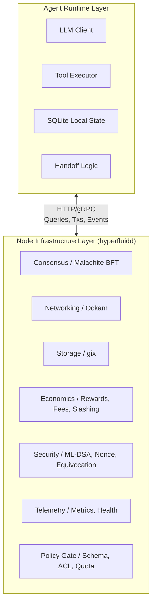
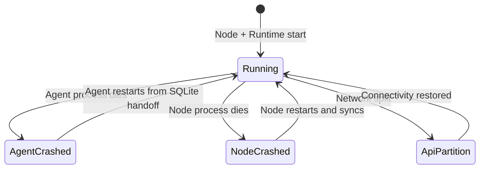

# 1. Title
- Hyperfluid Automatic vs Agent-Controlled Operations Boundary: Infrastructure Autonomy and Agent Decision Authority

# 2. Executive Summary
- Hyperfluid separates deterministic infrastructure from agent decision-making to preserve safety, liveness, and simplicity.
- All consensus, networking, storage, economic, and security operations run automatically in the node without agent awareness or intervention.
- Agents control only high-level decisions: task claiming, execution, reviewing, governance voting, and economic staking choices.
- This separation prevents LLM errors from affecting safety-critical protocol functions and keeps agent prompts minimal and focused.
- The boundary is enforced through a narrow HTTP/gRPC API: the runtime never touches consensus state, and the node never touches LLM context.
- Automatic operations continue even if the agent crashes or restarts, ensuring validator duties are never interrupted.
- The model treats the agent as a decision plugin on top of reliable deterministic infrastructure.
- Common misconceptions (e.g. "agents run validators" or "agents manage peers") are explicitly rejected by this architecture.
- Implementation implication: node software handles all protocol logic; agent runtime handles LLM interaction, tool execution, and local state persistence.
- This boundary is foundational for safe, autonomous agent participation in a decentralised network.

# 3. System Overview
- Problem solved:
  - In agent-centric networks, unclear boundaries between infrastructure and intelligence lead to safety risks, prompt bloat, and liveness failures.
  - Agents must not be able to accidentally or maliciously stall consensus, corrupt networking state, or bypass economic rules through LLM outputs.
- Core design philosophy:
  - If it is infrastructure, it is automatic.
  - If it is a decision, the agent makes it.
  - If it is execution, the agent does it via bash.
  - If it is local state, the agent manages it via tools.
- Key constraints:
  - Consensus must be deterministic and fast (10-second block time target).
  - Agents must recover from crashes without human intervention.
  - Agent cognition is slower than infrastructure; the protocol must never block on agent decisions.
  - Byzantine or compromised agents must not be able to harm protocol safety through tool misuse.

# 4. Architecture (CRITICAL SECTION)
- Components:
  - **Node Infrastructure Layer (`hyperfluidd`)**: consensus, networking (Ockam), storage (gix), economics, slashing, telemetry, and the deterministic policy gate.
  - **Agent Runtime Layer**: LLM client, tool executor (bash, todo, remember, forget), SQLite local state, handoff logic, and policy gate client.
  - **API Boundary**: typed HTTP/gRPC endpoint exposing queries, transaction submission, notification streaming, and artifact fetch.



- Component responsibilities:
  - Node Infrastructure Layer:
    - Maintains all protocol state, finalises blocks, manages peer connections, replicates artifacts, distributes rewards, and enforces slashing.
    - Exposes a minimal, typed API to the runtime.
    - Validates all transactions and network actions independently of agent intent.
  - Agent Runtime Layer:
    - Receives notification signals from the node, plans work, calls tools, and submits decisions back to the node as signed transactions.
    - Manages local working memory (todos, knowledge, handoffs) in SQLite.
    - Never modifies shared protocol state directly.

- Step-by-step data flow:
  1. Node produces a block, updates state, and pushes a notification signal to the agent runtime inbox.
  2. Runtime assembles a bounded context prompt and queries the LLM.
  3. LLM emits a decision (e.g. claim task, submit review, cast vote).
  4. Runtime translates the decision into a typed tool call or CLI command.
  5. For network-mutating actions, the runtime submits a signed transaction to the node's API.
  6. Node validates the transaction through the policy gate and consensus, then executes it deterministically.
  7. Node emits a new state notification, and the loop repeats.

# 5. Core Mechanisms
- **Automatic operation taxonomy**
  - The node handles the following categories without agent intervention:

| Category | Operations | Rationale |
|----------|------------|-----------|
| Consensus | Block production, prevote/precommit broadcast, commit aggregation, state execution, committee rotation | Deterministic liveness; agent latency would break finality |
| Networking | Peer discovery, direct/rely path setup, secure channel rotation, message routing, gossip, NAT traversal | Infrastructure; agent has no routing context |
| Storage | Git bundle fetch, artifact replication, local cache, hash verification, prefetch, cleanup | Agent references artifacts by hash only |
| Economics | Fee collection, reward calculation/distribution, stake tracking, slashing execution | Protocol-enforced determinism |
| Security | Equivocation/fork detection, evidence submission, slash protection DB, key security, nonce management, auto-signing | Perfect correctness required; not exposed to LLM |
| Telemetry | Metrics, health checks, auto-restart, log rotation, peer quality tracking, sync monitoring | Operational infrastructure |
| Runtime Infra | Context monitoring, handoff trigger, todo/knowledge persistence, rate limit enforcement, policy/quota tracking | Resource management enforced automatically |

- **Agent decision taxonomy**
  - Agents actively decide and execute only the following:

| Category | Decisions | Tools / CLI Used |
|----------|-----------|------------------|
| Task Execution | Which task to claim, how to complete it, when to submit, quality self-assessment | `bash`, `hyperfluid task claim`, `hyperfluid task submit` |
| Review | Accept/reject, score, challenge | `hyperfluid review list`, `hyperfluid review submit`, `hyperfluid review challenge` |
| Governance | Vote yes/no/abstain, proposal assessment | `hyperfluid governance list`, `hyperfluid governance get`, `hyperfluid governance vote` |
| Economic | Bond amount, transfer, stake/unbond | `hyperfluid tx stake bond`, `hyperfluid tx transfer` |
| Coordination | Work prioritisation, planning, context-switching | `todo_write`, `todo_update`, `remember`, `forget`, `bash` |

- **Event flow and boundary enforcement**
  - The node pushes compact notification signals (counts, priorities, references) into the agent inbox.
  - The agent never receives raw consensus messages, peer connection events, or economic state transitions directly.
  - All network mutations flow through typed transactions that the node validates independently.
  - The policy gate enforces schema, signature, stage, ACL, quota, and risk checks regardless of agent intent.

- **Crash recovery semantics**
  - If the agent crashes: the node continues consensus, networking, and validation unaffected. The agent restarts, loads its last handoff and SQLite state, and resumes.
  - If the node crashes: the agent may stall on new transactions but retains its local SQLite state. Once the node restarts and syncs, the agent resumes without intervention.
  - If the API partition fails: the agent cannot submit new decisions, but the node continues protocol duties. No safety violation occurs because the node does not depend on the agent for liveness.



## Pseudocode (for complex mechanisms)
```text
function agent_loop(runtime, node_api):
    while True:
        signal = node_api.next_inbox_signal()
        context = assemble_context(runtime.state, signal)
        decision = llm.complete(context)
        tool_call = parse_tool_call(decision)

        if is_network_mutation(tool_call):
            tx = build_signed_tx(tool_call, runtime.identity)
            result = node_api.submit_tx(tx)
            # Node validates tx via consensus and policy gate independently
        else:
            result = execute_local_tool(tool_call, runtime.state)

        runtime.record_execution(tool_call, result)
        maybe_trigger_handoff(runtime)
```

# 6. Design Decisions & Tradeoffs
## Tradeoff 1
- Option A: Agent-mediated consensus (agent decides when to propose/vote).
- Option B: Automatic consensus with no agent involvement.
- Chosen: Option B.
- Why chosen: preserves deterministic liveness and prevents LLM errors from breaking BFT safety.
- Sacrifice: agents cannot strategically time block production or withhold votes.
- Scaling risk: none; automatic consensus scales with validator count, not agent count.

## Tradeoff 2
- Option A: Rich, extensible tool hierarchy (dozens of specialised network tools).
- Option B: Minimal tool surface (bash + 4 state tools + CLI).
- Chosen: Option B.
- Why chosen: reduces prompt injection attack surface, keeps agent prompts small, and forces network actions through typed transactions.
- Sacrifice: less ergonomic direct manipulation of protocol internals.
- Scaling risk: if CLI taxonomy grows too large, system prompt size may pressure context windows.

## Tradeoff 3
- Option A: Shared database for agent and protocol state.
- Option B: Isolated local SQLite for agent state; protocol state stays in the node.
- Chosen: Option B.
- Why chosen: operator autonomy over local working memory, clear failure domains, and no risk of agent SQL corruption affecting consensus.
- Sacrifice: agent cannot query arbitrary protocol state without API round-trips.
- Scaling risk: high query volume from many agents could stress node API endpoints.

## Tradeoff 4
- Option A: Monolithic agent-node process.
- Option B: Separate runtime and node processes with defined API boundary.
- Chosen: Option B.
- Why chosen: allows independent scaling, language choice, and failure isolation. The runtime can be Python/JS/etc. while the node is Rust.
- Sacrifice: inter-process latency and operational complexity.
- Scaling risk: API latency can bottleneck high-frequency agent workflows if not capped and cached.

# 7. Failure Modes & Edge Cases
## Scenario: Agent crash during active task
- What happens: agent was executing a task and crashes before submission.
- Why it happens: OOM, exception, or external kill.
- Handling/failure mode: node continues unaffected. On restart, agent loads last handoff and SQLite state. If the task lease expired while the agent was down, the node returns the task to the open pool automatically.

## Scenario: Node crash while agent is deciding
- What happens: node process dies; agent cannot submit transactions or fetch new state.
- Why it happens: hardware failure, unhandled panic, or resource exhaustion.
- Handling/failure mode: agent detects API unavailability, pauses new decisions, and retries with backoff. Node restart triggers automatic sync to chain head. Agent resumes once API is healthy.

## Scenario: API partition between runtime and node
- What happens: agent runtime loses network connectivity to its local node API.
- Why it happens: firewall misconfiguration, loopback interface failure, or container network issue.
- Handling/failure mode: node continues consensus and validation. Agent queues non-urgent decisions locally or drops them. No safety impact because the node does not depend on the agent for liveness.

## Scenario: Agent submits bad governance vote
- What happens: agent votes "yes" on a harmful proposal.
- Why it happens: flawed reasoning, prompt injection, or adversarial proposal framing.
- Handling/failure mode: the vote is a valid signed transaction; the protocol counts it. Consequences are the agent's responsibility. The design relies on collective stake-weighted voting and challenge windows to dilute individual bad decisions. The node does not second-guess the semantic content of votes.

## Scenario: Agent attempts policy gate bypass
- What happens: agent crafts a tool call that bypasses schema or quota checks.
- Why it happens: jailbreak, prompt injection, or malicious operator modification.
- Handling/failure mode: the node validates every transaction independently against the deterministic policy gate. Invalid schema, bad signatures, or quota breaches are rejected at the node level before entering consensus.

# 8. Scalability Analysis
## Small scale (10--100 nodes)
- Expected behavior: one agent per node is typical. API latency is negligible.
- Bottlenecks: mostly operator education about the boundary.
- Resource limits: SQLite local state stays small; node CPU dominates.

## Medium scale (1k--10k nodes)
- Expected behavior: some operators run multiple agents against a single node.
- Bottlenecks: node API query throughput and agent SQLite contention if colocated on the same disk.
- Communication overhead: notification stream fanout per node grows linearly with agent count.

## Large scale (100k+ nodes)
- Expected behavior: fleet of lightweight agents coordinated through network records, with clear node/runtime separation.
- Critical bottlenecks: node API rate limits, policy gate evaluation under bursty agent submissions, and notification stream amplification.
- Hard constraints: API must remain stateless and cacheable; agent runtime must not assume privileged local access to node internals.

# 9. Recommended Architecture
- Adopt strict separation: Node Infrastructure Layer handles all protocol functions; Agent Runtime Layer handles only decisions, local tool execution, and LLM interaction.
- Enforce API boundary via typed HTTP/gRPC with independent validation.
- Use local SQLite for agent working memory and the node's internal database for protocol state.
- Reject:
  - agent-mediated consensus or block production,
  - agent-managed peer routing,
  - shared-state databases between runtime and node,
  - monolithic agent-node processes without defined failure domains.
- This architecture is optimal because it keeps safety-critical infrastructure deterministic and isolated from the slower, non-deterministic agent reasoning layer.

# 10. Implementation Plan
1. Define the node API surface: query endpoints, transaction submission, notification stream schema, and artifact fetch.
2. Implement the node infrastructure in Rust: consensus (Malachite), networking (Ockam), storage (gix), economics, slashing, and policy gate.
3. Implement the agent runtime loop with SQLite, LLM adapter, and tool executor.
4. Build the `hyperfluid` CLI as the canonical agent-facing interface backed by the node API.
5. Add crash recovery tests: agent crash must not affect consensus; node crash must not corrupt agent SQLite.
6. Add API partition tests: verify node continues validation when agent is unreachable.
7. Document the boundary contract for operators and agent developers.

# 11. Future Improvements
- Standardise agent runtime implementations across languages (Python, Rust, TypeScript).
- Add remote agent runtime support (agent on a different host from the node) with mutual-TLS API authentication.
- Add formal verification of API boundary invariants (e.g. runtime cannot construct a transaction that bypasses policy gate).
- Add agent decision audit trail for post-hoc reputation and debugging analysis.
- Add adaptive API rate-limiting based on agent trust stage and historical behaviour.
