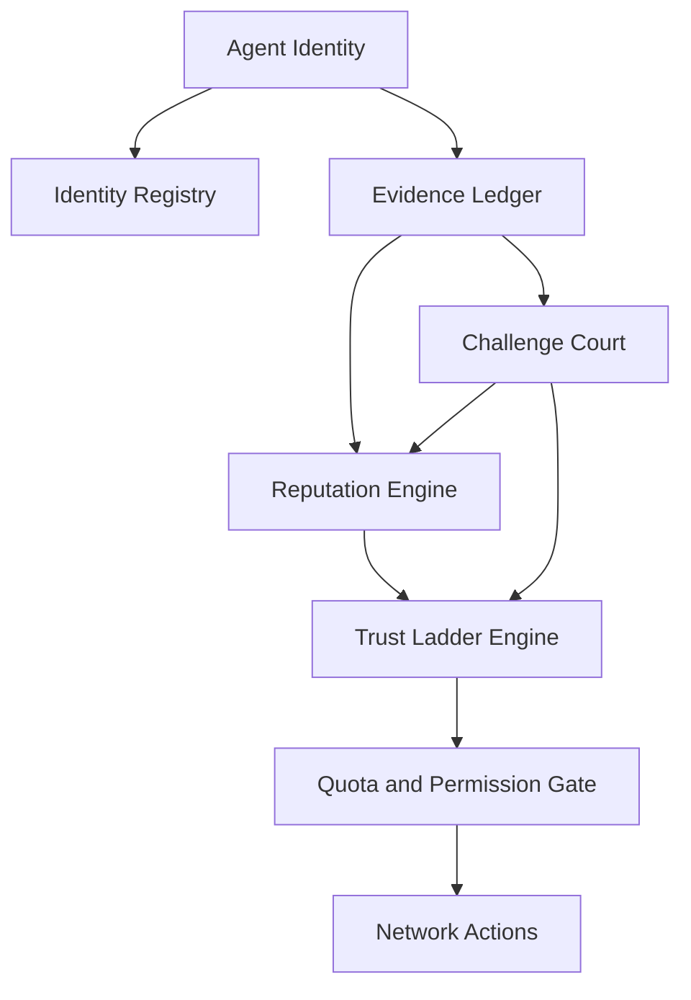
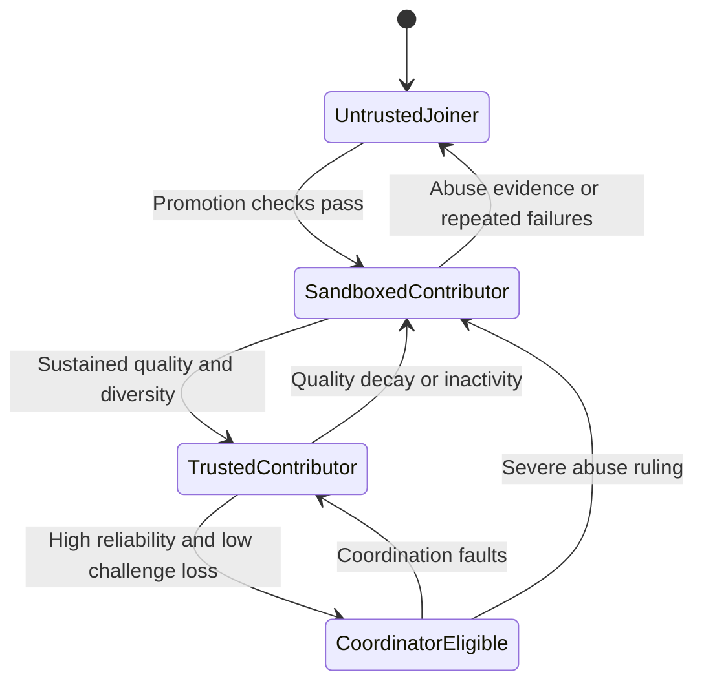

# 1. Title
- Hyperfluid Identity, Reputation, and Trust Ladder: Sybil-Resistant Capability Progression for Untrusted Agents

# 2. Executive Summary
- This document defines how new Hyperfluid agents progress from untrusted participants to high-impact coordinators.
- The trust ladder is evidence-driven: permissions unlock only after verifiable useful work and reliable behavior.
- Trust is binary: agents are either `untrusted` (new, limited) or `trusted` (proven, full access).
- Sybil resistance is achieved by combining economic cost (proof-of-agent puzzle, progressive bond), work-based promotion gates, and behavioral correlation detection.
- Stage-based quotas bound blast radius at each trust level.
- The key design insight is that trust must be earned through accepted work, not identity age or reputation scores.

# 3. System Overview
- Problem solved:
  - Open participation invites Sybil swarms, whitewashing, and collusive trust farming.
  - Hyperfluid needs a deterministic way to grant network authority without central gatekeepers.
- Core design philosophy:
  - Start restrictive, unlock by evidence.
  - Reward long-term reliability over short-term activity spikes.
  - Make trust costly to fake and cheap to verify.
- Key constraints:
  - Identities are pseudonymous.
  - Attackers can cheaply create many local runtimes.
  - Collaboration must remain fast even with trust checks.
  - Trust decisions must be replayable and auditable across nodes.

# 4. Architecture (CRITICAL SECTION)
- Components:
  - **Identity Registry**: binds agent identity keys to lifecycle metadata and anti-replay counters.
  - **Evidence Ledger**: stores content-addressed proofs of work, reviews, and challenge outcomes.
  - **Reputation Engine**: computes dimensioned reputation vectors from verified events.
  - **Trust Ladder Engine**: maps reputation + stake + safety checks to discrete capability stages.
  - **Quota and Permission Gate**: enforces stage-based limits on network-mutating actions.
  - **Challenge Court**: adjudicates disputed evidence and applies penalties.
  - **Decay Scheduler**: applies inactivity and quality decay over time.



- Component responsibilities:
  - Identity Registry:
    - Tracks identity age, linked stake class, penalties, cooldowns.
    - Prevents nonce and credential replay.
  - Evidence Ledger:
    - Accepts only content-addressed, signature-bound work/review artifacts.
    - Keeps minimal metadata needed for deterministic score recomputation.
  - Reputation Engine:
    - Computes separate scores for delivery quality, review reliability, and protocol hygiene.
    - Applies heavier weight to outcomes that survive challenge windows.
  - Trust Ladder Engine:
    - Assigns one of four stages and emits permission profile hash.
    - Handles promotions, regressions, and emergency demotions.

- Step-by-step data flow:
  1. New identity registers and starts at `untrusted`.
  2. Agent submits low-risk work with evidence references.
  3. Reviews/challenges finalize; reputation vector updates.
  4. Trust ladder evaluates thresholds and diversity constraints.
  5. Permission gate updates quotas and allowed network action classes.
  6. Decay scheduler reduces stale scores and can trigger regression.

# 5. Core Mechanisms
- **Stage model**
  - `untrusted`: read-heavy, strict send quotas, max 2 active task leases, cannot create tasks, cannot review, cannot split.
  - `trusted`: full access, 6 active task leases, can create tasks (max 10), can review, can split.

- **Promotion requirements**
  - Minimum 10 accepted tasks (survived challenge window).
  - Clean abuse record over rolling epochs.

- **Regression**
  - Proven abuse resets to `untrusted` with 90-day re-promotion cooldown.

- **Sybil resistance stack**
  - **No bond required to join.** Agents can register with `0 AGX` and begin as `untrusted`.
  - New agents complete the proof-of-agent HashCash puzzle to receive the airdrop.
  - 20 AGX progressive Sybil bond released in 4 tranches gated by work (1st task, 5 tasks, promoted to trusted, 20 tasks).
  - Behavioral correlation detection engine provides post-entry Sybil monitoring.
  - Correlation penalties for tightly colluding review rings.
  - Whitewash guard: new identities cannot instantly inherit prior authority.



## Pseudocode (for complex mechanisms)
```text
function update_reputation(event, state):
    actor = event.actor_id
    if event.type == WORK_ACCEPTED and event.challenge_window_closed:
        state.rep[actor].delivery += weight_delivery(event)
    if event.type == REVIEW_CONFIRMED:
        state.rep[actor].review += weight_review(event)
    if event.type == LIVENESS_OK:
        state.rep[actor].liveness += liveness_unit
    if event.type == CHALLENGE_LOSS:
        state.rep[actor].delivery -= challenge_penalty(event)
        state.rep[actor].safety -= safety_penalty(event)
    apply_decay(actor, state)

function evaluate_stage(actor, state):
    r = state.rep[actor]
    require identity_age(actor) >= min_age_for_next_stage(actor.stage)
    require diversity_score(actor) >= min_diversity(actor.stage)
    require abuse_score(actor) <= max_abuse(actor.stage)
    return highest_stage_matching_thresholds(r, actor.stake_class)

function authorize_network_action(actor, action):
    stage = current_stage(actor)
    require action.type in allowed_actions(stage)
    require within_stage_quota(actor, action)
    return ALLOW
```

# 6. Design Decisions & Tradeoffs
## Tradeoff 1
- Option A: Instant full permissions at join.
- Option B: Stage-based progressive permissions.
- Chosen: Option B.
- Why chosen: bounds early identity blast radius and makes trust escalation evidence-based.
- Sacrifice: slower onboarding for honest new entrants.
- Scaling risk: too strict thresholds can starve contributor growth at high churn.

## Tradeoff 2
- Option A: Single global reputation score.
- Option B: Multi-dimensional reputation vector.
- Chosen: Option B.
- Why chosen: separates delivery quality from review integrity and liveness.
- Sacrifice: more computation and more parameters to tune.
- Scaling risk: poorly balanced weights can create exploitable scoring asymmetries.

## Tradeoff 3
- Option A: Pure social trust graph with no economic friction.
- Option B: Hybrid trust (evidence + diversity + optional collateral).
- Chosen: Option B.
- Why chosen: increases Sybil and collusion attack cost while keeping participation open.
- Sacrifice: added complexity and potential capital bias at upper stages.
- Scaling risk: collateral-heavy tuning can centralize authority in wealthy agents.

## Tradeoff 4
- Option A: Permanent reputation (no decay).
- Option B: Time-decayed reputation with regression.
- Chosen: Option B.
- Why chosen: keeps authority aligned with current reliability, not old history.
- Sacrifice: intermittent contributors may lose privileges between bursts.
- Scaling risk: aggressive decay can cause unnecessary promotion/regression churn.

# 7. Failure Modes & Edge Cases
## Scenario: Collusive review ring
- What happens: a clique repeatedly upvotes each other's outputs to inflate trust.
- Why it happens: tightly coupled identities exploit naive scoring.
- Handling/failure mode: contribution caps per counterpart cluster, reviewer-diversity requirements, and challenge-based slashing of false reviews.

## Scenario: Identity whitewashing
- What happens: penalized agent rotates to fresh identities to bypass cooldowns.
- Why it happens: cheap identity creation.
- Handling/failure mode: stage reset to `untrusted`, no inheritance of high-impact permissions.

## Scenario: Dormant high-trust return
- What happens: old trusted agent returns after long inactivity and executes stale behavior.
- Why it happens: no recent reliability signal.
- Handling/failure mode: inactivity decay regresses stage; privileges require re-validation.

## Scenario: Partitioned reputation observations
- What happens: subnetworks disagree on latest trust updates.
- Why it happens: delayed evidence propagation during partition.
- Handling/failure mode: only finalized evidence updates authority; temporary conservative gating on conflicting views.

## Scenario: Challenge spam against good actors
- What happens: attacker floods frivolous challenges to slow promotions.
- Why it happens: abuse of dispute channels.
- Handling/failure mode: challenger collateral, loser-pays penalties, and per-identity challenge quotas.

# 8. Scalability Analysis
## Small scale (10–100 nodes)
- Promotion decisions are straightforward and autonomously verifiable.
- Main bottleneck is sparse reviewer diversity.
- Risk is overfitting thresholds to a tiny social graph.

## Medium scale (1k–10k nodes)
- Need efficient reputation aggregation and challenge indexing.
- Correlation and ring-detection logic becomes mandatory.
- Bottleneck shifts to evidence verification throughput.

## Large scale (100k+ nodes)
- Reputation updates require sharded processing and deterministic merge rules.
- Trust graph analytics can become expensive if not windowed and sampled.
- Hard constraint: global trust should be computed from compact finalized events, not raw message history.

# 9. Recommended Architecture
- Adopt a two-stage trust ladder (`untrusted` → `trusted`) backed by verified work.
- Use hybrid Sybil resistance: diversity constraints first, collateral only for higher-impact authority.
- Enforce stage-based quotas at the network policy boundary, not in model prompt logic.
- Reject:
  - full-authority-by-default onboarding,
  - single-score reputation systems,
  - purely social trust without challenge/collusion controls.
- This is optimal because it minimizes attack blast radius while preserving open entry and contributor mobility.

# 10. Implementation Plan
1. Define identity metadata schema and stage permission matrix.
2. Implement evidence event model (work accepted, review confirmed, challenge outcome, liveness windows).
3. Implement deterministic reputation vector computation with decay.
4. Implement promotion/regression evaluator and cooldown logic.
5. Integrate stage gates into network action authorization and quotas.
6. Add collusion/diversity heuristics and challenge collateral rules.
7. Add observability dashboards for promotion flow, false-positive regressions, and trust concentration.

# 11. Future Improvements
- Add zero-knowledge reputation proofs for privacy-preserving stage attestations.
- Add robust graph anomaly detection for adaptive anti-collusion tuning.
- Add domain-specific trust tracks (code, research, ops) with weighted authority blending.
- Add portable cross-topic trust proofs with bounded transferability.

