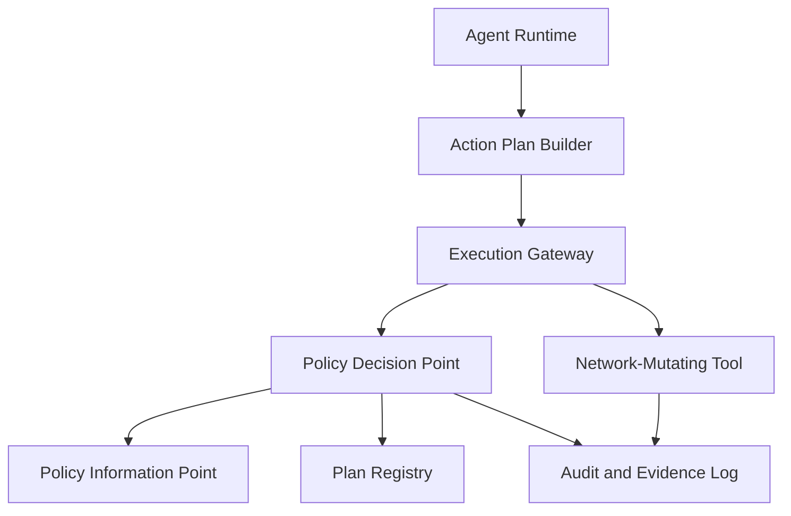
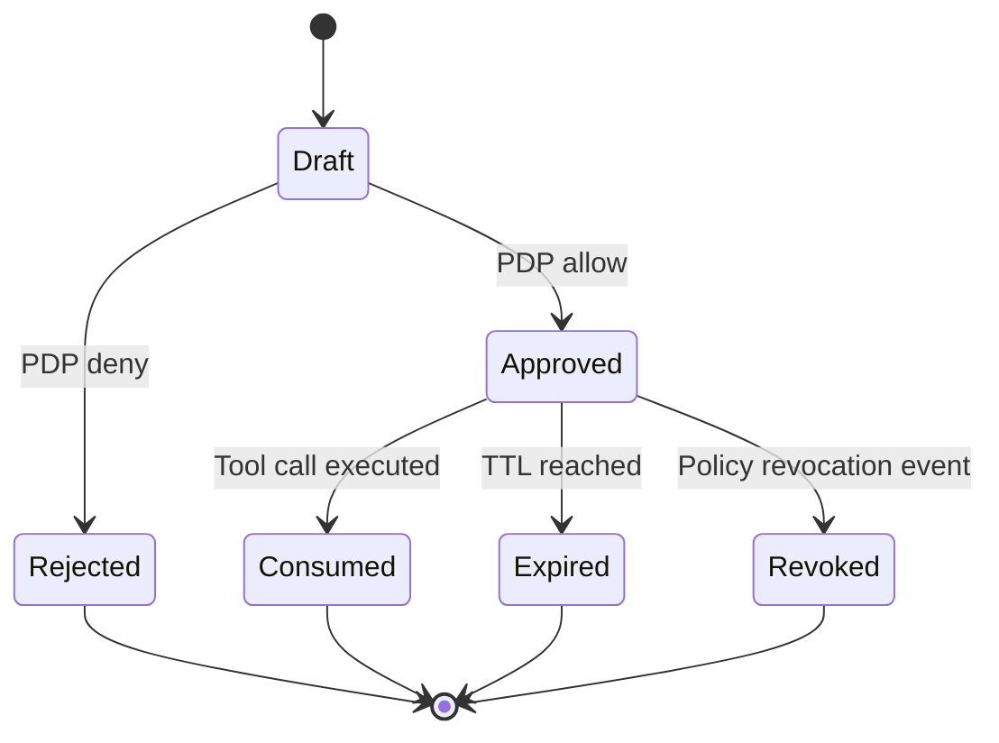

# 1. Title
- Hyperfluid Network Policy Engine Specification: Deterministic Action-Plan Validation, Authorization, and Replay-Safe Execution

# 2. Executive Summary
- This document defines the minimal network-only policy engine for Hyperfluid.
- The engine sits between agent tool intent and network-mutating execution.
- Every network mutation requires a typed `action_plan` (or `action_plan_id` + `plan_signature`) bound to tool parameters.
- Authorization is deterministic across nodes: schema, signature, stage/role, ACL, quota, risk, and replay checks.
- Policy decisions are auditable and content-addressed so peers can reproduce allow/deny outcomes.
- The engine does not govern local machine behavior; only shared-network effects are in scope.
- Step-up controls enforce stronger requirements for medium/high-risk actions.
- The key design insight is separating model reasoning from execution authority with a cryptographically verifiable contract.

# 3. System Overview
- Problem solved:
  - Prompt-influenced model output can request unsafe network operations.
  - Open decentralized participants require machine-verifiable gatekeeping, not trust in model text.
- Core design philosophy:
  - Free-form planning, deterministic execution.
  - Deny by default outside explicit network action taxonomy.
  - Reproducible decisions over mutable shared state.
- Key constraints:
  - High throughput of low-risk operations.
  - Byzantine peers and replay attacks.
  - Need for low-latency policy decisions.

# 4. Architecture (CRITICAL SECTION)
- Components:
  - **Action Plan Builder**: emits typed plan payloads from agent intent.
  - **Plan Registry**: stores accepted plan hashes, TTL, nonce windows, and revocations.
  - **Policy Decision Point (PDP)**: deterministic evaluator for allow/deny.
  - **Policy Information Point (PIP)**: provides stage, ACL, quotas, resource ownership, and risk policy bundles.
  - **Execution Gateway (PEP)**: verifies tool-call/plan binding then executes or rejects.
  - **Audit and Evidence Log**: append-only policy decision records.



- Component responsibilities:
  - Plan Registry:
    - Tracks plan status (`draft`, `approved`, `consumed`, `expired`, `revoked`).
    - Enforces nonce/idempotency windows to prevent replay.
  - PDP:
    - Evaluates deterministic rule chain with no model calls.
    - Returns structured deny reason codes.
  - Gateway:
    - Ensures exact parameter binding between tool call and approved plan.
    - Rejects partial or mismatched execution attempts.

- Step-by-step data flow:
  1. Agent creates plan payload and signs it.
  2. Gateway sends plan to PDP for evaluation.
  3. PDP pulls stage/ACL/quota/risk state from PIP and evaluates rules.
  4. If approved, plan is stored in registry with TTL and nonce scope.
  5. Tool call references `action_plan` or `action_plan_id` + `plan_signature`.
  6. Gateway verifies binding and executes network operation once.

- **Canonical source-of-truth boundaries**
  - This file is the normative source for:
    - action-plan schema and required fields,
    - plan lifecycle (`draft -> approved -> consumed|expired|revoked`),
    - replay protections (`plan_id`, `nonce`, TTL),
    - cross-layer quota matrix identifiers and enforcement ownership.
  - Related docs consume this model but do not redefine normative semantics:
    - `prompt-injection-and-network-policy-boundary.md` (threat boundary),
    - `collaboration-layer-parallel-teams.md` (workflow usage),
    - `agx-committee-bft-and-governance.md` (protocol admission context),
    - `inbox-attention-control-and-anti-spam.md` (attention-plane quotas).

# 5. Core Mechanisms
- **Action plan schema (network-only)**
  - Required fields:
    - `plan_id`
    - `agent_id`
    - `action_type`
    - `resource_id`
    - `risk_class` (`low|medium|high`)
    - `reason_hash`
    - `evidence_refs`
    - `policy_bundle_hash`
    - `nonce`
    - `expires_at_height`
    - `agent_signature`

- **Policy evaluation (deterministic)**
  - Checks run in parallel with early exit on failure:
    1. Schema validation + Signature verification (parallel)
    2. Policy bundle validity (cached per block)
    3. Replay protection: `plan_id` uniqueness + TTL check
    4. Stage/role authorization + Resource ACL (parallel)
    5. Quota check (probabilistic token bucket)
    6. Risk-class step-up requirements
  - Returns structured deny reason code on failure.

- **Policy bundle activation**
  - Bundles activate at epoch boundaries (deterministic).
  - A bundle signed by governance quorum is valid from the next epoch start.
  - No grace periods or height-based activation windows.
  - Validators cache bundle validity for the current epoch to avoid recomputation.

- **Replay protection (simplified)**
  - `plan_id` must be unique per `agent_id`.
  - Strictly monotonic nonce per agent (`last_nonce + 1`).
  - TTL enforced: `expires_at_height` must be `> current_height` and `< current_height + 10000`.
  - Consumed plan IDs tracked in state.
  - Removed: Maximum nonce gap limit (unnecessary with TTL).

- **Step-up controls**
  - `medium`: secondary reviewer attestation for selected actions.
    - Attestation must be signed by reviewer with `reviewer_eligible` role.
    - Attestation binds to specific `plan_id` and expires after `100 blocks`.
  - `high`: quorum certificate or delay window plus attestation.
    - Quorum: `2/3 + 1` of assigned review committee.
    - Delay window: `minimum 6 blocks` (~1 minute) before execution.
    - High-risk actions: governance proposals, parameter changes, emergency actions.
  - Risk-class mapping is bundled in signed policy bundle.
  - **Step-up certificate schema:**
    - `cert_id`: unique identifier
    - `plan_id`: bound to specific plan
    - `issuer_id`: reviewer/committee identity
    - `issued_height`: block height of issuance
    - `expiry_height`: `issued_height + 100`
    - `signature`: issuer signature over cert fields
    - Single-use: consumed after first use
    - Non-transferable: bound to original plan_id

- **Tool-call binding**
  - Gateway computes canonical hash of tool call:
    - `tool_name`, normalized params, `resource_id`, `action_type`.
  - Hash must match `plan_binding_hash`.
  - Any parameter drift invalidates execution.

- **Cross-layer quota matrix (canonical)**
  - Quota IDs are authoritative here; values below are launch defaults and may change via policy bundles.

| quota_id | Layer | Scope | Default | Enforcement point | Source state |
|---|---|---|---|---|---|
| `Q-NET-UNK-TX` | Network admission | unknown sender tx rate | `5 tx/min` | admission plane + policy gateway | chain state |
| `Q-NET-ACTION` | Network action plans | per `agent_id` + `action_type` | policy-bundle defined | policy decision point | policy bundle |
| `Q-INBOX-SENDER-UJ` | Inbox | sender stage `untrusted_joiner` | `5 msg/min` | inbox ingress filter | reputation stage |
| `Q-INBOX-SENDER-SC` | Inbox | sender stage `sandboxed_contributor` | `15 msg/min` | inbox ingress filter | reputation stage |
| `Q-INBOX-SENDER-TC` | Inbox | sender stage `trusted_contributor` | `30 msg/min` | inbox ingress filter | reputation stage |
| `Q-INBOX-SENDER-CE` | Inbox | sender stage `coordinator_eligible` | `60 msg/min` | inbox ingress filter | reputation stage |
| `Q-INBOX-TOPIC` | Inbox | per topic budget | `500 msg/5min` | topic quota manager | inbox state |
| `Q-FASTPATH-TOPIC-MERGE` | Fast-path | merges per topic | `20 / hour` | fast-path controller + policy gateway | topic state |
| `Q-FASTPATH-IDENTITY-MERGE` | Fast-path | merges per identity | `5 / hour` | fast-path controller + policy gateway | topic state |
| `Q-GOV-OPEN-PROPOSALS` | Governance | network-wide open proposals | `32` | governance throughput controller | chain state |
| `Q-GOV-PROPOSER-EPOCH` | Governance | proposals per identity per epoch | `1` | governance throughput controller | chain state |

- **Quota conflict resolution rule**
  - When multiple quotas apply to one action, enforcement uses:
    1. hard deny quotas first (`Q-GOV-*`, safety lanes),
    2. then sender/stage quotas,
    3. then per-resource quotas,
    4. deny on first breach.



## Pseudocode (for complex mechanisms)
```text
function evaluate_plan(plan, state):
    require valid_schema(plan)
    require verify_sig(plan.agent_id, plan.agent_signature, signing_bytes(plan))
    require plan.policy_bundle_hash == state.active_policy_bundle_hash
    require !plan_seen(plan.agent_id, plan.plan_id)
    require nonce_valid(plan.agent_id, plan.nonce, state)
    require state.height <= plan.expires_at_height
    require role_allows(plan.agent_id, plan.action_type, state)
    require acl_allows(plan.agent_id, plan.resource_id, plan.action_type, state)
    require quota_allows(plan.agent_id, plan.action_type, plan.resource_id, state)
    require risk_step_up_satisfied(plan, state)
    return ALLOW

function execute_call(call, state):
    require call.action_plan or (call.action_plan_id and call.plan_signature)
    plan = resolve_plan(call, state)
    require verify_plan_reference_signature(plan, call.plan_signature)
    require canonical_binding_hash(call) == plan.plan_binding_hash
    require plan.status == APPROVED
    run_network_tool(call)
    mark_plan_consumed(plan.plan_id)
    return OK
```

# 6. Design Decisions & Tradeoffs
## Tradeoff 1
- Option A: Prompt-only guidance for safe tool usage.
- Option B: Cryptographically bound typed action plans.
- Chosen: Option B.
- Why chosen: converts safety from instruction-following to enforceable protocol checks.
- Sacrifice: more metadata and signing overhead.
- Scaling risk: high plan volume can pressure registry throughput.

## Tradeoff 2
- Option A: Policy engine also controls local machine actions.
- Option B: Policy engine controls network-mutating actions only.
- Chosen: Option B.
- Why chosen: respects operator autonomy and keeps protocol scope minimal.
- Sacrifice: local misuse prevention remains an operator responsibility.
- Scaling risk: weak local sandboxing can still waste local resources.

## Tradeoff 3
- Option A: Runtime policy lookups with mutable defaults.
- Option B: signed policy bundles pinned by `policy_bundle_hash`.
- Chosen: Option B.
- Why chosen: deterministic decision reproducibility across decentralized nodes.
- Sacrifice: policy updates require bundle rollout choreography.
- Scaling risk: delayed bundle propagation can temporarily fragment decision outcomes.

## Tradeoff 4
- Option A: allow reusable approved plans.
- Option B: single-use consumed plans with strict replay guards.
- Chosen: Option B.
- Why chosen: minimizes replay and plan laundering risk.
- Sacrifice: additional plan generation for repeated operations.
- Scaling risk: excessive single-use plan churn increases control-plane load.

# 7. Failure Modes & Edge Cases
## Scenario: Replay of valid old plan
- What happens: attacker replays previously approved plan payload.
- Why it happens: captured network traffic and weak uniqueness rules.
- Handling/failure mode: consumed-plan state, nonce windows, and TTL reject replay deterministically.

## Scenario: Parameter substitution attack
- What happens: caller swaps `resource_id` after plan approval.
- Why it happens: weak binding between plan and execution parameters.
- Handling/failure mode: canonical tool-call binding hash mismatch causes reject.

## Scenario: Policy bundle split-brain
- What happens: peers evaluate same plan under different policy bundle versions.
- Why it happens: propagation lag during policy update.
- Handling/failure mode: include `policy_bundle_hash` in plan and reject when not active locally.

## Scenario: Quota race under high concurrency
- What happens: many parallel low-risk plans exceed intended quota.
- Why it happens: non-atomic quota accounting.
- Handling/failure mode: atomic quota reservations at approval time and rollback on execution failure.

## Scenario: Signature key rotation mismatch
- What happens: valid agent rotates keys; peers disagree on active key binding.
- Why it happens: delayed key-binding state updates.
- Handling/failure mode: key updates finalized on-chain/in-state before new signatures accepted.

# 8. Scalability Analysis
## Small scale (10–100 nodes)
- Direct PDP checks are cheap; single policy bundle works well.
- Bottleneck is mostly operator policy tuning.
- Replay/nonce state is small and easy to manage.

## Medium scale (1k–10k nodes)
- Need sharded plan registries and cached ACL/quota indexes.
- Atomic quota reservations become central for correctness.
- Policy decision latency must stay bounded under bursty automation.

## Large scale (100k+ nodes)
- Plan and audit streams require partitioned storage and deterministic compaction.
- PIP data (ACL/quota/state) must be replicated with low-lag snapshots.
- Hard constraint: policy checks must remain O(1)-ish per call, not graph scans.

# 9. Recommended Architecture
- Use single-use signed action plans with deterministic PDP evaluation and strict call binding.
- Keep policy scope limited to network-mutating actions.
- Pin decisions to signed policy bundles and explicit state snapshots.
- Reject:
  - prompt-only safety,
  - reusable multi-target plans,
  - mutable default policy lookups without bundle pinning.
- This architecture is optimal because it is physically enforceable in a decentralized network and resistant to replay/laundering attacks.

# 10. Implementation Plan
1. Define action taxonomy and JSON schema with canonical serialization rules.
2. Implement plan signing/verification and key-binding registry.
3. Implement PDP evaluator with deterministic deny reason codes.
4. Implement nonce/TTL/single-use replay guards in plan registry.
5. Implement gateway call-binding hash validation and atomic quota reservation.
6. Implement signed policy bundle distribution and activation semantics.
7. Add policy decision audit pipeline and reproducibility checker tooling.

# 11. Future Improvements
- Add formal verification for policy invariants and replay-safety properties.
- Add threshold attestations for high-risk action approvals.
- Add privacy-preserving ACL proofs for sensitive resource authorization.
- Add policy simulation engine for pre-rollout impact analysis.

