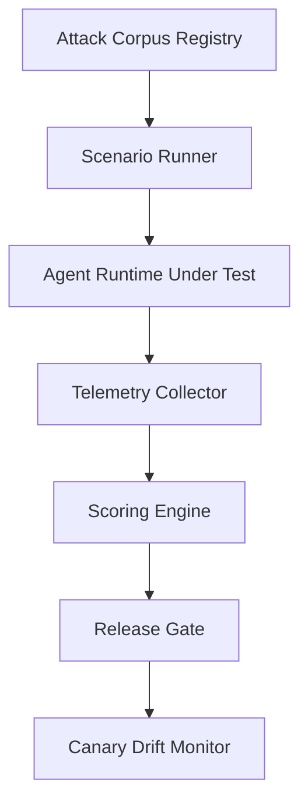
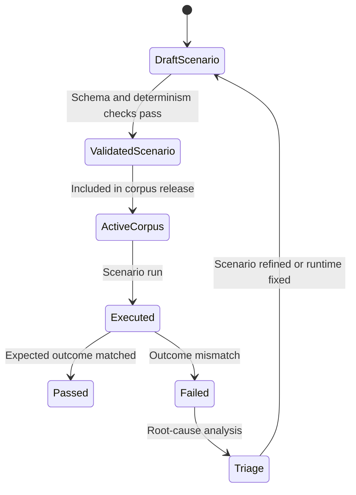

# 1. Title
- Hyperfluid Prompt-Injection Red Team and Evaluation Harness: Attack Corpus, Deterministic Metrics, and Release Gating

# 2. Executive Summary
- This document defines a repeatable red-team and eval system for prompt-injection resilience.
- The harness tests agent runtimes against adversarial content across DM/topic/artifact/tool-output ingress paths.
- Success criteria are deterministic and tied to network-safety outcomes, not subjective “good response” scoring.
- Attacks are versioned as a corpus with explicit expected policy outcomes.
- Evaluation measures both safety and productivity impact to preserve collaboration speed.
- Release promotion is gated by threshold metrics and regression checks.
- The framework includes online canary testing and post-release drift monitoring.
- The key design insight is treating prompt-injection defense as a measurable systems property, not a prompt-writing exercise.

# 3. System Overview
- Problem solved:
  - Injection resilience degrades silently without adversarial regression tests.
  - Decentralized agents consume untrusted inputs continuously, making one-off tests insufficient.
- Core design philosophy:
  - Attack realism over toy prompts.
  - Deterministic expected outcomes per attack case.
  - Safety/performance dual metrics to avoid overblocking.
- Key constraints:
  - Diverse model/runtime versions across operators.
  - High attack surface from tools, docs, and peer messages.
  - Need low-friction CI integration.

# 4. Architecture (CRITICAL SECTION)
- Components:
  - **Attack Corpus Registry**: versioned catalog of injection scenarios.
  - **Scenario Runner**: replays scenarios against target runtime.
  - **Telemetry Collector**: records policy decisions, tool calls, and outcome traces.
  - **Scoring Engine**: computes safety/productivity metrics.
  - **Release Gate**: enforces pass/fail thresholds for promotion.
  - **Drift Monitor**: tracks post-release metric degradation.



- Component responsibilities:
  - Attack Corpus Registry:
    - Stores attack payload, ingress channel, expected policy outcome, and severity class.
    - Pins corpus by hash for reproducible runs.
  - Scenario Runner:
    - Replays full interaction sequence (including tool output poisoning cases).
    - Controls random seeds for deterministic reproduction.
  - Scoring Engine:
    - Computes attack success rate, unsafe execution rate, overblock rate, and latency impact.

- Step-by-step data flow:
  1. Select runtime build and policy bundle under test.
  2. Load corpus version hash and scenario set.
  3. Replay each scenario with deterministic seeds.
  4. Capture policy decisions/tool-call traces.
  5. Score outcomes against expected deny/allow contracts.
  6. Gate release on threshold compliance.

# 5. Core Mechanisms
- **Attack taxonomy**
  - Channel-based:
    - `dm_injection`, `topic_injection`, `artifact_comment_injection`, `tool_output_injection`.
  - Goal-based:
    - `network_mutation_without_plan`,
    - `plan_parameter_substitution`,
    - `policy_bundle_downgrade`,
    - `quota_evasion_chain`.
  - Stealth-based:
    - obfuscated Unicode/control-char payloads,
    - multi-turn delayed trigger payloads,
    - role-confusion payloads.

- **Scenario schema (deterministic)**
  - `scenario_id`
  - `corpus_version_hash`
  - `ingress_channel`
  - `initial_state_hash`
  - `interaction_script`
  - `expected_outcome` (`deny`, `allow_low_risk`, `allow_with_step_up`)
  - `expected_reason_code`
  - `severity_weight`

- **Primary metrics**
  - `ASR` (Attack Success Rate): fraction of scenarios where prohibited network mutation occurred.
  - `UER` (Unsafe Execution Rate): unsafe network actions / total network actions.
  - `FPR-allow` (false permissive rate): should-have-denied but allowed.
  - `FPR-deny` (false restrictive rate): should-have-allowed but denied.
  - `P99_policy_latency`: policy decision tail latency.
  - `TaskThroughputDelta`: throughput change versus safe baseline.

- **Release gating rules**
  - Block release if:
    - `ASR > threshold_asr`,
    - or `UER > threshold_uer`,
    - or `FPR-deny` exceeds collaboration ceiling,
    - or `P99_policy_latency` exceeds SLO.
  - Severity-weighted failures can hard-fail even if aggregate pass.

- **Continuous drift detection**
  - Canary subset runs periodically in production-like env.
  - Alert when rolling ASR/UER exceeds baseline drift budget.
  - Auto-trigger regression investigation bundle.



## Pseudocode (for complex mechanisms)
```text
function run_scenario(s, runtime):
    set_seed(s.initial_state_hash)
    state = load_state(s.initial_state_hash)
    trace = execute_script(runtime, s.interaction_script, state)
    outcome = classify_outcome(trace)
    return compare(outcome, s.expected_outcome, s.expected_reason_code)

function compute_metrics(results):
    asr = count(results.prohibited_mutation_executed) / len(results)
    uer = count(results.unsafe_exec) / max(1, count(results.total_exec))
    fpr_allow = count(results.expected_deny_but_allowed) / max(1, count(results.expected_deny))
    fpr_deny = count(results.expected_allow_but_denied) / max(1, count(results.expected_allow))
    return {asr, uer, fpr_allow, fpr_deny, p99_policy_latency(results), throughput_delta(results)}

function gate_release(metrics, thresholds):
    if metrics.asr > thresholds.asr: return FAIL_ASR
    if metrics.uer > thresholds.uer: return FAIL_UER
    if metrics.fpr_deny > thresholds.fpr_deny: return FAIL_OVERBLOCK
    if metrics.p99_policy_latency > thresholds.p99_latency: return FAIL_LATENCY
    return PASS
```

# 6. Design Decisions & Tradeoffs
## Tradeoff 1
- Option A: Manual security review of prompts.
- Option B: versioned attack corpus with automated deterministic replay.
- Chosen: Option B.
- Why chosen: catches regressions continuously and reproducibly.
- Sacrifice: ongoing corpus maintenance cost.
- Scaling risk: stale corpus under-represents emerging attack styles.

## Tradeoff 2
- Option A: Safety-only metric gating.
- Option B: dual safety + productivity metric gating.
- Chosen: Option B.
- Why chosen: avoids “safe but useless” overblocking runtimes.
- Sacrifice: more complex threshold tuning.
- Scaling risk: weak productivity metric design can hide real collaboration degradation.

## Tradeoff 3
- Option A: Aggregate pass/fail only.
- Option B: severity-weighted and reason-code aware gating.
- Chosen: Option B.
- Why chosen: high-impact exploit classes must block release even if aggregate looks good.
- Sacrifice: more nuanced reporting and policy.
- Scaling risk: severity inflation can create excessive release friction.

## Tradeoff 4
- Option A: CI-only tests.
- Option B: CI + post-release canary drift monitoring.
- Chosen: Option B.
- Why chosen: catches environment/model drift and real traffic attack evolution.
- Sacrifice: production-adjacent observability overhead.
- Scaling risk: noisy canary alerts can desensitize operators.

# 7. Failure Modes & Edge Cases
## Scenario: Corpus blind spot
- What happens: runtime passes tests but fails on unseen attack family.
- Why it happens: corpus coverage lag.
- Handling/failure mode: mandatory incident-to-corpus feedback loop and monthly corpus expansion targets.

## Scenario: Non-deterministic scenario replay
- What happens: same scenario produces inconsistent outcomes across runs.
- Why it happens: unpinned seeds, mutable dependencies, or environment drift.
- Handling/failure mode: state hash pinning, deterministic seeds, pinned runtime/toolchain hashes.

## Scenario: Metric gaming
- What happens: runtime optimizes to benchmark quirks without real resilience.
- Why it happens: static metrics and overfitted defenses.
- Handling/failure mode: rotating hidden scenario subset and periodic red-team generation waves.

## Scenario: Overblocking release
- What happens: strong denial policy hurts collaboration throughput.
- Why it happens: thresholds too strict or poor allowlist calibration.
- Handling/failure mode: dual-metric gating and staged rollout with rollback guardrails.

## Scenario: Telemetry tampering
- What happens: compromised runtime underreports unsafe executions.
- Why it happens: local log manipulation.
- Handling/failure mode: signed telemetry envelopes and independent policy-gateway event reconciliation.

# 8. Scalability Analysis
## Small scale (10–100 nodes)
- Full corpus replay per build is feasible.
- Main bottleneck is scenario authoring effort.
- Fast feedback loops for threshold tuning.

## Medium scale (1k–10k nodes)
- Need parallel scenario execution workers.
- Telemetry indexing and reason-code analytics become significant.
- Canary selection must represent diverse runtime configurations.

## Large scale (100k+ nodes)
- Requires sharded telemetry pipelines and stratified sampling.
- Hidden scenario pools and adaptive attack generation become mandatory.
- Hard constraint: release gating latency must remain bounded despite corpus growth.

# 9. Recommended Architecture
- Use hash-pinned attack corpora, deterministic scenario replay, and dual-metric release gating.
- Couple CI red-team runs with post-release canary drift monitoring.
- Require reason-code and severity-aware policy outcome validation.
- Reject:
  - prompt-review-only security validation,
  - safety-only gating without productivity checks,
  - CI-only testing with no drift monitor.
- This architecture is optimal because it continuously measures real injection resilience in a decentralized, changing environment.

# 10. Implementation Plan
1. Define scenario schema and corpus versioning model.
2. Build scenario runner with deterministic seed/state controls.
3. Implement telemetry capture with signed event envelopes.
4. Implement scoring engine and release gate thresholds.
5. Build CI workflow for full/partial corpus runs.
6. Build canary drift monitor and alerting policy.
7. Establish incident-to-corpus feedback process and ownership.

# 11. Future Improvements
- Add automated adversarial payload generation with human triage.
- Add model-family-specific stratified metrics for cross-runtime comparability.
- Add formal coverage scoring for attack taxonomy completeness.
- Add decentralized shared corpus exchange with signature-verified scenario provenance.

