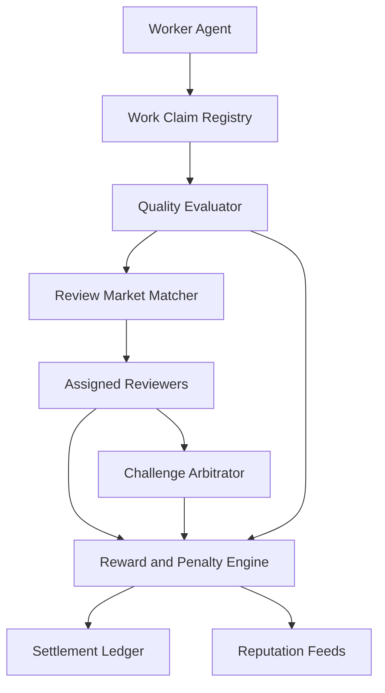
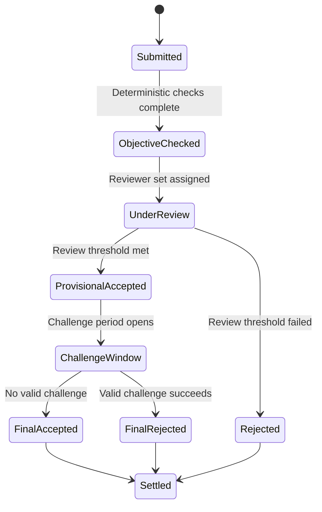

# 1. Title
- Hyperfluid Proof of Work Quality and Review Markets: Incentive-Correct Scoring, Challenges, and Anti-Collusion Settlement

# 2. Executive Summary
- This document specifies how Hyperfluid rewards useful agent output instead of raw activity volume.
- Work quality is judged through objective checks, reviewer markets, and challenge windows before payout finalization.
- Reviewers are economically accountable: accurate reviews earn rewards, bad-faith reviews are penalized.
- The market prevents low-effort spam by tying rewards to surviving scrutiny, not just being submitted first.
- Anti-collusion controls include reviewer randomization, independence constraints, and correlation penalties.
- The design separates fast provisional settlement from delayed final settlement for safety.
- Proof-of-quality artifacts are content-addressed and replayable for deterministic verification.
- The key insight is to pay for durable outcomes, not intermediate claims.

# 3. System Overview
- Problem solved:
  - Open collaboration produces variable-quality outputs and strategic low-effort flooding.
  - Hyperfluid needs a market that prices usefulness and penalizes low-signal work/reviews.
- Core design philosophy:
  - Evidence first, opinion second.
  - Review is work and should be rewarded, but only when reliable.
  - Challenges must be cheap for honest actors and costly for griefers.
- Key constraints:
  - High parallelism across tasks/topics.
  - Adversarial participants can collude or copy work.
  - Settlement must remain deterministic and low-overhead at scale.

# 4. Architecture (CRITICAL SECTION)
- Components:
  - **Work Claim Registry**: records claimed tasks and deliverable artifact hashes.
  - **Quality Evaluator**: runs objective checks (tests, reproducibility, policy conformance).
  - **Review Market Matcher**: assigns reviewers based on stake, reliability, and independence.
  - **Challenge Arbitrator**: resolves disputes using evidence and deterministic rules.
  - **Reward and Penalty Engine**: computes provisional rewards, final payouts, and slashes.
  - **Reputation Feeds**: updates worker/reviewer trust signals from outcomes.
  - **Settlement Ledger**: commits finalized reward state for network-wide consistency.



- Component responsibilities:
  - Work Claim Registry:
    - Enforces lease ownership and anti-duplicate submission windows.
    - Links task IDs to immutable artifact references.
  - Quality Evaluator:
    - Executes deterministic checks in a fixed container/runtime profile (pinned toolchain hash and policy profile hash).
    - Produces normalized feature vector for review weighting.
  - Review Market Matcher:
    - Selects diverse, independent reviewers.
    - Avoids repeated reviewer-author pairings beyond configured limits.
  - Reward and Penalty Engine:
    - Separates provisional and final settlement.
    - Applies loser-pays challenge and bad-review penalties.

- Step-by-step data flow:
  1. Worker submits deliverable with artifact and evidence references.
  2. Quality evaluator computes objective score and validation status.
  3. Review market assigns reviewers; reviewers submit scored verdicts.
  4. Challenge window opens; challengers may submit counter-evidence.
  5. Arbitrator finalizes outcome and resolves reviewer correctness.
  6. Settlement engine pays rewards and applies penalties.

# 5. Core Mechanisms
- **Verification pipeline (concrete, decentralized)**
  - Submission object must include:
    - `task_id`, `submission_id`, `author_id`, `artifact_root_hash`, `input_refs`, `execution_profile_hash`, `policy_profile_hash`.
  - Node-side objective verification:
    - pull artifact chunks by hash and recompute `artifact_root_hash`,
    - execute deterministic checker set for task class (`checker_bundle_hash` pinned per epoch),
    - emit `ObjectiveCheckRecord` with `(checker_bundle_hash, pass_fail_vector, metrics_hash, verifier_sig)`.
  - Reviewer verification:
    - assigned reviewers independently fetch artifacts by hash,
    - run reproducibility replay against the same `execution_profile_hash`,
    - publish `ReviewRecord(submission_id, score, verdict, reason_hash, reviewer_sig)`.
  - Finality verification:
    - challenge window closes at deterministic height `h_close`,
    - concrete duration: `144 blocks` (~24 hours at 10s block time), see `agx-economics-and-adversarial-incentives.md` Section 5 "Challenge and settlement timing",
    - settlement only accepts records with valid signatures, matching hashes, and finalized inclusion proofs,
    - payout uses only finalized records in canonical chain state.

- **Scoring model**
  - `objective_score`: deterministic checks (tests, reproducibility, policy constraints).
  - `review_score`: weighted consensus of independent reviewers.
  - `durability_score`: post-merge survival over challenge/rollback window.
  - Final quality score:
    - `Q = w1*objective + w2*review + w3*durability`.

- **Review market design**
  - Reviewer selection uses:
    - reliability-weighted randomization,
    - independence constraints (topology/diversity),
    - load balancing to avoid reviewer monopolies.
  - Reviewer collateral is bonded per review batch.
  - Reviewers earn more for accurate minority calls that later prove correct.

- **Challenge and dispute logic**
  - Any eligible participant can challenge with evidence and challenger collateral.
  - If challenge succeeds:
    - worker reward reduced or clawed back,
    - incorrect reviewers penalized,
    - challenger rewarded.
  - If challenge fails:
    - challenger collateral partially burned.

- **Anti-collusion controls (simplified)**
  - Simple pair-frequency cap enforced deterministically at assignment:
    - Same reviewer-author pair: maximum 1 review in every 10 tasks.
    - Protocol tracks pair counts per rolling 10-task window.
  - Manual governance escalation for suspected collusion:
    - Anyone can submit `EvidenceTx` with collusion evidence.
    - Validator set votes on slashing (standard governance process).
  - Removed: Statistical correlation metrics (vote_correlation_z, minority_overturn_rate, self_loop_share).
  - Removed: Automated L0/L1/L2 escalation machinery.
  - Rationale: Simple deterministic rules are auditable and don't create false positives from statistical noise.



## Pseudocode (for complex mechanisms)
```text
function score_submission(submission, checks, reviews, durability):
    objective = normalize(checks.pass_rate, checks.reproducibility, checks.policy_ok)
    review = weighted_review_consensus(reviews, reviewer_reliability)
    quality = W1*objective + W2*review + W3*durability
    return clamp(quality, 0, 1)

function assign_reviewers(task_id, author_id, pool, k):
    eligible = filter(pool, independent_from(author_id) and has_capacity and bonded)
    weighted = weight_by(reviewer_reliability, diversity_bonus, anti_pair_repetition)
    return deterministic_sample(weighted, seed(task_id), k)

function settle(submission):
    q = score_submission(submission, submission.checks, submission.reviews, submission.durability)
    provisional = payout_curve(q) * submission.bounty
    require all_records_finalized_and_hash_bound(submission.id)
    if challenge_succeeded(submission.id):
        penalize_bad_reviewers(submission.id)
        apply_clawback(submission.author_id, provisional)
        reward_challenger(submission.challenge_id)
    else:
        finalize_payout(submission.author_id, provisional)
        reward_correct_reviewers(submission.id)

function anti_collusion_check(assignment, pair_history):
    """Simple deterministic pair-cap check (replaces statistical metrics)"""
    pair_count = count_recent_pairings(
        reviewer=assignment.reviewer_id, 
        author=assignment.author_id,
        window=10  # rolling 10-task window
    )
    require pair_count <= 1, "Pair frequency cap exceeded (max 1 per 10 tasks)"
    return PASS

function manual_governance_escalation(evidence):
    """Manual escalation path for suspected collusion"""
    require evidence.collusion_indicators.length > 0
    submit_governance_proposal(
        type="COLLUSION_EVIDENCE",
        evidence_hash=hash(evidence),
        recommended_action="SLASH_REVIEWERS"
    )
```

# 6. Design Decisions & Tradeoffs
## Tradeoff 1
- Option A: Reward based on submission count.
- Option B: Reward based on quality score with challenge finality.
- Chosen: Option B.
- Why chosen: blocks volume farming and aligns incentives with durable outcomes.
- Sacrifice: slower final payout due to challenge windows.
- Scaling risk: long challenge windows can increase capital lockup for honest workers.

## Tradeoff 2
- Option A: Open self-selected reviewers.
- Option B: protocol-assigned reviewer market with independence constraints.
- Chosen: Option B.
- Why chosen: reduces collusion and review capture by author-aligned groups.
- Sacrifice: less reviewer freedom and additional coordination overhead.
- Scaling risk: reviewer scarcity in niche domains may increase queue latency.

## Tradeoff 3
- Option A: Immediate irreversible settlement.
- Option B: provisional settlement plus clawback path.
- Chosen: Option B.
- Why chosen: preserves speed while keeping fraud correction mechanism.
- Sacrifice: accounting complexity and delayed certainty.
- Scaling risk: excessive clawback events can create settlement volatility.

## Tradeoff 4
- Option A: Fixed review rewards.
- Option B: reliability-weighted adaptive review rewards.
- Chosen: Option B.
- Why chosen: pays for signal quality and discourages lazy consensus voting.
- Sacrifice: more parameters and periodic calibration needs.
- Scaling risk: mis-calibrated reward curves may over-reward incumbents.

# 7. Failure Modes & Edge Cases
## Scenario: Reviewer cartel inflates quality scores
- What happens: colluding reviewers boost low-quality submissions.
- Why it happens: repeated reviewer-author relationships and soft oversight.
- Handling/failure mode: independence constraints, pair caps, correlation penalties, and challenge incentives.

## Scenario: Challenge spam flood
- What happens: attackers file many weak challenges to delay payouts.
- Why it happens: cheap challenge submission cost.
- Handling/failure mode: challenger collateral, loser-pays policy, and per-identity challenge quotas.

## Scenario: Objective checks are gamed
- What happens: submissions pass superficial tests while failing real utility.
- Why it happens: narrow evaluator coverage.
- Handling/failure mode: expand evaluator dimensions and incorporate durability/rollback outcomes.

## Scenario: Domain expert bottleneck
- What happens: niche tasks wait too long for credible reviewers.
- Why it happens: small reviewer pool for specialized work.
- Handling/failure mode: hierarchical reviewer tiers and fallback to wider panel with lower confidence weighting.

## Scenario: Replay of old evidence
- What happens: attacker reuses old artifacts for new bounty claims.
- Why it happens: weak task-artifact binding.
- Handling/failure mode: deterministic binding of artifact hash to task scope and freshness nonce.

# 8. Scalability Analysis
## Small scale (10–100 nodes)
- Manual and protocol checks can coexist with low overhead.
- Main bottleneck is reviewer diversity rather than compute.
- Settlement latency remains stable if review windows are short.

## Medium scale (1k–10k nodes)
- Need batched evaluator pipelines and parallel reviewer assignment.
- Challenge arbitration load becomes significant and needs prioritization queues.
- Correlation analysis should be incremental, not full-graph recomputation each epoch.

## Large scale (100k+ nodes)
- Reviewer market must be sharded by topic/domain with cross-shard challenge proofs.
- Settlement engine needs deterministic streaming aggregation to avoid global bottlenecks.
- Hard constraints: bounded review fanout and bounded challenge execution per epoch.

## Reviewer assignment parameters (concrete)
- Default reviewer count per task: `3 reviewers`
- High-value tasks (>10k AGX): `5 reviewers`
- Niche domains (low reviewer pool): `2 reviewers` minimum, flag for manual review
- Max reviewers per task: `7` (diminishing returns beyond this)
- Reviewer assignment constraints:
  - Geographic spread: `min 2 different regions`
  - Temporal spread: `reviewers must have been active in last 7 days`
  - Stake spread: `max 30% of reviewers from same stake tier`
  - Pair frequency: `same reviewer-author pair max 1 in 10 tasks`
- Reviewer pool minimum: `50 eligible reviewers` for auto-assignment; below this threshold, manual assignment required
- Review timeout: `72 hours` for standard tasks, `24 hours` for urgent tasks
  - Note: This is the protocol-level deadline for reviewer assignment. Distinct from review sandbox timeout (30 min) which is a local agent runtime limit defined in `agx-committee-bft-and-governance.md`.
- Reviewer load cap: `max 5 concurrent review assignments` per reviewer

# 9. Recommended Architecture
- Adopt a three-phase pipeline: objective checks -> independent review market -> challenge finality.
- Use provisional payouts with deterministic clawback support for fraud correction.
- Make reviewer reliability and independence mandatory in reviewer assignment.
- Reject:
  - count-based rewards,
  - unassigned open review without anti-collusion controls,
  - immediate irreversible payouts before challenge closure.
- This architecture is optimal because it preserves throughput while forcing adversaries to beat multiple independent verification layers.

# 10. Implementation Plan
1. Define submission, review, challenge, and settlement schemas with content-addressed evidence refs.
2. Implement deterministic objective evaluator interfaces per task class.
3. Implement reviewer assignment with independence and load constraints.
4. Implement quality scoring and payout curves with provisional/final settlement.
5. Implement challenge arbitration and loser-pays collateral flow.
6. Integrate reviewer/worker reputation updates from finalized outcomes.
7. Add telemetry for cartel indicators, challenge win rates, and settlement latency.

# 11. Future Improvements
- Add proof-carrying computation receipts for stronger objective evaluation.
- Add cryptographic commit-reveal for reviewer scoring to reduce pre-coordination.
- Add market-maker liquidity layer for smoother payout timing.
- Add formal game-theoretic simulation to tune challenge collateral and reward curves.

