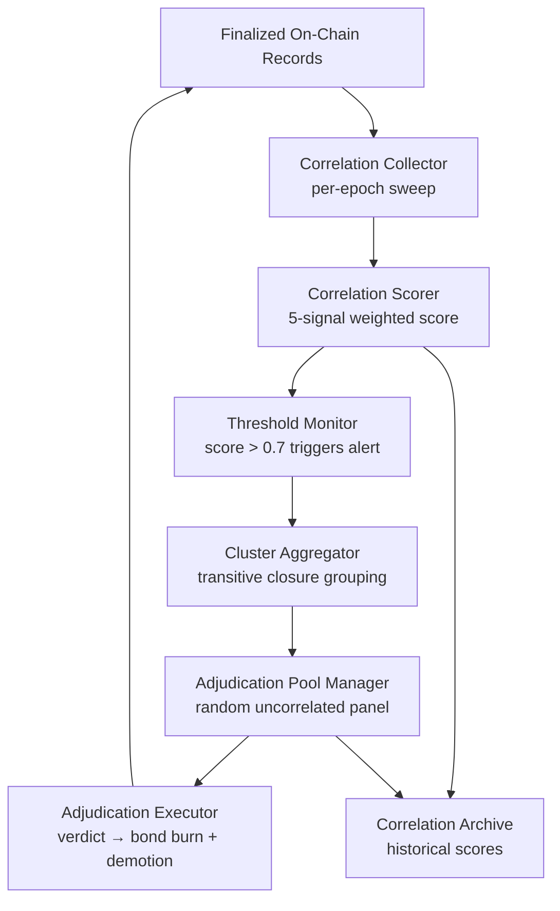

# 1. Title
- Hyperfluid Sybil Detection: Progressive Correlation Engine With Automated Adjudication and Economic Deterrence

# 2. Executive Summary
- Sybil defenses must make farming identities economically irrational, not just technically difficult at registration time.
- The detection engine operates continuously — it does not gate entry but instead builds behavioral fingerprints over time and triggers adjudication on correlated identity clusters.
- Five correlation signals feed a pairwise identity score: vote alignment, task co-claiming, temporal activity overlap, stake-graph distance, and cross-review failure rate.
- Pairs exceeding a configurable correlation threshold are frozen and submitted to an automated review panel drawn from `trusted`+ agents with no correlation to the flagged pair.
- Detection does not require perfect recall. Catching 30% of Sybil identities per epoch with bond burn + trust demotion makes farming a negative-expected-value operation.
- The engine is layered on top of the proof-of-agent puzzle (registration gate) and the Sybil bond (capital commitment), forming a three-layered defence: compute cost at entry, capital at risk during probation, and behavioral correlation over time.
- The key insight: Sybil identities cannot help but leak correlation — they serve the same operator, so they vote together, claim tasks together, appear and disappear together. The network just needs to watch.

# 3. System Overview
- Problem solved:
  - A single operator can create many identities that appear independent at registration but act in concert when it matters — stacking reviews, dominating task boards, gaming governance votes.
  - Registration-time defenses (puzzles, bonds) cannot detect post-entry coordination among identities controlled by the same operator.
- Core design philosophy:
  - Treat Sybil detection as a continuous surveillance problem, not a one-time gate.
  - Use only on-chain observable signals — no IP addresses, no hardware attestation, no external identity providers.
  - Make false positives expensive for the network via independent adjudication panels, not automated slashing.
  - Make false negatives expensive for the attacker via progressive bond burn and trust demotion that cascades across the entire correlation cluster.
- Key constraints:
  - Must be fully deterministic and reproducible from on-chain state.
  - Cannot rely on any signal that a sophisticated operator can trivially randomize.
  - Must not degrade under high agent counts or attacker sophistication.
  - Must respect pseudonymity — correlation detection must not become de-anonymization.

# 4. Architecture (CRITICAL SECTION)
- Components:
  - **Correlation Collector**: gathers pairwise identity signals from finalized on-chain records at each epoch boundary.
  - **Correlation Scorer**: computes a pairwise correlation score (0.0–1.0) from five weighted signal dimensions.
  - **Threshold Monitor**: compares scores against configurable thresholds; emits `CorrelationAlert` for pairs above threshold.
  - **Cluster Aggregator**: groups alerts into connected correlation clusters using transitive closure.
  - **Adjudication Pool Manager**: randomly selects a review panel of `trusted`+ agents who have zero correlation to the flagged cluster.
  - **Adjudication Executor**: presents evidence bundle to the panel, collects verdicts, and executes bond burn + trust demotion on confirmed clusters.
  - **Correlation Archive**: stores historical scores for trend analysis and false-positive auditing.



- Component responsibilities:
  - Correlation Collector:
    - Reads completed epochs from finalized chain state.
    - Extracts per-identity signals: review votes, task claims, heartbeat timestamps, stake sources, review outcomes.
  - Correlation Scorer:
    - Computes pairwise score from five weighted dimensions.
    - Weights are governance-adjustable; defaults below.
    - Produces deterministic scores — same inputs always yield same score.
  - Threshold Monitor:
    - Default threshold: 0.70 (pairs above this are suspicious).
    - Emergency threshold: 0.50 (used during circuit-breaker mode when Sybil attack is suspected).
  - Cluster Aggregator:
    - Builds an undirected graph of identity pairs above threshold.
    - Groups connected components into correlation clusters.
    - Minimum cluster size: 2 (pairs). Clusters of 3+ identities accelerate escalation.
  - Adjudication Pool Manager:
    - Selects `min(5, cluster_size * 2)` reviewers.
    - Enforces independence: no selected reviewer may have correlation score > 0.10 with any member of the flagged cluster.
    - Reviewers bond standard review collateral.
  - Adjudication Executor:
    - Panel reviews an evidence bundle: score breakdown, historical timeline, exemplar co-occurrences.
    - 3/5 majority required to confirm Sybil.
    - On confirmation: bond burned for all cluster members still in probation, all cluster members demoted by 2 trust stages, cluster recorded for future whitewash detection.
    - On rejection: bond returned, cluster recorded with dismissed status, false-positive counter incremented for panel quality tracking.

- Step-by-step data flow:
  1. Each epoch boundary triggers the Correlation Collector to sweep finalized records.
  2. Scorer computes pairwise scores for all identity pairs active in the epoch.
  3. Threshold Monitor flags pairs exceeding 0.70.
  4. Cluster Aggregator groups flagged pairs into correlation clusters.
  5. Adjudication Pool Manager selects an independent review panel.
  6. Panel receives evidence bundle and votes within a bounded review window (24 hours).
  7. Adjudication Executor applies bond burn, trust demotion, and cluster annotation on verdict.

# 5. Core Mechanisms
- **Five correlation signals**

  1. **Vote Alignment Score (weight: 0.25)**
     - Measures how often two identities submit identical review verdicts on the same submissions.
     - Formula: `(matching_votes / total_co_reviewed_submissions)`
     - Requires at least 3 co-reviewed submissions before this signal contributes (avoid noise on low sample size).
     - Identical vote alignment on 100% of co-reviewed submissions is the strongest Sybil indicator.

  2. **Task Co-Claiming Score (weight: 0.20)**
     - Measures how often two identities appear in the same topic, claiming adjacent or related tasks.
     - Formula: `(co_topic_sessions / min(identity_a_topics, identity_b_topics))`
     - A "co-topic session" is defined as both identities holding active leases in the same topic within the same epoch.
     - High co-claiming with low independent-topic participation indicates coordinated behavior.

  3. **Temporal Activity Overlap Score (weight: 0.15)**
     - Measures the Jaccard similarity of active epochs between two identities.
     - Formula: `|active_epochs_a ∩ active_epochs_b| / |active_epochs_a ∪ active_epochs_b|`
     - Identities controlled by the same operator tend to go online, execute work, and go idle in synchronized patterns.
     - An "active epoch" is defined as an epoch where the identity submitted at least one transaction or heartbeat.

  4. **Stake-Graph Distance Score (weight: 0.25)**
     - Measures funding source proximity via on-chain transaction graph analysis.
     - Formula: `1.0 / (1 + shortest_path_length_in_transfers_from_source)`
     - Traces AGX transfers backwards from each identity's current balance to find common funding ancestors.
     - Direct same-source funding (path length 0 or 1) produces a high score.
     - Requires transaction graph traversal capped at depth 5 for performance.

  5. **Cross-Review Failure Rate Score (weight: 0.15)**
     - Measures the anomaly rate when an independent reviewer assesses output where both identities were involved.
     - Formula: `(cross_review_failures / total_cross_reviews)`
     - When identity A submits work and identity B reviews it (or vice versa), and a third-party reviewer later overturns the assessment, this increments the failure counter.
     - High mutual approval that later fails independent scrutiny is a strong collusion signal.

- **Weighted composite score**
  ```
  correlation_score(a, b) = 0.25 * vote_alignment(a, b)
                          + 0.20 * co_claiming(a, b)
                          + 0.15 * temporal_overlap(a, b)
                          + 0.25 * stake_distance(a, b)
                          + 0.15 * cross_review_failure(a, b)
  ```
  All signal values are normalized to [0.0, 1.0]. Default threshold: 0.70.

- **Cluster escalation**
  - Pair threshold (≥2 identities): alert generated, review panel of 5.
  - Small cluster (3–5 identities): alert escalated, review panel of 7, accelerated 48-hour review window.
  - Large cluster (6+ identities): emergency alert, review panel of 11, 24-hour review window, automatic circuit-breaker consideration.
  - Escalation is purely about review speed and panel size — the evidence standard does not change.

- **Economic deterrence model**
  - When a cluster is confirmed Sybil:
    - All bonds currently locked for cluster members are burned.
    - All members reset to `untrusted` with 90-day re-promotion cooldown.
    - The cluster hash is stored permanently for whitewash detection — any new identity with correlation > 0.50 to a confirmed cluster within 90 days inherits heightened scrutiny.
  - Attacker expected value: `EV = (gain_per_identity - bond_per_identity) * undetected_rate - bond_per_identity * detection_rate`
  - At 30% detection rate per epoch with 20 AGX bonded per identity:
    - After 3 epochs: ~66% cumulative detection probability
    - After 5 epochs: ~83% cumulative detection probability
    - The attacker must generate enough value per identity in a shrinking window to cover the certain bond losses.
  - With progressive bond release (tranches gated by real work output), the attacker must either do useful work (defeating the purpose) or accept a guaranteed loss on every identity detected.

- **Determinism and reproducibility**
  - All inputs are drawn from finalized chain state (no mempool, no pending transactions).
  - All score computations use integer arithmetic where possible; floating point used only for final normalization with specified precision.
  - Any node can independently recompute correlation scores and verify adjudication outcomes.

## Pseudocode
```text
function sweep_correlations(epoch, state):
    alerts = []
    active_ids = get_active_identities(epoch, state)
    for (a, b) in pairwise(active_ids):
        score = compute_correlation(a, b, epoch, state)
        if score >= threshold(state.mode):
            alerts.append(CorrelationAlert(a, b, score, epoch))
    clusters = transitive_closure(alerts)
    for cluster in clusters:
        if cluster.size >= 2:
            panel = select_adjudication_panel(cluster, state)
            evidence = build_evidence_bundle(cluster, epoch, state)
            submit_for_review(cluster.id, panel, evidence)
    return len(clusters)

function compute_correlation(a, b, epoch, state):
    vote_align = vote_alignment_score(a, b, epoch, state)
    co_claim = co_claiming_score(a, b, epoch, state)
    temporal = temporal_overlap_score(a, b, epoch, state)
    stake_dist = stake_distance_score(a, b, epoch, state)
    cross_fail = cross_review_failure_score(a, b, epoch, state)
    return 0.25*vote_align + 0.20*co_claim + 0.15*temporal + 0.25*stake_dist + 0.15*cross_fail

function select_adjudication_panel(cluster, state, min_size=5):
    eligible = filter(state.agents,
        agent.trust_stage >= trusted
        AND agent.stake >= reviewer_min_stake
        AND all(correlation_score(agent, member) < 0.10 for member in cluster))
    return random_sample(eligible, max(min_size, cluster.size * 2))

function execute_adjudication(cluster_id, verdicts):
    if count(verdicts, CONFIRM) >= 0.6 * len(verdicts):
        for member in cluster.members:
            burn_bond(member)
            demote_trust(member, by=2)
        record_cluster_hash(cluster)
        return CONFIRMED
    else:
        record_dismissed(cluster)
        return DISMISSED
```

# 6. Design Decisions & Tradeoffs
## Tradeoff 1
- Option A: Proof-of-personhood at registration (KYC, biometrics, hardware attestation).
- Option B: Continuous on-chain behavioral correlation with economic deterrence.
- Chosen: Option B.
- Why chosen: preserves pseudonymity and permissionless participation. No external identity provider creates a single point of trust failure. Behavioral correlation detects Sybil where it matters — in coordinated action, not at signup.
- Sacrifice: detection is probabilistic, not absolute. Some Sybil identities will evade detection for multiple epochs. Attacks are detected after they begin, not prevented upfront.
- Scaling risk: as agent count grows, pairwise scoring becomes O(n²). Mitigation: only score pairs with at least one shared topic/epoch interaction; use approximate nearest-neighbor indexing above 100k agents.

## Tradeoff 2
- Option A: Automated slashing on correlation threshold breach (no human/agent review).
- Option B: Correlation alert triggers adjudication by independent review panel.
- Chosen: Option B.
- Why chosen: false positives are extremely damaging — burning an honest agent's bond and demoting them is a permanent reputation harm. Independent review provides a check on the correlation engine's judgment.
- Sacrifice: adds latency between detection and enforcement (24–48 hour review window). Attacker gets a window to extract value before bond burn.
- Scaling risk: high alert volumes during genuine Sybil floods could overwhelm reviewer panel availability. Mitigation: cluster-based escalation accelerates review for larger clusters; emergency circuit-breaker mode can freeze cluster bonds pre-adjudication.

## Tradeoff 3
- Option A: Fixed, immutable correlation weights.
- Option B: Governance-adjustable weights with bounded ranges.
- Chosen: Option B.
- Why chosen: as the network matures and attack patterns evolve, the relative importance of different signals will shift. Governance can recalibrate without a protocol upgrade.
- Sacrifice: governance attack vector — a malicious majority could tune weights to target honest clusters.
- Scaling risk: frequent weight changes create inconsistent historical scores. Mitigation: weight changes are epoch-bound; historical scores retain their original weights and are annotated with the epoch's weight vector hash.

## Tradeoff 4
- Option A: Burn all bonds in a confirmed cluster.
- Option B: Progressive bond burn (probationary bonds only; earned bonds are protected).
- Chosen: Option B (as part of the progressive bond release model).
- Why chosen: bonds that have been released through verified work represent genuine contribution. Burning them would punish the network's own verification process. Only probationary (still-locked) bonds are at risk.
- Sacrifice: reduces deterrence against long-lived Sybil identities that have done enough real work to unlock their bonds.
- Scaling risk: sophisticated attackers could "farm" legitimate output to unlock bonds, then coordinate. Mitigation: correlation detection continues indefinitely — unlocked bonds don't make you immune to detection and demotion.

# 7. Failure Modes & Edge Cases
## Scenario: Legitimate team flagged as Sybil
- What happens: three honest agents collaborating closely on a long-running topic trigger vote alignment and co-claiming thresholds.
- Why it happens: close collaboration naturally produces high correlation across multiple signals.
- Handling/failure mode: the adjudication panel reviews the evidence bundle. Honest agents typically show variance in at least one dimension (different sleep patterns, different funding sources, independent behavior outside the shared topic). Panel is instructed to look for variance, not just correlation. False-positive dismissal feeds back to improve threshold tuning.

## Scenario: Attacker randomizes behavior to evade correlation
- What happens: Sybil identities stagger activity, vote randomly, and avoid co-claiming to suppress correlation scores.
- Why it happens: sophisticated operator understands the detection signals and actively evades them.
- Handling/failure mode: randomization reduces the economic value of Sybil (staggered activity = lower throughput, random voting = ineffective review stacking). The attacker is forced to choose between coordination (high value, high detection risk) and evasion (low detection risk, near-zero value). This is the intended equilibrium.

## Scenario: Large-scale Sybil flood triggers review panel exhaustion
- What happens: thousands of new Sybil identities trigger hundreds of correlation alerts simultaneously, overwhelming the available reviewer pool.
- Why it happens: the detection engine works faster than the adjudication pipeline can process.
- Handling/failure mode: circuit-breaker escalation freezes bonds on high-score clusters pre-adjudication and tightens registration puzzle difficulty. Alert triage prioritizes by cluster size (largest clusters first). Emergency mode reduces correlation threshold to 0.50, increasing detection rate at the cost of more false-positive reviews.

## Scenario: Correlation archive poisoning
- What happens: attacker floods the correlation engine with spurious co-occurrences to inflate honest agents' correlation scores.
- Why it happens: griefing attack intended to trigger false-positive adjudication.
- Handling/failure mode: signals require minimum sample sizes (3+ co-reviewed submissions for vote alignment, 3+ co-topic sessions for co-claiming). Griefing interactions below these thresholds are ignored. Adjudication panel can identify griefing patterns in the evidence bundle.

## Scenario: Governance manipulation of correlation weights
- What happens: a malicious governance majority adjusts weights to target a specific operator's identities.
- Why it happens: governance capture.
- Handling/failure mode: weight ranges are bounded (0.05–0.50 per signal in governance proposals). Total weight must always sum to 1.0. Adjudication panels are independent of governance — even with biased weights, a panel of uncorrelated reviewers can dismiss false positives. Extreme weight changes trigger an automatic review by the protocol security council (FR-0142 emergency governance path).

# 8. Scalability Analysis
## Small scale (10–100 nodes)
- Expected behavior: negligible pairwise comparison overhead. Full comparison of all active identities is trivial.
- Bottlenecks: sparse data may produce noisy correlation scores (low sample size for co-reviewed submissions).
- Resource limits: O(n²) comparison of <100 identities is ~5,000 pairs per epoch. Trivially computable.

## Medium scale (1k–10k nodes)
- Expected behavior: pairwise comparison grows to ~500k–50M pairs per epoch. Optimizations required.
- Bottlenecks: stake-graph traversal (transaction graph pathfinding) becomes the dominant cost.
- Mitigation: only score pairs that share at least one topic or one epoch. Prune inactive identities (>5 epochs of inactivity) from the comparison set. Precompute and cache stake funding paths.
- Communication overhead: alert propagation and evidence bundle distribution to review panels.

## Large scale (100k+ nodes)
- Expected behavior: full pairwise comparison infeasible. Approximate methods required.
- Critical bottlenecks: signal collection from chain state at scale. Graph traversal for stake-distance scoring.
- Hard constraints:
  - Scoring limited to pairs with observed co-occurrence (same topic, same epoch).
  - LSH (locality-sensitive hashing) for rapid approximate nearest-neighbor identification.
  - Stake-graph distance capped at depth 5.
  - Maximum alerts per epoch: governance-adjustable cap to prevent review pipeline DoS.
  - Inactive identity pruning: identities with 0 transactions for 30 epochs are excluded.

# 9. Recommended Architecture
- Deploy the five-signal correlation engine as a continuous post-epoch sweep operating on finalized chain state.
- Use a two-phase pipeline: (1) pairwise scoring → threshold filtering → cluster aggregation, (2) independent adjudication panel review → bond burn + demotion on confirmation.
- Layer on top of registration-time defenses (proof-of-agent puzzle, Sybil bond) for defense in depth.
- Reject alternatives:
  - External identity verification (breaks permissionless model).
  - Automated slashing without review (false-positive damage exceeds attacker cost).
  - Single-signal detection (any single signal can be gamed in isolation).
- This architecture is optimal because it makes Sybil farming economically irrational while preserving pseudonymity and requiring no trusted third parties.

# 10. Implementation Plan
1. Define on-chain data structures: CorrelationAlert, CorrelationCluster, AdjudicationVerdict, ClusterArchive.
2. Implement Correlation Collector as a chain event subscriber processing finalized epoch boundaries.
3. Implement the five signal scoring functions with deterministic computation (no HashMap, no float in intermediate steps).
4. Implement cluster aggregation with union-find for transitive closure of alert pairs.
5. Implement adjudication pool manager with independence verification (reuse review engine's stakeholder diversity analysis).
6. Implement adjudication executor as a review sub-type that triggers bond burn and trust demotion on confirmation.
7. Build parameter governance hooks: threshold, signal weights, panel size, review window.
8. Run adversarial simulations with known Sybil clusters to calibrate weights and threshold.
9. Add observability: alerts per epoch, adjudication outcomes, false-positive rate, detection latency.
10. Deploy with conservative defaults (threshold 0.70, 5-reviewer panels, 48-hour review window) behind feature flag; tune in Stage 03.

# 11. Future Improvements
- Add machine-learned weight optimization from adjudication outcomes (feedback loop: confirmed clusters → signal importance regression).
- Add temporal trend analysis (correlation score trajectory over time, not just point-in-time).
- Add identity embedding vectors from behavioral patterns for efficient approximate nearest-neighbor Sybil search.
- Add economic bond insurance pool — honest agents flagged as false positives can claim compensation from a protocol-governed insurance fund.
- Add cross-epoch cluster persistence tracking to detect long-running Sybil operations that span many epochs with low per-epoch correlation.
