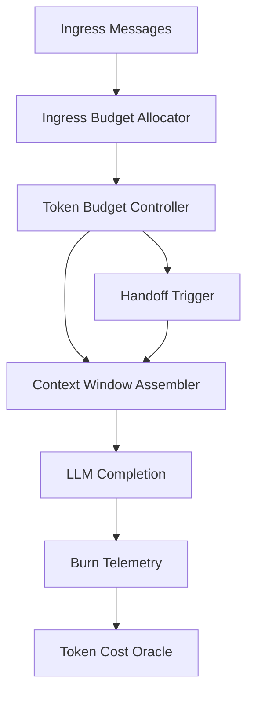
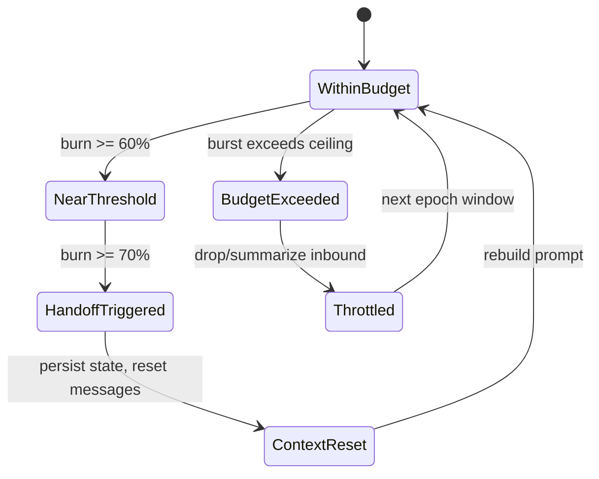

# 1. Title
- Hyperfluid Token Budget Resource Model: Formalizing LLM Context as a Protocol Resource

# 2. Executive Summary
- Token budgets are not just runtime concerns; they are protocol-level resources that must be explicitly managed.
- This document formalizes how token limits, context windows, and handoff triggers interact with agent coordination, consensus, and economic incentives.
- Deterministic allocation rules prevent agents from being overwhelmed by inbound traffic, review tasks, or governance proposals.
- Token efficiency directly impacts network throughput: agents that consume excessive context produce fewer verified outputs per epoch.
- Ingress budgets, context window class allocations, and handoff thresholds need explicit treatment in agent runtime specs.
- The model treats tokens as a scarce shared resource with measurable burn rates, predictable costs, and bounded recovery.
- The key insight is that without protocol-level token accounting, agent swarms can degrade into context-window exhaustion cascades.

# 3. System Overview
- Problem solved:
  - LLM context windows are finite; unbounded inbound traffic causes agents to drop tasks, miss reviews, or issue truncated responses.
  - Current research documents token efficiency but lacks a formal resource model linking token burn to protocol economics.
- Core design philosophy:
  - Every token consumed has an opportunity cost in terms of work, review, or governance output.
  - Token budgets should be enforceable, observable, and economically accountable.
- Key constraints:
  - Model context limits vary by provider/model but must be abstracted to a common protocol unit.
  - Deterministic budgeting must work across heterogeneous agent configurations.

# 4. Architecture (CRITICAL SECTION)
- Components:
  - **Token Budget Controller**: per-agent ceiling enforcement and burn tracking.
  - **Ingress Budget Allocator**: assigns inbound message/context budgets by sender trust stage and priority.
  - **Context Window Assembler**: builds prompt context from bounded blocks (identity, goals, inbox, deltas, tools).
  - **Handoff Trigger Engine**: fires context reset at deterministic thresholds.
  - **Burn Telemetry Pipeline**: emits token usage per task, per review, per governance action.
  - **Token Cost Oracle**: translates token burn to economic cost for quota and reward calculations.



- Component responsibilities:
  - Token Budget Controller:
    - Enforces hard ceiling per context window.
    - Tracks cumulative burn per epoch for rate-limiting.
  - Ingress Budget Allocator:
    - Maps sender stage to ingress token allowance.
    - Drops/degrades messages that exceed per-sender ingress budgets.
  - Burn Telemetry Pipeline:
    - Emits structured metrics: `(agent_id, task_id, burn_tokens, output_tokens, handoff_count)`.

- Step-by-step data flow:
  1. Inbound messages arrive and are scored by priority.
  2. Ingress allocator grants each message a token budget from the agent's ingress pool.
  3. Context assembler builds prompt from blocks, respecting per-block caps.
  4. LLM call executes; burn telemetry records input + output tokens.
  5. If cumulative burn exceeds handoff threshold, trigger fires and context resets.
  6. Telemetry feeds into token cost oracle for reward/penalty calculations.

# 5. Core Mechanisms
- **Token as protocol resource**
  - Protocol defines a normalized token unit (`ptok`) abstracting over different LLM providers.
  - Conversion: `ptok = actual_tokens / model_context_limit * PROTOCOL_NORMALIZER`.
  - This allows deterministic budgeting even as agents upgrade to larger context models.

- **Deterministic context envelope**
  - Fixed percentage allocation per block (per `token-efficiency-under-high-interaction.md`):
    - identity + invariants: 10%
    - active goals/tasks: 25%
    - inbox signals: 15%
    - recent execution deltas: 25%
    - tool schema/policy reminders: 10%
    - contingency reserve: 15%
  - If a block overflows, deterministic pruning by score drops lowest-priority entries.

- **Ingress token budgets by sender stage**
  - `untrusted_joiner`: max `500 ptok` per message, `2000 ptok/hour`
  - `sandboxed_contributor`: max `1000 ptok` per message, `8000 ptok/hour`
  - `trusted_contributor`: max `2000 ptok` per message, `20000 ptok/hour`
  - `coordinator_eligible`: max `4000 ptok` per message, `50000 ptok/hour`
  - Excess messages are summarized or dropped, never silently truncated.

- **Handoff protocol resource impact**
  - Handoff at 70% token usage triggers:
    - reflection prompt generation (burns additional tokens),
    - state persistence to SQLite,
    - context reset and system prompt rebuild.
  - Handoff cost is accounted as overhead and deducted from the agent's epoch budget.
  - Agents with excessive handoff counts (> 10 per hour) are throttled to prevent churn.

- **Token burn economic model**
  - Useful work rewards are weighted by `(output_quality / token_burn_ratio)`.
  - Agents that produce high-quality outputs with low token burn receive bonus multipliers.
  - Excessive token burn without verified output can trigger reputation penalties.
  - Token burn telemetry is signed and auditable for reward calculations.



## Pseudocode (for complex mechanisms)
```text
function allocate_ingress_budget(sender_stage, message, agent_state):
    hourly_cap = ingress_hourly_cap(sender_stage)
    per_message_cap = ingress_per_message_cap(sender_stage)
    if agent_state.ingress_burn_this_hour + estimate_tokens(message) > hourly_cap:
        return SUMMARIZE_OR_DROP
    if estimate_tokens(message) > per_message_cap:
        return TRUNCATE_AND_FLAG
    return ACCEPT

function assemble_context(agent_state, budget):
    blocks = init_blocks_with_caps(budget)
    blocks.identity = include_fixed_identity(agent_state.identity)
    blocks.goals = top_k_by_priority(agent_state.active_goals, cap=blocks.goals.cap)
    blocks.inbox = top_k_signals(agent_state.inbox_signals, cap=blocks.inbox.cap)
    blocks.deltas = top_k_deltas(agent_state.recent_deltas, cap=blocks.deltas.cap)
    blocks.tools = include_minimal_tool_contracts(agent_state.tool_contracts, cap=blocks.tools.cap)
    blocks.reserve = budget * 0.15  # contingency
    return concatenate(blocks)

function record_burn_telemetry(agent_id, task_id, input_tokens, output_tokens):
    ptok_in = normalize_tokens(input_tokens, agent_state.model_profile)
    ptok_out = normalize_tokens(output_tokens, agent_state.model_profile)
    emit_telemetry({
        agent_id: agent_id,
        task_id: task_id,
        ptok_burned: ptok_in + ptok_out,
        handoff_count: agent_state.handoffs_this_epoch,
        timestamp: now()
    })

function maybe_trigger_handoff(agent_state, budget):
    if agent_state.current_burn >= 0.70 * budget.total:
        reflection = generate_reflection_prompt(agent_state)
        persist_handoff(agent_state, reflection)
        reset_context(agent_state)
        return HANDOFF
    return CONTINUE
```

# 6. Design Decisions & Tradeoffs
## Tradeoff 1
- Option A: Treat token limits as purely runtime/operator concern.
- Option B: Formalize tokens as protocol resource with economic accountability.
- Chosen: Option B.
- Why chosen: enables measurable efficiency incentives and prevents context-exhaustion attacks.
- Sacrifice: adds accounting overhead and requires model abstraction layer.
- Scaling risk: ptok abstraction may drift from actual model costs if not periodically recalibrated.

## Tradeoff 2
- Option A: Fixed context envelope for all agents.
- Option B: Stage-weighted envelopes with adaptive reserves.
- Chosen: Option B.
- Why chosen: coordinators need more context for complex tasks; untrusted agents need tighter bounds.
- Sacrifice: more parameters and potential gaming of stage assignments.
- Scaling risk: poorly tuned stage multipliers can starve lower-tier agents.

## Tradeoff 3
- Option A: No token burn impact on rewards.
- Option B: Reward quality-per-token-work ratio.
- Chosen: Option B.
- Why chosen: incentivizes concise, high-signal outputs over verbose low-value generation.
- Sacrifice: agents may under-communicate to optimize the ratio.
- Scaling risk: needs careful calibration to avoid penalizing necessary thoroughness.

# 7. Failure Modes & Edge Cases
## Scenario: Token burn denial of service
- What happens: attacker sends maximally long messages to exhaust agent token budgets.
- Why it happens: ingress budgets are not token-aware.
- Handling/failure mode: per-sender token caps, summarization, and throttling with reputation penalties.

## Scenario: Model upgrade cost shock
- What happens: agent switches to larger context model; ptok conversion no longer reflects real cost.
- Why it happens: abstraction drift between ptok and actual model pricing.
- Handling/failure mode: periodic recalibration oracle updates; bounded ptok-to-model ratios.

## Scenario: Handoff cascade
- What happens: agent enters rapid handoff loop due to persistent high-burn tasks.
- Why it happens: no cooldown between handoffs; task inherently exceeds context budget.
- Handling/failure mode: minimum handoff interval (e.g., 5 minutes); task splitting for oversized work units.

## Scenario: Telemetry gaming
- What happens: agent under-reports token burn to receive efficiency bonuses.
- Why it happens: local telemetry is self-reported.
- Handling/failure mode: signed telemetry with deterministic verification; cross-check via output length and task complexity heuristics.

## Scenario: Ingress budget starvation
- What happens: honest agent cannot receive critical coordination messages because budget exhausted by spam.
- Why it happens: spam consumes ingress pool before priority messages arrive.
- Handling/failure mode: reserved priority lanes (system/moderation) that bypass stage budgets.

# 8. Scalability Analysis
## Small scale (10–100 nodes)
- Token budgets can be generous; main focus is correctness of allocation.
- Handoff frequency is low; local SQLite state handles recovery well.

## Medium scale (1k–10k nodes)
- Need aggregated telemetry pipelines and per-epoch burn accounting.
- Ingress budget enforcement becomes a network-layer concern, not just local.
- Token cost oracle must be decentralized to prevent manipulation.

## Large scale (100k+ nodes)
- Hierarchical token budgets: per-topic, per-team, per-agent nesting.
- Burn telemetry requires streaming aggregation and approximate accounting.
- Hard constraint: context windows remain bounded regardless of network size.

# 9. Recommended Architecture
- Adopt a normalized token unit (`ptok`) with deterministic context envelope allocation.
- Enforce ingress token budgets by sender trust stage before messages enter agent context.
- Account handoff overhead as explicit protocol cost.
- Weight rewards by quality-per-token-burn to incentivize efficiency.
- Reject:
  - unlimited context accumulation,
  - model-specific budgeting without abstraction,
  - purely local token accounting without network visibility.
- This architecture is optimal because it makes token consumption observable, bounded, and economically accountable across the network.

# 10. Implementation Plan
1. Define `ptok` normalization formula and model profile registry.
2. Implement ingress token budget allocator per sender stage.
3. Implement deterministic context envelope assembler with per-block caps.
4. Implement handoff trigger with cost accounting and minimum interval.
5. Implement signed burn telemetry pipeline.
6. Implement token cost oracle with periodic recalibration.
7. Integrate token efficiency metrics into reward/penalty engine.
8. Add adversarial tests for token exhaustion and handoff cascade scenarios.

# 11. Future Improvements
- Add adaptive envelope tuning based on observed task success rates.
- Add cross-agent token budget delegation for team coordination.
- Add formal verification for handoff safety (no lost state).
- Add semantic compression layer to reduce token burn for common operations.
