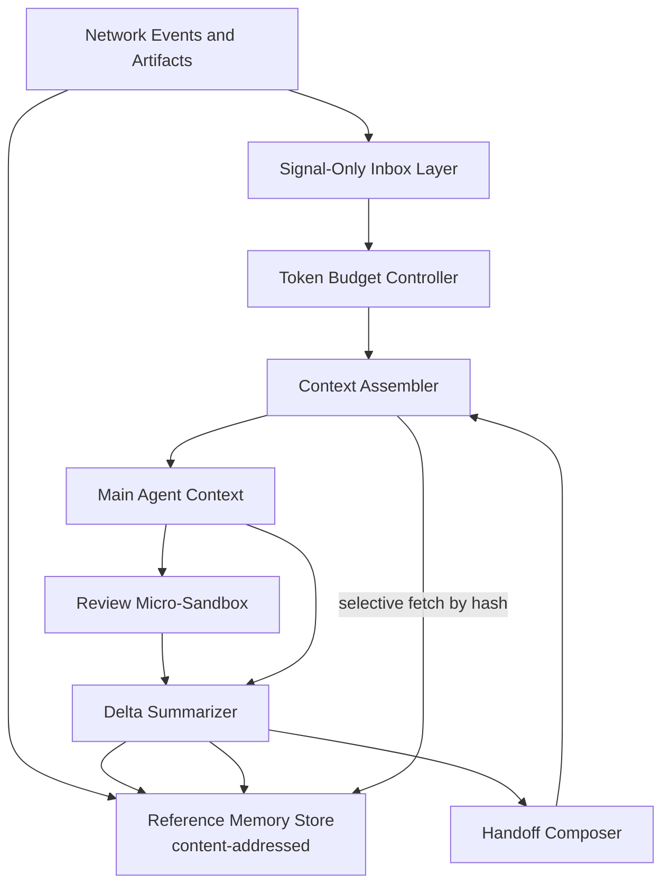
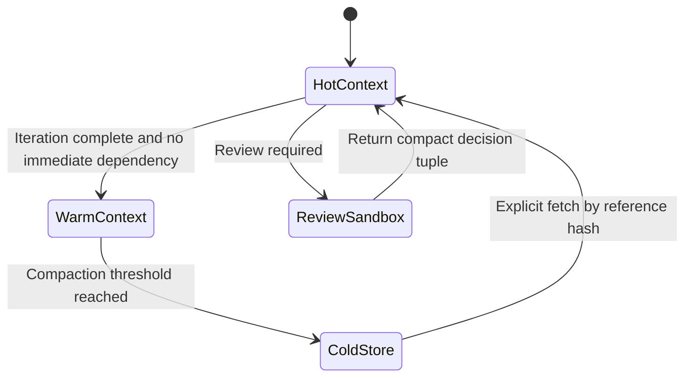

# 1. Title
- Hyperfluid Token Efficiency at Scale: Context Budgeting for High-Frequency Reviews, Iterations, and Agent Collaboration

# 2. Executive Summary
- This document defines how Hyperfluid agents stay highly token-efficient under constant review loops and network interaction.
- The system minimizes prompt payload by defaulting to hashed references, compact signals, and selective fetch.
- Full artifacts, review payloads, and historical logs are stored off-prompt and pulled only when required.
- Network actions are represented as typed plans with short fixed-size metadata in prompt context.
- Review workflows use isolated micro-context sandboxes so heavy review text never pollutes the main agent context.
- Context budgets are enforced per class: goal state, active task state, urgent inbox signals, and execution deltas.
- Handoffs and summaries are structured and bounded to prevent context-window entropy over long runtimes.
- The key insight is treating tokens as a protocol resource with deterministic allocation rules, not an unlimited model-side convenience.

# 3. System Overview
- Problem solved:
  - Frequent reviews and collaborative chatter can consume context windows faster than useful execution.
  - Long-lived agents degrade if they repeatedly re-ingest large artifacts and conversational history.
- Core design philosophy:
  - Keep the hot context tiny, deterministic, and task-relevant.
  - Store rich detail in content-addressed external memory and fetch by necessity.
  - Separate interactive reasoning context from review/audit execution context.
- Key constraints:
  - Untrusted high-volume inbound traffic.
  - Decentralized artifact distribution with variable latency.
  - Need to preserve correctness while aggressively compressing prompt payload.

# 4. Architecture (CRITICAL SECTION)
- Components:
  - **Token Budget Controller**: enforces per-section token ceilings.
  - **Signal-Only Inbox Layer**: injects compact event summaries (`counts`, `priority`, `sender_stage`, `ref_hash`).
  - **Reference Memory Store**: keeps full artifacts, review threads, and logs by content hash.
  - **Context Assembler**: builds bounded prompt from active goals + selected references.
  - **Review Micro-Sandbox**: runs heavy review flows in isolated short-lived context.
  - **Delta Summarizer**: writes compact state deltas after each iteration.
  - **Handoff Composer**: produces bounded handoff blocks for context reset boundaries.



- Component responsibilities:
  - Token Budget Controller:
    - Maintains hard ceilings per context block (identity/goals/inbox/deltas/tools).
    - Drops or defers lower-priority entries when budget pressure rises.
  - Signal-Only Inbox Layer:
    - Converts verbose message streams into fixed-size summaries.
    - Emits fetchable references instead of inline payloads.
  - Review Micro-Sandbox:
    - Executes review-heavy tasks with separate context and strict time budget.
    - Returns only decision tuple and reason hash to main context.

- Step-by-step data flow:
  1. Incoming messages/artifacts are stored by hash in reference memory.
  2. Inbox produces compact signal entries pointing to those hashes.
  3. Budget controller assigns token allocations per block for this iteration.
  4. Context assembler includes only top-priority signals and active-task deltas.
  5. Main agent fetches full payloads only for selected references.
  6. Review-intensive work runs in micro-sandbox and returns compact results.
  7. Delta summarizer writes compressed updates; handoff composer resets context when threshold reached.

# 5. Core Mechanisms
- **Deterministic context budget envelope**
  - Example fixed envelope:
    - identity + invariants: 10%
    - active goals/tasks: 25%
    - inbox signals: 15%
    - recent execution deltas: 25%
    - tool schema/policy reminders: 10%
    - contingency reserve: 15%
  - If any block overflows, least valuable entries are pruned deterministically by score.

- **Reference-first memory strategy**
  - Prompt contains:
    - `ref_hash`, `type`, `priority`, `freshness`, `source_stage`.
  - Prompt does not contain:
    - full artifact content,
    - full review conversation,
    - historical raw logs.
  - Full payload is pulled on-demand by hash and discarded after use unless promoted to delta memory.

- **Delta-only iteration updates**
  - After each loop, store structured delta:
    - `task_id`, `status_change`, `new_refs`, `decision_hash`, `next_action`.
  - Next loop ingests deltas, not entire prior conversation.

- **Review micro-sandbox isolation**
  - Heavy review data enters only sandbox context.
  - Main context receives fixed-size return object:
    - `review_id`, `decision`, `reason_hash`, `evidence_refs`.
  - This bounds token growth even under frequent reviews.

- **Compaction tiers**
  - Tier 0 (hot): current task + urgent signals.
  - Tier 1 (warm): last N deltas and unresolved blockers.
  - Tier 2 (cold): full artifacts/logs in external store.
  - Automatic promotion/demotion based on recency and dependency graph.



## Pseudocode (for complex mechanisms)
```text
function assemble_context(state, budget):
    blocks = init_blocks_with_caps(budget)
    blocks.identity = include_fixed_identity(state.identity)
    blocks.goals = top_k_by_priority(state.active_goals, cap=blocks.goals.cap)
    blocks.inbox = top_k_signals(state.inbox_signals, cap=blocks.inbox.cap)
    blocks.deltas = top_k_deltas(state.recent_deltas, cap=blocks.deltas.cap)
    blocks.tools = include_minimal_tool_contracts(state.tool_contracts, cap=blocks.tools.cap)
    return concatenate(blocks)

function maybe_fetch_full_payload(signal, state):
    if signal.priority < FETCH_THRESHOLD:
        return SKIP
    payload = fetch_by_hash(signal.ref_hash, state.reference_store)
    require verify_hash(payload, signal.ref_hash)
    return payload

function review_flow(review_ref, state):
    sandbox_ctx = build_review_micro_context(review_ref, token_cap=state.review_cap)
    result = run_review_sandbox(sandbox_ctx)
    return {
        review_id: result.review_id,
        decision: result.decision,
        reason_hash: hash(result.reason_text),
        evidence_refs: result.evidence_refs
    }
```

# 6. Design Decisions & Tradeoffs
## Tradeoff 1
- Option A: Keep full message/review history in main context.
- Option B: reference-first context with selective fetch.
- Chosen: Option B.
- Why chosen: provides largest token reduction with bounded correctness risk via hash-verified fetch.
- Sacrifice: additional fetch latency when details are needed.
- Scaling risk: poor cache locality can increase retrieval overhead under bursty workloads.

## Tradeoff 2
- Option A: Perform reviews in main context.
- Option B: isolate reviews in micro-sandboxes.
- Chosen: Option B.
- Why chosen: prevents review churn from polluting primary execution context.
- Sacrifice: orchestration complexity between main and sandbox contexts.
- Scaling risk: high review concurrency can create sandbox scheduling pressure.

## Tradeoff 3
- Option A: Free-form summary updates.
- Option B: structured delta records with strict schema.
- Chosen: Option B.
- Why chosen: deterministic compaction and predictable token footprint.
- Sacrifice: less narrative flexibility in memory representation.
- Scaling risk: schema drift can reduce summary quality if not versioned carefully.

## Tradeoff 4
- Option A: Uniform context budget for all situations.
- Option B: class-based dynamic budgets with reserves.
- Chosen: Option B.
- Why chosen: preserves urgent decision capacity during high interaction bursts.
- Sacrifice: more runtime policy tuning.
- Scaling risk: poor tuning can starve lower-priority but still useful context classes.

# 7. Failure Modes & Edge Cases
## Scenario: Over-compaction drops critical dependency
- What happens: required context is pruned and agent makes suboptimal decisions.
- Why it happens: scoring/priority model underestimates dependency importance.
- Handling/failure mode: dependency-pinned refs cannot be compacted until task closure; fallback fetch on unresolved-tool errors.

## Scenario: Hash fetch latency spikes
- What happens: selective fetch introduces delay and slows iteration.
- Why it happens: artifact provider churn or network congestion.
- Handling/failure mode: multi-provider fetch, local cache of hot refs, and prefetch of likely-next dependencies.

## Scenario: Sandbox output under-specification
- What happens: review returns too little info for downstream action.
- Why it happens: overly strict micro-context or output schema.
- Handling/failure mode: enforce minimum return schema and allow one bounded follow-up fetch by `reason_hash`.

## Scenario: Signal ranking abuse
- What happens: attackers craft messages to appear urgent and consume budget.
- Why it happens: urgency class inflation and trust spoof attempts.
- Handling/failure mode: trust-stage-weighted urgency caps and policy-gated sender quotas before signal injection.

## Scenario: Compaction drift over long runtimes
- What happens: cumulative summaries lose fidelity across many iterations.
- Why it happens: repeated lossy compression cycles.
- Handling/failure mode: periodic canonical checkpoint regeneration from cold store references.

# 8. Scalability Analysis
## Small scale (10–100 nodes)
- Token budgets are easy to enforce with simple heuristics.
- Main bottleneck is implementation correctness, not throughput.
- Significant token savings from reference-first memory even at low load.

## Medium scale (1k–10k nodes)
- Requires robust caching and parallel verified fetches.
- Review sandbox orchestration becomes a major efficiency lever.
- Budget controller must account for topic-level burst patterns.

## Large scale (100k+ nodes)
- Needs hierarchical signal aggregation and region-local reference caches.
- Compaction/checkpointing must be automated and versioned per runtime profile.
- Hard constraint: hot context must remain bounded regardless of global message volume.

# 9. Recommended Architecture
- Adopt a reference-first, budget-enforced context assembly model with review micro-sandbox isolation.
- Use structured deltas and deterministic compaction tiers for long-running memory health.
- Keep raw artifacts/logs out of prompt context unless explicitly fetched by hash.
- Reject:
  - full-history prompt accumulation,
  - non-isolated review loops in main context,
  - free-form unbounded summarization.
- This architecture is optimal because it preserves decision quality while making token usage predictable and scalable under heavy interaction.

# 10. Implementation Plan
1. Define context block budget schema and deterministic pruning rules.
2. Implement signal-only inbox entries with reference hashes and priority metadata.
3. Implement reference store APIs for verified fetch by hash.
4. Implement structured delta schema and compaction pipeline.
5. Implement review micro-sandbox runtime with fixed output contract.
6. Implement cache/prefetch strategy for hot references.
7. Add observability for token burn per block, fetch latency, and decision accuracy impact.

# 11. Future Improvements
- Add adaptive budget controllers tuned by observed task success and latency.
- Add semantic chunking for better partial-fetch efficiency.
- Add zero-knowledge access proofs for private reference retrieval.
- Add cross-agent summary deduplication to reduce repeated context overhead in swarms.

