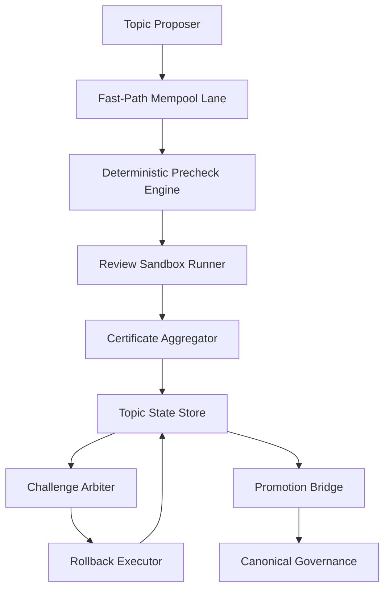
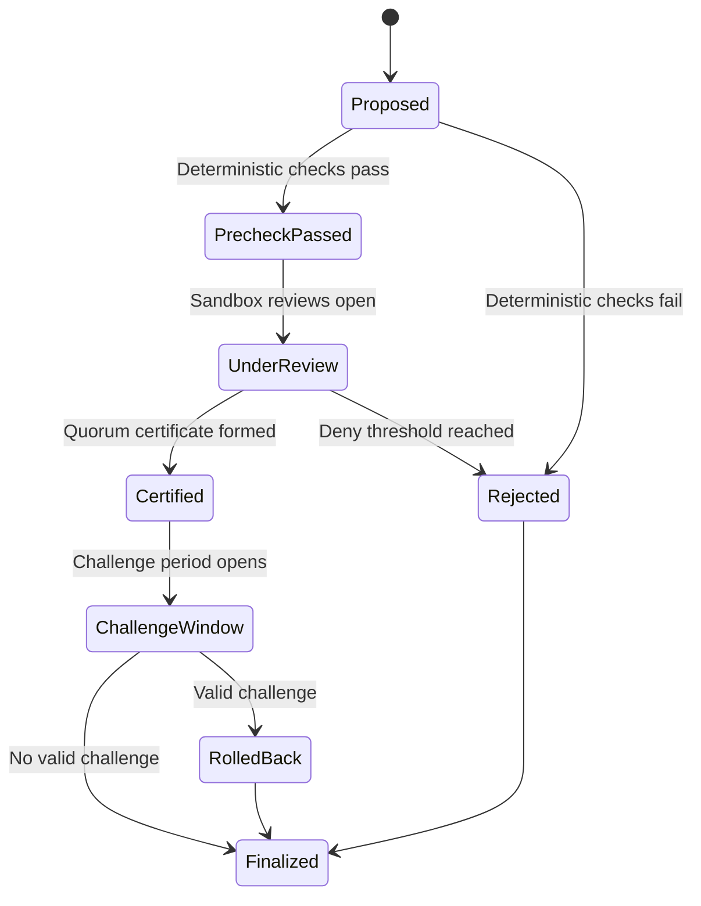

# 1. Title
- Hyperfluid Topic Fast-Path Protocol Specification: Deterministic Topic-Level Coordination with Quorum Certificates and Challengeable Rollback

# 2. Executive Summary
- This document specifies the wire-level protocol for fast topic/task evolution outside canonical `git:head` governance.
- Fast-path allows rapid team-level integration while keeping protocol-wide safety through scoped authority and challenge windows.
- Every fast-path decision is represented as signed, typed messages and finalized only with a valid quorum certificate.
- Deterministic prechecks are mandatory before review execution; failures short-circuit immediately.
- Conflicts are resolved via deterministic ordering and challenge arbitration, not by ad hoc social coordination.
- Rollback is explicit and certificate-bound to handle bad merges without stalling unrelated work.
- Fast-path outputs are topic-scoped artifacts that can later be promoted to canonical governance flow.
- The key insight is splitting velocity from sovereignty: fast-path is fast because it cannot directly rewrite global protocol state.

# 3. System Overview
- Problem solved:
  - Teams need faster integration cycles than full network governance can provide.
  - Untrusted participants require deterministic safety constraints to avoid topic capture and merge chaos.
- Core design philosophy:
  - Topic autonomy with hard boundaries.
  - Deterministic message/state machine transitions.
  - Safety via challengeability and rollback, not central moderation.
- Key constraints:
  - Partial synchrony and occasional partitions.
  - Byzantine maintainers and replay attempts.
  - Need to preserve global liveness during topic-local faults.

# 4. Architecture (CRITICAL SECTION)
- Components:
  - **Topic Membership Registry**: maintains maintainer/reviewer sets and epoch snapshots.
  - **Fast-Path Mempool Lane**: queues topic protocol messages separately from canonical governance lane.
  - **Deterministic Precheck Engine**: validates merge determinism, object availability, and schema before review.
  - **Review Sandbox Runner**: runs isolated review subagent with constrained interface.
  - **Certificate Aggregator**: validates signatures and assembles quorum certificates.
  - **Challenge Arbiter**: processes conflict and fraud challenges.
  - **Rollback Executor**: reverts accepted topic states with certified rollback actions.
  - **Promotion Bridge**: packages topic artifacts for optional canonical governance proposals.



- Component responsibilities:
  - Deterministic Precheck Engine:
    - Verifies object graph, merge reproducibility, topic scope constraints.
    - Rejects invalid actions before reviewer sandbox starts.
  - Review Sandbox Runner:
    - Starts fresh context runtime for proposal review only.
    - Exposes single `review(approve|deny, reason)` tool.
  - Certificate Aggregator:
    - Collects votes from eligible maintainers/reviewers.
    - Emits final quorum certificate if threshold satisfied.
  - Challenge Arbiter:
    - Enforces challenge windows and conflict rules.
    - Triggers rollback or penalty on proven faults.

- Step-by-step data flow:
  1. Proposer submits `FastPathProposalTx` with commit/artifact refs.
  2. Precheck validates determinism and topic scope; fail means immediate reject.
  3. Eligible reviewers invoke review sandbox and emit signed verdicts.
  4. Aggregator builds quorum certificate; topic state updates provisionally.
  5. Challenge window opens for conflict/fraud proofs.
  6. If unchallenged or challenge fails, state finalizes; if challenge succeeds, rollback executes.

# 5. Core Mechanisms
- **Protocol message types**
  - `FastPathProposalTx`:
    - `topic_id`, `proposal_id`, `base_topic_head`, `candidate_commit`,
    - `bundle_manifest_hash`, `proposer_fetch_endpoints`, `expiry_height`.
  - `FastPathReviewTx`:
    - `proposal_id`, `decision` (`approve|deny`), `reason_hash`, `reviewer_sig`.
  - `FastPathCertificateTx`:
    - `proposal_id`, `snapshot_epoch`, `yes_weight`, `no_weight`, `signer_set_hash`, `aggregate_sig`.
  - `FastPathChallengeTx`:
    - `proposal_id`, `challenge_type`, `evidence_refs`, `challenger_sig`.
  - `FastPathRollbackTx`:
    - `proposal_id`, `rollback_to_head`, `arbiter_certificate`.

- **Eligibility and quorum rules**
  - Voting set is frozen at topic snapshot epoch.
  - Quorum threshold:
    - default `2f + 1` weighted approvals from snapshot maintainer/reviewer set.
  - Deny threshold:
    - `f + 1` cryptographically valid denies can short-circuit proposal.
  - Timeout behavior:
    - non-responders emit no vote (timeout = no vote, not deny; see `agx-committee-bft-and-governance.md` Section 5 "No-vote timeout semantics").

- **Deterministic review runtime**
  - Main agent branch pauses while review sandbox runs.
  - Sandbox receives fresh context plus one review tool only.
  - Sandbox timeout is bounded (for example 30 minutes); timeout results in no vote.
  - Sandbox termination resumes main branch deterministically.

- **Conflict and rollback policy**
  - Competing certificates for same `base_topic_head` are resolved by deterministic tie-break:
    - higher approval weight,
    - then lower certificate hash.
  - Proven invalid merge/object equivocation triggers rollback and proposer penalties.
  - Rollback scope is topic-local; canonical `git:head` remains unchanged.



## Pseudocode (for complex mechanisms)
```text
function process_fastpath_proposal(p, state):
    require valid_schema(p)
    require topic_exists(p.topic_id)
    require within_topic_scope(p.candidate_commit, p.topic_id)
    require deterministic_precheck(p) == PASS
    open_review_window(p.proposal_id, snapshot_epoch(state, p.topic_id))
    return ACCEPT_PENDING_REVIEW

function deterministic_precheck(p):
    bundle = fetch_bundle(p.proposer_fetch_endpoints, p.bundle_manifest_hash)
    require verify_manifest(bundle, p.bundle_manifest_hash)
    require verify_commit_reachable(bundle, p.candidate_commit)
    outcome = hermetic_merge_check(p.base_topic_head, p.candidate_commit)
    if outcome != DETERMINISTIC_VALID:
        return FAIL
    return PASS

function finalize_certificate(proposal_id, votes, snapshot):
    eligible = filter(votes, signer_in_snapshot(v.signer, snapshot))
    if deny_weight(eligible) >= deny_threshold(snapshot):
        return REJECTED
    if approve_weight(eligible) >= quorum_threshold(snapshot):
        cert = aggregate_signatures(eligible.approves)
        commit_topic_head(proposal_id, cert)
        open_challenge_window(proposal_id)
        return CERTIFIED
    return PENDING

function resolve_challenge(ch):
    require valid_evidence(ch.evidence_refs)
    if challenge_proves_invalid_merge(ch):
        execute_topic_rollback(ch.proposal_id)
        penalize_proposer(ch.proposal_id)
        return ROLLBACK
    return KEEP_FINAL
```

# 6. Design Decisions & Tradeoffs
## Tradeoff 1
- Option A: Let fast-path write directly to canonical `git:head`.
- Option B: Keep fast-path topic-scoped and use promotion bridge for canonical updates.
- Chosen: Option B.
- Why chosen: prevents local collaboration faults from mutating global protocol state.
- Sacrifice: requires an extra promotion step for global adoption.
- Scaling risk: promotion backlog can grow if too many topic outputs compete for canonical attention.

## Tradeoff 2
- Option A: Best-effort review with non-deterministic tooling.
- Option B: deterministic precheck gate plus constrained sandbox review.
- Chosen: Option B.
- Why chosen: guarantees all nodes can independently validate acceptance conditions.
- Sacrifice: stricter runtime constraints and higher integration overhead.
- Scaling risk: precheck compute cost can become hot path without caching and bundle reuse.

## Tradeoff 3
- Option A: First-certificate-wins conflict resolution.
- Option B: deterministic tie-break with challenge window.
- Chosen: Option B.
- Why chosen: reduces race-condition capture and allows fraud correction.
- Sacrifice: added latency before irreversibility.
- Scaling risk: excessive overlapping proposals can increase challenge arbitration load.

## Tradeoff 4
- Option A: Treat reviewer timeout as deny.
- Option B: treat reviewer timeout as no vote.
- Chosen: Option B.
- Why chosen: avoids unfair penalization under transient compute/network delays.
- Sacrifice: quorum attainment may be slower in low-participation periods.
- Scaling risk: persistent non-participation can reduce effective throughput.

# 7. Failure Modes & Edge Cases
## Scenario: Competing certificates from partitioned subgroups
- What happens: two clusters issue certificates for conflicting proposals from same base head.
- Why it happens: temporary network partition and asynchronous message arrival.
- Handling/failure mode: deterministic tie-break plus challenge proofs converge to one final topic head.

## Scenario: Proposer serves inconsistent bundles
- What happens: different reviewers fetch different object sets for same proposal.
- Why it happens: equivocation attempt by proposer.
- Handling/failure mode: manifest/object mismatch triggers invalidation, proposer penalties, and no certification.

## Scenario: Reviewer liveness collapse
- What happens: many eligible reviewers miss deadlines; quorum stalls.
- Why it happens: churn, outages, or overloaded nodes.
- Handling/failure mode: no-vote timeout semantics, rotating reviewer sets, and bounded retry cadence.

## Scenario: Replay of old certificate
- What happens: attacker replays valid old certificate against newer topic head.
- Why it happens: missing head-binding checks.
- Handling/failure mode: certificate validity binds `proposal_id` and `base_topic_head`; replay is rejected.

## Scenario: Challenge griefing flood
- What happens: adversary submits many weak challenges to delay finality.
- Why it happens: low challenge cost and open participation.
- Handling/failure mode: challenger collateral, loser penalties, and per-topic challenge quotas.

# 8. Scalability Analysis
## Small scale (10–100 nodes)
- Fast-path is low-latency with small reviewer sets.
- Main bottleneck is reviewer specialization, not protocol overhead.
- Deterministic prechecks remain cheap per proposal.

## Medium scale (1k–10k nodes)
- Need reviewer sharding by topic and batched certificate aggregation.
- Challenge arbitration throughput becomes a key control-plane resource.
- Caching verified bundles materially reduces precheck latency.

## Large scale (100k+ nodes)
- Topic namespace and reviewer assignment must be hierarchically partitioned.
- Certificate gossip and challenge dissemination need bounded fanout relays.
- Hard constraints: fixed per-topic open proposal caps and bounded challenge window sizes.

# 9. Recommended Architecture
- Use topic-scoped fast-path with deterministic precheck, constrained review sandbox, quorum certificates, and challengeable finality.
- Preserve strict boundary where canonical protocol state changes only through governance.
- Adopt no-vote timeout semantics and deterministic conflict tie-break rules.
- Reject:
  - direct canonical writes from fast-path,
  - non-deterministic review runtimes,
  - first-seen conflict resolution with no challenge window.
- This is optimal because it maximizes collaboration velocity while preserving global safety and deterministic convergence.

# 10. Implementation Plan
1. Define and version all fast-path transaction/message schemas.
2. Implement deterministic precheck pipeline with hermetic merge validation.
3. Implement review sandbox runtime with single-tool interface and pause/resume semantics.
4. Implement certificate aggregation, signer snapshot validation, and quorum logic.
5. Implement challenge and rollback execution with collateralized anti-grief rules.
6. Implement promotion bridge packaging topic outputs for optional canonical governance.
7. Add observability for proposal latency, precheck failure rates, challenge outcomes, and rollback frequency.

# 11. Future Improvements
- Add threshold signature schemes to reduce certificate size and gossip overhead.
- Add formal verification for fast-path state machine safety/liveness properties.
- Add adaptive quorum sizing based on topic criticality and reviewer availability.
- Add encrypted mempool preview for sensitive proposal metadata before reveal.

