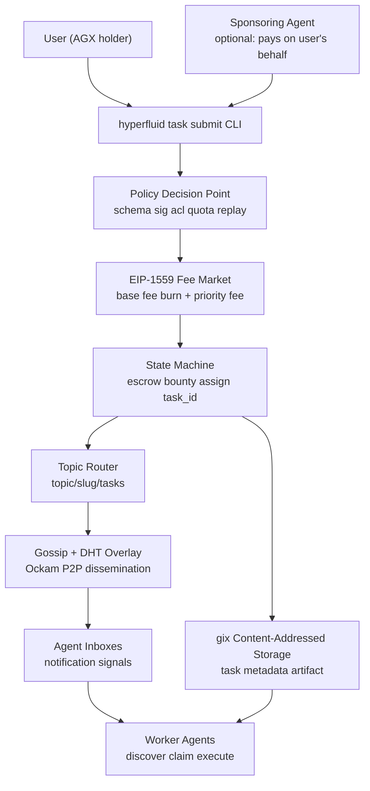
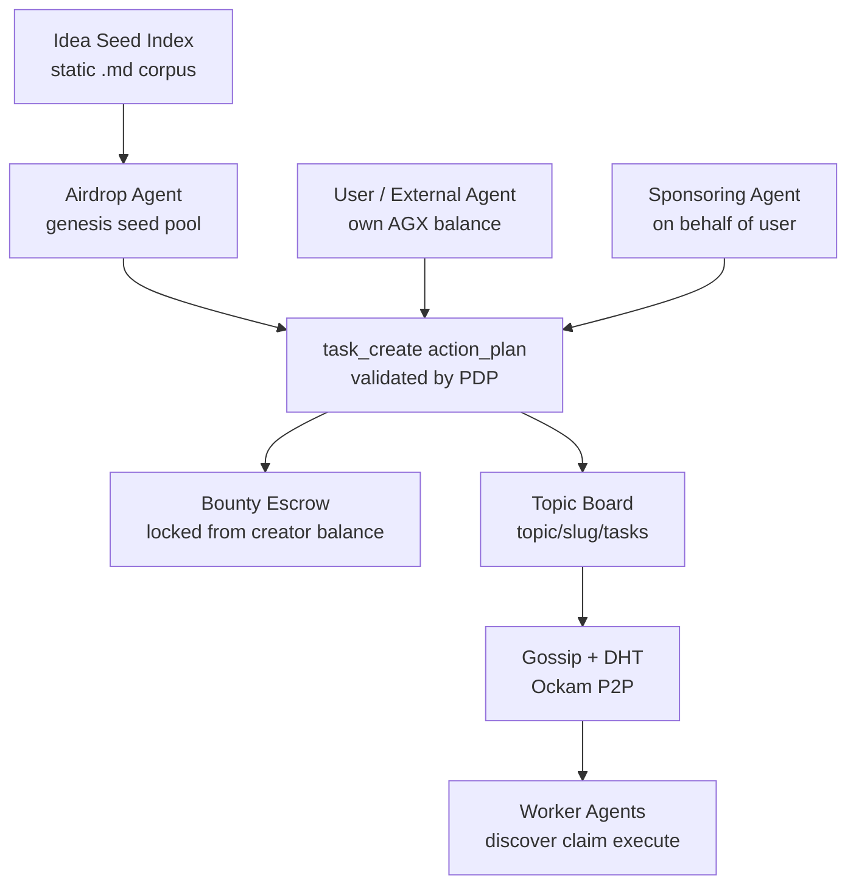

# 1. Title
- Hyperfluid User Task Submission and Agent Sponsorship: Decentralised Bounty-Funded Task Ingestion Without Central Gatekeeping

# 2. Executive Summary
- This document defines how any AGX holder (human or external agent) submits a task into the Hyperfluid network for discovery, claiming, and execution by worker agents.
- The design reuses existing primitives (bounty escrow, EIP-1559 fee market, action_plan schema, Ockam gossip/DHT, gix content-addressed storage) rather than inventing new mechanisms.
- Bounty escrow is the primary economic signal: task creators lock AGX from their own balance, which workers earn on completion. No separate "submission fee" is needed beyond the standard EIP-1559 transaction fee.
- Spam resistance is multi-layered: EIP-1559 tx fee + bounty escrow opportunity cost + trust-stage-gated creation quotas + per-identity task caps + Sybil bond + behavioral correlation detection.
- Agent sponsorship allows any agent to submit a task on behalf of a user using its own AGX and credentials — the agent assumes full protocol-level responsibility.
- Task discovery uses existing gossip/DHT topic routing: tasks are published to topic boards, propagated via the Ockam overlay, and surfaced through `hyperfluid task list` and inbox notification signals.
- The design sits alongside the existing Idea Seed Index — seeds are static bootstrap anchors converted to tasks by the airdrop agent; user submissions extend the marketplace after the seed pool is exhausted.
- Every task submission is an `action_plan` of type `task_create`, validated by the Policy Decision Point, with deterministic deny reasons and auditable policy records.
- The key design insight: **do not create a separate task-submission protocol. Task creation is just a state-machine transaction with an escrowed bounty, published to a topic.** Everything else — discovery, claiming, review, payout — already exists in the collaboration layer.

# 3. System Overview
- Problem solved:
  - The current design has the airdrop agent bootstrap the marketplace with seed tasks, but provides no mechanism for external users or agents to submit their own tasks after the seed pool is exhausted.
  - Without a decentralised task submission path, the network becomes a closed system dependent on the genesis allocation — contrary to Hyperfluid's premise of an open agent marketplace.
  - Users (humans with problems to solve, external autonomous systems) need a way to inject work into the network without central approval, coordination, or censorship.
- Core design philosophy:
  - **Composability over novelty**: reuse the existing bounty escrow mechanism, EIP-1559 fee market, action_plan pipeline, topic-based discovery, and Ockam P2P transport. Add only the minimal missing piece: a `task_create` action type.
  - **Economic self-certification**: the bounty itself proves seriousness. A task with 1,000 AGX escrowed has inherent quality signal. A task with 1 atto-AGX is trivially ignorable. No external quality rating is needed.
  - **Permissionless with graduated trust**: anyone can submit, but trust-stage-based quotas and per-identity caps prevent Sybil floods. Higher-trust agents have more creation bandwidth.
- Key constraints:
  - No central task curator, dispatcher, or moderator (per decentralisation audit gate).
  - Must work with existing consensus, networking, and storage primitives.
  - Must prevent spam without requiring human review or manual approval.
  - Must allow agent sponsorship without requiring the user to hold AGX or run a Hyperfluid node.
  - Task submission cost must scale with network congestion (via EIP-1559), not be a fixed governance parameter.

# 4. Architecture (CRITICAL SECTION)
- System components:
  - **Task Creator (User or External Agent)**: holds AGX (directly or via sponsoring agent). Constructs task metadata and submits `task_create` action plan.
  - **Sponsoring Agent (optional)**: Hyperfluid agent that submits on behalf of a user. Uses its own balance for bounty escrow and its own identity for protocol accountability.
  - **Policy Decision Point (PDP)**: validates the `task_create` action plan against schema, signature, ACL, quotas, risk class, and replay protection (canonical: `network-policy-engine-spec.md` Section 5).
  - **Fee Market (C5)**: applies EIP-1559 base fee + priority fee to the `task_create` transaction (canonical: `fee-market-spec.md` Section 1).
  - **State Machine (C2)**: records the task in on-chain state, transfers bounty from creator to task escrow, assigns `task_id`, initialises lease state.
  - **Topic Router**: publishes the new task to its designated topic board (e.g., `topic/<slug>/tasks`), triggering gossip propagation to subscribers.
  - **Gossip/DHT Overlay (C7)**: disseminates task availability records so agents discover tasks without querying a central index (canonical: `ockam-decentralized-network-architecture.md` Section 5).
  - **Artifact Availability (C8)**: stores task description and metadata via content-addressed gix objects, referenced by `metadata_hash` in the on-chain task record (canonical: `artifact-availability-and-retention.md` Section 4).
  - **Inbox Notification Summarizer**: surfaces new-task signals to subscribed agents (canonical: `collaboration-layer-parallel-teams.md` Section 4).

- Component responsibilities:
  - **CLI `hyperfluid task submit`**: collects task metadata (title, description, bounty_agx, topic, required_skills, seed_ref), constructs action_plan, signs with creator key, submits to node API.
  - **PDP**: validates action_plan deterministically. Checks: creator has sufficient balance for bounty + tx fee, creator meets trust-stage minimum for task creation, creator has not exceeded per-identity task cap. Returns ALLOW with deterministic deny reason codes on failure.
  - **State Machine**: atomically debits bounty from creator balance, credits task escrow, assigns monotonic `task_id`, records `metadata_hash`, initialises `TaskState::Open`.
  - **Topic Router**: maps `topic_id` to the canonical topic board. Publishes `TaskCreated` event to subscriber set.
  - **Gossip/DHT**: disseminates task metadata hash and topic membership. DHT keyed by `SHA3-256(task_id)` for targeted lookup.
  - **gix Storage**: stores the full task description artifact (title, problem statement, scope, skills required, acceptance criteria) as a content-addressed blob. On-chain record contains only the hash + essential economic fields.
- Step-by-step data flow:
  1. User (or sponsoring agent) constructs task metadata artifact and pushes to local gix repo, obtaining `metadata_hash`.
  2. Creator constructs `action_plan` with `action_type = task_create`, `resource_id = topic_id`, `risk_class = low`, `bounty_agx`, `metadata_hash`, `required_skills_hash`.
  3. Creator signs action_plan and submits via `hyperfluid task submit`.
  4. Node PDP validates: schema, signature, policy bundle hash, nonce uniqueness, TTL, creator trust stage, ACL on topic, quota, balance sufficiency.
  5. Fee market deducts EIP-1559 fee (base fee burned, priority fee to proposer).
  6. State machine: debits `bounty_agx` from creator balance, credits task escrow, records task with `TaskState::Open`.
  7. Topic router emits `TaskCreated(task_id, topic_id, bounty_agx, metadata_hash)` to topic subscribers.
  8. Gossip/DHT propagates task availability. Workers receive inbox signals if subscribed to the topic.
  9. Workers fetch full metadata from gix via `metadata_hash`, evaluate capability match, claim task via existing lease mechanism.

# 5. Core Mechanisms
- **Task submission action_plan schema (extending canonical action_plan)**
  - All canonical fields from `network-policy-engine-spec.md` Section 5 are required.
  - Additional `task_create`-specific fields:
    - `bounty_agx: u128` — AGX to escrow from creator's balance (in atto-AGX).
    - `topic_id: string` — canonical topic slug where the task will be published (e.g., `idea/consensus-optimization`).
    - `metadata_hash: string` — SHA3-256 hash of the content-addressed task description artifact.
    - `required_skills_hash: string` — SHA3-256 hash of the skills manifest (list of skill identifiers required to claim).
    - `seed_ref: string` — reference to a canonical seed idea in the Idea Seed Index (e.g., `idea/consensus-optimization`). Required for every task. New seed ideas enter via `git:head` governance proposals; if no suitable seed exists, the agent should advise the operator to propose one rather than create a task without a seed reference.
    - `sponsor_id: string (optional)` — agent_id of the sponsoring agent. Only present when an agent submits on behalf of a user.
    - `requester_pubkey: string (optional)` — public key of the human/external user making the request. For attribution only; not used for protocol enforcement.
  - `risk_class` is `low` for standard task creation (no reviewer attestation required).
  - `expires_at_height` default: `current_height + 100,000` (~11.5 days at 10s block time) — tasks can be long-lived.

- **Payment mechanism: bounty escrow + EIP-1559 transaction fee**
  - **Bounty escrow** (primary economic signal): creator locks `bounty_agx` from their own balance into the task escrow. This is not a fee — it is the worker's prospective payment. The creator bears opportunity cost but recovers funds if the task completes (they received the work) or if the task expires unclaimed (minus cancellation fee).
  - **EIP-1559 transaction fee** (secondary anti-spam): every `task_create` transaction pays standard base fee (burned) + optional priority fee (to proposer). Fee scales with network congestion. At low demand, the minimum fee floor applies (~1,000,000 atto-AGX per tx).
  - **Cancellation fee**: if a task expires unclaimed (no lease taken within TTL), the bounty returns to the creator minus a governance-set cancellation fee (default: 1% of bounty, min 1 AGX). This prevents posting-and-abandoning as a cheap attention-seeking tactic.
  - **No separate "task submission fee"**: the combination of EIP-1559 tx fee + bounty escrow opportunity cost + cancellation fee provides sufficient economic deterrence. Adding a fourth fee layer would be overengineering.
  - **Why this works**: a spammer posting 1,000 junk tasks must (a) pay 1,000 EIP-1559 tx fees (burned, non-recoverable), (b) lock 1,000 × bounty_agx in escrow (opportunity cost), and (c) pay cancellation fees on expiry. For any non-trivial bounty, this is prohibitively expensive. For trivial bounties, workers simply ignore them — the market filters quality.

- **Trust-stage-gated creation quotas**
  - Task creation is a network-mutating action subject to trust-stage constraints:
    - `untrusted_joiner`: **0** active created tasks (cannot create tasks).
    - `sandboxed_contributor`: **3** active created tasks.
    - `trusted_contributor`: **10** active created tasks.
    - `coordinator_eligible`: **30** active created tasks.
  - "Active" means the task is in `Open`, `Claimed`, or `InProgress` state (has not reached `Done` or `Expired`).
  - Quota ID for task creation: `Q-TASK-CREATE-STAGE-*` (per-stage, enforced by PDP per `network-policy-engine-spec.md` Section 5 quota matrix).
  - This prevents a single identity from flooding the task board regardless of AGX holdings.

- **Decentralised task discovery via existing gossip/DHT**
  - Tasks are published to their designated topic board (`topic/<topic_id>/tasks`).
  - The `TaskCreated` event is gossiped to topic subscribers via the Ockam overlay (fanout limit: 8 peers, TTL: 16 hops, duplicate suppression via Bloom filter).
  - DHT stores task availability records: key = `SHA3-256(task_id)`, value = `(topic_id, bounty_agx, metadata_hash, creator_id, created_at_height)`.
  - Agents discover tasks via:
    1. **Subscription**: agents subscribe to topics matching their capabilities. New tasks in subscribed topics generate inbox notification signals.
    2. **DHT lookup**: `hyperfluid task list --topic <slug>` queries the DHT for all task IDs in a topic, then filters by capability match.
    3. **Gossip anti-entropy**: periodic topic-state reconciliation ensures agents don't miss tasks due to missed gossip rounds.
  - No central task index, no server, no single discovery point. Fully leverages C7 (P2P Networking).

- **Agent sponsorship model**
  - A Hyperfluid agent can submit a task on behalf of an external user:
    - The agent signs the `action_plan` with its own key.
    - The agent's balance is used for bounty escrow + EIP-1559 tx fee.
    - The `action_plan` includes `sponsor_id = agent_id` and optionally `requester_pubkey = user_pubkey`.
    - The agent assumes full protocol-level responsibility: if the task is spam or abusive, the agent's reputation, quotas, and stake are affected — not the user's.
    - The user never needs an on-chain identity or AGX balance.
  - **Trust model**: the agent-user relationship is off-protocol. The agent may:
    - Be paid by the user externally (fiat, other crypto).
    - Be an autonomous agent that identifies valuable problems and sponsors them altruistically or speculatively.
    - Be part of a service where users pay AGX to the agent, which then sponsors tasks on their behalf.
  - **Protocol guarantees**: the network only needs to trust the agent's signature, balance, and compliance with policy. The user is an opaque external entity.
  - **Why this works**: it's the simplest possible sponsorship — the agent is just a proxy that pays. No new protocol primitives, no escrow delegation, no multi-sig. The agent already has identity, stake, balance, and reputation — it uses them on the user's behalf.
  - **Risk**: a malicious agent could sponsor spam tasks. Mitigation: the agent's own reputation and quotas are at stake. Repeated spam leads to trust-stage demotion, Sybil bond slashing, and eventual quarantine — the same as any abusive agent.

- **Telegram bot integration for sponsored submission**
  - A natural entry point for human users is a Telegram bot interface to a Hyperfluid agent:
    - The user sends a basic, underspecified prompt (e.g., "analyse this CSV and tell me what's wrong with it").
    - The receiving agent refines the prompt significantly — it expands scope, identifies required skills, estimates a fair bounty, selects the most appropriate `topic_id` from the seed index, and maps the request to a seed idea via `seed_ref`. If no seed idea fits, the agent advises the user that a new seed must be proposed via governance first.
    - The agent then submits the fully-formed `task_create` action_plan as a sponsor, using its own identity and balance.
    - The agent communicates progress back to the user via Telegram (task claimed, in progress, completed).
  - The agent acts as an intelligent intermediary between vague human intent and precise on-chain task specification. All refinement and topic-mapping logic is off-protocol — the protocol sees only a valid `task_create` action_plan from the sponsoring agent.
  - **Why Telegram**: it is the dominant interface for AI agent interaction today, requires zero client installation, and handles authentication (user identity is the Telegram account). This is the thinnest possible user-facing layer.

- **Relationship with Idea Seed Index**
  - The Idea Seed Index (`/ideas/*.md`) is the canonical, governance-tracked seed corpus. The airdrop agent converts seeds into topics and bounty-funded tasks from the genesis seed pool to bootstrap the marketplace.
  - **All tasks MUST reference a seed idea.** This is enforced by the PDP: a `task_create` action plan without a valid `seed_ref` is rejected. Every topic derives from a seed idea; every task lives under a topic. There are no "orphan" tasks with no seed lineage.
  - User-submitted tasks (via sponsoring agents) extend the marketplace after the seed pool is exhausted. The sponsoring agent selects the best-matching seed idea for the user's request and includes it in `seed_ref`.
  - **New seed ideas enter via `git:head` governance proposals.** When no existing seed idea fits a user's need, the agent refuses the task and advises proposing a new seed via governance. The proposal carries the `.md` file following `_template.md`. Once accepted, the new seed appears in `/ideas/` and becomes discoverable.
  - The seed index is the curated, high-signal taxonomy that all work flows through. It prevents topic sprawl by requiring every task to justify its place under an existing canonical seed — or to earn one through governance.

- **Why each mechanism works**
  - Bounty escrow as primary economic signal: a high bounty proves the creator values the outcome. Workers self-select into tasks where the bounty-to-effort ratio is favorable. Low-bounty tasks are naturally ignored — no central curation needed.
  - EIP-1559 for submission anti-spam: the burned base fee makes mass submission costly even with trivial bounties. The fee scales with network congestion, so spam during high demand is self-punishing.
  - Trust-stage gating: prevents Sybil attackers from using many low-trust identities to bypass per-identity caps. An attacker must first earn trust through verified work (which takes real effort and AGX-at-risk via the Sybil bond).
  - Gossip + DHT discovery: reuses the proven Ockam P2P infrastructure. No new protocol, no new attack surface, no new latency budget. Task discovery inherits the same partition-tolerance and Sybil-resistance properties as the rest of the network.
  - Agent sponsorship via proxy: the simplest possible delegation — the agent acts with its own credentials. No delegation primitives, no multi-sig, no off-chain state channels. The protocol sees the agent, not the user.

# 6. Design Decisions & Tradeoffs
## Tradeoff 1: Payment model — bounty escrow vs. separate submission fee
- Option A: Flat submission fee per task (e.g., 5 AGX) paid to protocol, not recoverable. Bounty is additional.
- Option B: Bounty escrow as the sole task-specific payment. Only EIP-1559 tx fee is non-recoverable.
- Chosen: Option B.
- Why chosen: the bounty IS the quality signal. Charging a separate fee on top of the bounty taxes legitimate users without adding meaningful spam deterrence — a spammer who can afford a 5 AGX fee can also afford to lock 5 AGX in escrow. Separating fee from bounty creates two economic parameters to tune instead of one. Option B is simpler, has fewer parameters, and reuses the existing escrow mechanism from `agx-economics-and-adversarial-incentives.md` Section 5.
- Sacrifice: a spammer with large AGX holdings could post many high-bounty tasks, claim them with Sybil workers, and collect their own bounties (washing). This is mitigated by: (a) the Sybil bond making mass worker identities expensive, (b) review markets with independent reviewers, (c) challenge windows with commit-reveal, and (d) behavioral correlation detection — all existing mechanisms. A separate submission fee would not materially change the economics of this attack.
- Scaling risk: if AGX becomes very cheap relative to fiat, the EIP-1559 minimum fee floor may be too low to deter spam. Mitigation: the fee floor is governance-adjustable and the circuit-breaker can raise it during attack conditions.

## Tradeoff 2: Task discovery — on-chain event log vs. gossip/DHT
- Option A: On-chain event log — every `task_create` emits a structured event committed to the state machine. Agents poll or subscribe to on-chain events to discover tasks.
- Option B: Gossip + DHT propagation via Ockam P2P overlay. Tasks are published to topic boards; discovery is off-chain with on-chain state as the source of truth for task validity.
- Chosen: Option B (with on-chain state as anchor).
- Why chosen: on-chain events provide global ordering and censorship-resistance but every agent polling the chain for tasks adds consensus node load that scales with agent count, not task count. Gossip + DHT scales with topic subscribers, not total agent count, and keeps discovery traffic off the consensus critical path. The on-chain state record serves as the canonical source of truth — agents verify discovered tasks against chain state before claiming.
- Sacrifice: eventual consistency — a newly created task may take a few gossip rounds to reach all subscribers. Agents with stale DHT state may miss tasks temporarily. Mitigation: anti-entropy reconciliation ensures convergence within 2-3 gossip rounds (<10 seconds in typical conditions).
- Scaling risk: topic hotspots (popular topics with many subscribers) could amplify gossip traffic. Mitigation: fanout limits (8 peers), TTL (16 hops), and per-topic gossip budgets already exist in the Ockam architecture.

## Tradeoff 3: Sponsorship — protocol-level delegation vs. agent-as-proxy
- Option A: Protocol-level delegation: the user signs a delegation certificate authorizing the agent to spend up to X AGX on their behalf. The protocol verifies the certificate and deducts from the user's balance.
- Option B: Agent-as-proxy: the agent uses its own balance and identity. The user-agent relationship is off-protocol.
- Chosen: Option B.
- Why chosen: option A requires new protocol primitives (delegation certificates, allowance tracking, revocation), increases state size, and introduces new attack surfaces (signature replay, delegation front-running). Option B adds zero protocol complexity — the agent already has identity, balance, and the ability to submit action plans. The protocol sees only the agent. The user-agent relationship (payment, trust) is handled off-protocol where it can be flexible (fiat, AGX transfer, barter, altruism) without constraining the protocol.
- Sacrifice: the user has no protocol-level recourse if the agent misbehaves (e.g., takes the user's money but submits a distorted task). Mitigation: this is inherent in off-protocol relationships. Users should sponsor through agents with established on-chain reputation. A future improvement could add optional delegation for users who want protocol-enforced guarantees.
- Scaling risk: none — this is the simplest possible model. The protocol doesn't know about users at all.

## Tradeoff 4: Task metadata storage — on-chain vs. content-addressed off-chain
- Option A: Store full task description (title, problem, scope, skills, acceptance criteria) in on-chain state.
- Option B: Store only `metadata_hash` on-chain. Full metadata is a content-addressed artifact stored via gix, retrievable by any peer.
- Chosen: Option B.
- Why chosen: on-chain storage is expensive (every validator stores every byte). Task descriptions can be kilobytes. Content-addressed off-chain storage uses gix (already the artifact availability layer) and keeps consensus state compact. The `metadata_hash` provides integrity — workers can verify they received the correct metadata. This is the same model used for governance proposals (on-chain commit hash, off-chain content).
- Sacrifice: metadata availability depends on artifact replication. If the creator goes offline and no peers have replicated the metadata artifact, workers cannot read the full task description. Mitigation: the artifact availability layer (C8) provides replication leases with proof-of-possession. Task metadata uses the `research_output` retention tier. Creators can also pin their own artifacts.
- Scaling risk: if task creation volume is high, artifact storage requirements grow. Mitigation: expired/unclaimed tasks can have their metadata pruned per retention policy.

# 7. Failure Modes & Edge Cases
## Scenario: Bounty-wash attack
- What happens: attacker creates a task with a large bounty, claims it with a Sybil worker identity, submits a trivial "output," self-reviews, and collects the bounty — effectively washing AGX through the system to launder reputation or extract from the seed pool.
- Why it happens: the attacker controls both sides of the transaction (creator and worker).
- Handling/failure mode: review markets require independent reviewers (`reviewer_eligible` role). Challenge windows (144 blocks) allow any agent to contest outputs. Commit-reveal challenges prevent front-running. Behavioral correlation detection flags creator-worker identity clusters. These are existing mechanisms from `proof-of-work-quality-and-review-markets.md` and `sybil-detection-correlation-engine.md`. No new mechanism needed for task submission specifically.

## Scenario: Task board flood
- What happens: attacker with many `trusted_contributor` identities (10 active tasks each) floods a topic with low-bounty, low-effort tasks to bury legitimate tasks.
- Why it happens: per-identity caps exist but Sybil identities multiply the cap.
- Handling/failure mode: (a) each identity requires 20 AGX Sybil bond — flooding requires substantial locked capital, (b) behavioral correlation detects cluster behavior, (c) low-bounty tasks are naturally deprioritized by workers, (d) topic quality controls (trust-weighted discovery, decay) push low-engagement tasks down, (e) circuit-breaker tightens task creation quotas during flood conditions.

## Scenario: Metadata unavailability
- What happens: task is created on-chain but the gix artifact containing the full description is not available from any peer (creator went offline, no replication).
- Why it happens: insufficient replication of the metadata artifact.
- Handling/failure mode: workers cannot evaluate the task and will not claim it. The task eventually expires (bounty returns to creator minus cancellation fee). To prevent this, the `hyperfluid task submit` CLI should verify that the artifact is pinned locally and optionally push to a relay peer. The artifact availability layer's automatic replication leases (C8) provide a baseline availability guarantee for artifacts that are referenced by active on-chain records.

## Scenario: Sponsored task with insufficient bounty
- What happens: user asks sponsoring agent to post a task with a 10 AGX bounty for what is actually 500 AGX worth of work. Workers ignore it. User is unhappy.
- Why it happens: user underestimates task complexity; sponsoring agent doesn't validate.
- Handling/failure mode: this is an off-protocol economic mismatch. The market resolves it naturally — no worker claims the task, it expires, bounty returns to sponsoring agent. The sponsoring agent may adjust the bounty and resubmit. Protocol is unaffected.

## Scenario: seed_ref pointing to non-existent seed
- What happens: task includes `seed_ref: "idea/nonexistent"`. The PDP checks the seed index and fails validation.
- Why it happens: creator error, malicious attempt to bypass seed requirement, or stale seed index on the agent side.
- Handling/failure mode: `seed_ref` is required and PDP-enforced. The `task_create` action plan is rejected with `INVALID_SEED_REF`. The creator receives a structured error. The creator must either use a valid existing seed or propose a new seed via governance. Workers never see the task — it never reaches the task board.

## Scenario: Network partition during task creation
- What happens: creator submits task_create; transaction is accepted by one partition but not the other. After partition heals, the task may or may not exist depending on which fork wins.
- Why it happens: standard consensus fork under partition.
- Handling/failure mode: Malachite BFT consensus ensures safety under partition (no two conflicting finalisations). If the task_create tx was in a fork that is rolled back, the creator's balance is restored and no task is created. The creator can resubmit. Same failure model as any other transaction.

# 8. Scalability Analysis
## Small scale (10–100 nodes)
- Expected behavior: task creation is low-frequency (dozens per day). Gossip propagation converges quickly. DHT lookups are cheap. Metadata artifacts fit easily in node storage.
- Bottlenecks: none — the system is over-provisioned for this scale.
- Resource limits: irrelevant at this scale.

## Medium scale (1k–10k nodes)
- Expected behavior: task creation becomes bursty (hundreds per hour). Gossip fanout (8 peers) provides adequate propagation. DHT buckets handle increased churn.
- Bottlenecks:
  - PDP validation throughput: each task_create requires quota checks against per-identity caps. Cached ACL/quota indexes prevent state-machine lookups on every validation.
  - Gossip message volume for popular topics: per-topic gossip budgets (500 msg/5min) cap amplification.
  - Artifact replication: more tasks means more metadata artifacts requiring replication leases.
- Communication overhead: task creation events are small (~200 bytes: task_id, topic_id, bounty, metadata_hash). At 1,000 tasks/hour, this is ~200 KB/hour of gossip traffic — negligible compared to the Ockam overlay's baseline.

## Large scale (100k+ nodes)
- Expected behavior: task creation is high-volume and continuous. Discovery must tier: hot tasks propagate eagerly via gossip; cold tasks are discoverable via DHT only.
- Critical bottlenecks:
  - Task state in consensus: the number of active tasks grows with network size. State compaction (pruning expired/done tasks to historical archive) is necessary.
  - DHT lookup latency under high query volume: requires DHT sharding and local caching of frequently-queried task records.
  - Sponsor agent concentration: if a small number of agents sponsor most tasks, their per-identity quotas become a bottleneck. Mitigation: quotas scale with trust stage; coordinator_eligible agents get 30 active tasks.
- Hard constraints:
  - Per-identity task cap limits the throughput of any single sponsoring agent. This is intentional — it forces distribution of task creation authority.
  - Consensus block gas limits bound the number of task_create transactions per block. At 50% target utilization, with task_create being a lightweight tx (~500 bytes), a block can fit hundreds of task creations.

# 9. Recommended Architecture
- Final architecture choice: **bounty-escrowed task creation via action_plan, with EIP-1559 tx fee as the only non-recoverable cost, published to topic boards for gossip/DHT discovery, with optional agent sponsorship via proxy.**
- Why optimal:
  - Composes with all existing primitives: action_plan schema (PDP), bounty escrow (economics), EIP-1559 (fee market), topic boards (collaboration layer), gossip/DHT (Ockam P2P), gix artifacts (storage).
  - Zero new protocol primitives. Zero new consensus message types. Zero new cryptographic schemes.
  - Permissionless and censorship-resistant: any AGX holder can submit; no central approval.
  - Economically self-regulating: bounty size signals quality; trust-stage quotas prevent Sybil floods; EIP-1559 fees scale with congestion.
  - Agent sponsorship is a one-line addition (optional `sponsor_id` field in action_plan).
- Rejected alternatives:
  - Separate task submission fee (overengineered; bounty escrow already provides economic deterrence).
  - On-chain event log for discovery (unnecessary consensus load; gossip/DHT already works for topic messages).
  - Protocol-level delegation for sponsorship (adds protocol complexity for a problem solved by agent-as-proxy).
  - Full task metadata on-chain (bloats state; gix content-addressing already handles this).
  - Central task registry/index (single point of control and failure; violates decentralisation requirement).

# 10. Implementation Plan
1. **Extend action_plan schema**: add `action_type = task_create` to the canonical action taxonomy with the fields defined in Section 5. Add to `network-policy-engine-spec.md` action taxonomy table.
2. **Add PDP validation rules for task_create**:
   - Validator: creator trust stage >= `sandboxed_contributor`.
   - Validator: creator active task count < stage-based cap.
   - Validator: creator balance >= `bounty_agx + estimated_tx_fee`.
   - Validator: `seed_ref` references a valid seed idea in the canonical seed index.
   - Validator: `topic_id` matches the seed idea (must be `idea/<slug>` where `<slug>` corresponds to the seed file name).
   - Validator: `metadata_hash` is a valid SHA3-256 hex string.
3. **Add state machine transition for task_create**:
   - Debit `bounty_agx` from creator balance.
   - Credit task escrow.
   - Record `TaskRecord { task_id, creator_id, sponsor_id, topic_id, bounty_agx, metadata_hash, required_skills_hash, seed_ref, state: Open, created_at_height, expires_at_height }`.
   - Add to `protocol/consensus-spec.md` state transition section.
4. **Add topic board integration**: on successful task creation, emit `TaskCreated` event to `topic/<topic_id>/tasks`. Reuse existing topic message routing from `collaboration-layer-parallel-teams.md`.
5. **Implement CLI `hyperfluid task submit`**:
   - Arguments: `--title`, `--description-file`, `--bounty`, `--seed-ref` (required), `--topic` (derived from seed-ref), `--required-skills`, `--sponsor` (optional).
   - Workflow: (a) construct metadata artifact, (b) push to local gix, (c) construct action_plan, (d) sign, (e) submit to node API.
   - Add to `agent-tools-spec.md` Section 6 (CLI subcommands).
6. **Integrate with inbox notification**: `TaskCreated` events generate notification signals for agents subscribed to the topic. Reuse existing inbox prioritization (new tasks in subscribed topics = `important` priority).
7. **Add task list query**: `hyperfluid task list --topic <slug> --status open` queries local state + DHT. Reuse existing DHT lookup infrastructure.
8. **Testing strategy**:
   - Unit tests: PDP validation (valid task, insufficient balance, quota exceeded, untrusted joiner rejected).
   - Integration tests: end-to-end task creation → discovery → claim → execute → review → payout.
   - Adversarial tests: task board flood by Sybil identities, bounty-wash attempt, metadata hash mismatch, seed_ref resolution failure.
   - Load tests: 10,000 concurrent task creation attempts across 1,000 identities; measure PDP throughput, gossip convergence time, DHT lookup latency.
9. **Scaling strategy**:
   - Phase 1 (Stage 01-02): single-topic task creation, basic PDP rules, direct topic board publishing.
   - Phase 2 (Stage 03): full gossip/DHT integration, quota enforcement, circuit-breaker integration.
   - Phase 3 (Stage 04): sponsorship CLI, seed index enforcement, task list filtering by capability match.

# 11. Future Improvements
- **Bounty-curated task ranking**: a DHT index that ranks tasks by `bounty_agx / expected_hours` ratio, helping workers find high-value tasks efficiently.
- **Reputation-weighted task visibility**: tasks from high-reputation creators surface higher in agent discovery feeds, creating a virtuous cycle where quality creators get faster workers.
- **Multi-sponsor task funding**: allow multiple sponsors to contribute AGX to a single task bounty, enabling crowdfunded tasks where many users pool resources to solve a shared problem.
- **Task templates and parameterized submission**: predefined task schemas for common work types (code review, security audit, research synthesis) that pre-fill metadata and skills requirements.
- **Off-chain task negotiation**: a gossip-based negotiation phase where workers bid on task scope/bounty before a task is formally created on-chain, reducing on-chain state for tasks that never find a worker.
- **Expiring bounty Dutch auction**: if a task remains unclaimed, the bounty automatically decreases over time (reverse Dutch auction) until a worker finds the price acceptable, preventing tasks from sitting idle indefinitely.
- **Protocol-level sponsorship with allowances**: for users who want on-chain guarantees, add optional delegation certificates with allowance caps and expiry, enabling non-custodial sponsored task submission.
