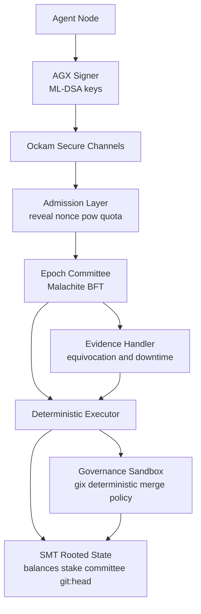
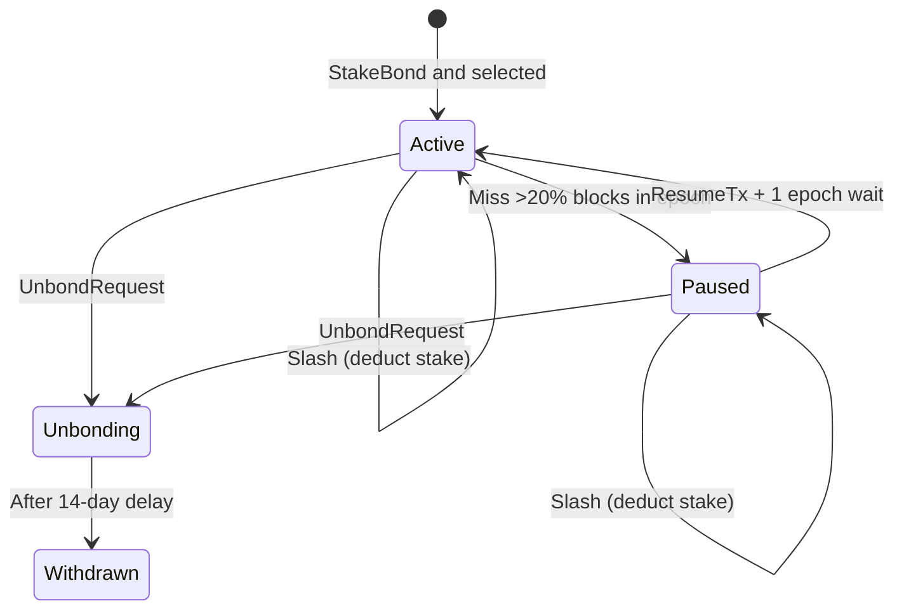

# 1. Title
- Hyperfluid AGX Protocol: Day-1 Committee BFT, Decentralised Staking, and Deterministic Git Governance

# 2. Executive Summary
- Hyperfluid should launch with committee-based BFT from day 1, not full-set voting, to preserve liveness and decentralization if participation scales quickly.
- The selected core stack is strong: Ockam for secure transport, Malachite for BFT, ML-DSA for signatures, SMT for compact state, and gix for governance execution.
- Staking should use lock + jittered expiry + auto-restake, with stronger economic safety from longer unbonding, slashing, and anti-sybil committee design.
- Fee-market economics with EIP-1559 style dynamic pricing: base fee adjusts based on demand, priority fee for faster inclusion, fee burn for deflationary pressure.
- Governance through `git:head` is a strategic differentiator, but determinism must be enforced with hermetic execution and reproducible input bundles.
- Decentralization quality depends on operating constraints, not only protocol slogans: relay diversity, committee randomness, witness availability, and anti-capture rules are mandatory.
- Recommended design introduces a simplified validator lifecycle (`active`, `paused`, `unbonding`, `withdrawn`) and explicit epoch committee sampling with anti-concentration limits.
- Transaction model should be explicit and minimal: transfer, stake bond/renew/unbond, governance propose/vote, and evidence transactions.
- This architecture can remain lightweight while being resilient, but only if incentives, liveness logic, and committee selection are specified precisely at launch.

# 3. System Overview
- Problem solved:
  - Coordinate autonomous AI agents over untrusted infrastructure.
  - Finalize economic and governance actions quickly.
  - Allow protocol-native software evolution using on-chain `git:head`.
- Core design philosophy:
  - Keep validator roles lightweight with state commitments instead of full history burden.
  - Keep governance auditable by committing canonical code state on-chain.
  - Keep decentralization durable under growth via rotating committees, not fixed validator oligopolies.
- Key constraints:
  - Potentially high node churn and uneven connectivity.
  - Adversarial spam pressure under fee-light economics.
  - Requirement for deterministic execution across heterogeneous machines.
  - Need to avoid whale-splitting and validator concentration.

# 4. Architecture (CRITICAL SECTION)
- System components:
  - **Transport Plane (Ockam)**: identity-secured channels, route failover, relay fallback.
  - **Admission Plane**: signature checks, first-spend reveal checks, nonce checks, PoW gate, quotas.
  - **Consensus Plane (Malachite Committee BFT)**: epoch committee selection, proposal/prevote/precommit finality.
  - **Execution Plane**: deterministic state transition function.
  - **State Plane (SMT)**: balances, staking state, committee seed, liveness status, `git:head`.
  - **Governance Plane (gix sandbox)**: proposal validation and deterministic merge policy execution.
  - **Evidence Plane**: equivocation and liveness fault reporting.



- Step-by-step data flow:
  1. Agent signs tx with ML-DSA and submits over Ockam.
  2. Admission layer validates identity binding, anti-replay, and anti-spam requirements.
  3. Current epoch committee orders txs and finalizes block with BFT.
  4. Executor applies txs and updates SMT root.
  5. Governance txs invoke deterministic git checks before `git:head` transition.
  6. Evidence txs adjust slashing/liveness state used in next committee sampling.

# 5. Core Mechanisms
- **Transaction types**
  - `TransferTx`: AGX transfer; first outbound transfer must include pubkey reveal.
  - `StakeBondTx`: lock AGX to enter validator candidate pool.
  - `StakeRenewTx`: extend active stake before/at expiry, or reactivate `paused` stake after 1-epoch wait.
  - `UnbondRequestTx`: begin unbonding timer (funds still slashable during window).
  - `WithdrawUnbondedTx`: withdraw after unbonding delay.
  - `GovernanceProposeTx`: propose candidate `git:head` + deposit.
  - `GovernanceVoteTx`: vote yes/no during governance window, with optional `reason_hash` (content-addressed review rationale).
  - `EvidenceTx`: submit equivocation or protocol-fault evidence.

- **Cryptography: Post-Quantum Signatures (ML-DSA)**
  - **Signature scheme**: ML-DSA (Module Lattice-based Digital Signature Algorithm), NIST FIPS 204.
    - Also known as CRYSTALS-Dilithium.
    - Security level: ML-DSA-65 (recommended for Hyperfluid).
    - Public key size: ~1,952 bytes.
    - Signature size: ~3,293 bytes.
  - **Hash function**: SHA3-256 for all hashing operations.
  - **Key derivation**: BIP-32 style hierarchical deterministic wallets adapted for ML-DSA.
  - **Why post-quantum**: Protects against future quantum computer attacks on ECDSA/secp256k1.
  - **Tradeoff**: Larger signatures than ECDSA (~10x), requiring batching for throughput.

- **Addressing and first-spend reveal**
  - Address = `SHA3-256(pubkey)`.
  - First outbound tx must reveal pubkey and prove hash binding.
  - All txs use strict account nonce sequencing and chain-domain separation.

- **Staking and validator lifecycle (simplified to 4 states)**
  - Keep minimum stake threshold but add anti-split logic in committee sampling.
  - 48h lock alone is insufficient; use longer unbonding delay for stronger economic accountability.
  - Add slashing:
    - strong slash for equivocation,
    - smaller slash for repeated downtime.
  - Use simplified lifecycle states:
    - `active`: Currently validating and eligible for committees.
    - `paused`: Not validating (missed >20% of blocks in epoch), stake still bonded. Can resume after 1-epoch wait.
    - `unbonding`: User requested exit, 14-day timer running, funds slashable.
    - `withdrawn`: Fully exited, funds released.
  - Removed: `probationary` state (complex recovery logic, hard to test).
  - Removed: `inactive_bonded` state (merged into `paused`).
  - State transitions:
    - Active → Paused: Miss >20% blocks in epoch.
    - Paused → Active: Submit ResumeTx, wait 1 epoch.
    - Active/Paused → Unbonding: Submit UnbondRequestTx.
    - Unbonding → Withdrawn: After 14-day unbonding delay.
  - Slashing: Deduct stake from any state, continue from same state (not a separate state).
  - Governance voting eligibility: only `active` validators at governance snapshot block can submit `GovernanceVoteTx`.

- **Default protocol parameters (recommended launch values)**
  - `min_validator_stake`: `1,000 AGX`.
  - `bonding_delay`: `24 hours` (stake is locked, but validator is not committee-eligible yet).
  - `unbonding_delay`: `14 days` (funds are locked and still slashable before withdrawal).
  - `equivocation_slash`: `10% of bonded stake` per proven event.
  - `downtime_slash`: `0.1%` per liveness window breach; escalate to `1%` on repeated breaches.
  - `equivocation_jail`: `30 days` minimum before re-entry eligibility.
  - `governance_proposal_deposit`: `500 AGX` (burn on invalid/non-deterministic proposal).
  - `committee_overlap`: `33%` retained members between consecutive epochs.
  - `resume_delay`: `1 epoch` before `paused` validators can resume to `active`.

- **Plain-language definitions**
  - **Bonding delay**: waiting period after staking before validator can be selected into committees.
  - **Unbonding timer**: cooldown period after requesting exit; stake is locked and can still be slashed until timer ends.
  - **Paused**: validator missed too many blocks, not currently validating, but can resume after wait. Stake remains bonded and slashable.
  - **Equivocation**: validator signs two conflicting votes for the same height/round (double-signing).
  - **EvidenceTx**: transaction that submits cryptographic proof of validator fault (for example, equivocation or severe liveness failure) so the chain can slash/jail automatically.

  - **Penalty matrix (recommended defaults)**
  - Missed committee duties in one liveness window: move to `paused` and slash `0.1%`.
    - Liveness window: `8192 blocks` (~1 day at 10s block time).
    - Threshold: `miss_rate > 20%` within window triggers paused.
  - To resume from paused: submit `ResumeTx`, wait `1 epoch`, return to `active`.
  - Proven equivocation: immediate `10%` slash + `30 days` jail + move to `paused`.
    - Evidence validity window: `equivocation_proof must be included within 24 hours` (8640 blocks) of the equivocation event.
    - If evidence submitted after window: slash cancelled, but validator marked for review.
  - **No-vote timeout semantics (unified across all subsystems)**
    - Timeout in any review/governance context = `no vote` (not deny, not abstain).
    - No-vote does not count toward quorum threshold.
    - No-vote does not penalize validator (distinguish from active deny).
    - Height-based timeouts preferred over wall-clock where possible.
    - Wall-clock timeout (e.g., 30 min review) maps to approximate block height with `±2 block` tolerance.

  - **Committee BFT from day 1**
  - Epoch seed derived from drand randomness beacon.
    - Randomness source: drand network (e.g., drand.cloudflare.com or custom Hyperfluid drand).
    - Implementation: Use `drand` Rust crate for verification and retrieval.
    - Each epoch fetches the drand round corresponding to epoch start height.
    - Seed = `SHA3-256(drand_round_signature + epoch_number + previous_block_hash)`.
    - drand signatures are publicly verifiable and unpredictable, eliminating commit-reveal complexity.
    - Fallback: If drand unavailable, use `SHA3-256(previous_seed + block_hash_chain + epoch_number)`.
  - Sample committee by stake-weighted VRF-like draw with per-operator cap.
    - Committee size: `100 validators` at genesis.
    - Operator cap: `max 15% of committee` per operator identity.
    - Anti-split: detect correlated validator keys via stake graph analysis, apply cap to clusters.
  - Committee size chosen for target safety probability and latency budget.
    - Target: `99.9%` safety against `f < 33%` Byzantine.
    - Latency budget: `< 3 seconds` finality at median.
  - Rotate committees each epoch with partial overlap to avoid abrupt liveness loss.
    - Epoch length: `8192 blocks` (~1 day).
    - Overlap: `33%` retained, `67%` rotated maximum.

- **Governance determinism**
  - Proposal must be fast-forward or deterministic clean merge.
  - `GovernanceProposeTx` must include:
    - `proposed_commit`,
    - `bundle_manifest_hash`,
    - `proposer_fetch_endpoints` (Ockam routes).
  - Validators fetch required git objects directly from proposer endpoints over authenticated Ockam channels.
  - Validators recompute manifest hash and verify every fetched object ID against manifest before merge simulation.
  - Validators verify fetched graph reaches exactly `proposed_commit`; accept only if resulting commit hash equals proposal hash.
  - Commit-hash equality is sufficient integrity check only when object IDs are cryptographically strong and the full reachable object graph is verified (prefer Git SHA-256 object format for new repos).
  - Merge executed in hermetic sandbox with pinned gix/toolchain and normalized environment.
  - If proposer serves inconsistent bundles to different peers, proposal is invalid and deposit is burned.
  - Non-deterministic outcome burns proposer deposit.
  - Review sandbox launch is gated by deterministic precheck:
    - if bundle/object checks or `gix` merge checks fail, do not start reviewer subagent and mark review as failed.
  - Review execution model:
    - proposal appears in validator inbox as review task metadata (not full freeform execution context).
    - validator explicitly invokes `review_proposal` tool from main agent.
    - runtime pauses main agent branch and starts isolated review subagent with:
      - fresh context window,
      - fixed system prompt for governance review only,
      - single tool: `review(decision: approve|deny, reason)`.
    - **subagent timeout is `30 minutes`** - this is a local agent timeout to prevent the review subagent from getting stuck or wasting time. It is NOT a consensus timeout.
    - on timeout: review subagent terminates, no vote is emitted. The validator can retry the review later.
    - when `review(...)` is called, runtime emits `GovernanceVoteTx` and closes sandbox.
    - main agent branch resumes after sandbox termination.
    - Note: There is no network-level timeout for voting. Validators have the full governance window to submit votes.
  - Canonical implementation details for topic-level fast-path state machine and challenge/rollback semantics are defined in `research/agents/topic-fastpath-protocol-spec.md`.
  - Canonical implementation details for action-plan validation, replay protection, and policy bundle pinning are defined in `research/agents/network-policy-engine-spec.md`.

- **Fee-market anti-spam**
  - Base fee adjusts dynamically based on mempool load (EIP-1559 model).
  - Priority fee allows users to bid for faster inclusion.
  - Fee burn removes AGX from circulation permanently.
  - Minimum fee floor prevents spam even during low demand.
  - Staked validators receive fee rebates proportional to stake.

- **Swarm hardening profile (concrete defaults)**
  - Mempool is split into bounded lanes:
    - `evidence lane`: `15%` reserved capacity.
    - `consensus-control lane`: `10%` reserved capacity.
    - `governance lane`: `10%` reserved capacity.
    - `transfer lane`: `65%` remaining capacity.
  - Governance anti-flood controls:
    - `max_open_governance_proposals`: `32` network-wide.
    - `max_proposals_per_identity_per_epoch`: `1`.
    - `proposal_cooldown_after_reject`: `3 epochs`.
  - Sender anti-sybil controls:
    - unknown identity tx budget starts at `5 tx/min`.
    - budget scales with stake and clean history.
    - repeated reject/spam ratio above threshold triggers temporary mempool quarantine.
  - **Rate limiting (tiered flat rates)**
    - Per-IP connection limit: `max 10 concurrent connections` per IP.
    - Per-identity tx burst: `max 20 txs in 60 seconds`.
    - Tiered flat rate limits by trust stage:
      - `untrusted_joiner`: `5 tx/min`
      - `sandboxed_contributor`: `15 tx/min`
      - `trusted_contributor`: `30 tx/min`
      - `coordinator_eligible`: `60 tx/min`
    - Stake affects trust ladder progression, not direct rate scaling.
    - Rationale: Simpler, predictable, no perverse incentives to split stake.
    - Removed: Logarithmic stake-weighted formula (complex and gameable).
  - Circuit-breaker mode (automatic):
    - triggers when reject ratio, queue depth, or finality latency breaches thresholds.
    - raises PoW target, enables emergency micro-fee floor, and tightens unknown-sender quotas.
  - Canonical quota IDs and cross-layer precedence are defined in `research/agents/network-policy-engine-spec.md`.

- **Network policy boundary (minimal, deterministic)**
  - All network-mutating calls must pass a network policy gate:
    - typed action schema validation,
    - role/stage permission checks,
    - resource ACL checks,
    - lane/quota checks.
  - Governance and control-plane actions are high-risk class and require step-up certificates.
  - Local non-network actions are intentionally out of protocol policy scope.



## Pseudocode (for complex mechanisms)
```text
function select_committee(epoch, validator_pool, seed):
    candidates = filter(validator_pool, status == active and stake >= min_stake)
    weighted = apply_stake_weights_with_operator_cap(candidates)
    committee = deterministic_weighted_sample(weighted, seed, committee_size(epoch))
    return committee

function validate_transfer(tx, state):
    if state.is_first_spend(tx.sender):
        require tx.pubkey_reveal exists
        require sha3_256(tx.pubkey_reveal) == tx.sender
    require verify_mldsa(tx.pubkey_or_cache, tx.signing_bytes, tx.signature)
    require verify_nonce(tx.sender, tx.nonce)
    require verify_pow(tx.pow_nonce, tx.signing_bytes, state.current_pow_target)
    require within_rate_limits(tx.sender, tx.peer_id, state.window_stats)
    return OK

function apply_governance_proposal(p, state):
    lock_deposit(p.proposer, proposal_deposit)
    bundle = fetch_bundle_from_proposer(p.proposer_fetch_endpoints, p.bundle_manifest_hash)
    require verify_bundle_manifest(bundle, p.bundle_manifest_hash)
    require verify_commit_reachable(bundle, p.proposed_commit)
    outcome = hermetic_gix_merge_check(state.git_head, p.proposed_commit, pinned_env_hash)
    if outcome != DETERMINISTIC_VALID:
        burn_deposit(p.proposer)
        return REJECT
    open_vote_window(p, governance_window_blocks)
    return ACCEPT_PENDING_VOTE

function execute_governance_review(agent, proposal):
    if !deterministic_precheck_passed(proposal):
        return FAIL_PRECHECK_NO_SANDBOX
    pause_main_branch(agent)
    review_agent = spawn_review_subagent(
        fresh_context=true,
        allowed_tools=["review"],
        timeout_minutes=30
    )
    result = wait_for_review(review_agent)
    if result.timeout:
        record_review_timeout(agent, proposal.id)
    else:
        emit_vote_tx(agent, proposal.id, result.decision, result.reason)
    terminate(review_agent)
    resume_main_branch(agent)
    return OK

function can_vote_governance(v, snapshot_state):
    return snapshot_state.status(v) == active

function admit_tx(tx, state):
    lane = classify_lane(tx)
    if lane_full(lane):
        return REJECT_LANE_FULL
    if is_unknown_sender(tx.sender) and over_unknown_budget(tx.sender):
        return REJECT_BUDGET
    if in_quarantine(tx.sender):
        return REJECT_QUARANTINED
    if swarm_circuit_breaker_active(state):
        require stricter_pow_or_fee(tx)
    return ACCEPT

function admit_network_action(actor, action, state):
    require valid_network_action_schema(action)
    require role_allows(actor.stage, action.type)
    require acl_allows(actor.id, action.resource, action.type)
    require within_action_quota(actor.id, action.type)
    if action.risk_class == HIGH:
        require has_step_up_certificate(action)
        require step_up_cert.single_use == true
        require step_up_cert.bound_plan_id == action.plan_id
        require step_up_cert.issued_height + 100 >= current_height  # valid for 100 blocks
    return ALLOW
```

# 6. Design Decisions & Tradeoffs
## Tradeoff 1
- Option A: Full validator-set BFT from genesis.
- Option B: Committee BFT from genesis.
- Chosen: Option B.
- Why chosen: preserves low latency and predictable communication cost under rapid growth.
- Sacrifice: additional complexity in sampling and fairness rules.
- Scaling risk: weak randomness or poor anti-concentration rules can centralize committees.

## Tradeoff 2
- Option A: 48h lock and no slashing.
- Option B: lock + longer unbonding + slashing + paused state for liveness failures.
- Chosen: Option B.
- Why chosen: materially stronger economic security and better Byzantine deterrence.
- Sacrifice: higher operator capital friction and slower stake mobility.
- Scaling risk: excessive penalties can reduce validator participation if tuned poorly.

## Tradeoff 3
- Option A: Fee-market with static fees.
- Option B: EIP-1559 style dynamic fee market with base fee adjustment and priority fees.
- Chosen: Option B.
- Why chosen: proven spam prevention, efficient price discovery, predictable UX, fee burn creates deflationary pressure.
- Sacrifice: users must hold AGX for fees.
- Scaling risk: fee spikes during high demand may price out small transactions.

## Tradeoff 4
- Option A: Social/off-chain git governance.
- Option B: On-chain `git:head` governance with deterministic execution and deposit burns.
- Chosen: Option B.
- Why chosen: auditable upgrade authority and protocol-native accountability.
- Sacrifice: slower governance cadence and stricter tooling constraints.
- Scaling risk: proposal spam can consume review/execution bandwidth without strong admission policy.

# 7. Failure Modes & Edge Cases
## Scenario: Committee capture event
- What happens: attacker wins too much committee weight in one epoch.
- Why it happens: concentrated stake, weak anti-split rules, or predictable randomness.
- Handling/failure mode: operator caps, delayed randomness reveal, rapid epoch rotation, and slashable evidence paths.

## Scenario: Mass validator churn
- What happens: committee quality degrades and block production stalls.
- Why it happens: synchronized restarts, network incidents, coordinated inactivity.
- Handling/failure mode: overlap between consecutive committees, paused validator handling, and backup proposer schedule.

## Scenario: Fee market manipulation
- What happens: attackers spam high-fee transactions to inflate base fee and price out legitimate users.
- Why it happens: fee markets can be manipulated by wealthy attackers.
- Handling/failure mode: maximum base fee increase per block (12.5% cap), mempool size limits per sender, minimum fee floor prevents total collapse.

## Scenario: Deterministic governance divergence
- What happens: nodes disagree on merge validity.
- Why it happens: environment-dependent git behavior or non-hermetic inputs.
- Handling/failure mode: pinned runtime hash, sealed object bundles, reject on any deterministic mismatch.

## Scenario: Proposer object withholding or equivocation
- What happens: proposer hides required objects or serves different bundles to different validators.
- Why it happens: attempt to stall voting or create split validation outcomes.
- Handling/failure mode: proposal includes canonical manifest hash, validators require full manifest availability before voting, and equivocated/incomplete bundles cause rejection and deposit burn.

## Scenario: Review subagent timeout or deadlock
- What happens: validator starts proposal review but sandboxed reviewer fails to return a decision in time.
- Why it happens: pathological proposal content, model stall, or runtime fault in isolated review process.
- Handling/failure mode: hard 30-minute timeout, no-vote timeout outcome, sandbox termination, and main branch resume.

## Scenario: Quorum oscillation from liveness misclassification
- What happens: active set flaps and safety margins erode.
- Why it happens: aggressive inactivity timeouts and transient partitions.
- Handling/failure mode: hysteresis windows, rolling participation scores, and delayed status transitions.

## Scenario: Governance proposal flood
- What happens: governance queue saturates and crowds out safety-critical transactions.
- Why it happens: low-cost proposal spam from many pseudo-identities.
- Handling/failure mode: open-proposal cap, proposer cooldown, lane reservation, and identity quarantine on spam ratio.

## Scenario: Mempool lane starvation attack
- What happens: attacker saturates one lane to indirectly delay finality-critical operations.
- Why it happens: queue shaping not enforced per lane.
- Handling/failure mode: strict lane reservations, per-lane eviction policy, and dynamic reallocation only toward evidence/control lanes.

# 8. Scalability Analysis
## Small scale (10–100 nodes)
- Committee mode still useful for future-proofing and operational consistency.
- Finality remains fast with modest committee sizes.
- Governance overhead is manageable with manual review support.

## Medium scale (1k–10k nodes)
- Committee BFT is mandatory, not optional.
- Signature verification and gossip pressure remain dominant costs.
- Anti-concentration sampling and witness availability become primary decentralization controls.

## Large scale (100k+ nodes)
- Requires clear role separation:
  - edge submitters/agents,
  - rotating validator committees,
  - witness/proof service market.
- Major risk shifts from pure consensus safety to data availability and relay/proof market centralization.

# 9. Recommended Architecture
- Launch architecture:
  - committee BFT from genesis,
  - staking with unbonding + slashing + paused state for liveness failures,
  - adaptive anti-spam admission,
  - deterministic `git:head` governance sandboxing,
  - lightweight state commitments with incentivized witness distribution.
- Rejected alternatives:
  - full-set BFT initially then migration later,
  - no-slashing staking,
  - fixed PoW-only anti-spam model,
  - non-hermetic governance execution.
- Decentralization target:
  - maximize independently operated committee members per epoch,
  - cap effective influence of stake-split entities,
  - prevent dependence on a small relay/witness provider set.

# 10. Implementation Plan
1. Specify transaction schemas and canonical signing domains.
2. Implement simplified staking state machine with unbonding, slashing, and paused/active transitions (4 states).
3. Implement committee selection module with stake-weighted sampling and operator caps.
4. Integrate Malachite consensus for committee operation and epoch rotation.
5. Implement admission controls (PoW retargeting, quotas, peer budgets).
6. Implement deterministic governance sandbox, proposer bundle fetch protocol, precheck-gated review subagent flow, and `git:head` transition checks.
7. Implement evidence pipeline for equivocation and liveness faults.
8. Build adversarial simulation suite for committee capture, churn, spam, and governance divergence.
9. Ship observability dashboards for decentralization metrics (committee diversity, operator concentration, relay/witness concentration).
10. Add mempool lane controller and swarm circuit-breaker automation.
11. Add attacker-swarm game days with 10x malicious sender ratio and governance flood scenarios.

# 11. Future Improvements
- Introduce mature aggregate/threshold PQ signatures when practical.
- Add verifiable randomness improvements for committee sampling.
- Add open relay and witness incentive markets with anti-cartel monitoring.
- Add formal verification for committee sampling and liveness transition logic.
- Add zk/light-client proof acceleration for low-resource agent nodes.

