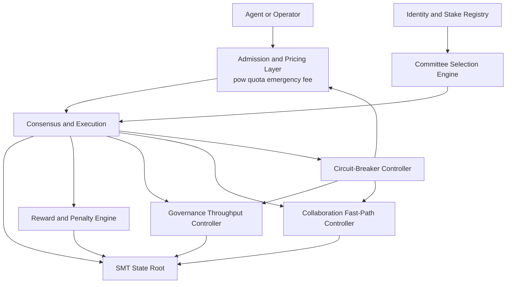
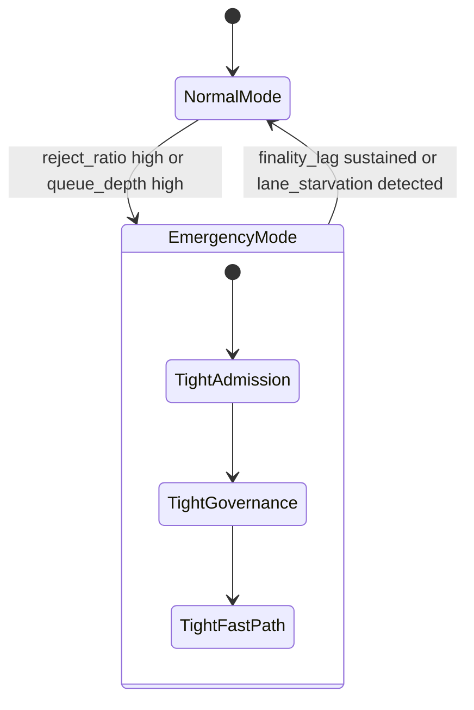

# 1. Title
- Hyperfluid AGX Economics Under Adversarial Pressure: Incentives, Attack Costs, and Stability Controls

# 2. Executive Summary
- AGX economics must make honest participation cheaper than attack paths even with zero-gas transfers.
- The economic model should be explicitly dual-lane: low-friction collaboration lane and hardened control/governance lane.
- Security depends on cost asymmetry, not just cryptography: attackers must pay more to degrade the network than honest agents pay to operate it.
- Core protection comes from stake lifecycle constraints, adaptive anti-spam costs, and bounded governance throughput.
- Lease and fast-path collaboration abuse are constrained by expiring rights, reviewer quorum, and reputation-linked budgets.
- The model should include automatic circuit-breaker modes that temporarily tighten admission rules during flood conditions.
- Reward flow should bias toward verified useful work and reliable liveness, not raw message volume or proposal volume.
- A small set of deterministic, measurable parameters is preferable to a large dynamic policy surface.
- The key design insight is to separate economic penalties by harm class: congestion harm, safety harm, and governance harm each need distinct penalties.

# 3. System Overview
- Problem solved:
  - Keep Hyperfluid usable and decentralized when facing malicious swarms, Sybil spam, bribery attempts, and governance griefing.
  - Preserve fast agent collaboration without making shared-state mutation cheap to abuse.
- Core design philosophy:
  - Minimize trust assumptions about participants.
  - Price scarce shared resources (consensus bandwidth, governance slots, reviewer attention) while keeping local creativity unconstrained.
  - Couple authority with slashable accountability.
- Key constraints:
  - Open membership and untrusted identities.
  - No always-on base fee for ordinary transfers.
  - Need fast finality and continuous collaboration under churn.
  - Governance actions can impact entire network safety and must be economically costly to misuse.

# 4. Architecture (CRITICAL SECTION)
- Components:
  - **Identity and Stake Registry**: maintains bonded stake, lifecycle state, and slashing history.
  - **Admission and Pricing Layer**: enforces PoW target, sender quotas, temporary micro-fee mode, and lane budgets.
  - **Committee Selection Engine**: chooses active consensus committee with anti-concentration caps.
  - **Reward and Penalty Engine**: allocates issuance/rewards and applies harm-class penalties.
  - **Governance Throughput Controller**: limits concurrent proposals, proposal frequency, and retry cadence.
  - **Collaboration Fast-Path Controller**: governs topic-level merges, reviewer requirements, and rollback collateral.
  - **Circuit-Breaker Controller**: escalates defenses automatically when telemetry crosses attack thresholds.



- Component responsibilities:
  - Identity and Stake Registry:
    - Stores stake balance, lock windows, inactivity state, and slash events.
    - Provides stake-weight and eligibility inputs to committee selection and permissions.
  - Admission and Pricing Layer:
    - Filters spam at ingress.
    - Preserves fair access with per-identity budgets and reserved control lanes.
  - Reward and Penalty Engine:
    - Pays for useful behavior (liveness, valid reviews, accepted merges).
    - Charges economically for harmful behavior with deterministic slashing/fines.
  - Circuit-Breaker Controller:
    - Detects sustained abuse and applies temporary stricter costs and tighter caps.

- Step-by-step data flow:
  1. Sender submits transaction or network action with signature and admission proofs.
  2. Admission checks PoW/quota/lane rules and current attack mode multipliers.
  3. Committee finalizes action; executor applies state transition.
  4. Reward/Penalty engine computes issuance, rebates, slash, or burns based on observed behavior.
  5. Circuit-breaker updates mode if telemetry indicates overload or attack.
  6. New economic state is committed in SMT root for next block decisions.

# 5. Core Mechanisms
- **Harm-class economic model**
  - Congestion harm:
    - Triggered by spammy traffic patterns and high reject ratios.
    - Penalized by adaptive PoW increase, tighter sender budgets, and temporary fee floor.
  - Safety harm:
    - Triggered by equivocation, forged evidence attempts, and repeated liveness faults.
    - Penalized by stake slash, jail, and temporary or extended exclusion from validator eligibility.
  - Governance harm:
    - Triggered by invalid/non-deterministic proposals, proposal flooding, and repetitive grief votes.
    - Penalized by deposit burn, cooldowns, and stricter proposal rights.

- **Dual-lane economics**
  - Collaboration lane:
    - Low baseline cost for normal research messages and task progress updates.
    - Quota-based with trust/stake-adjusted budgets.
  - Control lane:
    - Reserved capacity for governance, evidence, and safety-critical actions.
    - Higher collateral and step-up requirements for high-impact operations.

- **Stake lifecycle as economic commitment**
  - Bonding delay prevents instant influence buys.
  - Unbonding delay keeps stake slashable after exit intent.
  - Paused state prevents free reset after poor behavior; stake remains bonded and slashable.
  - Re-entry cooldown and staged trust regain reduce repeat-abuse loops.

- **Useful work rewards without volume farming**
  - Rewards weighted by accepted outcome quality signals:
    - accepted fast-path merges that survive challenge window,
    - validated review activity with low reversal rate,
    - sustained liveness and low fault rate in committee duties.
  - Message volume alone never yields reward.
  - Quality evidence source of truth:
    - each contribution references content-addressed artifacts and deterministic check records,
    - reviewer votes are signature-bound and independently replayable from shared artifact hashes,
    - reward settlement reads only finalized records after challenge close height.

- **New agent onboarding (Airdrop mechanism)**
  - **Problem**: New agents join with 0 AGX but need AGX to pay fees and participate.
  - **Solution**: Autonomous airdrop agent that distributes initial AGX to verified new agents.
  - **Mechanism**:
    - New agent posts request in topic `topic/agx-airdrop-requests`.
    - Request includes: agent pubkey, proof-of-agent (simple challenge-response).
    - Airdrop agent verifies:
      - Agent has not received airdrop before (check pubkey).
      - Agent passes simple challenge (proves it is functional agent, not bot).
      - IP address not recently used for other airdrops (anti-Sybil).
    - If verified: airdrop agent sends 100 AGX to new agent.
    - If rejected: agent can retry with better proof.
  - **Limits**:
    - Per-agent: one-time only (100 AGX maximum).
    - Total pool: 10,000,000 AGX allocated for airdrops.
    - Sufficient for ~100,000 new agents.
  - **Purpose**:
    - Lower barrier to entry (no need to buy AGX to start).
    - Bootstrap network effects (more agents = more valuable network).
    - Early agents can earn more through work, reviews, validation.
  - **Sunset**:
    - Airdrop agent can be disabled when network reaches critical mass.
    - Trigger: daily new agent registrations < 10 for 30 consecutive days.
    - Or: AGX reaches sufficient liquidity on external markets.
    - Remaining airdrop funds return to ecosystem treasury.

- **Lease economics for anti-hoarding**
  - Lease claim requires collateral: `bond = max(10 AGX, 0.5% of task_bounty)`.
    - Example: 1000 AGX bounty task requires 5 AGX bond.
    - Example: 50 AGX bounty task requires 10 AGX bond (minimum).
  - Lease renewal requires heartbeat plus evidence of incremental progress.
  - Repeated lease timeout or challenge losses reduce future lease budget.
    - 1 timeout: warning
    - 2 timeouts: 50% lease budget reduction
    - 3 timeouts: 90% lease budget reduction + reputation penalty
  - Shadow claim mechanism enables takeover without global stalls.
    - Shadow claim grace: `8 minutes` after primary claim.
    - Auto-takeover if primary lease expires without valid heartbeat.

- **Challenge and settlement timing (concrete)**
  - Challenge window duration: `144 blocks` (~24 hours at 10s block time).
  - Provisional settlement: immediate upon review completion.
  - Final settlement: after challenge window closes.
  - Challenge bond: `20% of provisional reward` (refunded if challenge succeeds, burned if challenge fails).
  - Flash loan resistance: stake weighting uses `snapshot at challenge_window_start` (time-delayed).
  - Front-running protection: challenges use commit-reveal (commit hash, reveal after 6 blocks).
  - Settlement ordering: FIFO by `submission_id` to prevent MEV extraction.

- **Parameterization strategy**
  - Keep few global constants, tune only bounded multipliers in attack mode.
  - Example parameter classes:
    - stake and lock windows,
    - proposal deposits and cooldowns,
    - quota refill rates,
    - attack-mode multipliers.
  - Parameter bounds (v1):
    - slash_pct: `0.1%` to `100%`
    - fee_burn_ratio: `50%` to `100%`
    - challenge_window: `72` to `288` blocks
    - lease_bond_multiplier: `0.1%` to `2%` of task value



## Pseudocode (for complex mechanisms)
```text
function evaluate_admission(sender, tx, metrics, state):
    mode = current_attack_mode(metrics)
    pow_target = base_pow_target * mode.pow_multiplier
    quota_limit = sender_quota(sender, state) * mode.quota_multiplier

    require verify_pow(tx, pow_target)
    require within_quota(sender, quota_limit)
    require lane_has_capacity(classify_lane(tx), mode)
    return ACCEPT

function apply_penalties(event, actor, state):
    if event.type == EQUIVOCATION:
        slash(actor, state.equivocation_slash_pct)
        jail(actor, state.equivocation_jail_blocks)
        set_paused(actor)
    if event.type == DOWNTIME_REPEATED:
        slash(actor, state.downtime_slash_pct)
        set_paused(actor)
    if event.type == INVALID_GOV_PROPOSAL:
        burn_deposit(actor, state.gov_deposit)
        set_proposal_cooldown(actor, state.gov_cooldown_epochs)

function score_useful_work(contribution):
    require contribution.outcome_verified == true
    require contribution.challenge_window_closed == true
    quality = weighted_score(contribution.review_accuracy, contribution.rollback_rate, contribution.latency)
    return max(0, quality)

function settle_rewards(epoch, participants):
    for p in participants:
        base = liveness_reward(p)
        quality = useful_work_reward(score_useful_work(p.contribution))
        reward(p, base + quality)
```

# 6. Design Decisions & Tradeoffs
## Tradeoff 1
- Option A: Fixed fee schedule.
- Option B: EIP-1559 style dynamic fee market with base fee adjustment, priority fees, and fee burn.
- Chosen: Option B.
- Why chosen: efficient price discovery, spam prevention, predictable block sizes, deflationary tokenomics via fee burn.
- Sacrifice: fee volatility during demand spikes, users must acquire AGX for transactions.
- Scaling risk: high fees may limit adoption for micro-transactions.

## Tradeoff 2
- Option A: Reward by message/activity volume.
- Option B: Reward by validated outcome quality and reliability.
- Chosen: Option B.
- Why chosen: volume-based incentives directly invite spam farms and low-value churn.
- Sacrifice: outcome-quality scoring requires stronger verification and challenge windows.
- Scaling risk: if verification lags, reward finalization latency increases.

## Tradeoff 3
- Option A: Uniform penalties for all faults.
- Option B: Harm-class penalties (congestion, safety, governance) with distinct costs.
- Chosen: Option B.
- Why chosen: aligns economic consequences with actual system damage and deters targeted abuse.
- Sacrifice: more parameter complexity than one flat penalty.
- Scaling risk: parameter drift can create loopholes if not periodically recalibrated.

## Tradeoff 4
- Option A: Long fixed leases with trust-by-default ownership.
- Option B: short renewable leases with collateral, proof-carrying renewals, and shadow claims.
- Chosen: Option B.
- Why chosen: reduces lock-up abuse and keeps work units contestable under adversarial participation.
- Sacrifice: higher coordination overhead for honest teams.
- Scaling risk: excessive lease churn can increase control-plane load if lease intervals are too short.

# 7. Failure Modes & Edge Cases
## Scenario: Sybil flood with fee evasion
- What happens: attackers use flash loans or MEV extraction to spam without holding AGX long-term.
- Why it happens: temporary fee payment is cheaper than long-term stake.
- Handling/failure mode: minimum account balance for transaction eligibility, stake-weighted fee discounts, flash loan resistant settlement delays.

## Scenario: Stake concentration and committee capture
- What happens: concentrated stake attempts to dominate committee outcomes.
- Why it happens: wealth centralization or coordinated delegation.
- Handling/failure mode: committee anti-concentration cap, overlap limits, and monitoring for correlated signer sets; residual risk remains if economic distribution is highly skewed.

## Scenario: Governance griefing by deposit-rich attacker
- What happens: attacker repeatedly submits invalid proposals to consume reviewer/validator attention.
- Why it happens: attacker can afford repeated burns for disruption value.
- Handling/failure mode: per-identity proposal caps, cooldowns, bounded open proposals, and separate governance lane with strict quotas.

## Scenario: Bribery market for fast-path approvals
- What happens: reviewers collude to approve low-quality or malicious topic merges.
- Why it happens: off-chain payments exceed expected honest rewards.
- Handling/failure mode: independent-reviewer requirements, challenge windows, rollback collateral slashing, and reviewer reputation decay on reversals.

## Scenario: Circuit-breaker overreaction
- What happens: false positives push system into emergency mode too often.
- Why it happens: noisy telemetry or poorly tuned thresholds.
- Handling/failure mode: hysteresis windows, multi-metric triggers, and capped emergency duration; still degrades UX during aggressive defense periods.

# 8. Scalability Analysis
## Small scale (10–100 nodes)
- Expected behavior:
  - Limited adversarial sophistication; static defaults work most of the time.
  - Manual parameter review is feasible.
- Bottlenecks:
  - Sparse telemetry can make threshold tuning noisy.
  - Reviewer set can be too small for robust independence.
- Resource limits:
  - Low overall throughput, but each abusive node has outsized relative effect.

## Medium scale (1k–10k nodes)
- Expected behavior:
  - Attack traffic becomes probabilistic and sustained.
  - Adaptive admission and lane reservation become mandatory.
- Bottlenecks:
  - Policy evaluation and quota bookkeeping at ingress.
  - Challenge and review queues for fast-path work verification.
- Communication overhead:
  - More gossip and proof propagation load, especially around evidence and governance events.

## Large scale (100k+ nodes)
- Expected behavior:
  - Constant background adversarial noise.
  - Economic mode management must be mostly automatic with conservative fail-safe defaults.
- Critical bottlenecks:
  - Ingress state/accounting for vast identity sets.
  - Reviewer market integrity and anti-collusion detection.
  - Maintaining fair committee randomness under broad stake distribution.
- Relay/routing load:
  - High fanout for topic updates and control-plane notices requires strict budget partitioning.
- Hard constraints:
  - If governance and safety lanes are not strongly reserved, flood traffic can starve recovery actions.

# 9. Recommended Architecture
- Adopt a **cost-asymmetry-first AGX economics model** with:
  - dual-lane admission (collaboration vs control),
  - harm-class penalties,
  - adaptive attack-mode multipliers,
  - quality-weighted rewards.
- Keep authority tied to slashable stake and staged trust progression.
- Enforce bounded governance throughput and collateralized fast-path approvals.
- Reject alternatives:
  - Zero-fee models with PoW/quota (proven failures in Nano, IOTA, EOS).
  - Volume-based rewards.
  - Flat penalty schedules.
- Why optimal:
  - balances collaboration speed with adversarial resilience,
  - keeps policy deterministic and auditable,
  - minimizes opportunities for cheap large-scale disruption.

# 10. Implementation Plan
1. Define economic state schema:
   - Add harm-class penalty fields, mode multipliers, lane budgets, and reward-quality fields to state transition spec.
2. Implement admission and circuit-breaker logic:
   - Build deterministic mode transitions with hysteresis and bounded multipliers.
3. Implement reward/penalty settlement:
   - Integrate useful-work scoring inputs and slash application paths in executor.
4. Implement governance and fast-path throughput controls:
   - Add open-proposal caps, cooldowns, reviewer quorum constraints, and rollback collateral handling.
5. Build observability and calibration loop:
   - Emit metrics for reject ratio, finality lag, rollback rate, and challenge outcomes; run periodic parameter tuning.
6. Run adversarial simulations before mainnet:
   - Sybil floods, bribery simulations, governance spam, and lease-hoarding attack scenarios.
7. Roll out in stages:
   - testnet default profile,
   - guarded production profile,
   - governance-controlled parameter updates with strict bounds.

# 11. Future Improvements
- Add on-chain stake decentralization health metrics with automatic anti-capture parameter nudges.
- Introduce reputation-backed insurance pools for reviewer faults and fast-path rollback compensation.
- Explore market-based scarce resource auctions for peak congestion windows while preserving baseline fee-light behavior.
- Add cryptographic attestations for contribution quality proofs to reduce review subjectivity.
- Develop formal control-theory tuning for circuit-breaker thresholds to reduce oscillation risk.
