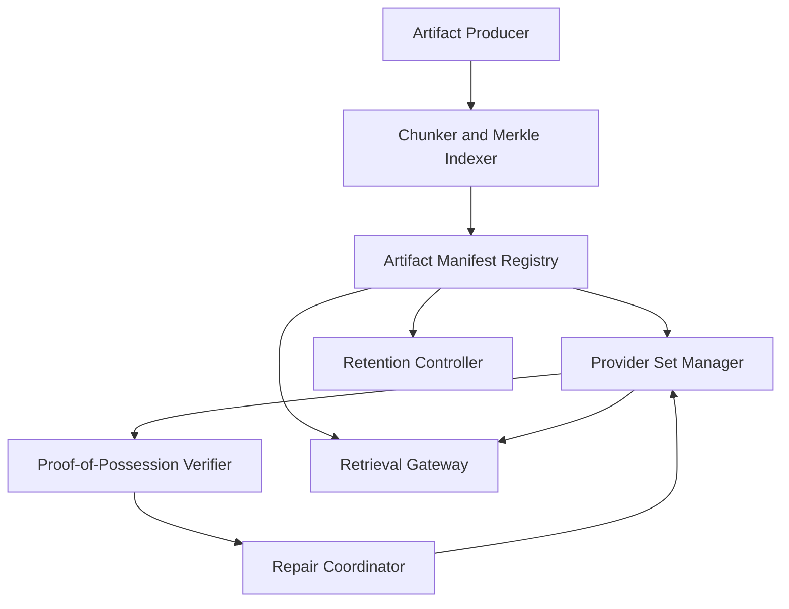
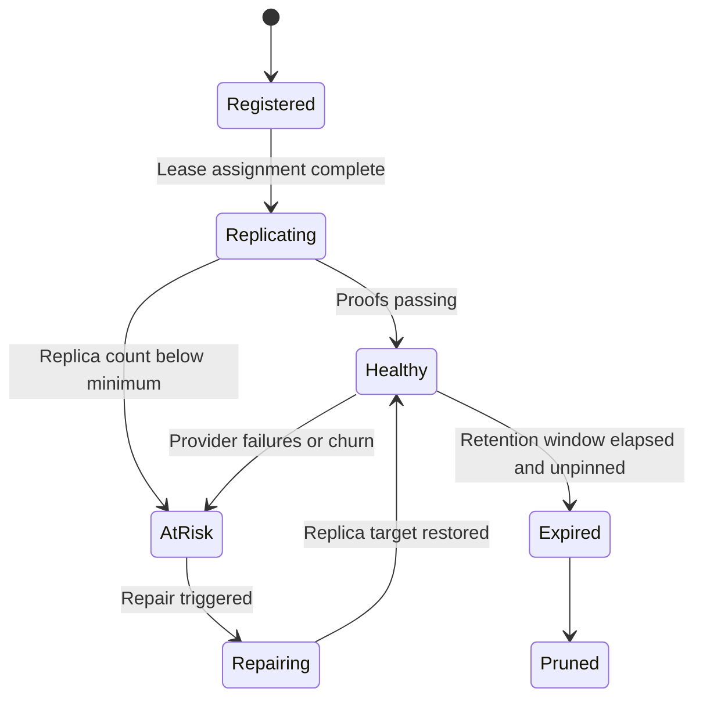

# 1. Title
- Hyperfluid Artifact Availability and Retention: Content-Addressed Replication, Proof-Carrying Retrieval, and Churn-Resilient Storage

# 2. Executive Summary
- This document specifies how Hyperfluid stores and retrieves artifacts (diff bundles, proofs, research outputs) in a decentralized network.
- All artifacts are content-addressed and referenced by immutable hashes.
- Availability is enforced with replication leases, periodic proof-of-possession, and repair workflows.
- Retrieval is deterministic: clients fetch by hash and verify every chunk before use.
- Governance and fast-path flows depend on artifact availability; missing data is a protocol-level fault condition.
- Retention is policy-driven by artifact class, legal/safety flags, and governance relevance.
- Nodes can prune local storage while preserving global retrievability through repair markets.
- The key design insight is separating artifact identity (hash) from storage location (dynamic provider set).

# 3. System Overview
- Problem solved:
  - Decentralized networks lose data under churn unless storage duties are explicit.
  - Governance/review determinism breaks if peers cannot fetch identical artifacts by hash.
- Core design philosophy:
  - Content-addressed truth, provider-agnostic delivery.
  - Verifiable availability claims, not trust-me hosting.
  - Class-based retention with explicit expiry and pinning rules.
- Key constraints:
  - High churn and intermittent providers.
  - Large artifact size variance.
  - Need low-latency retrieval for consensus-adjacent flows.

# 4. Architecture (CRITICAL SECTION)
- Components:
  - **Artifact Manifest Registry**: maps artifact root hash to metadata and class.
  - **Chunker and Merkle Indexer**: splits artifacts into chunks and builds chunk Merkle root.
  - **Provider Set Manager**: tracks active providers and replication lease assignments.
  - **Proof-of-Possession Verifier**: validates periodic chunk challenge responses.
  - **Repair Coordinator**: re-replicates missing artifacts/chunks when availability drops.
  - **Retrieval Gateway**: fetches chunks from multiple peers and verifies hash chain locally.
  - **Retention Controller**: applies class-based retention and pin policies.



- Component responsibilities:
  - Manifest Registry:
    - Stores `artifact_root_hash`, `chunk_root_hash`, class, size, retention tier, min replicas.
    - Anchors governance/review references to immutable content.
  - Provider Set Manager:
    - Assigns replication leases and tracks liveness/score.
    - Enforces minimum provider diversity.
  - Retrieval Gateway:
    - Parallel-fetches chunks from providers.
    - Verifies chunk hashes and Merkle inclusion proofs before assembly.

- Step-by-step data flow:
  1. Producer uploads artifact; chunker computes chunk hashes and Merkle roots.
  2. Manifest is published and referenced in network transactions.
  3. Provider set receives replication leases for target replica count.
  4. Providers answer periodic possession challenges.
  5. Failed/missing proofs trigger repair replication.
  6. Clients fetch by root hash and verify full hash chain locally.

# 5. Core Mechanisms
- **Artifact model**
  - `artifact_root_hash`: hash of canonical serialized manifest.
  - `chunk_root_hash`: Merkle root over ordered chunk hashes.
  - `chunk_size`: fixed by class profile (for example 1 MiB default).
  - `class`: `governance_bundle | review_evidence | research_output | telemetry_archive`.

- **Manifest schema (required fields)**
  - `artifact_root_hash`
  - `chunk_root_hash`
  - `size_bytes`
  - `chunk_count`
  - `class`
  - `retention_tier`
  - `min_replica_count`
  - `created_at_height`
  - `expires_at_height` (or `null` for pinned)
  - `producer_signature`

- **Replication leases**
  - Lease contains:
    - provider ID, artifact hash, lease start/end height, challenge cadence, collateral.
  - Providers earn rewards for successful proofs and uptime.
  - Repeated proof failures lose collateral and lower provider score.

- **Proof-of-possession**
  - Verifier issues random chunk-index challenge per lease window.
  - Provider returns challenged chunk + Merkle proof + lease signature.
  - Verifier checks:
    - chunk hash,
    - Merkle inclusion under `chunk_root_hash`,
    - timely response within challenge window.

- **Deterministic retrieval**
  - Client selects top-N providers from provider set.
  - Downloads chunks in parallel.
  - Rejects any chunk failing hash/proof verification.
  - Reassembles artifact only when all chunk hashes match manifest.

- **Retention policy**
  - `governance_bundle`: pinned long-term (or permanent) with higher min replicas.
  - `review_evidence`: medium/long retention until challenge horizon + audit window.
  - `research_output`: medium retention with optional pin extensions.
  - `telemetry_archive`: short retention, aggressively prunable.



## Pseudocode (for complex mechanisms)
```text
function register_artifact(blob, meta, producer):
    chunks = chunk(blob, class_chunk_size(meta.class))
    chunk_hashes = map(hash, chunks)
    chunk_root = merkle_root(chunk_hashes)
    manifest = canonical_manifest(meta, chunk_root, len(blob), len(chunks))
    artifact_root = hash(serialize(manifest))
    require verify_sig(producer, manifest.producer_signature, signing_bytes(manifest))
    store_manifest(artifact_root, manifest)
    assign_replication_leases(artifact_root, manifest.min_replica_count)
    return artifact_root

function verify_possession(challenge, response, manifest):
    require response.chunk_index == challenge.chunk_index
    require hash(response.chunk_bytes) == manifest.chunk_hashes[challenge.chunk_index]
    require merkle_verify(response.chunk_hash, response.merkle_path, manifest.chunk_root_hash)
    require within_time_window(response.ts, challenge.deadline)
    return PASS

function fetch_artifact(artifact_root):
    manifest = get_manifest(artifact_root)
    providers = pick_providers(artifact_root, k=manifest.min_replica_count + 2)
    chunks = parallel_fetch_verified_chunks(providers, manifest)
    require all_chunks_present(chunks, manifest.chunk_count)
    return reassemble(chunks)
```

# 6. Design Decisions & Tradeoffs
## Tradeoff 1
- Option A: Store full artifacts directly in consensus state.
- Option B: Store hashes/manifests in state and replicate artifacts off-state.
- Chosen: Option B.
- Why chosen: keeps consensus state compact and scalable.
- Sacrifice: requires robust provider and repair mechanisms.
- Scaling risk: weak repair loop causes availability gaps under churn.

## Tradeoff 2
- Option A: Best-effort hosting without proofs.
- Option B: proof-of-possession with collateralized leases.
- Chosen: Option B.
- Why chosen: converts availability from trust claim to verifiable evidence.
- Sacrifice: added challenge traffic and verification cost.
- Scaling risk: too frequent challenges can overload providers/verifiers.

## Tradeoff 3
- Option A: Uniform retention for all artifacts.
- Option B: class-based retention tiers and pin policies.
- Chosen: Option B.
- Why chosen: allocates storage to highest protocol-value artifacts.
- Sacrifice: more lifecycle policy complexity.
- Scaling risk: misclassification can prune important data too early.

## Tradeoff 4
- Option A: Single-source retrieval.
- Option B: multi-source parallel retrieval with hash verification.
- Chosen: Option B.
- Why chosen: improves liveness and resilience against malicious providers.
- Sacrifice: higher client complexity and bandwidth overhead.
- Scaling risk: excessive fanout can amplify retrieval traffic under heavy load.

# 7. Failure Modes & Edge Cases
## Scenario: Replica collapse during churn burst
- What happens: many providers disconnect; replica count falls below minimum.
- Why it happens: correlated outages and weak diversity in provider assignments.
- Handling/failure mode: AtRisk state triggers repair coordinator to reseed replicas to independent providers.

## Scenario: Malicious provider serves corrupted chunks
- What happens: client receives incorrect chunk data.
- Why it happens: byzantine provider or storage corruption.
- Handling/failure mode: chunk hash/Merkle verification rejects bad chunks and blacklists provider for artifact epoch.

## Scenario: Proof farming without full data
- What happens: provider attempts to game challenges with partial data.
- Why it happens: predictable challenge indices or leaked samples.
- Handling/failure mode: randomized challenge indices, rotating seeds, and repeated failures slash collateral.

## Scenario: Governance bundle unavailable at vote time
- What happens: validators cannot fetch deterministic proposal inputs.
- Why it happens: poor retention policy or provider outages.
- Handling/failure mode: proposal precheck fails deterministically; governance action is rejected pending re-availability.

## Scenario: Repair coordinator overload
- What happens: too many simultaneous repair jobs backlog replication.
- Why it happens: large-scale outages or underprovisioned provider pool.
- Handling/failure mode: priority queue by artifact class (governance/evidence first) and bounded concurrent repairs.

# 8. Scalability Analysis
## Small scale (10–100 nodes)
- Simple provider assignment and challenge cadence are sufficient.
- Main bottleneck is limited provider diversity.
- Storage overhead manageable with modest replica counts.

## Medium scale (1k–10k nodes)
- Need partitioned manifest indexes and distributed challenge schedulers.
- Repair traffic becomes significant during rolling churn.
- Cross-region provider diversity matters for retrieval latency.

## Large scale (100k+ nodes)
- Requires hierarchical provider sets and shard-aware artifact placement.
- Challenge verification must be batched/streamed for throughput.
- Hard constraint: retrieval path must remain hash-verifiable without global coordinator dependency.

# 9. Recommended Architecture
- Use content-addressed manifests in protocol state plus collateralized off-state replication.
- Enforce proof-of-possession with deterministic challenge validation.
- Use class-based retention with governance/evidence artifacts prioritized.
- Reject:
  - best-effort hosting without proofs,
  - uniform retention,
  - single-provider retrieval.
- This architecture is optimal because it keeps state compact while preserving deterministic artifact availability under churn.

# 10. Implementation Plan
1. Define manifest/chunk schemas and canonical serialization rules.
2. Implement chunking, Merkle indexing, and artifact registration.
3. Implement provider lease assignment with diversity constraints.
4. Implement challenge scheduler and proof verification pipeline.
5. Implement repair coordinator and class-priority repair queue.
6. Implement retrieval gateway with multi-source verified assembly.
7. Implement retention controller and pin-extension governance hooks.

# 11. Future Improvements
- Add erasure coding to reduce replica overhead while preserving recoverability.
- Add cryptographic attestations for storage hardware/runtime.
- Add adaptive challenge cadence based on provider reliability history.
- Add decentralized storage market pricing for dynamic lease rewards.

