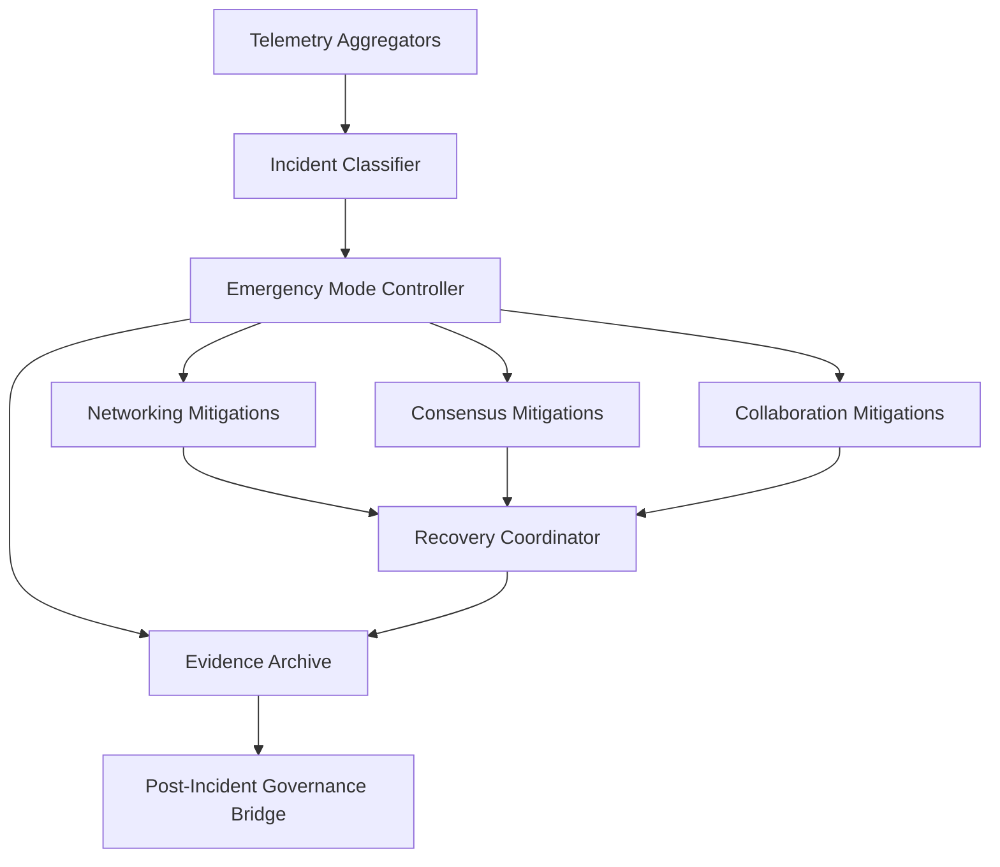
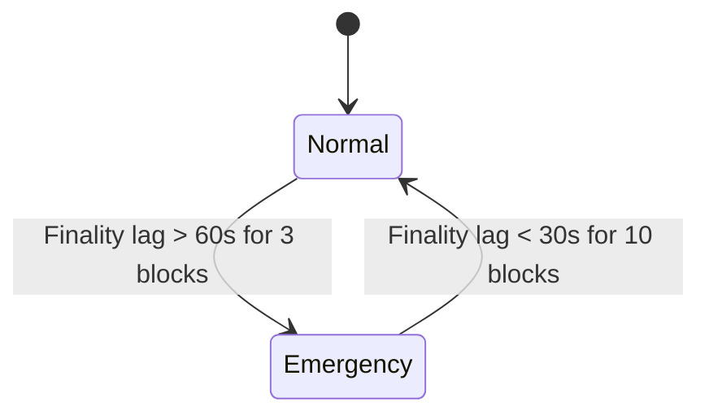

# 1. Title
- Hyperfluid Decentralized Incident Response and Recovery: Detection, Emergency Modes, and Deterministic Network Healing

# 2. Executive Summary
- This document defines incident response without centralized operators.
- Incidents include stalls, floods, bad upgrades, relay concentration failures, and governance determinism faults.
- Detection is metric-driven and evidence-signed, not authority-driven.
- Emergency mode transitions are deterministic and reversible with hysteresis.
- Recovery is sequenced to preserve safety first, then liveness, then throughput.
- Incident actions are scoped and certificate-bound to avoid abuse during crises.
- Post-incident governance receives immutable evidence bundles for root-cause decisions.
- The key design insight is treating incident handling as a protocol state machine, not an ad hoc ops playbook.

# 3. System Overview
- Problem solved:
  - Distributed failures require coordinated mitigation without a trusted central responder.
  - Delayed or inconsistent mitigation can cascade into consensus and collaboration collapse.
- Core design philosophy:
  - Detect by shared telemetry and signed evidence.
  - Trigger bounded emergency controls automatically.
  - Recover deterministically with explicit exit criteria.
- Key constraints:
  - Partial partitions and inconsistent views.
  - Adversarial false-alarm attempts.
  - Need to maintain critical control lanes during attack.

# 4. Architecture (CRITICAL SECTION)
- Components:
  - **Telemetry Aggregators**: collect local metrics and produce signed summaries.
  - **Incident Classifier**: maps evidence to incident classes/severity.
  - **Emergency Mode Controller**: applies deterministic mode transitions and policy multipliers.
  - **Mitigation Executors**: enforce mode-specific controls in networking/consensus/collaboration layers.
  - **Recovery Coordinator**: orchestrates staged restoration.
  - **Evidence Archive**: stores incident timelines, proofs, and actions.
  - **Post-Incident Governance Bridge**: feeds evidence into governance for parameter or code updates.



- Component responsibilities:
  - Incident Classifier:
    - Requires threshold breach plus persistence window.
    - Rejects single-source unverifiable alarms.
  - Emergency Mode Controller:
    - Applies mode multipliers and lane reservations.
    - Enforces cooldown and hysteresis to prevent oscillation.
  - Recovery Coordinator:
    - Validates metrics over recovery window before mode downgrade.
    - Replays deferred low-priority operations safely.

- Step-by-step data flow:
  1. Nodes publish signed telemetry summaries each epoch/window.
  2. Classifier aggregates and evaluates class thresholds.
  3. Mode controller transitions if deterministic trigger conditions are met.
  4. Mitigation executors apply controls by layer.
  5. Recovery coordinator monitors stabilization conditions.
  6. Evidence archive finalizes timeline and exports postmortem bundle.

# 5. Core Mechanisms
- **Incident classes**
  - `consensus_stall`: finality lag or commit failure.
  - `flood_attack`: reject ratio/queue depth spikes.
  - `bad_upgrade`: deterministic precheck mismatch or split validation.
  - `relay_concentration`: route dependence exceeds concentration ceiling.
  - `artifact_unavailability`: governance/review artifacts below minimum availability.

- **Trigger logic (deterministic)**
  - Trigger requires:
    - metric breach,
    - persistence across N windows,
    - minimum independent reporter count,
    - signed evidence validity.
  - Example:
    - `consensus_stall` if `finality_p95 > SLO` for 3 windows and >= M independent reporters.

- **Emergency mode (binary: Normal / Emergency)**
  - `Normal`: Baseline parameters (standard PoW, quotas, lane allocation).
  - `Emergency`: Fixed safe-mode parameters:
    - PoW difficulty increased by fixed multiplier (e.g., 3x),
    - Unknown-sender budgets reduced by fixed factor (e.g., 50%),
    - Evidence and control lanes reserved (guaranteed capacity),
    - Low-trust fast-path actions temporarily frozen,
    - Emergency fee floor enabled (if configured).
  - Removed: `Elevated` intermediate mode.

- **Simple triggers (explicit metrics)**
  - Enter Emergency if: `finality_lag > 60 seconds` for 3 consecutive blocks.
  - Exit Emergency if: `finality_lag < 30 seconds` for 10 consecutive blocks.
  - Removed: Composite "breach score" (hard to compute and reason about).
  - Removed: Asymmetric thresholds and hysteresis windows.
  - Removed: Minimum dwell times and cooldown timers.

- **Recovery sequencing**
  1. Stabilize consensus/control lanes (in Emergency).
  2. Monitor metrics; exit Emergency when conditions met.
  3. Resume normal operations.

- **Abuse resistance for incident controls**
  - Emergency triggers require signed evidence from multiple independent validators.
  - False-alarm reporters can be penalized after adjudication.



## Pseudocode (for complex mechanisms)
```text
function classify_incident(window_metrics, evidence_set):
    require evidence_quorum(evidence_set)
    if breach(window_metrics.finality_p95, FINALITY_SLO, windows=3):
        return CONSENSUS_STALL
    if breach(window_metrics.reject_ratio, REJECT_SLO, windows=3):
        return FLOOD_ATTACK
    if governance_determinism_mismatch(evidence_set):
        return BAD_UPGRADE
    if relay_concentration(window_metrics) > RELAY_HHI_MAX:
        return RELAY_CONCENTRATION
    return NONE

function apply_mode(mode, state):
    if mode == NORMAL:
        state.pow_multiplier = BASELINE_POW
        state.unknown_sender_budget = BASELINE_BUDGET
        state.lane_allocation = BASELINE_LANES
    if mode == EMERGENCY:
        state.pow_multiplier = EMERGENCY_POW  # e.g., 3x
        state.unknown_sender_budget = EMERGENCY_BUDGET  # e.g., 50% of baseline
        state.lane_allocation = RESERVE_CONTROL_LANES
        freeze_low_trust_fastpath(state)
        enable_emergency_fee_floor(state)

function maybe_downgrade_mode(mode, metrics):
    # Binary mode: only NORMAL -> EMERGENCY or EMERGENCY -> NORMAL
    if mode == EMERGENCY and finality_lag(metrics) < RECOVERY_THRESHOLD:
        return NORMAL
    if mode == NORMAL and finality_lag(metrics) > EMERGENCY_THRESHOLD:
        return EMERGENCY
    return mode

function transition_allowed(prev_mode, next_mode, metrics, evidence_quorum):
    # Simplified: just check evidence quorum for transitions
    if not evidence_quorum:
        return false
    # No dwell times or cooldowns - direct transition based on metrics
    return true
```

# 6. Design Decisions & Tradeoffs
## Tradeoff 1
- Option A: Human/manual incident declaration.
- Option B: deterministic metric + evidence triggered incident state machine.
- Chosen: Option B.
- Why chosen: removes central bottleneck and supports autonomous recovery.
- Sacrifice: requires robust telemetry integrity and threshold tuning.
- Scaling risk: mis-tuned thresholds can trigger unnecessary emergency mode.

## Tradeoff 2
- Option A: Single emergency mode.
- Option B: multi-level (`Normal`, `Elevated`, `Emergency`) modes.
- Chosen: Option B.
- Why chosen: enables proportional response and smoother recovery.
- Sacrifice: increased policy complexity.
- Scaling risk: mode-transition bugs can create oscillation under noisy metrics.

## Tradeoff 3
- Option A: Immediate full rollback on bad-upgrade suspicion.
- Option B: deterministic precheck reject + bounded emergency restrictions.
- Chosen: Option B.
- Why chosen: avoids overreaction and unnecessary global disruption.
- Sacrifice: potentially slower hard rollback for truly catastrophic upgrades.
- Scaling risk: delayed strong response can extend damage window if detection lags.

## Tradeoff 4
- Option A: Keep all traffic classes active during incident.
- Option B: prioritize control/evidence lanes and throttle low-value traffic.
- Chosen: Option B.
- Why chosen: preserves safety/liveness-critical operations during stress.
- Sacrifice: temporary collaboration throughput degradation.
- Scaling risk: prolonged throttling can create backlog shock after recovery.

# 7. Failure Modes & Edge Cases
## Scenario: False positive emergency trigger
- What happens: network enters elevated restrictions without real attack.
- Why it happens: telemetry noise or temporary burst conditions.
- Handling/failure mode: persistence windows, independent reporter quorum, and hysteresis reduce flapping.

## Scenario: Telemetry partition disagreement
- What happens: different partitions infer different incident states.
- Why it happens: partial connectivity and delayed evidence propagation.
- Handling/failure mode: local conservative controls plus deterministic convergence after partition heal.

## Scenario: Malicious false-alarm campaign
- What happens: adversaries submit fabricated incident evidence to force throttling.
- Why it happens: incident controls are high leverage.
- Handling/failure mode: signature verification, reporter quorum, and post-incident penalties for false reporters.

## Scenario: Emergency mode lock-in
- What happens: network cannot exit emergency despite recovery.
- Why it happens: missing downgrade criteria or stale metrics.
- Handling/failure mode: explicit recovery windows, bounded emergency duration, and forced re-evaluation epochs.

## Scenario: Recovery traffic surge
- What happens: deferred workloads flood system when restrictions lift.
- Why it happens: backlog accumulation.
- Handling/failure mode: staged ramp-up and temporary post-incident quotas.

# 8. Scalability Analysis
## Small scale (10–100 nodes)
- Incident detection can run with modest quorum requirements.
- Main risk is sparse reporters causing weak signal quality.
- Recovery is fast but sensitive to single-node variance.

## Medium scale (1k–10k nodes)
- Need distributed telemetry aggregation and evidence indexing.
- Multi-layer mitigations become essential to avoid cascades.
- Recovery sequencing must be automated to avoid operator bottlenecks.

## Large scale (100k+ nodes)
- Requires hierarchical telemetry summaries and region-aware incident controls.
- Evidence archive/query workloads become significant.
- Hard constraint: incident transitions must remain deterministic under partial observability.

# 9. Recommended Architecture
- Use a deterministic incident state machine with signed telemetry and evidence quorum.
- Apply layered mitigations by severity level and preserve critical control/evidence lanes.
- Sequence recovery with explicit stabilization windows and staged ramp-up.
- Reject:
  - centralized manual-only incident declaration,
  - binary on/off emergency mode,
  - unrestricted traffic during severe incidents.
- This architecture is optimal because it keeps decentralized operations safe and live under adversarial conditions.

# 10. Implementation Plan
1. Define incident classes, metric schemas, and evidence formats.
2. Implement signed telemetry summaries and quorum validation.
3. Implement mode controller with persistence/hysteresis rules.
4. Implement layer-specific mitigation executors.
5. Implement recovery coordinator with staged re-enable flow.
6. Implement evidence archive and post-incident governance export.
7. Run drills for stall/flood/bad-upgrade scenarios and tune thresholds.
8. Add anti-oscillation verification matrix:
   - noisy-threshold test (should not flap),
   - burst-recovery-reburst test (cooldown respected),
   - partitioned telemetry test (no unsafe downgrade),
   - multiplier-step bound test (`<=20%` window delta),
   - dwell-time gate test (no early exit),
   - deterministic replay test (identical transitions from same evidence stream).

# 11. Future Improvements
- Add formal verification for mode transition safety/liveness.
- Add adaptive thresholding with bounded auto-tuning.
- Add region-aware incident containment policies.
- Add decentralized incident simulation network for pre-release stress testing.

