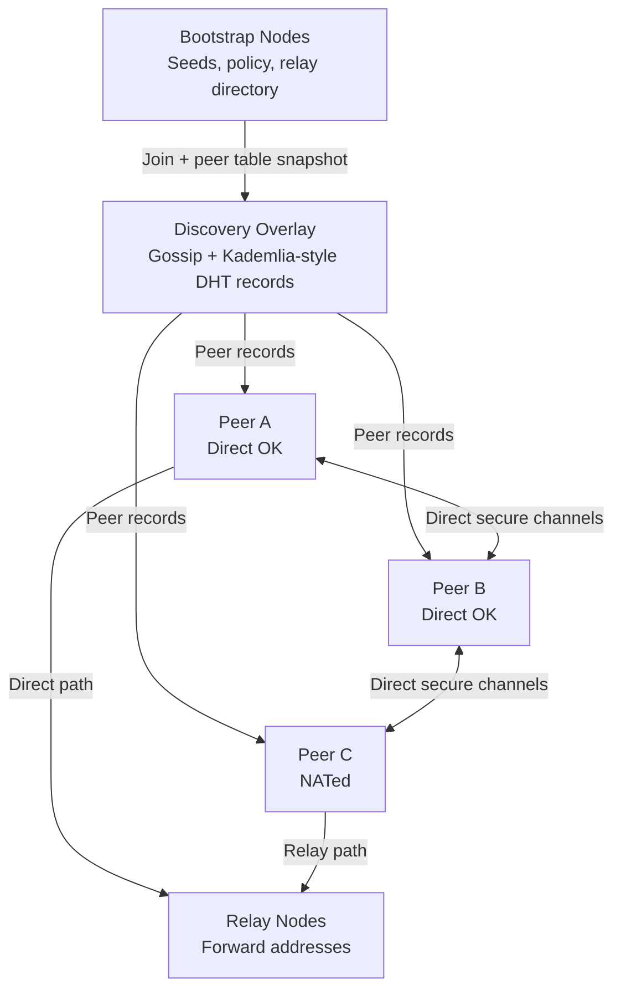

# 1. Title
- Direct-First Decentralised Ockam Network Architecture for Massive-Scale Secure Peer Connectivity

# 2. Executive Summary
- This document defines a production-grade Ockam-based decentralised network where peers prefer direct IP connectivity and use relays only as a fallback.
- The architecture uses Ockam Nodes, Workers, Routing (`onward_route`/`return_route`), Secure Channels, Identities, and Relays as composable primitives.
- Direct transport paths are always attempted first because they minimize latency, relay load, and operational cost.
- Relay paths are created only when NAT/firewall constraints block direct transport establishment.
- Relay-connected peers continuously run upgrade probes to migrate active sessions to direct channels when reachability changes.
- Peer discovery combines bootstrap seeds, gossip, and a Kademlia-style DHT to scale from small clusters to internet-scale overlays.
- End-to-end confidentiality, integrity, and mutual authentication are preserved regardless of hop count by placing Secure Channels above routing/transports.
- Sybil resistance is implemented using identity-bound admission policies, credentials, rate controls, and stake/reputation-aware peer scoring.
- The resulting topology is a hybrid mesh: direct edges dominate healthy regions, relay edges preserve liveness under hostile network boundaries.
- The key design insight is strict transport hierarchy: **direct first, relay fallback, continuous upgrade**, enforced by explicit connection-state machinery.

# 3. System Overview
- The system solves a common decentralised-networking problem: peers need private, authenticated, end-to-end encrypted connectivity across heterogeneous networks where many nodes cannot accept inbound traffic.
- Ockam is suitable because it separates application-layer security and routing from underlying transport sessions, allowing secure multi-hop communication across arbitrary topology changes.
- Core design philosophy:
  - Preserve end-to-end trust semantics independent of transport path.
  - Optimize for direct 1-hop communication when technically reachable.
  - Treat relays as constrained shared infrastructure, not the default data plane.
  - Keep control-plane discovery decentralised while keeping trust admission explicit.
- Key constraints:
  - Large percentages of peers may be behind NAT/firewalls.
  - Public IP/port knowledge can be stale and adversarially manipulated.
  - Relay capacity is finite and becomes a bottleneck under fan-in.
  - Identity verification and authorization must stay cheap enough for high churn.

# 4. Architecture (CRITICAL SECTION)
- Components:
  - **Peer Node**: standard participant; publishes capabilities, discovers peers, establishes secure channels, routes app messages.
  - **Relay Node**: publicly reachable Ockam node offering forwarding addresses for relay-required peers.
  - **Bootstrap Node**: low-churn discovery entrypoint returning initial peer set, relay set, and policy metadata.
  - **Discovery Overlay**: gossip + Kademlia-style DHT for peer records, relay advertisements, and reachability updates.
  - **Trust Plane**: identity verification, credential checks, authorization policy evaluation.
  - **Connection Manager**: finite-state controller implementing direct-first/fallback/upgrade lifecycle.

## Architecture Diagram



## Component Responsibilities
- Peer Node:
  - Maintains Ockam identity/vault material and secure-channel listeners.
  - Stores peer records (`identifier`, endpoints, relay hints, trust attributes, last-seen).
  - Runs direct-connect probes and relay fallback logic.
  - Performs route selection and periodic route re-evaluation.
- Relay Node:
  - Exposes stable public listener(s) and relay service.
  - Maps relay addresses to live reverse paths from private peers.
  - Enforces per-identity quotas and admission controls.
- Bootstrap Node:
  - Returns signed seed peer list, relay list, and minimum trust policy.
  - Does not become mandatory after network join.
- Discovery Overlay:
  - Gossip disseminates freshness-critical events (new endpoint, relay loss, credential revocation).
  - DHT stores indexable long-lived records for scalable peer lookup.
- Trust Plane:
  - Verifies identifier ownership and credential claims.
  - Rejects unauthorized peers before app-level exposure.
- Connection Manager:
  - Implements peer classification:
    - **Directly reachable**: direct secure channel available or probe successful.
    - **Relay-required**: direct probes failed and relay route currently healthy.

## Step-by-Step Data Flow
1. New peer joins via bootstrap and receives seed peers, relay candidates, trust anchors.
2. Peer announces identity + reachable endpoints (if any) into gossip/DHT with signed metadata.
3. On demand to contact target peer, initiator attempts direct route using known public endpoint.
4. If direct transport and secure-channel handshake succeed, traffic uses direct 1-hop route.
5. If direct attempt fails (timeout/refused/unreachable), initiator obtains target relay route and creates relay-backed secure channel.
6. While relay channel is active, both peers schedule low-rate direct re-probes.
7. On successful direct probe, peers establish a new direct secure channel, drain in-flight traffic, then retire relay path.

# 5. Core Mechanisms
- Ockam internals mapped to decentralised operation:
  - **Nodes/Workers**: each node hosts workers for discovery, routing, relay control, and app protocols.
  - **Routing**: messages carry `onward_route` and `return_route`; multi-hop forwarding is explicit and transport-agnostic.
  - **Secure Channels**: mutual authentication + encrypted transport over any route, including relay/multi-hop.
  - **Relays**: private peers create outbound links to relay nodes and receive forwarding addresses without exposing inbound ports.
  - **Identity**: cryptographic identifiers and credentials anchor trust/authorization decisions.
- Direct vs relay path selection mechanism:
  - Use endpoint confidence scoring (freshness, historical success, RTT, packet loss).
  - Attempt direct path first for scores above threshold.
  - Enter relay mode only after bounded retry budget and classified direct failure.
- NAT traversal strategy:
  - Ockam relay path is guaranteed fallback for hard NAT/firewall cases.
  - Minimize relay dwell time via periodic direct probes and opportunistic endpoint refresh from gossip.
  - Use geographically distributed relay pools and deterministic peer-to-relay mapping to avoid hot spots.
- Discovery mechanism (hybrid, recommended):
  - Bootstrap for initial liveness.
  - Gossip for fast anti-entropy and reachability updates.
  - DHT for scalable targeted lookup by peer identifier.
- Routing strategies:
  - **Direct**: 1-hop route (`tcp_connection -> secure_channel_listener`).
  - **Relay**: multi-hop route (`tcp_connection -> relay_forwarder -> target_listener`).
  - **Broadcast/Gossip**: bounded fanout, message IDs, TTL, and duplicate suppression.
    - Fanout limit: `max 8 peers` per gossip round (values chosen for 100k+ node scalability target with <1% amplification factor)
    - Message TTL: `max 16 hops`
    - Duplicate suppression: Bloom filter with `100,000 entries`, `1% false positive rate`
    - Gossip budget per sender: `max 100 messages per minute`
- Discovery specifics:
  - **Bootstrap nodes**: Dynamic bootstrap set, no hard minimum. Any validator or long-running node can serve as bootstrap.
    - New nodes discover bootstrap endpoints through:
      - Embedded seed list in client binary (small, ~10-20 well-known nodes)
      - Community-maintained bootstrap registry
      - DNS TXT records for bootstrap discovery
    - No central bootstrap authority - fully decentralized.
  - **DHT Kademlia buckets**:
    - `k = 20` contacts per bucket
    - Bucket diversity requirement: `min 3 different ASNs` per bucket
    - Key format: `SHA3-256(identity_pubkey)`
    - Refresh interval: `every 30 minutes` for stale buckets
  - **NAT traversal**:
    - STUN servers: `min 3` geographically distributed
    - ICE candidate gathering timeout: `5 seconds`
    - Direct probe interval: `every 60 seconds` with `±20% jitter`
  - **Relay model**: Every node is a relay by default. Only nodes behind strict NAT/firewall use relay paths.
    - No special relay rewards - relaying is standard peer behavior.
    - Relay capacity proportional to stake (staked nodes expected to provide more relay bandwidth).
    - Nodes can opt-out of relaying if bandwidth-constrained.
- Swarm-resistant ingress controls:
  - Stage 0 pre-auth gate: per-IP/per-ASN handshake budgets and SYN/handshake concurrency caps.
  - Stage 1 identity gate: per-identity connection caps and join-rate token buckets.
  - Stage 2 gossip gate: per-topic/per-peer gossip budgets with strict duplicate suppression windows.
  - Relay service admission: stake/credential-weighted relay priority with hard unknown-sender quotas.
  - Automatic ban decay: temporary blocks for abuse spikes, with gradual recovery after clean behavior.
- Why this works:
  - Security is route-independent because secure channels are end-to-end above transport hops.
  - Liveness is topology-independent because relays preserve reachability when direct edges disappear.
  - Efficiency converges toward direct paths via continuous upgrade attempts.

## Pseudocode (for complex mechanisms)
```text
state PeerConnState = {UNKNOWN, DIRECT_PROBING, DIRECT_ACTIVE, RELAY_ACTIVE, UPGRADING}

function connect_to_peer(target_id):
    rec = discovery_lookup(target_id)
    if rec.direct_endpoints not empty:
        set_state(target_id, DIRECT_PROBING)
        if try_direct_secure_channel(rec.direct_endpoints):
            set_state(target_id, DIRECT_ACTIVE)
            return direct_channel

    relay_route = resolve_relay_route(rec)
    if relay_route is None:
        raise UnreachablePeer

    relay_channel = create_secure_channel(relay_route)
    set_state(target_id, RELAY_ACTIVE)
    schedule_upgrade_probe(target_id)
    return relay_channel

function schedule_upgrade_probe(target_id):
    every upgrade_interval with jitter:
        if state(target_id) == RELAY_ACTIVE:
            set_state(target_id, UPGRADING)
            rec = discovery_lookup(target_id)
            if try_direct_secure_channel(rec.direct_endpoints):
                switch_traffic_to_direct(target_id)
                close_relay_channel(target_id)
                set_state(target_id, DIRECT_ACTIVE)
            else:
                set_state(target_id, RELAY_ACTIVE)

function ingress_guard(peer):
    if over_ip_or_asn_budget(peer.network_fingerprint):
        return REJECT
    if over_identity_connection_cap(peer.identifier):
        return REJECT
    if over_join_rate(peer.identifier):
        return THROTTLE
    return ACCEPT
```

# 6. Design Decisions & Tradeoffs
## Tradeoff 1
- Option A: Relay-first default routing for predictable reachability.
- Option B: Direct-first routing with relay fallback.
- Chosen: **Option B**.
- Why chosen: lower median latency, lower relay bandwidth cost, better horizontal scalability because relay load is reserved for constrained peers.
- Sacrifice: slower first-message success in some NAT-heavy environments due to failed direct probe attempt.
- Scaling risk: aggressive direct probing at massive scale can create connection storms without adaptive backoff.

## Tradeoff 2
- Option A: Pure gossip discovery.
- Option B: Hybrid bootstrap + gossip + Kademlia-style DHT.
- Chosen: **Option B**.
- Why chosen: gossip alone is fast but expensive at scale; DHT gives efficient targeted lookup; bootstrap prevents cold-start partitioning.
- Sacrifice: higher implementation complexity and more control-plane states to maintain.
- Scaling risk: DHT churn and eclipse attacks degrade lookup quality unless bucket diversity and signature validation are enforced.

## Tradeoff 3
- Option A: Single global relay cluster.
- Option B: Distributed relay federation with deterministic peer assignment and overflow migration.
- Chosen: **Option B**.
- Why chosen: reduces regional bottlenecks, limits blast radius, improves locality and failure isolation.
- Sacrifice: harder relay health orchestration and placement logic.
- Scaling risk: poor assignment heuristics can still create uneven hotspots under skewed geography.

## Tradeoff 4
- Option A: Trust-on-first-use identity acceptance.
- Option B: Credential-gated admission with policy checks.
- Chosen: **Option B**.
- Why chosen: stronger Sybil resistance and clearer authorization semantics for production.
- Sacrifice: onboarding friction and operational PKI/issuer lifecycle management.
- Scaling risk: issuer outages or revocation propagation lag can temporarily block legitimate peers.

# 7. Failure Modes & Edge Cases
## Scenario: Network partitions
- What happens: overlay splits; some peers cannot resolve fresh endpoints or relays in other partition.
- Why it happens: routing outages, BGP events, regional cloud failures.
- Handling/failure mode: continue local partition operation with cached peer/relay sets; on heal, reconcile DHT versions and replay gossip deltas.

## Scenario: Node churn
- What happens: frequent join/leave invalidates discovery entries and relay mappings.
- Why it happens: mobile/edge devices, autoscaling, spot interruptions.
- Handling/failure mode: signed short-TTL endpoint records, heartbeat-based liveness decay, and lazy cleanup of stale relay forwards.

## Scenario: Latency spikes
- What happens: RTT inflation triggers handshake timeouts and false relay fallback.
- Why it happens: congestion, relay overload, long-tail queueing.
- Handling/failure mode: percentile-aware timeout tuning, hysteresis before path switching, and jittered retry windows.

## Scenario: Security attacks
- What happens: Sybil flooding, relay abuse, bogus endpoint advertisements, replay attempts.
- Why it happens: low identity creation cost and open participation assumptions.
- Handling/failure mode: credential requirements, per-identifier rate limits, signed discovery records, nonce-based replay protection, and peer reputation penalties.

## Scenario: Partial system failures
- What happens: subset of relays or bootstrap nodes fail while peers remain online.
- Why it happens: software bugs, rolling deploy mistakes, regional outages.
- Handling/failure mode: multi-bootstrap lists, N-way relay candidates per peer, fast failover route recomputation, and direct-path preference to reduce dependence.

## Scenario: Malicious join swarm
- What happens: huge number of fake peers attempt handshake and discovery enrollment.
- Why it happens: low-cost identity creation and open edge exposure.
- Handling/failure mode: pre-auth handshake budgets, per-ASN limits, staged admission, and temporary abuse quarantine.

## Scenario: Relay queue flooding
- What happens: relays saturate with low-value traffic, dropping legitimate coordination.
- Why it happens: no strict service classes or sender quotas.
- Handling/failure mode: relay service classes, reserved control-plane capacity, sender-rate ceilings, and priority for credentialed/staked identities.

# 8. Scalability Analysis
## Small scale (10–100 nodes)
- Expected behavior:
  - Near-mesh direct connectivity likely for publicly reachable nodes.
  - Simple gossip is sufficient; DHT maintenance overhead is low.
- Bottlenecks:
  - Minimal; mostly handshake bursts during startup.
- Resource limits:
  - CPU dominated by secure-channel handshakes, not steady-state forwarding.

## Medium scale (1k–10k nodes)
- Expected behavior:
  - Direct connections remain dominant among reachable nodes.
  - Relay usage rises for mobile/NAT segments.
- Bottlenecks:
  - Peer table growth, connection fanout caps, relay hot regions.
- Communication overhead:
  - Gossip requires fanout control and topic partitioning; DHT lookup amplification appears under churn.

## Large scale (100k+ nodes)
- Expected behavior:
  - Sparse practical overlays; each peer keeps bounded active neighbor set.
  - Discovery becomes multi-tiered (regional bootstrap + sharded DHT + scoped gossip).
- Critical bottlenecks:
  - Relay ingress bandwidth, identity/credential verification throughput, global revocation dissemination.
- Relay/routing load:
  - Relay traffic must be budgeted to NATed minority; if relay ratio grows, costs rise superlinearly.
- Hard constraints:
  - Connection limits per node/OS, memory footprint of peer metadata, and cryptographic handshake CPU during churn spikes.

# 9. Recommended Architecture
- Final architecture choice:
  - **Hybrid decentralised Ockam overlay with strict direct-first routing, relay fallback, and continuous relay-to-direct upgrades.**
- Why optimal:
  - Preserves Ockam’s end-to-end authenticated encryption across any topology while minimizing dependence on relays.
  - Provides robust liveness in hostile network boundaries without sacrificing normal-case latency and cost efficiency.
- Rejected alternatives:
  - Relay-primary mesh (too expensive and relay-bound).
  - Pure direct mesh (unreliable under NAT/firewall prevalence).
  - Centralized discovery-only control plane (single trust and availability bottleneck).
- Clear technical justification:
  - This architecture aligns with Ockam’s routing model (`onward_route`/`return_route`), secure-channel abstraction over multi-hop transports, and relay capabilities for NAT traversal, while introducing explicit control-loop logic for path optimization at scale.

# 10. Implementation Plan
1. **Technologies to use**
   - Rust Ockam libraries (`ockam`, `ockam_node`, `ockam_transport_tcp`, identity/secure channel modules), persistent peer store (RocksDB/SQLite), metrics stack (Prometheus/OpenTelemetry).
2. **Components to build first**
   - Implement peer node runtime (identity, secure-channel listener, connection manager state machine).
   - Add bootstrap service and signed seed distribution.
   - Add discovery layer: gossip transport + Kademlia-style DHT records.
   - Add relay node service with per-identity quotas and health telemetry.
3. **Deployment strategy**
   - Phase 1: local 3-node lab (direct + relay fallback + upgrade).
   - Phase 2: multi-region relay federation and bootstrap redundancy.
   - Phase 3: progressive rollout with canary peer cohorts and policy hardening.
4. **Testing strategy**
   - Local deterministic testbed with containerized peers and traffic replay.
   - Scenario tests: direct reachable, symmetric NAT, strict firewall, relay outage, bootstrap loss, churn burst.
    - Security tests: unauthorized identity rejection, credential revocation propagation, replay resistance, route tampering rejection.
    - Swarm tests: fake-peer join flood, relay queue flood, gossip amplification attempts, and budget-eviction correctness.
    - Performance tests: handshake throughput, relay bandwidth saturation, discovery convergence time.
5. **Scaling strategy**
   - Cap per-peer active connections; use adaptive neighbor selection.
   - Regionalize relays and bootstrap nodes; shard DHT keyspace.
   - Introduce adaptive direct-probe rate control based on global load signals.
   - Maintain SLOs: direct-path ratio, relay dwell time, median handshake latency, and failed-upgrade rate.

# 11. Future Improvements
- Add QUIC/WebTransport transports to improve NAT friendliness and mobile resilience.
- Add relay marketplace-style incentive model for decentralized third-party relay capacity.
- Introduce privacy-preserving discovery (encrypted DHT values, blinded endpoint advertisements).
- Add formal verification for connection-manager state machine safety/liveness.
- Add multi-credential trust domains for federated governance across organizations.
- Add ML-assisted relay assignment and congestion prediction for proactive rebalancing.
