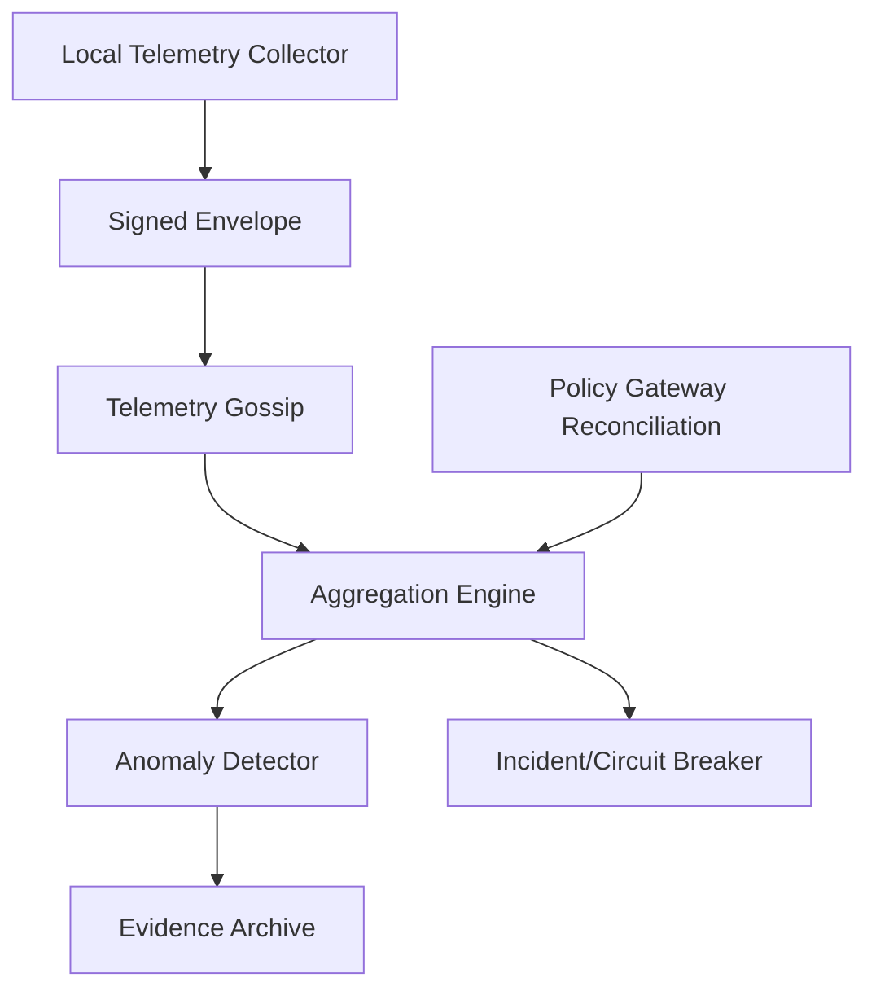
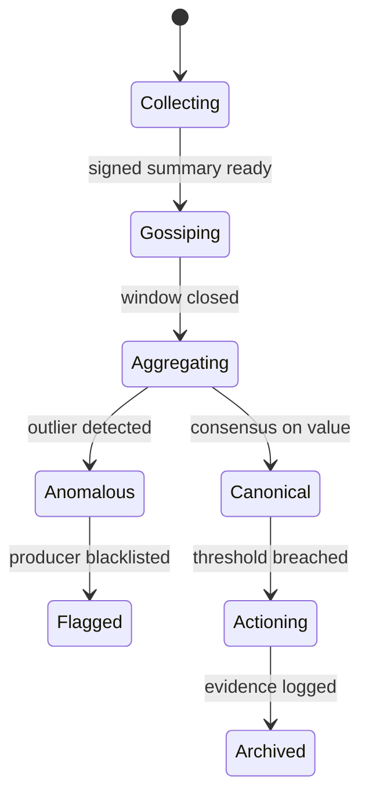

# 1. Title
- Hyperfluid Telemetry Threat Model: Compromised Metrics, Manipulated Signals, and Adversarial Detection

# 2. Executive Summary
- Telemetry is the nervous system of Hyperfluid: it drives incident response, economic tuning, reputation scoring, and circuit-breaker decisions.
- If telemetry is compromised, attackers can induce false emergency modes, hide real attacks, or manipulate reward distributions.
- This document identifies threat actors, attack vectors, and mitigation strategies for the telemetry pipeline.
- Key threats: false incident triggers, suppressed attack indicators, metric gaming, and telemetry partition attacks.
- Defense relies on signed multi-source evidence, quorum-based aggregation, and deterministic trigger logic that does not depend on a single reporter.
- The threat model must be updated continuously as new telemetry sources are added.
- The key insight is that telemetry integrity is a consensus-adjacent problem: it cannot be trusted if it comes from a single point of failure.

# 3. System Overview
- Problem solved:
  - Incident response, circuit breakers, and economic tuning all assume honest telemetry.
  - Red-team evaluations and agent security metrics depend on uncorrupted measurement pathways.
- Core design philosophy:
  - Distrust single-source telemetry; require corroboration.
  - Treat telemetry as evidence, not truth.
  - Make telemetry tampering detectable and attributable.
- Key constraints:
  - High telemetry volume from thousands of agents.
  - Partial network partitions create inconsistent views.
  - Adversaries may control subsets of nodes and attempt to spoof metrics.

# 4. Architecture (CRITICAL SECTION)
- Components:
  - **Local Telemetry Collector**: per-node metric collection (latency, queue depth, burn rate, finality lag).
  - **Signed Telemetry Envelope**: cryptographically binds metrics to producer identity and timestamp.
  - **Telemetry Gossip Layer**: disseminates signed summaries to peers for cross-validation.
  - **Aggregation Engine**: combines multi-source metrics into canonical values.
  - **Anomaly Detector**: flags statistically implausible or contradictory telemetry.
  - **Evidence Archive**: immutable append-only log of raw telemetry for post-incident forensics.
  - **Policy Gateway Reconciliation**: cross-checks local telemetry against independently observed network events.



- Component responsibilities:
  - Local Telemetry Collector:
    - Samples metrics at deterministic intervals (not event-driven to prevent manipulation).
    - Produces raw metric tuples with monotonic sequence numbers.
  - Signed Telemetry Envelope:
    - Signs `(producer_id, metric_type, value, height, seq_no)` with producer's ML-DSA key.
    - Prevents retroactive metric fabrication.
  - Aggregation Engine:
    - Computes median/trimmed-mean across reporters for each metric class.
    - Rejects outlier reporters that deviate beyond statistical threshold.

- Step-by-step data flow:
  1. Each node collects local metrics and signs them.
  2. Signed summaries are gossiped to peers in the same epoch.
  3. Aggregation engine collects metrics from N independent validators.
  4. Anomaly detector flags contradictory or outlier submissions.
  5. If threshold conditions are met, incident classifier triggers mode transitions.
  6. All raw telemetry is archived for post-incident governance review.

# 5. Core Mechanisms
- **Threat actor taxonomy**
  - `metric_spoofer`: submits fabricated metrics to trigger false incident modes.
  - `suppressor`: controls compromised nodes and suppresses real attack indicators.
  - `partition_attacker`: creates network splits to prevent telemetry aggregation.
  - `gaming_agent`: optimizes reported metrics without improving actual behavior.
  - `relay_manipulator`: interferes with gossip paths to delay or corrupt telemetry.

- **Signed telemetry schema**
  - Fields:
    - `producer_id`: validator/agent identity
    - `metric_class`: finality_lag | reject_ratio | queue_depth | burn_rate | relay_hhi
    - `value`: numeric reading
    - `height`: block height at measurement
    - `seq_no`: monotonic sequence per producer per metric_class
    - `signature`: ML-DSA signature over canonical serialization of above fields
  - Sequence numbers prevent replay attacks.
  - Height binding prevents pre-computation.

- **Aggregation rules**
  - Require minimum `M` independent reporters for each metric class (e.g., `M = max(5, committee_size / 10)`).
  - Use median for latency/finality metrics; trimmed mean for ratio metrics.
  - Discard top and bottom `k%` before aggregation (e.g., `k = 10`).
  - Flag producers whose metrics exceed `z` standard deviations from aggregate.

- **Anomaly detection**
  - Contradiction: two subsets of validators report diametrically opposed metric trends.
  - Spike: single producer reports 10x deviation from rolling median.
  - Suppression: a producer that was previously active stops reporting during an incident window.
  - Pattern: metric values form suspiciously regular sequences (indicating scripted spoofing).

- **Mitigation strategies**
  - **Multi-source corroboration**: never act on single-source telemetry.
  - **Reporter reputation**: producers with history of anomalous reports receive lower weight.
  - **Independent observation**: policy gateway reconciles observed network events (tx receipts, block commits) against reported metrics.
  - **Temporal binding**: metrics bound to specific heights prevent retroactive fabrication.
  - **Outlier suppression**: trimmed-mean aggregation is robust to bounded spoofing.



## Pseudocode (for complex mechanisms)
```text
function aggregate_metric(class, reports, min_reporters=5):
    require len(reports) >= min_reporters
    sorted_values = sort([r.value for r in reports])
    trimmed = remove_outliers(sorted_values, lower_pct=0.10, upper_pct=0.10)
    aggregate = median(trimmed)

    for r in reports:
        if abs(r.value - aggregate) > z_threshold(trimmed):
            flag_anomaly(r.producer_id, class, r.value, aggregate)

    return aggregate

function validate_telemetry_envelope(env):
    require verify_mldsa(env.producer_id, env.signature, canonical_bytes(env))
    require env.seq_no > last_seq_no(env.producer_id, env.metric_class)
    require env.height <= current_height + 1
    require env.height >= current_height - 10
    return VALID

function detect_suppression(producer_id, metric_class, window):
    expected_reports = expected_count(producer_id, metric_class, window)
    actual_reports = count_received(producer_id, metric_class, window)
    if actual_reports < 0.5 * expected_reports:
        flag_suppression(producer_id, metric_class)
        return SUSPICIOUS
    return OK

function reconcile_with_policy_gateway(metric_class, aggregated_value):
    if metric_class == "finality_lag":
        observed = compute_finality_from_block_headers()
        if abs(observed - aggregated_value) > tolerance:
            flag_reconciliation_failure(metric_class, observed, aggregated_value)
    # similar for other independently observable metrics
```

# 6. Design Decisions & Tradeoffs
## Tradeoff 1
- Option A: Trust locally computed metrics without validation.
- Option B: Require multi-source signed telemetry with aggregation and anomaly detection.
- Chosen: Option B.
- Why chosen: single-source telemetry is trivially gameable in a decentralized network.
- Sacrifice: increased latency for incident detection and higher bandwidth for gossip.
- Scaling risk: aggregation cost grows with validator count; need efficient gossip and approximate methods at scale.

## Tradeoff 2
- Option A: All telemetry is public and transparent.
- Option B: Some telemetry is encrypted or privacy-preserving.
- Chosen: Option A for network metrics; Option B considered for agent-internal metrics.
- Why chosen: network metrics (finality, queue depth) must be verifiable by all; agent-internal metrics may reveal strategy.
- Sacrifice: agent-level telemetry may be limited or delayed.
- Scaling risk: public telemetry creates a large attack surface for analysis and targeting.

## Tradeoff 3
- Option A: Immediate action on threshold breach.
- Option B: Require persistence window + quorum before mode transitions.
- Chosen: Option B.
- Why chosen: prevents false alarms from transient spikes or isolated spoofing.
- Sacrifice: slightly slower incident response.
- Scaling risk: prolonged persistence windows can delay response to genuine fast-moving attacks.

## Tradeoff 4
- Option A: Retain all raw telemetry indefinitely.
- Option B: Compact and prune old telemetry while keeping aggregate signatures.
- Chosen: Option B with governance-artifact retention for incidents.
- Why chosen: unbounded telemetry storage is not sustainable.
- Sacrifice: fine-grained forensics degrade for old non-incident periods.
- Scaling risk: pruning must not remove evidence needed for adjudication.

# 7. Failure Modes & Edge Cases
## Scenario: Coordinated metric spoofing
- What happens: attackers control enough nodes to skew aggregated metrics.
- Why it happens: insufficient minimum-reporter count or weak outlier detection.
- Handling/failure mode: increase minimum reporters, tighten z-thresholds, and weight by historical reporter reliability.

## Scenario: Telemetry partition confusion
- What happens: subnetworks disagree on incident state due to partition.
- Why it happens: partial connectivity prevents full aggregation.
- Handling/failure mode: local conservative controls; deterministic convergence after heal; no premature mode transitions.

## Scenario: Suppression during real attack
- What happens: compromised nodes hide attack indicators from aggregation.
- Why it happens: attacker controls subset of reporters.
- Handling/failure mode: independent observation via policy gateway; expect some honest reporters to survive; use median (not mean) aggregation.

## Scenario: Gaming via metric optimization
- What happens: agent tweaks behavior to optimize reported metrics without improving actual system health.
- Why it happens: rewards or reputation tied to simple telemetry proxies.
- Handling/failure mode: composite metrics that cannot be trivially gamed; cross-validation with outcome quality.

## Scenario: Replay of old telemetry
- What happens: attacker replays valid old signed envelopes to create false trends.
- Why it happens: missing sequence-number or height validation.
- Handling/failure mode: strict seq_no monotonicity and height window enforcement.

# 8. Scalability Analysis
## Small scale (10–100 nodes)
- Full aggregation with exact median is trivial.
- Main risk is sparse reporters causing weak anomaly detection.

## Medium scale (1k–10k nodes)
- Need batched telemetry gossip and approximate streaming aggregation.
- Anomaly detection should be incremental, not full-window recomputation.
- Reporter reputation weighting becomes computationally significant.

## Large scale (100k+ nodes)
- Hierarchical telemetry summaries: regional aggregators report to global layer.
- Hard constraint: aggregation must remain robust even if large fractions of nodes are Byzantine.
- Telemetry archive/query requires content-addressed storage with class-based retention.

# 9. Recommended Architecture
- Use signed, sequenced, height-bound telemetry envelopes gossiped to peers.
- Aggregate with trimmed-mean or median requiring minimum independent reporters.
- Anomaly detection flags outliers, suppressors, and contradictions.
- Reconcile aggregated telemetry against independently observable network events.
- Archive raw telemetry for post-incident governance with class-based pruning.
- Reject:
  - single-source telemetry triggers,
  - unsigned or unsequenced metrics,
  - immediate action without persistence/quorum validation.
- This architecture is optimal because it makes telemetry tampering detectable, attributable, and bounded in impact.

# 10. Implementation Plan
1. Define telemetry schema, metric classes, and signed envelope format.
2. Implement local telemetry collector with deterministic sampling intervals.
3. Implement signed envelope generation and verification.
4. Implement gossip dissemination with duplicate suppression.
5. Implement aggregation engine with outlier trimming and minimum reporter enforcement.
6. Implement anomaly detector for spoofing, suppression, and contradiction.
7. Implement policy gateway reconciliation for independently observable metrics.
8. Implement evidence archive with class-based retention and governance export.
9. Run red-team drills: coordinated spoofing, suppression, partition, and replay attacks.

# 11. Future Improvements
- Add threshold signatures for compact multi-producer telemetry certificates.
- Add zk-based proofs for agent-internal metrics without revealing full state.
- Add adaptive anomaly thresholds based on historical network variance.
- Add formal verification for aggregation safety under Byzantine majority assumptions.
- Add decentralized telemetry audit committees for adjudicating disputed metrics.
