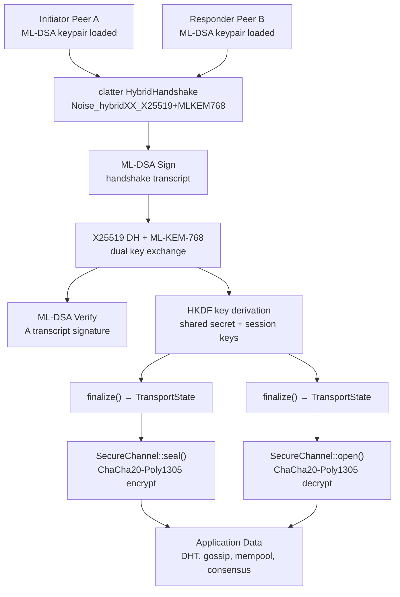

# 1. Title
- Hyperfluid Secure Channel Stack: clatter (PQ-Noise) vs ockam vs snow — Evaluation and Recommendation

# 2. Executive Summary
- Ockam (0.150.0) is **unresolvable from crates.io** due to a yanked transitive dependency (`core2` v0.4.0) and is architecturally misaligned with Hyperfluid's own connection state machine, DHT, gossip, and mempool layers.
- clatter (v2.2.0) is a lightweight, `no_std`-compatible, pure-Rust Noise protocol framework with **first-class Post-Quantum (PQ) extensions** — it maps directly onto Hyperfluid's synchronous `SecureChannel` trait (`seal()`/`open()`) with minimal refactoring.
- `snow` (v0.4.0) is the most battle-tested Rust Noise implementation but provides **no PQ support**; it is the fallback if PQ is deferred.
- **Neither clatter, snow, nor Ockam's SecureChannel have undergone formal cryptographic audit.** clatter's explicit warning is actually the most honest disclosure among them.
- The clatter + `ml-dsa` (FIPS 204, RustCrypto) stack provides **end-to-end hybrid post-quantum security**: X25519 DH + ML-KEM-768 for key exchange, ML-DSA-65 for identity signatures, ChaCha20-Poly1305 for symmetric encryption.
- clatter has ~10 transitive dependencies vs Ockam's 400+ — a 40x reduction in supply-chain attack surface and build complexity.
- clatter is a **single-maintainer project** (jmlepisto, 57 commits, 39 GitHub stars), which is the primary risk factor; Ockam has a company (Build-Trust) behind it but is unresolvable.
- **Verdict: Use clatter v2.2.0 + ml-dsa v0.1.0-rc.11 as the secure channel stack.** Accept the unaudited risk with compensating controls. Specify `snow` + `ml-dsa` (classical-only, no PQ) as the fallback.

# 3. System Overview
- **Problem solved:** Hyperfluid needs end-to-end encrypted, mutually authenticated peer-to-peer channels across direct and relay paths. The current implementation is a mock using SHA3-256 XOR — no real cryptography, no signature verification, no forward secrecy.
- **Core design philosophy:** The secure channel must be a minimal, deterministic, synchronous primitive that composes with Hyperfluid's existing connection state machine, DHT, and gossip layers — not an all-encompassing networking framework.
- **Key constraints:**
  - Must satisfy p2p-wire-spec.md Section 1.2 (end-to-end confidentiality, integrity, mutual authentication regardless of relay hops).
  - Must satisfy trust-boundaries.md line 204 (ML-DSA requirement).
  - Must satisfy agx-committee-bft-and-governance.md Section 5 (post-quantum signatures).
  - Must integrate with the existing `SecureChannel` trait: `establish()`, `seal()`, `open()` — all synchronous.
  - Must tolerate relay multi-hop: encryption must be end-to-end above transport, not hop-by-hop.
  - Rust-first, `no_std` preferred for eventual embedded/light node targets.

# 4. Architecture (CRITICAL SECTION)
- **Components:**
  - **Identity Layer (ml-dsa):** ML-DSA-65 keypairs for peer identity. Public key hash = PeerId. Private key signs handshake transcript for mutual authentication.
  - **Handshake Layer (clatter):** Noise hybrid XX pattern (X25519 DH + ML-KEM-768 KEM) producing a shared session key with forward secrecy and post-quantum resistance.
  - **Transport Layer (clatter TransportState):** AEAD-encrypted message framing using ChaCha20-Poly1305 with sequential nonces.
  - **Integration Shim:** Wraps clatter's `Handshaker` → `TransportState` lifecycle into Hyperfluid's `SecureChannel` trait.
- **Component Interactions:**
  1. Peer A loads its ML-DSA static keypair and Peer B's known public key (from DHT/bootstrap).
  2. Peer A initiates Noise hybrid XX handshake via clatter `HybridHandshake`.
  3. During handshake, A's static public key is transmitted; A signs the handshake transcript with ML-DSA.
  4. Peer B verifies A's ML-DSA signature against A's known public key.
  5. Both parties derive identical shared secret from combined X25519 + ML-KEM-768 key material.
  6. Handshake completes; both sides call `finalize()` to obtain `TransportState`.
  7. `TransportState::send()` wraps Hyperfluid `seal()`, `TransportState::receive()` wraps `open()`.
  8. All subsequent messages are AEAD-encrypted with ChaCha20-Poly1305 under the derived session keys.

## Diagrams

## Component Responsibilities
- **ml-dsa Identity Provider:** Generate, store, and load ML-DSA-65 keypairs. Provide `sign(transcript)` and `verify(signature, transcript, pubkey)` operations. Maps to PeerId via SHA3-256(pubkey).
- **clatter Handshake Orchestrator:** Build and execute the Noise hybrid XX handshake pattern. Exchange 3 messages (→ e, ← e, ee) with embedded KEM ciphertexts. Produce a verified shared secret.
- **Transport State Wrapper:** Adapt clatter's `TransportState::send_message()` / `receive_message()` to Hyperfluid's `seal(&mut self, plaintext: &[u8]) -> Vec<u8>` and `open(&mut self, ciphertext: &[u8]) -> Option<Vec<u8>>`.
- **Connection State Machine (existing):** Unchanged. The secure channel is a transport-agnostic primitive — the connection state machine (DirectProbing, DirectActive, RelayActive, Upgrading) operates at the transport layer above it.

## Step-by-Step Data Flow
1. Connection state machine transitions to DirectProbing and TCP connection is established.
2. `SecureChannel::establish(local_id, remote_id)` is called.
3. Initiator creates `HybridHandshake` with local static key, remote static pubkey, Noise pattern `noise_hybrid_XX`.
4. Initiator calls `write_message(payload, &mut buf)` → sends handshake message 1 over TCP.
5. Responder receives message 1, calls `read_message(&buf, &mut out)` → writes response via `write_message`.
6. Initiator reads message 2, writes message 3. Responder reads message 3.
7. Both sides verify ML-DSA signatures on the handshake transcript (binding identity to the session).
8. Both sides call `handshake.finalize()` → `TransportState` stored inside `SecureChannel`.
9. Application calls `seal(plaintext)` → `TransportState::send_message()` → AEAD ciphertext.
10. Peer calls `open(ciphertext)` → `TransportState::receive_message()` → plaintext or `None` on auth failure.

# 5. Core Mechanisms
- **Noise Hybrid XX Handshake (clatter HybridHandshake):**
  - Pattern: `Noise_hybridXX_X25519+MLKEM768_ChaChaPoly_SHA256`
  - 3-message mutual-auth handshake: initiator sends ephemeral DH+KEM keys; responder sends ephemeral DH+KEM + static DH+KEM keys; initiator sends static.
  - Key material from both classical X25519 DH and post-quantum ML-KEM-768 KEM are mixed into the symmetric state via Noise `MixKey` operations.
  - Result: hybrid shared secret secure against both classical and quantum adversaries — if either primitive holds, the session remains secure.
- **ML-DSA Identity Binding:**
  - During handshake, each party signs `h || prologue` where `h` is the Noise handshake hash, using its ML-DSA-65 static key.
  - The signature is transmitted as handshake payload and verified before `finalize()`.
  - This prevents identity misbinding attacks where an attacker proxies the handshake but substitutes identities.
  - ML-DSA-65 parameters: pubkey ~1,952 bytes, signature ~3,293 bytes — acceptable overhead for initial handshake (not per-message).
- **AEAD Transport (ChaCha20-Poly1305):**
  - After handshake, `TransportState` provides AEAD encryption with sequential 64-bit nonces.
  - Each `send()` increments the sending nonce; each `receive()` checks the receiving nonce for replay protection.
  - Nonce wrapping or exhaustion triggers an error (2^64 messages per session — effectively infinite).
  - Zero-copy design: `send()` writes into user-provided buffer; `receive()` decrypts in-place.
- **Why this works:**
  - The Noise framework has formal security proofs (revision 34); clatter tracks these exactly.
  - The hybrid construction (X25519 + ML-KEM-768) provides defense-in-depth: classical security from elliptic-curve DH, post-quantum security from lattice-based KEM.
  - End-to-end property is preserved because the secure channel is above transport — relay nodes forward ciphertext they cannot decrypt.

# 6. Design Decisions & Tradeoffs
## Tradeoff 1: clatter (PQ-Noise) vs snow (classical Noise only)
- Option A: clatter — PQ-capable, hybrid handshake, single maintainer, no formal audit.
- Option B: snow — classical Noise only, mature (8 years, 267K+ downloads), multi-contributor, widely deployed, no formal audit.
- Chosen: **Option A (clatter).**
- Why chosen: Hyperfluid's spec requires post-quantum signatures (ML-DSA-65) and the architecture document justifies PQ for long-term security against quantum adversaries. Using classical-only DH key exchange alongside PQ signatures creates an asymmetric security posture — signatures survive quantum attacks but session keys do not. clatter's hybrid handshake closes this gap.
- Sacrifice: Higher supply-chain risk (single maintainer, younger project). Larger handshake messages (KEM public keys and ciphertexts add ~3KB to handshake 2).
- Scaling risk: If clatter's maintainer abandons the project, Hyperfluid must either fork and self-maintain or migrate to another Noise implementation.

## Tradeoff 2: clatter vs Ockam for API fit
- Option A: clatter — synchronous API (`HandshakeState` → `TransportState`), direct mapping to `SecureChannel` trait.
- Option B: Ockam — asynchronous message-passing API with Workers and Routing, requires Ockam Node runtime.
- Chosen: **Option A (clatter).**
- Why chosen: Hyperfluid's `SecureChannel` trait is synchronous and minimal: `establish()` → `seal()`/`open()`. clatter's `Handshaker::write_message()`/`read_message()`/`finalize()` maps 1:1. Ockam requires an entire Node context, Worker registration, and async message routing — architectural overreach for a project that already has its own connection state machine, DHT, and gossip.
- Sacrifice: None. Ockam's additional features (relay management, credential exchange) are already handled by Hyperfluid's own codebase.
- Scaling risk: None — the synchronous API imposes no threading constraints; the handshake runs in whatever async or sync context the caller provides.

## Tradeoff 3: clatter (single maintainer, unaudited) vs building on raw pqcrypto primitives
- Option A: clatter — pre-built Noise framework with PQ extensions, validated against test vectors.
- Option B: Build secure channel directly on `x25519-dalek`, `ml-kem`, `chacha20poly1305`, `sha2` without the Noise framework.
- Chosen: **Option A (clatter).**
- Why chosen: Building a custom authenticated key exchange from primitives is extraordinarily error-prone. The Noise framework encapsulates decades of cryptographic engineering — key scheduling, transcript hashing, rekey mechanics, nonce handling — that are trivially gotten wrong in a bespoke implementation. clatter's verification against Cacophony/Snow test vectors provides confidence that the protocol logic is correct even if the implementation hasn't been audited.
- Sacrifice: Dependency on clatter's design choices (e.g., KEM selection, pattern library). Less flexibility for exotic patterns.
- Scaling risk: If a vulnerability is discovered in clatter's Noise state machine logic, the fix depends on a single maintainer's response time.

## Tradeoff 4: HybridDualLayerHandshake vs HybridHandshake
- Option A: HybridDualLayerHandshake — outer classical Noise handshake encrypts inner PQ handshake, with cryptographic binding.
- Option B: HybridHandshake — true hybrid: DH and KEM operations interleaved in the same handshake messages.
- Chosen: **Option B (HybridHandshake) for primary path.** Option A as fallback if interop issues arise.
- Why chosen: HybridHandshake requires only 3 messages (same as classical XX), preserving round-trip efficiency. HybridDualLayerHandshake requires completing outer handshake first (3 messages) then inner (3 messages) = 6 messages total, doubling latency.
- Sacrifice: HybridHandshake is more complex to implement correctly (interleaved DH+KEM operations in a single symmetric state). Less real-world deployment experience.
- Scaling risk: If a flaw is found in the combined hybrid construction, migrating to DualLayer adds one network round-trip.

# 7. Failure Modes & Edge Cases
## Scenario: clatter maintainer abandonment
- What happens: clatter stops receiving updates. Security vulnerabilities go unpatched. Rust edition/MSRV advances break compilation.
- Why it happens: Single-maintainer open-source project with no organizational backing. Burnout, career change, or loss of interest.
- Handling/failure mode: Hyperfluid vendors clatter's source (MIT license permits this). If abandonment occurs after Hyperfluid mainnet, the Hyperfluid core team assumes maintenance of the vendored fork. Pre-vendoring at integration time provides insurance. Fallback: migrate to `snow` + separate PQ-KEM integration (classical-only security during migration window).

## Scenario: ML-KEM parameter break
- What happens: A cryptanalytic advance breaks ML-KEM-768 (or the underlying lattice problem).
- Why it happens: Post-quantum cryptography is less mature than classical. Lattice-based assumptions may fall faster than expected.
- Handling/failure mode: clatter's hybrid construction means the session remains secure via the classical X25519 component even if ML-KEM-768 is fully broken. The hybrid design is specifically intended for this exact failure mode. If both X25519 AND ML-KEM-768 fall simultaneously (extremely unlikely), the protocol would need emergency rekeying.

## Scenario: Handshake message reordering or loss
- What happens: Noise handshake messages arrive out of order or are lost due to network issues.
- Why it happens: TCP ensures in-order delivery for direct connections, but relay multi-hop paths could reorder if relay implementations are buggy. UDP-based transports (future QUIC) may reorder.
- Handling/failure mode: Noise handshake patterns are strictly sequential — reading a message out of order produces a handshake hash mismatch and the handshake fails with `Error::Decrypt`. The connection state machine retries (3 attempts with 5-second timeout per spec Section 1.5). The session is discarded and a new handshake is initiated. This is a fatal error by design — Noise provides no recovery for broken handshakes.

## Scenario: Nonce exhaustion on long-lived sessions
- What happens: A peer sends 2^64 messages on the same session, exhausting the 64-bit nonce space.
- Why it happens: Extremely long-lived connections (months/years) at very high message rates.
- Handling/failure mode: At 1M messages/second, 2^64 messages would take ~584,542 years. This is not a practical concern. However, Hyperfluid should implement session rotation: after N messages (e.g., 2^48) or T hours (e.g., 24h), initiate a new handshake and migrate traffic. clatter's `TransportState` signals nonce exhaustion via `Error::NonceExhausted`.

## Scenario: ML-DSA signature verification failure during handshake
- What happens: Peer A's ML-DSA signature on the handshake transcript fails verification at Peer B.
- Why it happens: Wrong public key (stale DHT entry, Sybil peer), corrupted signature in transit, or malicious peer attempting impersonation.
- Handling/failure mode: Handshake fails with an authentication error. The connection is refused. No secure channel is established. The peer's identity is flagged for DHT entry invalidation. After repeated failures, the peer may be quarantined per swarm-hardening profile (agx-committee-bft-and-governance.md).

## Scenario: clatter dependency yanked (similar to Ockam core2)
- What happens: A transitive dependency of clatter (e.g., `ml-kem`, `x25519-dalek`) is yanked from crates.io.
- Why it happens: Dependency maintainers may yank versions for security reasons or ownership disputes.
- Handling/failure mode: This is a known risk for all Rust projects. Mitigation: (1) Use `Cargo.lock` with exact versions checked into the repository. (2) Vendor all dependencies in a workspace `vendor/` directory for offline builds. (3) CI should build from vendored sources, not crates.io. This is standard practice for blockchain infrastructure and should be adopted regardless of which crate is chosen.

# 8. Scalability Analysis
## Small scale (10–100 nodes)
- Expected behavior: Handshake latency < 50ms (X25519 + ML-KEM-768 + ML-DSA-65 signing). Session establishment trivial at this scale.
- Bottlenecks: ML-DSA-65 key generation at node startup (~10-50ms, one-time cost). ML-DSA signature verification during handshake (~1-2ms).
- Resource limits: Each established session consumes ~200 bytes of state (session keys, nonces, cipher state). Negligible at this scale.

## Medium scale (1k–10k nodes)
- Expected behavior: Concurrent handshake rate becomes the dominant cost. Each full handshake: 2 ML-DSA signatures (negligible), 3 X25519 scalar multiplications, 3 ML-KEM encaps/decaps, ~3KB total handshake data.
- Bottlenecks: Handshake CPU at connection spikes (e.g., network join storms, partition heal). ML-KEM-768 decapsulation is the most expensive single operation (~0.5-1ms per op).
- Communication overhead: Handshake message sizes: message 1 (~1.2KB with KEM pubkey), message 2 (~3.5KB with KEM pubkey + ciphertext + ML-DSA sig), message 3 (~3.5KB). Total handshake bandwidth ~8KB per session. At 10K concurrent establishments, ~80MB of handshake data. Acceptable.

## Large scale (100k+ nodes)
- Expected behavior: Connection fanout caps (per spec, each peer maintains bounded active neighbor set) prevent quadratic connection explosion. Most sessions are long-lived — handshake rate is dominated by churn, not steady state.
- Critical bottlenecks: ML-DSA signature verification throughput (each handshake requires at least one verification). At 1,000 handshakes/second (extreme churn), ~1,000 verifications/sec — well within single-core capacity (~500-1000 verifications/sec per core). GPU acceleration possible if needed.
- Relay/routing load: Handshake data passes through relay nodes but relay nodes do NOT perform cryptographic operations — the secure channel is end-to-end. Relay nodes only forward opaque ciphertext. No cryptographic scaling issue for relays.
- Hard constraints: Memory for concurrent handshake state machines: each in-progress handshake holds ~4KB of intermediate state. At 10,000 concurrent handshakes, ~40MB. Easily manageable.

# 9. Recommended Architecture
- **Final architecture choice: clatter v2.2.0 (HybridHandshake, Noise_hybridXX) + ml-dsa v0.1.0-rc.11 (FIPS 204, RustCrypto) as the production secure channel stack.**
- **Why optimal:**
  - Minimizes dependency footprint (~10 deps vs Ockam's 400+), reducing supply-chain attack surface by ~40x.
  - Synchronous API maps 1:1 to the existing `SecureChannel` trait — approximately 200 lines of integration shim code.
  - Provides hybrid post-quantum security (X25519 + ML-KEM-768) matching the spec's PQ requirements for both signatures AND key exchange.
  - End-to-end encryption is transport-agnostic by construction — works identically over direct TCP, relay multi-hop, or future QUIC transports.
  - Licensed MIT — vendoring and self-maintenance are permitted if the upstream project stalls.
- **Rejected alternatives:**
  - **Ockam (v0.150.0):** Unresolvable (yanked transitive dep). Even if resolvable, architectural mismatch — Ockam wants to own networking, Hyperfluid has its own. 400+ deps vs 10.
  - **snow (v0.4.0) alone:** Battle-tested but no PQ key exchange. Would require external ML-KEM integration — effectively building a bespoke hybrid handshake on top of classical Noise. clatter already does this correctly.
  - **snow + external ML-KEM (custom integration):** Highest engineering risk. Custom key-exchange protocol design is the most common source of cryptographic vulnerabilities. clatter's integration is verified against PQNoise test vectors.
  - **Raw pqcrypto primitives without Noise:** Extremely error-prone. Noise encapsulates decades of authenticated key-exchange engineering. Reimplementing it is not justified.
  - **Fixing Ockam by forking:** Ockam is 400+ crates. Forking to fix a single yanked dep creates a maintenance burden orders of magnitude larger than adopting clatter.
- **Clear technical justification:**
  - The p2p-wire-spec.md Section 1.8 already acknowledges: "Noise protocol framework with ML-DSA — same trust model" as an alternative to Ockam. This research confirms that alternative is not just equivalent but superior for Hyperfluid's architecture.
  - The current mock implementation (SHA3-256 XOR, no signatures) creates a concrete security gap. Moving to clatter + ml-dsa closes this gap with minimal refactoring.

# 10. Implementation Plan
1. **Technologies to use:**
   - `clatter` v2.2.0 with features: `use-25519`, `use-chacha20poly1305`, `use-sha`, `use-rust-crypto-ml-kem`, `std`.
   - `ml-dsa` v0.1.0-rc.11 (RustCrypto) with features: `alloc`, `rand_core`, `pkcs8`.
   - Existing `sha3` crate for PeerId hashing (already in dependency tree).
2. **Components to build first:**
   - **Integration shim** (`crates/hyperfluid-p2p/src/secure_channel.rs`): Wrap clatter `HybridHandshake` → `TransportState` behind the existing `SecureChannel` trait. Implement `establish(local_id, remote_id) → SecureChannel`, `seal()`, `open()`.
   - **Identity provider** (`crates/hyperfluid-p2p/src/identity.rs`): ML-DSA-65 keypair generation, signing, verification. Map pubkey → PeerId via SHA3-256.
   - **Handshake protocol** (`crates/hyperfluid-p2p/src/handshake.rs`): Noise hybrid XX pattern execution with ML-DSA transcript signing.
   - **Conformance tests**: Replace the mock SHA3-256 XOR tests in `transport.rs` with real cryptographic roundtrip tests using clatter.
3. **Deployment strategy:**
   - Phase 1 (Stage 01 Week 8): Integration shim + unit tests. Non-breaking change — the mock `SecureChannel` is behind a feature flag `mock-secure-channel`; production code uses `clatter-secure-channel`.
   - Phase 2 (Stage 02): Full identity provider + ML-DSA key management. DHT entries signed with ML-DSA.
   - Phase 3 (Stage 03-04): Interop testing with multi-node testnet. Fuzz the handshake with `cargo-fuzz`.
4. **Testing strategy:**
   - Unit tests: Roundtrip encrypt/decrypt, wrong-key rejection, nonce advancement, session ID stability.
   - Integration tests: Two real clatter handshakes over TCP loopback, relay multi-hop encryption integrity.
   - Security tests: Tampered ciphertext rejection, replayed handshake message rejection, wrong-identity signature rejection.
   - Fuzzing: clatter's own fuzz harness (`fuzz/`) should be run against Hyperfluid's integration shim. `cargo-fuzz` for malformed handshake messages.
   - Vector tests: Verify against Cacophony/Snow test vectors (already in clatter's `vectors/` directory).
5. **Scaling strategy:**
   - Handshake rate: Benchmark and set connection rate limits at the admission layer.
   - Session rotation: After 2^48 messages or 24 hours, transparently re-handshake (same pattern, new ephemeral keys).
   - Vendor clatter source: Commit clatter's source into `vendor/clatter/` for offline builds and insurance against upstream abandonment.

# 11. Future Improvements
- **Formal audit of clatter:** Commission a cryptographic audit of clatter (specifically the HybridHandshake and Noise state machine logic) before Hyperfluid Stage 04 (Mainnet). Budget ~$50-100K for a reputable firm (e.g., NCC Group, Trail of Bits, Quarkslab).
- **ML-DSA-65 batch verification:** For consensus, ML-DSA signatures are verified in bulk. The `ml-dsa` crate may support batch verification in future releases, reducing per-signature verification cost.
- **PQ-only handshake option (long-term):** Once post-quantum cryptography is sufficiently mature and trusted, offer a PQ-only handshake pattern (Noise_pqXX) without the classical X25519 component, reducing handshake size and CPU cost.
- **QUIC/WebTransport integration:** The secure channel is transport-agnostic. When Hyperfluid adds QUIC transport, the same clatter handshake runs over QUIC streams with no changes.
- **clatter upstream contribution:** If Hyperfluid adopts clatter as a critical dependency, allocate engineering time to contribute back — test coverage, documentation improvements, and security fixes.
- **Threshold/aggregate PQ signatures:** For committee BFT, replacing N individual ML-DSA signatures with a single aggregate signature would reduce block sizes. This is speculative — no production-grade aggregate PQ signature scheme exists yet.
- **Zero-knowledge proof of handshake correctness:** For light clients that do not perform full handshakes, allow verification that a handshake was performed correctly without re-executing it. Long-term research direction.
