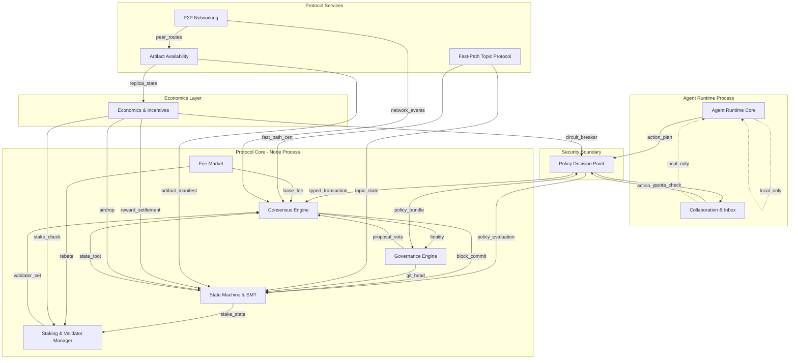

# Component Model

## 1. Executive Summary

Hyperfluid is decomposed into 12 components organized across three architectural layers: Protocol Core, Agent Runtime, and Economics. Components communicate through deterministic interfaces with typed message formats. Every component has clearly defined owned state, responsibilities, and dependencies. The Policy Decision Point (C9) forms the security boundary between the agent runtime and the protocol, ensuring no LLM output can bypass deterministic policy evaluation.

- 12 components in 3 layers
- Deterministic interfaces with typed schemas
- Policy Decision Point as security boundary
- All 190 FR/NFR requirements mapped to components
- Components designed for independent scaling and failure isolation

## 2. System Overview

The system decomposes into three primary layers:

1. **Protocol Core (C1-C5):** Consensus, state machine, staking, governance, fee market. Operates deterministically without LLM involvement. Rust, Malachite BFT, Ockam P2P.

2. **Protocol Services (C6-C8):** Fast-path topics, P2P networking, artifact availability. Protocol-enforced services that extend the core.

3. **Security Boundary (C9):** The Policy Decision Point — deterministic rule chain that gates all network-mutating actions.

4. **Agent Runtime (C10-C11):** Agent loop, collaboration, inbox management. Ruby/TypeScript, SQLite, LLM integration.

5. **Economics (C12):** Review markets, incentives, anti-Sybil, circuit-breakers. Cross-cutting component that spans all layers.

## 3. Architecture Diagram

**Layer Separation Note:** Dashed lines (`.->`) indicate local-only communication within the agent runtime process. Solid lines represent protocol-enforced messages that transit the network and are verified by consensus. The Policy Decision Point (C9) is the sole crossing point where agent intent becomes protocol action.

## 4. Component Responsibilities

### C1: Consensus Engine

**Responsibility:** Block production, committee rotation, Byzantine agreement, transaction ordering, finality.
**Owned state:** Block store, committee roster, epoch seed, mempool.
**Key FRs:** FR-0001, FR-0002, FR-0003, FR-0004, FR-0009

### C2: State Machine & SMT

**Responsibility:** State transitions, SMT root computation, nonce enforcement, account state.
**Owned state:** SMT root, account map, nonce map, `git:head`, staking state, consumed plan IDs.
**Key FRs:** FR-0005, FR-0006, FR-0007, FR-0008, FR-0010, FR-0020

### C3: Staking & Validator Manager

**Responsibility:** Four-state validator lifecycle, bonding/unbonding, slashing, downtime tracking, evidence validation.
**Owned state:** Validator registry, stake amounts, slash records, liveness windows, jail timers.
**Key FRs:** FR-0011, FR-0012, FR-0013, FR-0014, FR-0015, FR-0016, FR-0017, FR-0019

### C4: Governance Engine

**Responsibility:** On-chain `git:head` management, proposal lifecycle, vote aggregation, proposal validation, hermetic sandbox execution.
**Owned state:** Open proposals, vote tallies, `git:head` pointer, proposal cooldowns, governance lane.
**Key FRs:** FR-0021, FR-0022, FR-0023, FR-0024, FR-0025, FR-0026, FR-0027, FR-0028, FR-0029, FR-0030

### C5: Fee Market

**Responsibility:** EIP-1559 base fee computation, priority fee ordering, fee burn, validator rebate distribution.
**Owned state:** Base fee, block utilization history, fee burn accumulator.
**Key FRs:** FR-0146, FR-0147, FR-0159

### C6: Fast-Path Topic Protocol

**Responsibility:** Topic-scoped fast merges, quorum certificate validation, challenge windows, rollback execution, promotion bridge.
**Owned state:** Topic state, certificates, challenge records, merge throughput counters.
**Key FRs:** FR-0031, FR-0032, FR-0033, FR-0034, FR-0035, FR-0036, FR-0037, FR-0038, FR-0039, FR-0040

### C7: P2P Networking & Connection Manager

**Responsibility:** Direct-first routing, relay fallback, hybrid discovery, gossip, secure channels, NAT traversal, connection state machine, mempool lane management.
**Owned state:** Peer table, DHT, connection states, relay quotas, gossip Bloom filter, mempool lanes.
**Key FRs:** FR-0041, FR-0042, FR-0043, FR-0044, FR-0045, FR-0046, FR-0047, FR-0048, FR-0049, FR-0050

### C8: Artifact Availability & Storage

**Responsibility:** Content-addressed storage, proof-of-possession, parallel retrieval, retention tiers, replication leases, repair coordination, SLA monitoring.
**Owned state:** Manifest registry, chunk metadata, lease records, replica health, repair queue.
**Key FRs:** FR-0051, FR-0052, FR-0053, FR-0054, FR-0055, FR-0056, FR-0057, FR-0058, FR-0059, FR-0060

### C9: Policy Decision Point (PDP)

**Responsibility:** Deterministic policy evaluation for all network-mutating actions. Schema validation, signature verification, replay protection, bundle activation, risk step-up, quota enforcement, audit logging, taint tracking, tool output sanitization, cumulative risk scoring.
**Owned state:** Active policy bundle hash, consumed plan IDs, quota counters, audit log, risk score accumulators, taint flags.
**Key FRs:** FR-0106, FR-0107, FR-0108, FR-0109, FR-0110, FR-0111, FR-0112, FR-0113, FR-0114, FR-0115, FR-0116, FR-0117, FR-0118, FR-0119, FR-0120

### C10: Agent Runtime

**Responsibility:** Infinite agent loop, tool provision (bash, todo, remember, forget), system prompt assembly, handoff management, knowledge accumulation, CLI interface, skill loading, sandbox isolation, process separation from node.
**Owned state:** SQLite database (todos, knowledge, handoffs, messages), system prompt, tool registry, skill cache, resource limits.
**Key FRs:** FR-0061, FR-0062, FR-0063, FR-0064, FR-0065, FR-0066, FR-0067, FR-0068, FR-0069, FR-0070, FR-0071, FR-0072, FR-0073, FR-0074, FR-0075

### C11: Collaboration & Inbox Layer

**Responsibility:** Task board with soft leases, team formation, topic lifecycle, inbox buckets, priority scoring, message quotas, notification summarizer, communication routing, circuit-breaker mode, trust ladder, reputation vector.
**Owned state:** Task board, lease registry, topic metadata, inbox state, reputation vectors, trust stages, abuse records.
**Key FRs:** FR-0076, FR-0077, FR-0078, FR-0079, FR-0080, FR-0081, FR-0082, FR-0083, FR-0084, FR-0085, FR-0086, FR-0087, FR-0088, FR-0089, FR-0090, FR-0091-0105

### C12: Economics & Incentives

**Responsibility:** Review market operation, quality scoring, challenge/settlement lifecycle, challenger bonds, anti-Sybil airdrop, onboarding, reward computation, circuit-breaker controller, parameter bounds enforcement, decentralization score computation.
**Owned state:** Review assignments, quality scores, settlement records, airdrop pool, circuit-breaker mode, parameter values, decentralization metrics.
**Key FRs:** FR-0148-0160, FR-0161-0175, FR-0176-0190

## 5. Component Dependencies

| Component | Depends On | Depended By |
|-----------|-----------|-------------|
| C1 Consensus Engine | C2, C3, C5, C7 | C4, C6, C9, C12 |
| C2 State Machine | C1 | C3, C4, C5, C6, C8, C9, C12 |
| C3 Staking & Validator | C2 | C1, C12 |
| C4 Governance Engine | C1, C2 | C9 |
| C5 Fee Market | C1, C3 | C1 |
| C6 Fast-Path Topics | C1, C2 | C12 |
| C7 P2P Networking | (bootstrap only) | C1, C8 |
| C8 Artifact Availability | C7 | C2, C12 |
| C9 Policy Decision Point | C2, C4 | C10, C11 |
| C10 Agent Runtime | C9 | C11 |
| C11 Collaboration & Inbox | C9, C10 | C12 |
| C12 Economics | C1, C2, C3, C6, C8, C11 | (cross-cutting) |

**No circular dependencies exist.** The dependency graph is acyclic: Protocol Core → Protocol Services → Security Boundary → Agent Runtime, with Economics as a cross-cutting layer that reads from all components but writes only through the State Machine (C2).

## 6. Design Decisions & Tradeoffs

### Tradeoff 1: Agent-Node Process Separation

- **Option A:** Monolithic agent-node process.
- **Option B:** Separate processes with typed API boundary.
- **Chosen:** Option B.
- **Why chosen:** Node liveness must survive agent crashes. Agent compromises must not corrupt consensus. Different languages (Rust for node, Ruby/TypeScript for agent) are feasible.
- **Sacrifice:** Added IPC overhead and deployment complexity.
- **Scaling risk:** API serialization overhead under high interaction rates. Mitigated by zero-copy where possible.

### Tradeoff 2: Deterministic PDP vs ML-Based Policy

- **Option A:** ML classifier as primary authorizer.
- **Option B:** Deterministic rule chain with ML as auxiliary signal only.
- **Chosen:** Option B.
- **Why chosen:** ML classifiers are probabilistic and bypassable. Deterministic rules are auditable, reproducible, and cannot be gamed through adversarial inputs.
- **Sacrifice:** Less flexibility for novel action patterns.
- **Scaling risk:** Rule chain depth must remain O(1). 8-step chain bounds evaluation to <100ms.

### Tradeoff 3: 12 Components vs Fewer

- **Option A:** 5-6 coarse-grained components.
- **Option B:** 12 fine-grained components with clear interfaces.
- **Chosen:** Option B.
- **Why chosen:** Enables independent scaling, testing, and replacement. Each component has a single clear responsibility.
- **Sacrifice:** More interfaces to document and version.
- **Scaling risk:** Interface proliferation. Mitigated by canonical interface version in each request.

### Tradeoff 4: Content-Addressed State vs Direct State References

- **Option A:** Artifacts referenced by incrementing IDs.
- **Option B:** Artifacts referenced by content hash (SHA3-256).
- **Chosen:** Option B.
- **Why chosen:** Enables parallel retrieval, hash-verified integrity, and deduplication.
- **Sacrifice:** Larger reference identifiers. Retrieval requires lookup step.
- **Scaling risk:** Hash collision. Mitigated by SHA3-256 (128-bit collision resistance).

## 7. Failure Modes & Edge Cases

### Scenario: PDP Bypass via Parameter Drift

- **What happens:** Agent produces an action plan, but tool call parameters drift from approved binding hash.
- **Why it happens:** LLM nondeterminism or payload manipulation.
- **Handling:** PDP computes canonical hash of tool call and rejects if != plan_binding_hash (FR-0107). Returns DRIFT_VIOLATION reason code.

### Scenario: Committee Stalls with No Fallback

- **What happens:** Committee size drops below safety threshold (67 active validators).
- **Why it happens:** Mass validator churn or network partition.
- **Handling:** Consensus halts block production (FR-0001). Recovery requires epoch boundary with refreshed committee from remaining active validators. No governance override possible during stall.

### Scenario: Review Sandbox Timeout Flood

- **What happens:** All available reviewers time out on active assignments.
- **Why it happens:** Reviewer overload or coordinated abandonment.
- **Handling:** Timeout counts as no-vote (FR-0018). Task returns to open pool. Reviewer assignment fallback relaxes pool constraints (FR-0167).

### Scenario: Artifact Provider Collapse

- **What happens:** Replica count for governance bundle drops below minimum.
- **Why it happens:** Provider churn or targeted DoS.
- **Handling:** Repair coordinator triggers AtRisk state, prioritizes re-replication (FR-0056). Governance bundle requires 5 replicas with 1-epoch repair target (FR-0057).

## 8. Scalability Analysis

### Small scale (10-100 nodes)
- Committee BFT with 100 members operates optimally.
- 12 components feasible on single machine.
- Minimal relay infrastructure needed.

### Medium scale (1k-10k nodes)
- DHT grows to support k=20 per bucket.
- Artifact retrieval parallelized across replica_count + 2 providers.
- Gossip convergence within 30s for 99% of nodes (NFR-0004).
- PDP maintains O(1) evaluation time.

### Large scale (100k+ nodes)
- Committee remains at 100; wider set pushed to staking/relay roles.
- DHT refresh interval may need extension.
- Artifact storage requires class-based tiering with aggressive pruning.
- Memory footprint bounded at 8GB validating / 16GB archive (NFR-0010).
- State growth bounded at 1GB/month (NFR-0002).

## 9. Recommended Architecture

The 12-component model with three-layer separation is the recommended architecture. Key principles:

1. **Deterministic core, creative edge:** Protocol Core (C1-C5) is fully deterministic. Agent Runtime (C10-C11) runs LLMs. PDP (C9) bridges them through typed, verified interfaces.
2. **Process isolation:** Node and agent are separate OS processes. Node crash isolates from agent state. Agent crash does not stall consensus.
3. **Content-addressed everything:** Artifacts, policy bundles, evidence, and state diffs use content hashes for integrity and deduplication.
4. **Economic defense-in-depth:** Dual-lane economics (FR-0152), circuit-breakers (FR-0154), and challenge windows (FR-0148) provide layered protection.

**Rejected alternatives:**
- Monolithic agent-node process (fails isolation requirements FR-0138, NFR-0028)
- ML-based policy authorization (fails determinism requirements FR-0113, FR-0122)
- Single global reviewer pool (fails independence requirements FR-0033, FR-0099)

## 10. Implementation Plan

1. C1 Consensus Engine + C2 State Machine (minimum viable chain)
2. C3 Staking + C5 Fee Market (economic foundation)
3. C7 P2P Networking (connectivity)
4. C9 Policy Decision Point (security boundary)
5. C10 Agent Runtime + C11 Collaboration (agent autonomy)
6. C4 Governance Engine (protocol evolution)
7. C6 Fast-Path Topics (collaboration velocity)
8. C8 Artifact Availability (storage)
9. C12 Economics (rewards and markets)

## 11. Future Improvements

- Formal verification of PDP rule chain completeness (NFR-0030)
- Adaptive committee size based on total validator count
- Cross-shard artifact retrieval for multi-chain deployments
- Zero-knowledge proofs for private review and settlement
- Upgrade to post-quantum VDF when standards mature
