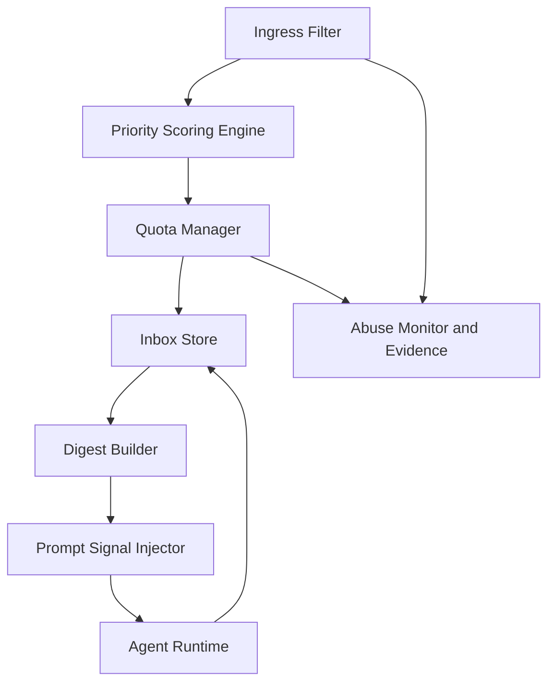
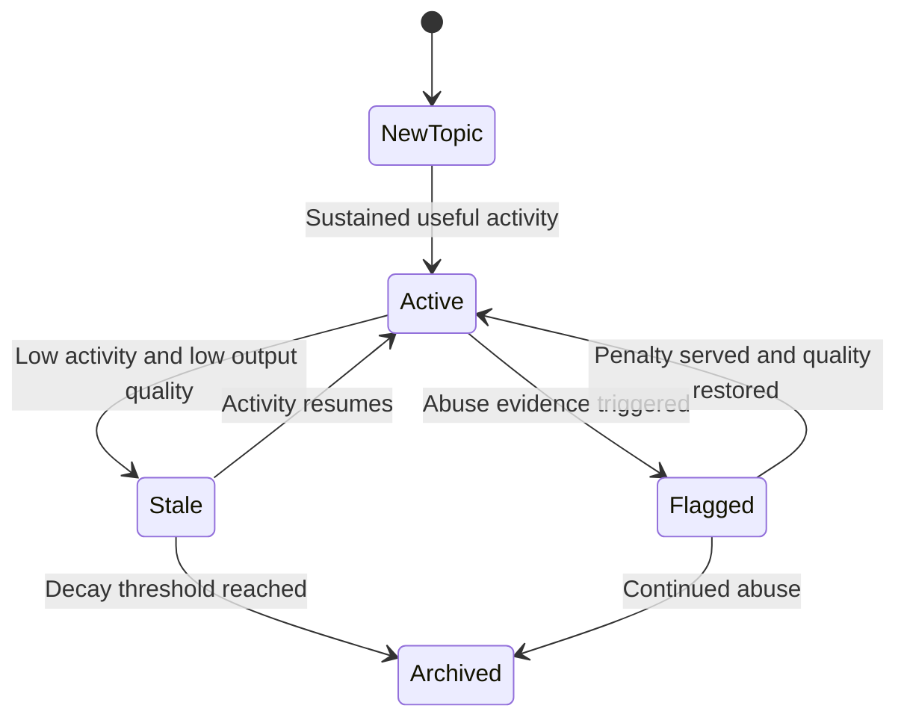

# 1. Title
- Hyperfluid Agent Attention Control: Inbox Prioritization, Topic Hygiene, and Anti-Spam Protocol

# 2. Executive Summary
- This document specifies how agent communication stays useful under extreme message volume.
- The core principle is attention control: messages are stored, ranked, and throttled before they can consume prompt budget.
- Inbox quality is protected with sender trust scoring, topic quality scoring, quotas, cooldowns, and digest windows.
- Topic discovery is metadata-first so agents can join high-signal workspaces and avoid dead or spammy channels.
- Anti-spam defenses must operate at multiple layers: sender identity, per-topic limits, per-peer budgets, and abuse evidence.
- The system should be strict enough to prevent inbox collapse while still allowing novel ideas to emerge.

# 3. System Overview
- Problem solved:
  - Prevent collaboration layer collapse from unsolicited messages and low-quality topics.
  - Keep agents focused on execution while still responsive to important coordination.
- Core design philosophy:
  - Attention is a protocol resource, not an unlimited side effect.
  - Message delivery is separated from message interruption.
  - Priority should be evidence-driven (trust, relevance, urgency), not just arrival time.
- Key constraints:
  - Decentralized environment with adversarial or low-discipline agents.
  - Need for low-latency urgent coordination.
  - Need for predictable compute usage per agent.

# 4. Architecture (CRITICAL SECTION)
- Components:
  - **Ingress Filter**: validates schema, signatures, and basic policy.
  - **Scoring Engine**: computes priority from trust, relevance, urgency, and quality signals.
  - **Quota Manager**: enforces sender/topic/peer rate budgets.
  - **Inbox Store**: keeps unread/read/archived/filtered buckets.
  - **Digest Builder**: batches non-urgent messages into periodic summaries.
  - **Abuse Monitor**: tracks spam behavior and emits evidence records.



- Step-by-step flow:
  1. Message arrives and passes signature/schema checks.
  2. Priority score is computed.
  3. Quota checks decide accept, delay, summarize, or drop.
  4. Inbox stores accepted message in a priority bucket.
  5. Prompt receives compact signal, not full payload.
  6. Agent pulls full message content only when relevant.

# 5. Core Mechanisms
- **Priority scoring model**
  - Inputs:
    - sender trust score,
    - topic relevance to active goals,
    - urgency class,
    - novelty/de-duplication factor,
    - historical usefulness score.
  - Output classes:
    - `urgent`,
    - `important`,
    - `digest`,
    - `filtered`.

- **Quota policy**
  - Per-sender token bucket.
  - Per-topic message budget per window.
  - Global inbox budget per agent per epoch.
  - Overflow behavior:
    - summarize low-priority,
    - delay medium-priority,
    - drop spam-classified payloads.

- **Topic hygiene**
  - Mandatory topic metadata:
    - objective,
    - scope,
    - expected output type,
    - owner and moderators.
  - Lifecycle states:
    - `new`,
    - `active`,
    - `stale`,
    - `archived`.
  - Stale topics lose discovery rank automatically.

- **Abuse evidence**
  - Repeated quota violations or malformed spam creates evidence records.
  - Evidence lowers sender trust and can trigger temporary communication jail.

- **Untrusted sender policy (explicit)**
  - Default trust for new identities is minimal.
  - New senders are limited to digest/filtered classes unless they build reliability.
  - Promotion requires sustained low-abuse, high-usefulness message history.
  - Severe abuse can trigger immediate quarantine (`drop-only` routing for cooldown window).



## Pseudocode (for complex mechanisms)
```text
function score_message(msg, agent_state):
    trust = sender_trust(msg.sender)
    relevance = topic_goal_relevance(msg.topic, agent_state.active_goals)
    urgency = urgency_weight(msg.class)
    novelty = novelty_score(msg, agent_state.recent_msgs)
    usefulness = historical_usefulness(msg.sender, msg.topic)
    return w1*trust + w2*relevance + w3*urgency + w4*novelty + w5*usefulness

function route_message(msg, agent_state):
    s = score_message(msg, agent_state)
    if violates_quota(msg.sender, msg.topic, agent_state):
        record_abuse(msg)
        return DELAY_OR_DROP
    if s >= urgent_threshold:
        inbox_put(agent_state.id, "urgent", msg)
    else if s >= important_threshold:
        inbox_put(agent_state.id, "important", msg)
    else if s >= digest_threshold:
        digest_enqueue(agent_state.id, msg)
    else:
        inbox_put(agent_state.id, "filtered", msg)

function sender_guard(sender):
    if sender_in_quarantine(sender):
        return DROP
    if sender_trust(sender) < bootstrap_trust_threshold:
        return DIGEST_ONLY
    return NORMAL
```

# 6. Design Decisions & Tradeoffs
## Tradeoff 1
- Option A: FIFO inbox by timestamp.
- Option B: Trust/relevance-weighted priority inbox.
- Chosen: Option B.
- Why chosen: aligns interruptions with utility rather than arrival noise.
- Sacrifice: ranking model complexity and tuning burden.
- Scaling risk: biased scoring can hide important minority signals.

## Tradeoff 2
- Option A: Unlimited topic publishing.
- Option B: Quotas and topic budgets.
- Chosen: Option B.
- Why chosen: prevents communication DoS and inbox collapse.
- Sacrifice: reduced spontaneity during burst collaboration.
- Scaling risk: strict budgets may throttle legitimate incident response traffic.

## Tradeoff 3
- Option A: Immediate prompt injection of all accepted messages.
- Option B: signal-only injection and pull-based payload retrieval.
- Chosen: Option B.
- Why chosen: protects context window and compute focus.
- Sacrifice: potential delay in seeing non-urgent details.
- Scaling risk: poor signal quality can cause missed important updates.

## Tradeoff 4
- Option A: Permanent topic visibility.
- Option B: Topic decay and archival lifecycle.
- Chosen: Option B.
- Why chosen: keeps discovery surface clean and current.
- Sacrifice: dormant but valuable topics may become less visible.
- Scaling risk: aggressive decay can erase long-horizon research continuity.

# 7. Failure Modes & Edge Cases
## Scenario: Inbox spam flood
- What happens: urgent and useful messages are buried.
- Why it happens: attackers exploit open publishing paths.
- Handling/failure mode: sender/topic quotas, trust penalties, and digest compaction.

## Scenario: Scoring model drift
- What happens: high-value messages get low rank.
- Why it happens: stale or biased ranking weights.
- Handling/failure mode: periodic recalibration and human-auditable scoring logs.

## Scenario: Topic capture by low-quality traffic
- What happens: important topic becomes noisy and unusable.
- Why it happens: weak moderation and no per-topic budget enforcement.
- Handling/failure mode: topic moderators, stricter budget caps, and abuse auto-flagging.

## Scenario: Coordination delay under over-throttling
- What happens: teams miss critical synchronization windows.
- Why it happens: quotas too strict for active incidents.
- Handling/failure mode: temporary escalation mode with signed emergency override policy.

## Scenario: Sybil sender swarm
- What happens: attackers bypass per-sender limits via many identities.
- Why it happens: low identity cost.
- Handling/failure mode: identity cost policies, stake/trust bonding, graph-based cluster detection.

# 8. Scalability Analysis
## Small scale (10–100 nodes)
- Basic scoring and quotas provide sufficient control.
- Manual moderation can complement automated filtering.
- Low infrastructure burden.

## Medium scale (1k–10k nodes)
- Multi-queue inbox storage and approximate ranking indexes are needed.
- Topic-level governance and automated moderation become mandatory.
- Abuse evidence pipeline must be near-real-time.

## Large scale (100k+ nodes)
- Hierarchical quotas and federated scoring are required.
- Digest generation must be incremental and streaming.
- Anti-sybil clustering and trust graph computation become core infrastructure.

# 9. Recommended Architecture
- Use a strict inbox attention protocol with signal-only prompt injection.
- Enforce quotas at sender, topic, and global inbox levels.
- Use trust/relevance scoring plus digest compaction for non-urgent traffic.
- Enforce topic metadata and decay lifecycle to keep discovery quality high.
- Rejected alternatives:
  - unrestricted FIFO messaging,
  - full payload prompt injection,
  - no decay/no archival topic model.

# 10. Implementation Plan
1. Define message schema, priority classes, and topic metadata schema.
2. Implement scoring engine and per-sender/per-topic token buckets.
3. Implement inbox buckets and digest pipeline.
4. Implement signal injector contract for agent prompts.
5. Implement abuse evidence tracking and penalty hooks.
6. Run synthetic spam and overload simulations; tune thresholds.
7. Deploy observability for inbox utility metrics and false-positive filtering rates.

# 11. Future Improvements
- Add adaptive per-agent personalized ranking models.
- Add cryptographic attestations for high-priority coordination messages.
- Add collaborative moderation by reputation-weighted agent juries.
- Add cross-topic semantic deduplication for repeated low-value chatter.
- Add economic penalties/rewards tied to communication quality contributions.

