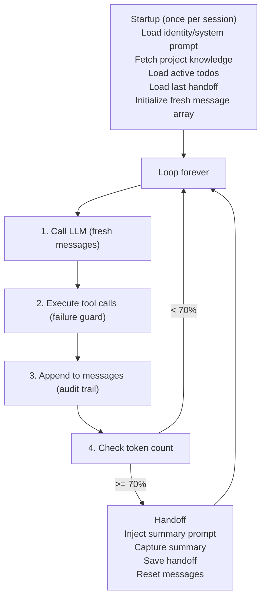
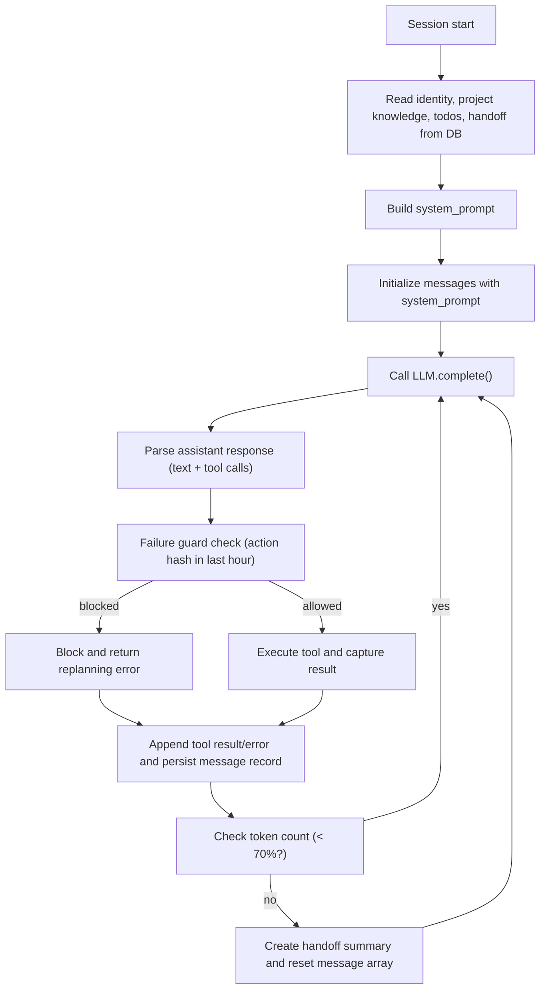
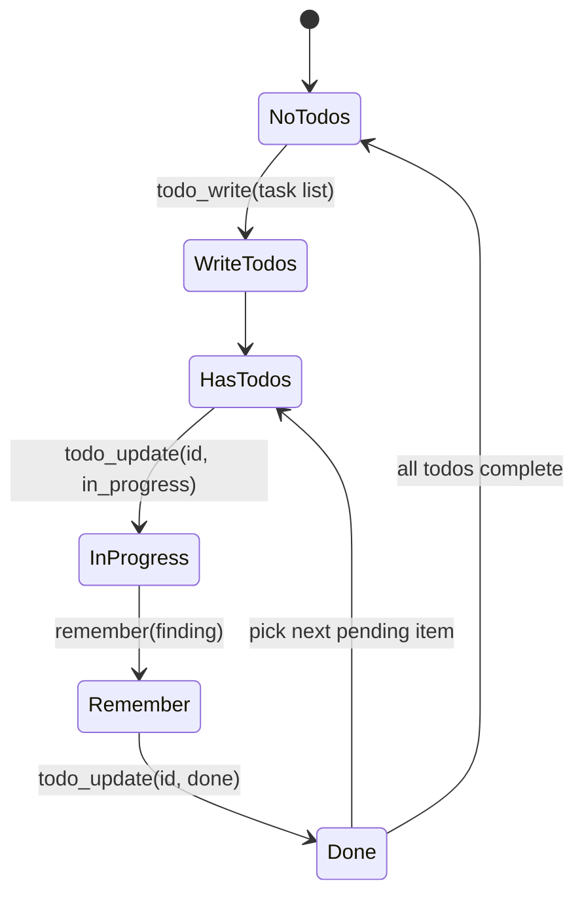

# 1. Title

**The Infinite Agent: One Loop, Fresh Messages, State in Database**

# 2. Executive Summary

- **Core principle:** An autonomous agent running forever does not need sophisticated memory—it needs a simple state machine enforced via prompt discipline.
- **Single infinite loop:** `load_system_prompt() → call_llm() → execute_tools() → check_token_count() → handoff_if_needed() → repeat`
- **State lives in database, not RAM:** Every todo, every finding, every failure is persisted. The agent always loads from disk.
- **Fresh messages every context window:** No cumulative prompt bloat. Messages array is ephemeral; system prompt is the real memory.
- **Core memory tools in this runtime skeleton:** `todo_write`, `todo_update`, `remember`, `forget` keep long-running state synchronized; domain/network tools are additional and separate.
- **Handoff at 70% tokens:** When context fills, inject a single reflection prompt, capture response, reset messages, continue.
- **Failure guard before execution:** Hash-based detection blocks repeated tool failures; forces replan.
- **Network safety boundary:** In Hyperfluid deployments, network-mutating tool calls still require typed `action_plan`/`action_plan_id` and policy-gate approval.
- **No hidden complexity:** The entire runtime fits on one screen. All sophistication is in prompt language and database schema design.

# 3. System Overview

### Problem

Standard agent frameworks assume short-lived sessions:
- Context is cumulative (grows until it breaks)
- State lives in RAM (dies on crash)
- Agents must fit entire history into finite token window
- Long-running agents eventually forget or loop

### Solution: One Infinite Loop, State in Database



### Constraints

- Agent must recover from crash and resume without human intervention
- Todo list can never be empty; if cleared, agent must discover/create new goals
- Repeated tool failures must be blocked before execution, not after
- Long-term knowledge (findings, patterns) must outlive individual sessions
- Prompts must never exceed context window
- External messages/events must be treated as untrusted input and pass ingress budgets before entering prompt context
- SQLite state in this document is per-agent local runtime state, not shared protocol consensus state.

# 4. Architecture (CRITICAL SECTION)

### 4.1 Runtime Loop (Pseudocode)

```python
def startup():
    system_prompt = build_system_prompt(
        identity_block(),
        project_knowledge_block(),
        current_todos_block(),
        last_handoff_block()
    )
    messages = [{"role": "user", "content": system_prompt}]
    return system_prompt, messages

def infinite_loop(llm_client, db):
    system_prompt, messages = startup()
    
    while True:
        # 1. Call LLM
        response = llm_client.complete(messages)
        messages.append({"role": "assistant", "content": response})
        
        # 2. Execute tool calls (with failure guard)
        for tool_call in response.tool_calls:
            if should_block_tool(db, tool_call):
                error = f"Tool {tool_call.name} blocked: repeated failures"
                messages.append({"role": "user", "content": error})
                record_blocked_call(db, tool_call)
            else:
                result = execute_tool(tool_call)
                messages.append({"role": "user", "content": result})
                record_execution(db, tool_call, result)
        
        # 3. Check token count
        token_count = count_tokens(system_prompt, messages)
        max_tokens = get_context_limit()
        
        if token_count >= 0.70 * max_tokens:
            # Handoff: inject reflection prompt
            reflection_prompt = (
                "You are approaching context limit. Summarize in detail: "
                "what you've accomplished, what's in progress, important "
                "findings, and exactly what to do next (file names, "
                "line numbers, decisions). This becomes your memory."
            )
            messages.append({"role": "user", "content": reflection_prompt})
            response = llm_client.complete(messages)
            
            # Save handoff and reset
            db.execute(
                "INSERT INTO handoffs (ts, summary) VALUES (?, ?)",
                (now(), response)
            )
            messages = []  # Reset
            system_prompt, messages = startup()
```

### 4.2 Database Schema

```sql
PRAGMA journal_mode = WAL;
PRAGMA synchronous = NORMAL;

-- Full message log (audit trail, never used for prompt building)
CREATE TABLE messages (
  id       INTEGER PRIMARY KEY,
  ts       INTEGER NOT NULL,
  session  TEXT NOT NULL,
  role     TEXT NOT NULL,  -- user|assistant
  content  TEXT NOT NULL   -- full JSON or text
);
CREATE INDEX idx_messages_session ON messages(session);

-- Todo list (single active list per session)
CREATE TABLE todos (
  id       INTEGER PRIMARY KEY,
  ts       INTEGER NOT NULL,
  item     TEXT NOT NULL,
  status   TEXT NOT NULL DEFAULT 'pending',  -- pending|in_progress|done|blocked
  context  TEXT                              -- optional note
);
CREATE INDEX idx_todos_status ON todos(status);

-- Project knowledge (permanent, curated, persistent across sessions)
CREATE TABLE project_knowledge (
  id      INTEGER PRIMARY KEY,
  ts      INTEGER NOT NULL,
  kind    TEXT NOT NULL,   -- finding|pattern|constraint|decision
  content TEXT NOT NULL    -- concise, searchable
);
CREATE INDEX idx_pk_kind ON project_knowledge(kind);

-- Context window handoffs (summary at session boundaries)
CREATE TABLE handoffs (
  id      INTEGER PRIMARY KEY,
  ts      INTEGER NOT NULL,
  summary TEXT NOT NULL    -- agent's own reflection
);

-- Failure guard (prevent repeated bad actions)
CREATE TABLE failures (
  id          INTEGER PRIMARY KEY,
  ts          INTEGER NOT NULL,
  action_hash TEXT NOT NULL,  -- hash(tool_name + normalized_params)
  error_msg   TEXT
);
CREATE INDEX idx_failures_hash_ts ON failures(action_hash, ts);
```

### 4.3 Data Flow (Complete Session)



### 4.4 System Prompt Template (Every Session)

```text
[IDENTITY]
You are an autonomous agent working continuously on this project.
Your job is to maintain a todo list and work through it. If the list
is empty, your first task is to explore the codebase and create a list
of concrete tasks before doing anything else.

[PROJECT KNOWLEDGE]
{rows from project_knowledge, newest first, limited to ~500 tokens}
{If empty: "No stored findings yet. Document important discoveries as you go."}

[CURRENT TODO LIST]
{All rows where status != 'done', formatted as checklist with IDs}
{If empty: "NO ACTIVE TODOS. Discover and create a new list immediately."}

[LAST HANDOFF (if any)]
{Most recent row from handoffs, or empty if first session}

[RECENT CONTEXT]
{Last N messages (excluding this system setup), filling remaining token budget}

---

You have four core tools for memory management:
- todo_write: Replace entire todo list when starting a new task group.
- todo_update: Mark items in_progress, done, or blocked as you work.
- remember: Store a permanent finding (pattern, constraint, decision).
- forget: Delete outdated or wrong knowledge.

Use them to keep your state synchronized with the database.
Domain and network tools can also exist; network-mutating tools are gated separately by typed action plans and network policy checks.
```

# 5. Core Mechanisms

### 5.1 Todo State Machine (Enforced by Prompt)



The system prompt enforces this cycle. No code checks needed—the agent is told "always have a list, always mark progress, when done make a new one."

### 5.2 Handoff Mechanism (Context Window Boundary)

At 70% token utilization:

1. **Inject reflection prompt** (one user message):
   ```text
   You are approaching your context limit (token X / Y).
   Summarize in detail:
   - What you accomplished this session
   - What is currently in_progress
   - Important findings or patterns discovered
   - Exactly what to do next (file names, line numbers, code changes needed)
   Be specific. This summary becomes your memory for the next session.
   ```

2. **Capture response** → write to `handoffs` table with timestamp

3. **Reset messages** → empty the ephemeral message array

4. **Rebuild system prompt** → includes the new handoff as `[LAST HANDOFF]`

5. **Continue** → agent has zero discontinuity; it wrote its own memory in its own words

### 5.3 Failure Guard (Pre-Execution Check)

```python
def should_block_tool(db, tool_call):
    """Check if this action has failed recently"""
    normalized_params = normalize_params(tool_call.params)
    action_hash = hash(tool_call.name + normalized_params)
    
    recent_count = db.scalar(
        """SELECT COUNT(*) FROM failures 
           WHERE action_hash=? AND ts>?""",
        action_hash, now() - 3600  # Last hour window
    )
    
    return recent_count >= 3  # Block after 3 failures

def execute_with_guard(db, tool_call):
    if should_block_tool(db, tool_call):
        # Don't execute; inject into messages
        error = (
            f"Tool '{tool_call.name}' has failed 3+ times with these params "
            f"in the last hour. Replan: try a different approach."
        )
        return {"error": error, "blocked": True}
    
    try:
        result = execute_tool(tool_call)
        return {"success": True, "result": result}
    except Exception as e:
        db.execute(
            "INSERT INTO failures (ts, action_hash, error_msg) VALUES (?, ?, ?)",
            (now(), hash(tool_call.name + ...), str(e))
        )
        return {"success": False, "error": str(e)}
```

### 5.4 Project Knowledge Accumulation (remember/forget)

**remember tool call:**
```python
def handle_remember(db, kind, content):
    """Store permanent project knowledge"""
    db.execute(
        "INSERT INTO project_knowledge (ts, kind, content) VALUES (?, ?, ?)",
        (now(), kind, content)
    )
    # Next session will include this in [PROJECT KNOWLEDGE] block

# Agent calls:
# {
#   "name": "remember",
#   "arguments": {
#     "kind": "finding",
#     "content": "The authentication system uses JWT tokens stored in memory, not localStorage"
#   }
# }
```

**forget tool call:**
```python
def handle_forget(db, id):
    """Remove outdated knowledge"""
    db.execute("DELETE FROM project_knowledge WHERE id=?", (id,))
```

# 6. Design Decisions & Tradeoffs

### Tradeoff 1: Stateful Loop vs Request-Response

- **Option A: Request-Response (traditional)**
  - Agent runs once per user message
  - State implicit in conversation history
  - Scales to many concurrent sessions easily
  - Problem: History grows unbounded; agent forgets

- **Option B: Stateful Infinite Loop (chosen)**
  - Agent runs once, continuously
  - State explicit in database, not conversation
  - Fresh message array per context window
  - Problem: Only one agent per process

- **Why chosen**
  - For truly autonomous agents, one-per-process is fine
  - Avoids the unbounded history problem entirely
  - Agent experience is continuous, not fragmented by session boundaries

### Tradeoff 2: Cumulative vs Fresh Message Array

- **Option A: Cumulative messages (traditional chat)**
  - Append every response
  - Natural conversation flow
  - Problem: fills context window; agent forgets

- **Option B: Fresh array per handoff (chosen)**
  - Reset messages at 70% token utilization
  - Agent writes its own memory via handoff
  - Problem: requires reflection prompt discipline

- **Why chosen**
  - Handoff is explicit, human-readable
  - Forces agent to synthesize and summarize
  - Prevents token creep

### Tradeoff 3: Explicit Tools vs Implicit State Updates

- **Option A: Implicit (agent modifies DB directly)**
  - Agent calls SQL directly
  - Fastest, most flexible
  - Problem: no audit trail, schema contracts unclear

- **Option B: Explicit tools (chosen)**
  - Agent calls `todo_write`, `todo_update`, `remember`, `forget`
  - Every state change is a tool call in message log
  - Audit trail + type safety

- **Why chosen**
  - Debugging is trivial (replay message log)
  - Tool schemas define state contracts
  - LLM sees explicit affordances

### Tradeoff 4: Pre-Execution Guard vs Post-Failure Recovery

- **Option A: Post-failure recovery**
  - Let tool call execute; catch errors
  - Problem: wasted time, side effects may have happened

- **Option B: Pre-execution guard (chosen)**
  - Check failure hash before running tool
  - Block repeated failures; force replan
  - Problem: requires accurate action normalization

- **Why chosen**
  - Prevents infinite loops
  - Cheaper than repeated execution
  - Forces LLM to adapt strategy

### Tradeoff 5: Permanent Knowledge vs Session-Only Knowledge

- **Option A: Session-only**
  - All knowledge dies after session
  - Simpler code, less storage
  - Problem: agent relearns same things every session

- **Option B: Permanent project knowledge (chosen)**
  - `project_knowledge` table persists across sessions
  - Agent can `remember` and `forget`
  - Problem: knowledge can become stale

- **Why chosen**
  - Enables true learning and growth
  - Agent accumulates expertise over time
  - Crucial for long-running projects

# 7. Failure Modes & Edge Cases

### 7.1 Empty Todo List (No Work to Do)

- **What happens**
  - Agent loads todo list; it's empty or all marked done
- **Why it happens**
  - Agent completed everything; project is stable
- **Handling**
  - System prompt says: "If list is empty, discover and create a new one"
  - Agent queries codebase, identifies gaps/improvements, calls `todo_write`

### 7.2 Repeated Tool Failure Loop

- **What happens**
  - Agent repeatedly calls same tool with same params
  - Tool fails 3+ times in 1 hour
- **Why it happens**
  - Agent misunderstands tool contract or environment is broken
- **Handling**
  - Failure guard blocks execution
  - Agent receives message: "Tool X blocked, replan"
  - Agent adapts: "I'll use tool Y instead" or "I need to prepare differently"

### 7.3 Crash Mid-Session

- **What happens**
  - Process dies; agent restarts
- **Why it happens**
  - Power loss, OOM, unhandled exception
- **Handling**
  - SQLite WAL recovers committed rows
  - On restart: load last handoff, rebuild system prompt, continue
  - Messages in progress are lost (they're ephemeral)
  - Todos in `in_progress` remain marked that way (agent resumes them)

### 7.4 Context Window Fills Unexpectedly

- **What happens**
  - Tokens exceed limit before 70% check
- **Why it happens**
  - Tool result was very large, or many tool calls
- **Handling**
  - Trigger handoff early (monitor at ~65%)
  - Truncate large results before appending to messages

### 7.5 Handoff Summary is Vague

- **What happens**
  - Agent writes generic summary; lacks concrete details
- **Why it happens**
  - LLM's reflection prompt not specific enough
- **Handling**
  - System prompt reinforces: "Be specific: file names, line numbers, exact code changes"
  - Review handoff quality; adjust reflection prompt if pattern emerges

### 7.6 Knowledge Accumulation Grows Too Large

- **What happens**
  - After many sessions, `project_knowledge` has 100+ rows
  - System prompt becomes huge
- **Why it happens**
  - Agent keeps remembering things; never forgets
- **Handling**
  - Truncate to newest N rows (default ~20)
  - Agent can explicitly `forget` outdated knowledge
  - Periodic curation: review oldest rows, delete stale findings

### 7.7 Untrusted Event Flood

- **What happens**
  - External event queue floods with low-value or malicious messages
  - Agent spends cycles triaging noise instead of execution
- **Why it happens**
  - Open participation and missing ingress quotas/prioritization
- **Handling**
  - Enforce sender and topic token buckets before enqueue
  - Inject only compact signal summaries into prompt, never full payload by default
  - Apply quarantine to repeated abusive senders and reserve slots for high-priority trusted events

# 8. Scalability Analysis

### Single Agent (One Process)

- **Typical setup**
  - One Python/Rust process, infinite loop
  - SQLite file on local disk
  - One OpenAI API account (or similar LLM provider)

- **Limits**
  - Throughput: ~1 tool call per 5-30 seconds (depends on tool complexity)
  - Knowledge growth: unbounded but manageable (trim old rows)
  - Crash recovery: automatic via SQLite WAL

- **Cost**
  - LLM API: dominant cost (1-2 calls per minute typically)
  - Storage: negligible (SQLite files stay <100MB for months of work)
  - Compute: minimal (wait-bound on LLM API)

### Multi-Agent (Shared Knowledge Base)

- **Setup**
  - Multiple agent processes, same SQLite file (via network or NFS)
  - Each agent has its own todo list partition (by project or agent_id)
  - Shared project_knowledge table

- **Challenges**
  - SQLite write concurrency (WAL helps but still serialized)
  - Todo list coordination (agent 1's todo affects agent 2's workload)
  - Knowledge consistency (one agent's finding must not conflict with another's)

- **Scaling approach**
  - Per-agent SQLite files (no sharing)
  - Central metadata service for task distribution
  - Async handoff export to shared knowledge DB

### Fleet of Agents

- **At scale (10+ agents)**
  - Each agent: local SQLite + in-process LLM adapter
  - Distributed system for:
    - Central task queue (what should agents work on?)
    - Shared knowledge aggregation (findings from all agents)
    - Crash recovery and health checks

- **This doc covers single agent only** (sufficient for most use cases)

# 9. Recommended Architecture

**Use exactly as described:**

- **Runtime**
  - One infinite loop (startup -> repeat forever)
  - Fresh message array at handoff (70% token limit)
  - LLM adapter for OpenAI (or similar provider)

- **Storage**
  - SQLite with WAL mode and NORMAL synchronous
  - Five tables: messages, todos, project_knowledge, handoffs, failures

- **Tools (memory management only)**
  - `todo_write`: Replace entire list
  - `todo_update`: Mark items in progress/done/blocked
  - `remember`: Store permanent finding
  - `forget`: Delete outdated knowledge

- **System Prompt**
  - Identity block (fixed)
  - Project knowledge (newest N rows)
  - Current todos (all status != done)
  - Last handoff (most recent or empty)
  - Recent messages (filling remaining budget)

- **Handoff**
  - At 70% tokens, inject one reflection prompt
  - Save response to handoffs table
  - Reset messages; continue

- **Failure Guard**
  - Before every tool call, check `failures` table
  - Block if action_hash failed 3+ times in last hour
  - Force agent to replan

**This is optimal because:**
- Simplicity (entire runtime fits on one screen)
- Durability (SQLite, no external dependencies)
- Observability (all messages logged, full audit trail)
- Autonomy (agent experiences zero discontinuity across handoffs)
- Resilience (crash recovery automatic, loops prevented)

# 10. Implementation Plan

### Phase 1: Basic Loop (Day 1)

- Create SQLite schema (no tools yet)
- Implement `startup()`: build system prompt from DB rows
- Implement loop: call LLM -> parse response -> repeat
- Test with minimal todo list and one simple tool (for observation only)

### Phase 2: State Tools (Day 2)

- Implement `todo_write` (replace entire list)
- Implement `todo_update` (mark status + context)
- Implement `remember` (insert to project_knowledge)
- Implement `forget` (delete from project_knowledge)
- Test state persistence across loop iterations

### Phase 3: Failure Guard (Day 3)

- Implement `action_hash` normalization
- Implement pre-execution check (`should_block_tool`)
- Record failures to database
- Test loop prevention: repeated failures trigger block

### Phase 4: Handoff Mechanism (Day 4)

- Implement token counting (integrate with LLM client)
- Implement 70% threshold check
- Implement reflection prompt injection
- Implement handoff capture and reset
- Test full handoff cycle

### Phase 5: System Prompt Assembly (Day 5)

- Implement knowledge block builder (newest N rows with token budget)
- Implement todo block builder (all non-done, with checklist formatting)
- Implement handoff block builder (most recent or "none")
- Test complete system prompt assembly with realistic data

### Phase 6: Production Hardening (Days 6-7)

- Add observability: log all messages, all tool calls, all handoffs
- Add health checks: detect infinite loops, stalled agent
- Add graceful error handling: tool exceptions don't crash loop
- Add config file: context limit, handoff threshold, retry logic
- Test crash recovery and restart

# 11. Future Improvements

- **Confidence scoring on todo items** — agent marks confidence for each task; prioritize high-confidence work
- **Adaptive handoff threshold** — adjust 70% based on tool execution patterns
- **Handoff chain visibility** — render full history of handoffs as context for debugging
- **Knowledge curation interface** — human approves/edits project_knowledge before agent uses it
- **Domain-specific tool plugins** — swap tool sets based on project type (e.g., code tools vs data tools)
- **Multi-project context** — agent switches between projects; per-project todo lists and knowledge
- **Failure pattern analysis** — detect repeated failure patterns; suggest systemic fixes
- **Performance profiling** — track LLM API costs, tool latency, handoff frequency; optimize
- **Human feedback integration** — agent requests clarification on ambiguous todos; human adds context
- **Replay and debugging** — re-run full session from message log; inspect state at any point


