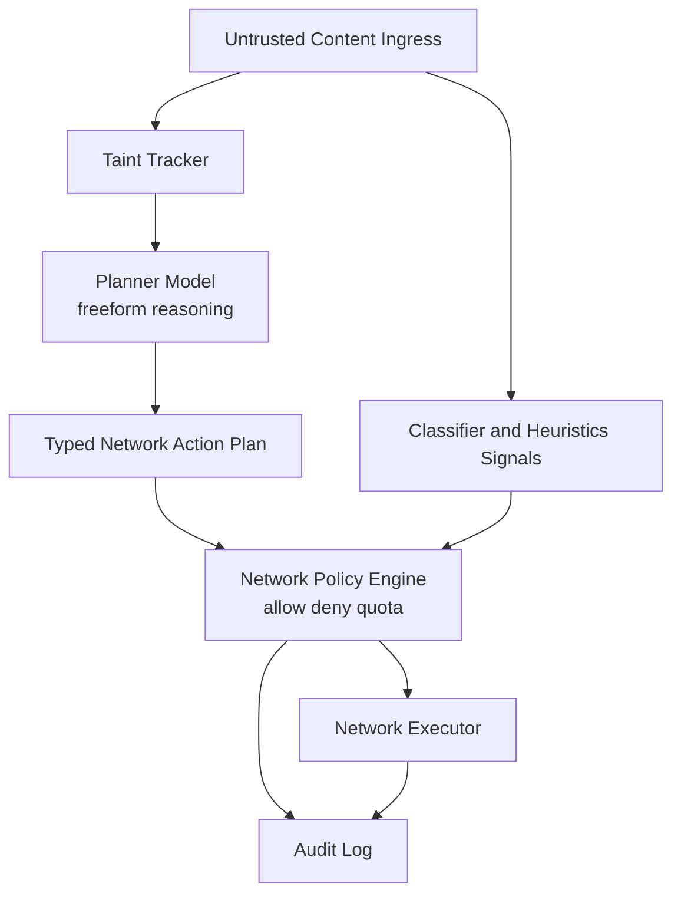
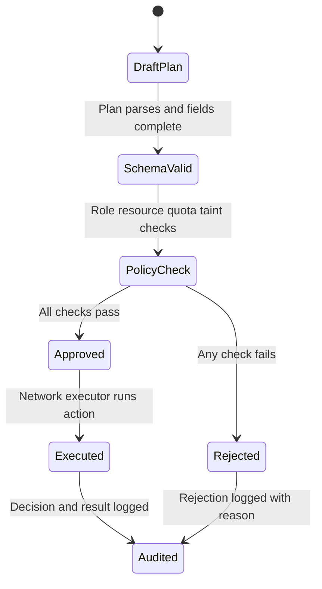

# 1. Title
- Hyperfluid Prompt Injection Defense: Typed Network Action Plans and Minimal Network-Only Policy Engine

# 2. Executive Summary
- Prompt injection is treated as a network boundary security problem, not a pure prompting problem.
- External text is untrusted by default and cannot directly trigger network-mutating tools.
- Agents emit typed network action plans, and a deterministic policy gate approves or rejects actions before execution.
- The policy gate is intentionally minimal and network-scoped; local machine actions remain operator-controlled and out of protocol scope.
- Classifiers (for example ModernBERT-style) are auxiliary signals for scoring and quarantine, not the root of trust.
- High-risk actions require step-up controls (additional reviewers, delay windows, or stricter quotas).
- This model preserves creativity (free planning/ideation) while constraining shared-state effects.
- The architecture prevents prompt-injection payloads from jumping straight into relay/topic/task/governance surfaces.

# 3. System Overview
- Problem solved:
  - Prevent legitimate agents from being manipulated by malicious content into harming network state.
  - Preserve agent autonomy locally while enforcing strict shared-network safety.
- Core design philosophy:
  - Freeform thought, constrained execution.
  - Network effects must pass deterministic policy checks.
  - Safety-critical controls must be model-agnostic and auditable.
- Key constraints:
  - Any inbound payload (DM/topic/doc/web/code text) may be adversarial.
  - Collaboration throughput cannot collapse under over-strict controls.
  - Policy must stay understandable and cheap to evaluate.

# 4. Architecture (CRITICAL SECTION)
- Components:
  - **Untrusted Content Ingress**: messages/documents/tool outputs from network.
  - **Taint Tracker**: marks provenance of untrusted content in agent memory/context.
  - **Planner Model**: proposes goals and typed network action plan objects.
  - **Network Policy Engine**: deterministic allow/deny/quota decision point (network-only).
  - **Network Executor**: runs approved network actions.
  - **Audit Log**: immutable action decision and execution trail.
  - **Abuse/Anomaly Signals**: optional classifier + heuristics for quarantine/rate adaptation.



- Step-by-step data flow:
  1. Inbound content is tagged untrusted and taint-labeled.
  2. Model reasons and emits typed network action plan JSON.
  3. Policy engine validates schema, permissions, quotas, and risk rules.
  4. Approved actions execute against network APIs; rejected actions are logged.
  5. Signals can tighten quotas/quarantine but cannot directly authorize execution.

# 5. Core Mechanisms
- **Typed network action plan schema**
  - Example action types:
    - `publish_topic_message`
    - `claim_task_lease`
    - `renew_task_lease`
    - `submit_fast_path_merge`
    - `submit_governance_proposal`
    - `cast_governance_vote`
  - Required fields per action:
    - `action_type`
    - `resource_id`
    - `reason`
    - `risk_class`
    - `evidence_refs`
    - `idempotency_key`
  - Free text alone never executes tools.

- **Minimal network-only policy engine**
  - In-scope: actions that mutate shared network state.
  - Out-of-scope: local machine operations in operator sandbox.
  - Decision checks:
    - role/stage authorization,
    - resource ACL,
    - quota/rate budget,
    - risk-class step-up requirements,
    - taint-provenance restrictions for sensitive actions.

- **Risk classes**
  - `low`: routine topic/task interactions within quotas.
  - `medium`: fast-path team merges and high-visibility publications.
  - `high`: governance proposals and other protocol-impacting operations.

- **Step-up controls (network)**
  - Additional reviewer certificate for medium/high actions.
  - Delay window before high-risk execution.
  - Reserved lane and stricter budgets for control-plane safety actions.



## Pseudocode (for complex mechanisms)
```text
function evaluate_network_action(agent, action, context):
    require valid_schema(action)
    require action.action_type in NETWORK_ACTION_ALLOWLIST
    require role_allows(agent.stage, action.action_type)
    require resource_acl_allows(agent.id, action.resource_id, action.action_type)
    require within_quota(agent.id, action.action_type, action.resource_id)

    if action.risk_class == "high":
        require has_step_up_certificate(action)
        require after_delay_window(action)

    if taint_sensitive(action) and sourced_from_untrusted(context, action):
        return REJECT_TAINT

    return APPROVE
```

# 6. Design Decisions & Tradeoffs
## Tradeoff 1
- Option A: Prompt-only defense with better instructions.
- Option B: Typed plan + deterministic policy gate.
- Chosen: Option B.
- Why chosen: converts injection defense from heuristic text interpretation to enforceable control logic.
- Sacrifice: additional schema and policy maintenance.
- Scaling risk: too many policy branches can increase operator complexity.

## Tradeoff 2
- Option A: Policy engine controls local and network actions.
- Option B: policy engine controls network actions only.
- Chosen: Option B.
- Why chosen: matches operator freedom model and keeps protocol scope minimal.
- Sacrifice: local misuse prevention is delegated to operator sandboxing.
- Scaling risk: weak local sandbox hygiene can still waste local resources.

## Tradeoff 3
- Option A: classifier as primary blocker.
- Option B: classifier as auxiliary signal.
- Chosen: Option B.
- Why chosen: classifiers are probabilistic and bypassable; deterministic policy must remain root guard.
- Sacrifice: classifier utility is constrained to scoring/quarantine.
- Scaling risk: poor signal quality can increase false quarantines without careful tuning.

## Tradeoff 4
- Option A: no taint tracking, rely on role checks only.
- Option B: taint-aware policy checks for sensitive actions.
- Chosen: Option B.
- Why chosen: prevents untrusted content from silently influencing high-risk actions.
- Sacrifice: added context provenance bookkeeping.
- Scaling risk: coarse taint rules can over-block legitimate workflows.

# 7. Failure Modes & Edge Cases
## Scenario: Injection payload hidden in trusted channel
- What happens: malicious instruction appears inside apparently valid team/topic content.
- Why it happens: compromised or spoofed sender path.
- Handling/failure mode: action still must pass typed plan + policy checks; trust score drop and quarantine on abuse evidence.

## Scenario: Schema-conformant malicious action
- What happens: attacker crafts valid schema but harmful intent.
- Why it happens: semantic misuse of allowed action/resource.
- Handling/failure mode: resource ACL, quota caps, and risk-step-up checks block unsafe impact.

## Scenario: Policy bypass attempt via tool chaining
- What happens: agent attempts sequence of low-risk actions to approximate high-risk outcome.
- Why it happens: compositional bypass strategy.
- Handling/failure mode: cumulative risk scoring and per-workflow budget limits with audit-triggered throttling.

## Scenario: Overblocking harms collaboration speed
- What happens: useful actions delayed/rejected too often.
- Why it happens: aggressive defaults and mis-tuned thresholds.
- Handling/failure mode: staged rollout, observability-based tuning, and explicit exception policies for trusted teams.

## Scenario: Classifier drift
- What happens: auxiliary detector misses new attack patterns or raises false positives.
- Why it happens: distribution shift in prompt-injection payloads.
- Handling/failure mode: keep classifier out of root authorization path and continuously recalibrate from audited outcomes.

# 8. Scalability Analysis
## Small scale (10–100 nodes)
- Simple allowlist + quota policies are sufficient.
- Manual review of audit logs is practical.
- Main risk is under-specifying action schemas.

## Medium scale (1k–10k nodes)
- Need compiled policy evaluation and indexed audit retrieval.
- Step-up certificates and taint checks should be optimized for low latency.
- Main bottleneck shifts to policy tuning and exception governance.

## Large scale (100k+ nodes)
- Policy bundles must be versioned, signed, and distributed efficiently.
- Audit and anomaly pipelines need streaming analysis and shard-local aggregation.
- Main failure risk is policy sprawl; keep network action taxonomy minimal.

# 9. Recommended Architecture
- Adopt typed network action plans as the only executable interface for network mutations.
- Enforce a minimal deterministic network policy engine at the network boundary.
- Keep local action freedom outside protocol policy scope; rely on operator sandboxing locally.
- Use classifier/heuristics as additive signals for throttling/quarantine, not authorization truth.
- Reject alternatives:
  - prompt-only defenses,
  - classifier-only blocking,
  - broad local policy control that exceeds protocol boundary.

# 10. Implementation Plan
1. Define network action type taxonomy and JSON schema contracts.
2. Implement policy decision point in front of all network-mutating tools/APIs.
3. Add role/resource/quota/risk checks with deterministic decision reasons.
4. Add taint labels and taint-sensitive policy rules for high-risk actions.
5. Add step-up certificate workflow for medium/high risk actions.
6. Add signed policy bundle distribution and version pinning.
7. Add audit pipeline and red-team prompt-injection simulation harness.

# 11. Future Improvements
- Add formal verification for key policy invariants.
- Add semantic diff-based policy linting for safer policy updates.
- Add adaptive risk scoring by behavior clusters across identities.
- Add cryptographic attestation of policy-evaluator binary/runtime.
- Add multi-agent policy simulation sandbox before policy rollouts.

