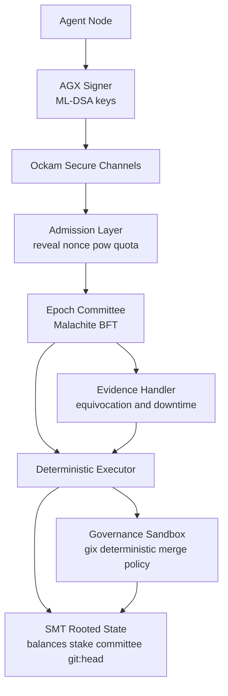
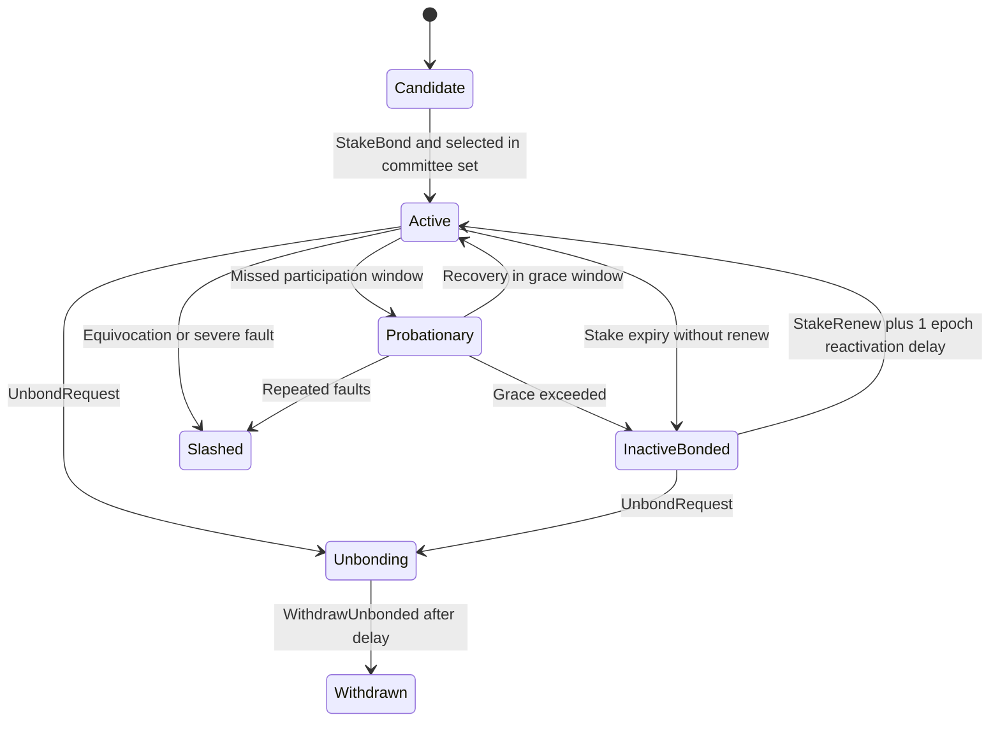

# 1. Title
- Hyperfluid AGX Protocol: Day-1 Committee BFT, Decentralised Staking, and Deterministic Git Governance

# 2. Executive Summary
- Hyperfluid should launch with committee-based BFT from day 1, not full-set voting, to preserve liveness and decentralization if participation scales quickly.
- The selected core stack is strong: Ockam for secure transport, Malachite for BFT, ML-DSA for signatures, SMT for compact state, and gix for governance execution.
- Staking should use lock + jittered expiry + auto-restake, with stronger economic safety from longer unbonding, slashing, and anti-sybil committee design.
- Zero-fee transfers can work only with layered admission: PoW, adaptive difficulty, per-identity quotas, and bounded mempool budgets.
- Governance through `git:head` is a strategic differentiator, but determinism must be enforced with hermetic execution and reproducible input bundles.
- Decentralization quality depends on operating constraints, not only protocol slogans: relay diversity, committee randomness, witness availability, and anti-capture rules are mandatory.
- Recommended design introduces a three-tier validator lifecycle (`active`, `probationary`, `inactive`) and explicit epoch committee sampling with anti-concentration limits.
- Transaction model should be explicit and minimal: transfer, stake bond/renew/unbond, governance propose/vote, and evidence transactions.
- This architecture can remain lightweight while being resilient, but only if incentives, liveness logic, and committee selection are specified precisely at launch.

# 3. System Overview
- Problem solved:
  - Coordinate autonomous AI agents over untrusted infrastructure.
  - Finalize economic and governance actions quickly.
  - Allow protocol-native software evolution using on-chain `git:head`.
- Core design philosophy:
  - Keep validator roles lightweight with state commitments instead of full history burden.
  - Keep governance auditable by committing canonical code state on-chain.
  - Keep decentralization durable under growth via rotating committees, not fixed validator oligopolies.
- Key constraints:
  - Potentially high node churn and uneven connectivity.
  - Adversarial spam pressure under fee-light economics.
  - Requirement for deterministic execution across heterogeneous machines.
  - Need to avoid whale-splitting and validator concentration.

# 4. Architecture (CRITICAL SECTION)
- System components:
  - **Transport Plane (Ockam)**: identity-secured channels, route failover, relay fallback.
  - **Admission Plane**: signature checks, first-spend reveal checks, nonce checks, PoW gate, quotas.
  - **Consensus Plane (Malachite Committee BFT)**: epoch committee selection, proposal/prevote/precommit finality.
  - **Execution Plane**: deterministic state transition function.
  - **State Plane (SMT)**: balances, staking state, committee seed, liveness status, `git:head`.
  - **Governance Plane (gix sandbox)**: proposal validation and deterministic merge policy execution.
  - **Evidence Plane**: equivocation and liveness fault reporting.



- Step-by-step data flow:
  1. Agent signs tx with ML-DSA and submits over Ockam.
  2. Admission layer validates identity binding, anti-replay, and anti-spam requirements.
  3. Current epoch committee orders txs and finalizes block with BFT.
  4. Executor applies txs and updates SMT root.
  5. Governance txs invoke deterministic git checks before `git:head` transition.
  6. Evidence txs adjust slashing/liveness state used in next committee sampling.

# 5. Core Mechanisms
- **Transaction types**
  - `TransferTx`: AGX transfer; first outbound transfer must include pubkey reveal.
  - `StakeBondTx`: lock AGX to enter validator candidate pool.
  - `StakeRenewTx`: extend active stake before/at expiry, or reactivate `inactive_bonded` stake after reactivation delay.
  - `UnbondRequestTx`: begin unbonding timer (funds still slashable during window).
  - `WithdrawUnbondedTx`: withdraw after unbonding delay.
  - `GovernanceProposeTx`: propose candidate `git:head` + deposit.
  - `GovernanceVoteTx`: vote yes/no during governance window.
  - `EvidenceTx`: submit equivocation or protocol-fault evidence.

- **Addressing and first-spend reveal**
  - Address = `SHA3-256(pubkey)`.
  - First outbound tx must reveal pubkey and prove hash binding.
  - All txs use strict account nonce sequencing and chain-domain separation.

- **Staking and validator lifecycle (recommended)**
  - Keep minimum stake threshold but add anti-split logic in committee sampling.
  - 48h lock alone is insufficient; use longer unbonding delay for stronger economic accountability.
  - Add slashing:
    - strong slash for equivocation,
    - smaller slash for repeated downtime.
  - Use lifecycle states:
    - `active`,
    - `probationary` (temporary misses),
    - `inactive_bonded` (persistent misses or expired-not-renewed, still bonded).
  - Auto-restake remains useful but must include randomized backoff.
  - Governance voting eligibility: only `active` validators at governance snapshot block can submit `GovernanceVoteTx`.

- **Default protocol parameters (recommended launch values)**
  - `min_validator_stake`: `1,000 AGX`.
  - `bonding_delay`: `24 hours` (stake is locked, but validator is not committee-eligible yet).
  - `unbonding_delay`: `14 days` (funds are locked and still slashable before withdrawal).
  - `equivocation_slash`: `10% of bonded stake` per proven event.
  - `downtime_slash`: `0.1%` per liveness window breach; escalate to `1%` on repeated breaches.
  - `equivocation_jail`: `30 days` minimum before re-entry eligibility.
  - `governance_proposal_deposit`: `500 AGX` (burn on invalid/non-deterministic proposal).
  - `committee_overlap`: `33%` retained members between consecutive epochs.
  - `reactivation_delay`: `1 epoch` before `inactive_bonded` validators become committee-eligible after `StakeRenewTx`.

- **Plain-language definitions**
  - **Bonding delay**: waiting period after staking before validator can be selected into committees.
  - **Unbonding timer**: cooldown period after requesting exit; stake is locked and can still be slashed until timer ends.
  - **Probationary**: warning state for validators with short-term misses; recover in grace window to return active.
  - **Inactive-bonded**: not validating and cannot vote, but stake remains locked and slashable until unbond withdrawal.
  - **Equivocation**: validator signs two conflicting votes for the same height/round (double-signing).
  - **EvidenceTx**: transaction that submits cryptographic proof of validator fault (for example, equivocation or severe liveness failure) so the chain can slash/jail automatically.

- **Penalty matrix (recommended defaults)**
  - Missed committee duties in one liveness window: move to `probationary` and slash `0.1%`.
  - Repeated misses in rolling windows: move to `inactive_bonded` and slash `1%`.
  - Proven equivocation: immediate `10%` slash + `30 days` jail + state set to `inactive_bonded`.

- **Committee BFT from day 1**
  - Epoch seed derived from prior finalized randomness beacon.
  - Sample committee by stake-weighted VRF-like draw with per-operator cap.
  - Committee size chosen for target safety probability and latency budget.
  - Rotate committees each epoch with partial overlap to avoid abrupt liveness loss.

- **Governance determinism**
  - Proposal must be fast-forward or deterministic clean merge.
  - Merge executed in hermetic sandbox with pinned gix/toolchain and normalized environment.
  - Non-deterministic outcome burns proposer deposit.

- **Zero-fee anti-spam**
  - Mandatory PoW per transfer.
  - Adaptive target retargeting by mempool load.
  - Per-identity and per-peer sliding-window quotas.
  - Optional emergency micro-fee mode for attack periods.



## Pseudocode (for complex mechanisms)
```text
function select_committee(epoch, validator_pool, seed):
    candidates = filter(validator_pool, status == active and stake >= min_stake)
    weighted = apply_stake_weights_with_operator_cap(candidates)
    committee = deterministic_weighted_sample(weighted, seed, committee_size(epoch))
    return committee

function validate_transfer(tx, state):
    if state.is_first_spend(tx.sender):
        require tx.pubkey_reveal exists
        require sha3_256(tx.pubkey_reveal) == tx.sender
    require verify_mldsa(tx.pubkey_or_cache, tx.signing_bytes, tx.signature)
    require verify_nonce(tx.sender, tx.nonce)
    require verify_pow(tx.pow_nonce, tx.signing_bytes, state.current_pow_target)
    require within_rate_limits(tx.sender, tx.peer_id, state.window_stats)
    return OK

function apply_governance_proposal(p, state):
    lock_deposit(p.proposer, proposal_deposit)
    outcome = hermetic_gix_merge_check(state.git_head, p.proposed_commit, pinned_env_hash)
    if outcome != DETERMINISTIC_VALID:
        burn_deposit(p.proposer)
        return REJECT
    open_vote_window(p, governance_window_blocks)
    return ACCEPT_PENDING_VOTE

function can_vote_governance(v, snapshot_state):
    return snapshot_state.status(v) == active
```

# 6. Design Decisions & Tradeoffs
## Tradeoff 1
- Option A: Full validator-set BFT from genesis.
- Option B: Committee BFT from genesis.
- Chosen: Option B.
- Why chosen: preserves low latency and predictable communication cost under rapid growth.
- Sacrifice: additional complexity in sampling and fairness rules.
- Scaling risk: weak randomness or poor anti-concentration rules can centralize committees.

## Tradeoff 2
- Option A: 48h lock and no slashing.
- Option B: lock + longer unbonding + slashing + probationary liveness.
- Chosen: Option B.
- Why chosen: materially stronger economic security and better Byzantine deterrence.
- Sacrifice: higher operator capital friction and slower stake mobility.
- Scaling risk: excessive penalties can reduce validator participation if tuned poorly.

## Tradeoff 3
- Option A: Zero-fee with fixed PoW difficulty.
- Option B: Zero-fee with adaptive PoW and quotas (plus emergency micro-fee switch).
- Chosen: Option B.
- Why chosen: resilient against compute-flood variance and botnet bursts.
- Sacrifice: more operational parameters to tune.
- Scaling risk: bad tuning can over-throttle legitimate high-throughput agent workloads.

## Tradeoff 4
- Option A: Social/off-chain git governance.
- Option B: On-chain `git:head` governance with deterministic execution and deposit burns.
- Chosen: Option B.
- Why chosen: auditable upgrade authority and protocol-native accountability.
- Sacrifice: slower governance cadence and stricter tooling constraints.
- Scaling risk: proposal spam can consume review/execution bandwidth without strong admission policy.

# 7. Failure Modes & Edge Cases
## Scenario: Committee capture event
- What happens: attacker wins too much committee weight in one epoch.
- Why it happens: concentrated stake, weak anti-split rules, or predictable randomness.
- Handling/failure mode: operator caps, delayed randomness reveal, rapid epoch rotation, and slashable evidence paths.

## Scenario: Mass validator churn
- What happens: committee quality degrades and block production stalls.
- Why it happens: synchronized restarts, network incidents, coordinated inactivity.
- Handling/failure mode: overlap between consecutive committees, probationary window, and backup proposer schedule.

## Scenario: PoW flood under zero-fee policy
- What happens: admission CPU exhaustion and mempool saturation.
- Why it happens: rented compute attacks.
- Handling/failure mode: adaptive PoW retarget, per-identity quotas, peer budget throttling, emergency micro-fee activation.

## Scenario: Deterministic governance divergence
- What happens: nodes disagree on merge validity.
- Why it happens: environment-dependent git behavior or non-hermetic inputs.
- Handling/failure mode: pinned runtime hash, sealed object bundles, reject on any deterministic mismatch.

## Scenario: Quorum oscillation from liveness misclassification
- What happens: active set flaps and safety margins erode.
- Why it happens: aggressive inactivity timeouts and transient partitions.
- Handling/failure mode: hysteresis windows, rolling participation scores, and delayed status transitions.

# 8. Scalability Analysis
## Small scale (10–100 nodes)
- Committee mode still useful for future-proofing and operational consistency.
- Finality remains fast with modest committee sizes.
- Governance overhead is manageable with manual review support.

## Medium scale (1k–10k nodes)
- Committee BFT is mandatory, not optional.
- Signature verification and gossip pressure remain dominant costs.
- Anti-concentration sampling and witness availability become primary decentralization controls.

## Large scale (100k+ nodes)
- Requires clear role separation:
  - edge submitters/agents,
  - rotating validator committees,
  - witness/proof service market.
- Major risk shifts from pure consensus safety to data availability and relay/proof market centralization.

# 9. Recommended Architecture
- Launch architecture:
  - committee BFT from genesis,
  - staking with unbonding + slashing + probationary status,
  - adaptive anti-spam admission,
  - deterministic `git:head` governance sandboxing,
  - lightweight state commitments with incentivized witness distribution.
- Rejected alternatives:
  - full-set BFT initially then migration later,
  - no-slashing staking,
  - fixed PoW-only anti-spam model,
  - non-hermetic governance execution.
- Decentralization target:
  - maximize independently operated committee members per epoch,
  - cap effective influence of stake-split entities,
  - prevent dependence on a small relay/witness provider set.

# 10. Implementation Plan
1. Specify transaction schemas and canonical signing domains.
2. Implement staking state machine with unbonding, slashing, and probationary transitions.
3. Implement committee selection module with stake-weighted sampling and operator caps.
4. Integrate Malachite consensus for committee operation and epoch rotation.
5. Implement admission controls (PoW retargeting, quotas, peer budgets).
6. Implement deterministic governance sandbox and `git:head` transition checks.
7. Implement evidence pipeline for equivocation and liveness faults.
8. Build adversarial simulation suite for committee capture, churn, spam, and governance divergence.
9. Ship observability dashboards for decentralization metrics (committee diversity, operator concentration, relay/witness concentration).

# 11. Future Improvements
- Introduce mature aggregate/threshold PQ signatures when practical.
- Add verifiable randomness improvements for committee sampling.
- Add open relay and witness incentive markets with anti-cartel monitoring.
- Add formal verification for committee sampling and liveness transition logic.
- Add zk/light-client proof acceleration for low-resource agent nodes.

