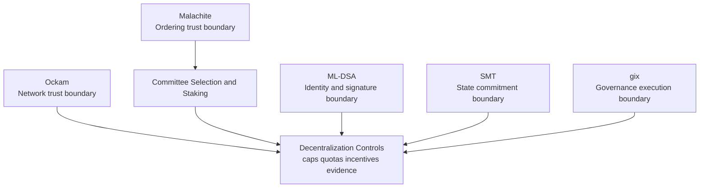
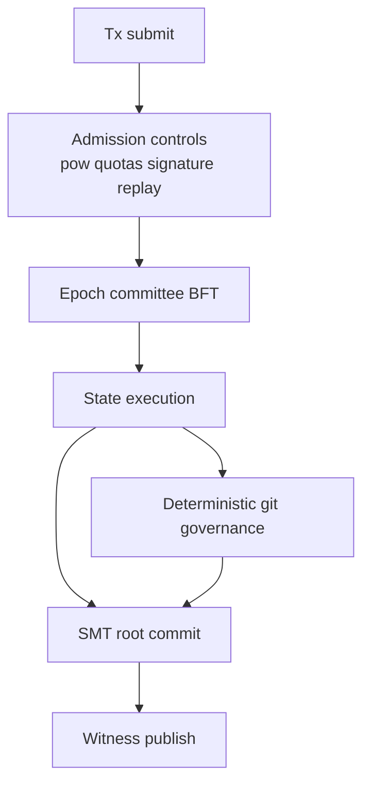

# 1. Title
- Hyperfluid Decentralization Benchmark: Library Choices, Committee BFT Readiness, and Comparative L1 Design Analysis

# 2. Executive Summary
- Hyperfluid can be as decentralized as leading PoS systems only if committee BFT, anti-concentration controls, and data-availability incentives are first-class from genesis.
- Ockam, Malachite, ML-DSA, SMT, and gix remain coherent choices, but the integration contracts around them matter more than the libraries alone.
- Malachite is promising but still alpha; this raises operational risk that must be offset with strict versioning, simulation, and rollback procedures.
- Post-quantum signatures improve long-horizon security posture but increase per-tx bandwidth and verification cost; batching and admission controls are mandatory.
- Sparse state commitments enable lightweight nodes, but decentralization fails if witness/history serving centralizes into a few operators.
- Hyperfluid’s `git:head` governance is novel and powerful, but deterministic execution must be enforced harder than most chains enforce contract determinism.
- Compared to common L1 patterns (Ethereum, Cosmos-family, Solana-family), Hyperfluid’s differentiation is protocol-governed code evolution plus agent-native economics; its risk is governance execution becoming consensus-critical.
- Recommended path: committee BFT day 1, slashing-enabled staking, adaptive anti-spam, hermetic governance, and decentralization SLOs.

# 3. System Overview
- Objective:
  - Evaluate whether the selected stack can deliver a chain that is lightweight and genuinely decentralized at high adoption.
  - Compare against proven L1 decentralization patterns to identify required hardening.
- Evaluation constraints:
  - Must scale from small launch network to very large participation without consensus redesign.
  - Must resist sybil, spam, and governance-capture attacks.
  - Must keep hardware and ops burden low enough for broad participation.

# 4. Architecture (CRITICAL SECTION)
- Evaluation model:
  - Each library maps to one protocol trust boundary.
  - Each boundary requires explicit decentralization controls.



- Component responsibilities and controls:
  - Ockam: secure routing; requires relay diversity and anti-eclipse peer rules.
  - Malachite: BFT finality; requires committee rotation and version-gated rollout.
  - ML-DSA: identity integrity; requires domain-separated signatures and DoS-resistant admission.
  - SMT: compact state; requires witness market and proof availability commitments.
  - gix: deterministic governance execution; requires hermetic and reproducible merge runtime.

# 5. Core Mechanisms
- **Comparative decentralization patterns from major chains**
  - Ethereum-style PoS: broad validator set with economic penalties and delayed exits.
  - Cosmos-family Tendermint chains: BFT finality with bounded validator set and governance specialization.
  - Solana-family high-throughput designs: performance-optimized but often hardware/network concentration risk.
  - Hyperfluid target: committee BFT with low hardware footprint plus deterministic protocol-level git governance.

- **Where Hyperfluid can be better**
  - Day-1 committee BFT avoids painful migration from full-set consensus.
  - On-chain `git:head` with deterministic sandbox creates a clearer upgrade authority trail than social-layer repo control.
  - Agent-native transaction design can optimize for autonomous workload profiles.

- **Where Hyperfluid can be worse unless fixed**
  - Zero-fee model without adaptive controls can be easier to spam than fee-market chains.
  - Stateless commitment model can centralize proof availability unless economically incentivized.
  - Committee sampling can centralize under stake splitting without anti-concentration controls.



## Pseudocode (for complex mechanisms)
```text
function decentralization_score(epoch_metrics):
    committee_entropy = shannon_entropy(epoch_metrics.operator_distribution)
    relay_hhi = herfindahl_index(epoch_metrics.relay_share)
    witness_hhi = herfindahl_index(epoch_metrics.witness_share)
    stake_capture = epoch_metrics.top_10_operator_stake
    return weighted_score(committee_entropy, 1-relay_hhi, 1-witness_hhi, 1-stake_capture)

function committee_entry_rules(candidate):
    require candidate.stake >= min_stake
    require candidate.not_jailed
    require candidate.uptime_score >= min_uptime
    require operator_effective_weight(candidate.operator) <= operator_cap
    return ELIGIBLE
```

# 6. Design Decisions & Tradeoffs
## Tradeoff 1
- Option A: Full-set BFT launch and future committee migration.
- Option B: Committee BFT from genesis.
- Chosen: Option B.
- Why chosen: avoids redesign risk and keeps communication overhead bounded from day 1.
- Sacrifice: more complexity in validator sampling and fairness logic.
- Scaling risk: poor randomness/caps can still produce committee centralization.

## Tradeoff 2
- Option A: Simple lock-only staking.
- Option B: slashing + unbonding + liveness states.
- Chosen: Option B.
- Why chosen: closer to proven economic-security patterns in mature PoS systems.
- Sacrifice: higher complexity and slower capital mobility.
- Scaling risk: too-harsh penalties can reduce validator diversity.

## Tradeoff 3
- Option A: Fee-market-first anti-spam.
- Option B: zero-fee-first with adaptive PoW/quotas and emergency fee switch.
- Chosen: Option B.
- Why chosen: aligns with autonomous agent UX while retaining attack controls.
- Sacrifice: larger tuning and operations burden.
- Scaling risk: incorrect tuning causes either spam exposure or throughput starvation.

## Tradeoff 4
- Option A: off-chain/social code governance.
- Option B: on-chain deterministic `git:head` governance.
- Chosen: Option B.
- Why chosen: explicit and auditable protocol authority.
- Sacrifice: governance pipeline becomes consensus-adjacent critical path.
- Scaling risk: if deterministic checks are brittle, governance can stall or split nodes.

# 7. Failure Modes & Edge Cases
## Scenario: Economic centralization over epochs
- What happens: same operators dominate committees repeatedly.
- Why it happens: weak operator caps or stake-splitting loopholes.
- Handling/failure mode: operator identity aggregation, effective stake caps, and diversity-aware sampling weights.

## Scenario: Relay market concentration
- What happens: network routing depends on a small relay subset.
- Why it happens: convenience defaults and no relay incentives for long tail.
- Handling/failure mode: relay rewards tied to diversity, route randomization, and client-side relay set requirements.

## Scenario: Witness/proof availability cartel
- What happens: few archive providers control state proof access.
- Why it happens: no explicit witness serving incentives.
- Handling/failure mode: witness-serving rewards, proof availability SLAs, and penalties for missing commitments.

## Scenario: Committee-targeted adaptive adversary
- What happens: attacker focuses on selected committee members after reveal.
- Why it happens: predictable committee exposure and networking metadata leakage.
- Handling/failure mode: delayed committee reveal windows, encrypted committee coordination channels, and rapid fallback proposer rotation.

## Scenario: Governance execution split
- What happens: nodes disagree on `git:head` proposal validity.
- Why it happens: non-hermetic environments or inconsistent object inputs.
- Handling/failure mode: pinned runtime hash, sealed proposal bundles, and reject-by-default on mismatch.

# 8. Scalability Analysis
## Small scale (10–100 nodes)
- Committee system can run with larger overlap for simplicity.
- Decentralization score is sensitive to operator concentration from early participants.
- Priority is policy correctness over raw throughput.

## Medium scale (1k–10k nodes)
- Committee and witness markets become dominant decentralization levers.
- Admission and verification paths need horizontal scaling.
- Governance proposal execution must be resource-isolated from block production.

## Large scale (100k+ nodes)
- Role specialization is required:
  - edge submitters,
  - committee validators,
  - relay providers,
  - witness/archive providers.
- Decentralization must be measured continuously, not assumed.
- Primary failure risk shifts from pure consensus to market concentration in supporting services.

# 9. Recommended Architecture
- Keep the selected library set, but enforce these launch requirements:
  - committee BFT from day 1 with anti-concentration sampling,
  - slashing-enabled staking with meaningful unbonding delay, `inactive_bonded` state, and 1-epoch reactivation delay,
  - governance voting restricted to `active` validators at snapshot,
  - adaptive anti-spam controls for zero-fee operation,
  - hermetic deterministic governance execution,
  - incentivized relay and witness diversity.
- Rejected alternatives:
  - deferring committee design,
  - lock-only staking without slashing,
  - governance execution without reproducibility guarantees.
- Decentralization benchmark targets:
  - committee operator concentration ceiling per epoch,
  - relay and witness provider HHI thresholds,
  - max top-10 stake influence threshold.

# 10. Implementation Plan
1. Define measurable decentralization SLOs and governance safety invariants.
2. Implement committee sampling with operator cap logic and auditable randomness.
3. Implement staking economics (unbonding, slashing, probationary/inactive_bonded/jailed states, reactivation delay).
4. Implement adaptive admission controls for zero-fee transfer load.
5. Implement hermetic governance execution package format and runtime hash pinning.
6. Build relay and witness incentive modules and diversity telemetry.
7. Run adversarial drills against committee capture, service concentration, and governance divergence.

# 11. Future Improvements
- Add stronger distributed randomness beacons for committee selection.
- Add privacy-preserving anti-sybil identity attestation for operator aggregation.
- Add threshold PQ signature pathways as implementations mature.
- Add formal game-theoretic analysis for stake-splitting and cartel behaviors.
- Add public decentralization transparency reports per epoch.

